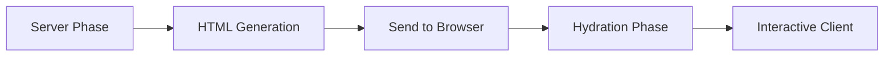

# Server-Side Rendering (SSR) Guide for Next.js

## Table of Contents
1. [Understanding SSR vs CSR](#understanding-ssr-vs-csr)
2. [Common SSR Errors & Solutions](#common-ssr-errors--solutions)
3. [Testing SSR](#testing-ssr)
4. [Debugging Techniques](#debugging-techniques)
5. [Best Practices](#best-practices)
6. [Project-Specific Issues](#project-specific-issues)

---

## Understanding SSR vs CSR

### The Rendering Pipeline



### What Happens in Each Phase

#### 1. **Server Phase** (Node.js Environment)
- React components run on the server
- NO browser APIs available (`window`, `document`, `localStorage`)
- Must produce static HTML
- Runs once per request

#### 2. **HTML Generation**
- Server renders components to HTML strings
- Sends static HTML to browser
- Includes serialized data for hydration

#### 3. **Hydration Phase**
- React "hydrates" the static HTML
- Attaches event handlers
- Makes the page interactive
- Must match server-rendered HTML exactly

#### 4. **Client Phase**
- Normal React behavior
- Full access to browser APIs
- Dynamic updates work normally

---

## Common SSR Errors & Solutions

### Error 1: "window is not defined"

**Problem:**
```typescript
// ❌ This crashes on server
const width = window.innerWidth;
```

**Solution 1 - Check if window exists:**
```typescript
// ✅ Runtime check
const width = typeof window !== 'undefined' ? window.innerWidth : 1920;
```

**Solution 2 - Use useEffect:**
```typescript
// ✅ Only runs on client
const [width, setWidth] = useState(1920);
useEffect(() => {
  setWidth(window.innerWidth);
}, []);
```

**Solution 3 - The Mounted Pattern:**
```typescript
// ✅ Best practice for complex components
export function Component() {
  const [mounted, setMounted] = useState(false);
  
  useEffect(() => {
    setMounted(true);
  }, []);
  
  if (!mounted) {
    return <LoadingState />; // Simple SSR-safe placeholder
  }
  
  // Full component with browser APIs
  return <FullComponent />;
}
```

### Error 2: "localStorage is not defined"

**Problem:**
```typescript
// ❌ Crashes on server
const theme = localStorage.getItem('theme');
```

**Solution:**
```typescript
// ✅ Load in useEffect
const [theme, setTheme] = useState('light'); // Default value
useEffect(() => {
  const stored = localStorage.getItem('theme');
  if (stored) setTheme(stored);
}, []);

// ✅ Save with safety check
const saveTheme = (newTheme: string) => {
  if (typeof window !== 'undefined') {
    localStorage.setItem('theme', newTheme);
  }
  setTheme(newTheme);
};
```

### Error 3: "Hydration failed because initial UI does not match"

**Problem:**
```typescript
// ❌ Different output on server vs client
const id = Math.random(); // Different each time!
const time = new Date().toLocaleTimeString(); // Different on server!
```

**Solution:**
```typescript
// ✅ Use stable values
const id = useMemo(() => `item-${index}`, [index]);

// ✅ Initialize after mount
const [time, setTime] = useState('');
useEffect(() => {
  setTime(new Date().toLocaleTimeString());
}, []);
```

### Error 4: "document is not defined"

**Problem:**
```typescript
// ❌ Accessing DOM during SSR
const element = document.getElementById('my-element');
```

**Solution:**
```typescript
// ✅ Use refs and effects
const elementRef = useRef<HTMLDivElement>(null);
useEffect(() => {
  if (elementRef.current) {
    // Now safe to access DOM
  }
}, []);
```

### Error 5: Dynamic Imports Issues

**Problem:**
```typescript
// ❌ Component with browser dependencies
import MapLibrary from 'heavy-map-library';
```

**Solution:**
```typescript
// ✅ Dynamic import with SSR disabled
const MapComponent = dynamic(
  () => import('./MapComponent'),
  { 
    ssr: false,
    loading: () => <MapSkeleton />
  }
);
```

---

## Testing SSR

### 1. Manual Testing Setup

```bash
# Development (with SSR)
npm run dev

# Test SSR explicitly
curl http://localhost:3000 | grep "your-content"

# Check for loading states
curl http://localhost:3000 | grep "Loading"

# Verify hydration
# Open browser console and look for hydration warnings
```

### 2. Automated SSR Tests

Create `__tests__/ssr.test.tsx`:

```typescript
import { renderToString } from 'react-dom/server';
import { InteractivePortfolio } from '@/components/InteractivePortfolio';

describe('SSR Tests', () => {
  it('should render without crashing on server', () => {
    // Mock window/document for test environment
    const originalWindow = global.window;
    // @ts-ignore
    delete global.window;
    
    const html = renderToString(<InteractivePortfolio />);
    expect(html).toContain('Loading'); // Should show loading state
    
    global.window = originalWindow;
  });
  
  it('should not access browser APIs during SSR', () => {
    const mockLocalStorage = {
      getItem: jest.fn(),
      setItem: jest.fn(),
    };
    
    // Render without window
    // @ts-ignore
    delete global.window;
    
    expect(() => {
      renderToString(<YourComponent />);
    }).not.toThrow();
    
    expect(mockLocalStorage.getItem).not.toHaveBeenCalled();
  });
});
```

### 3. E2E Testing for SSR/CSR

Create `e2e/ssr-hydration.spec.ts`:

```typescript
import { test, expect } from '@playwright/test';

test.describe('SSR and Hydration', () => {
  test('should render initial content from server', async ({ page }) => {
    // Disable JavaScript to see SSR-only content
    await page.setJavaScriptEnabled(false);
    await page.goto('/');
    
    // Should still show basic content
    await expect(page.locator('h1')).toContainText('NatureQuest');
  });
  
  test('should hydrate without errors', async ({ page }) => {
    const errors: string[] = [];
    page.on('console', msg => {
      if (msg.type() === 'error') {
        errors.push(msg.text());
      }
    });
    
    await page.goto('/');
    await page.waitForLoadState('networkidle');
    
    // Check for hydration errors
    const hydrationErrors = errors.filter(e => 
      e.includes('Hydration') || e.includes('did not match')
    );
    
    expect(hydrationErrors).toHaveLength(0);
  });
  
  test('should progressively enhance', async ({ page }) => {
    // Load with JS disabled
    await page.setJavaScriptEnabled(false);
    await page.goto('/');
    const initialContent = await page.content();
    
    // Enable JS and reload
    await page.setJavaScriptEnabled(true);
    await page.reload();
    await page.waitForLoadState('networkidle');
    
    // Should have more interactive elements
    const enhancedContent = await page.content();
    expect(enhancedContent.length).toBeGreaterThan(initialContent.length);
  });
});
```

### 4. Build-Time SSR Validation

Create `scripts/validate-ssr.js`:

```javascript
const { renderToString } = require('react-dom/server');
const React = require('react');

// Mock browser globals
global.window = undefined;
global.document = undefined;
global.localStorage = undefined;
global.sessionStorage = undefined;

// Import your components
const components = [
  './src/components/InteractivePortfolio',
  './src/components/ecosystem/EcosystemWidget',
  // Add all client components
];

components.forEach(componentPath => {
  try {
    const Component = require(componentPath).default;
    const html = renderToString(React.createElement(Component));
    console.log(`✅ ${componentPath} - SSR OK`);
  } catch (error) {
    console.error(`❌ ${componentPath} - SSR FAILED:`, error.message);
    process.exit(1);
  }
});
```

Add to `package.json`:
```json
{
  "scripts": {
    "test:ssr": "node scripts/validate-ssr.js",
    "build": "npm run test:ssr && next build"
  }
}
```

---

## Debugging Techniques

### 1. Identify Where Errors Occur

```typescript
// Add debug logging
export function Component() {
  console.log('Rendering, isServer:', typeof window === 'undefined');
  
  if (typeof window === 'undefined') {
    console.log('SSR: Rendering on server');
    return <ServerVersion />;
  }
  
  console.log('CSR: Rendering on client');
  return <ClientVersion />;
}
```

### 2. Check Server Console vs Browser Console

- **Server errors**: Appear in terminal where `npm run dev` runs
- **Client errors**: Appear in browser DevTools console
- **Hydration errors**: Usually in browser with "Warning:" prefix

### 3. Use Next.js Built-in Debugging

```bash
# Enable verbose logging
DEBUG=* npm run dev

# Check build output for SSR issues
npm run build
```

### 4. Chrome DevTools SSR Debugging

1. Open DevTools → Network tab
2. Look for the initial HTML response
3. Right-click → "View Source" (not "Inspect")
4. This shows actual SSR HTML before hydration

### 5. Common Error Messages Decoded

| Error | Meaning | Fix |
|-------|---------|-----|
| "window is not defined" | Accessing browser API on server | Use `typeof window` check |
| "Text content did not match" | Server/client render differently | Ensure consistent rendering |
| "Cannot read property of null" | DOM element doesn't exist yet | Use refs and useEffect |
| "BAILOUT_TO_CLIENT_SIDE_RENDERING" | SSR failed, using CSR fallback | Fix SSR errors |

---

## Best Practices

### 1. Component Structure Pattern

```typescript
'use client'; // Next.js 13+ app directory

import { useState, useEffect } from 'react';

export function SafeComponent() {
  // 1. State with SSR-safe defaults
  const [mounted, setMounted] = useState(false);
  const [data, setData] = useState(null);
  
  // 2. Browser-only initialization
  useEffect(() => {
    setMounted(true);
    
    // Safe to use browser APIs here
    const stored = localStorage.getItem('data');
    if (stored) setData(JSON.parse(stored));
  }, []);
  
  // 3. SSR-safe render
  if (!mounted) {
    return <div>Loading...</div>;
  }
  
  // 4. Full client render
  return (
    <div>
      {/* Complex component with browser features */}
    </div>
  );
}
```

### 2. Data Fetching Pattern

```typescript
// ✅ Server-side data fetching (Next.js 13+)
async function ServerComponent() {
  const data = await fetch('https://api.example.com/data');
  return <ClientComponent initialData={data} />;
}

// ✅ Client component receives data
'use client';
function ClientComponent({ initialData }) {
  const [data, setData] = useState(initialData);
  // Can update data on client without SSR issues
}
```

### 3. Progressive Enhancement

```typescript
export function EnhancedComponent() {
  const [features, setFeatures] = useState({
    animations: false,
    websockets: false,
    localStorage: false
  });
  
  useEffect(() => {
    // Progressively enable features
    setFeatures({
      animations: !window.matchMedia('(prefers-reduced-motion)').matches,
      websockets: 'WebSocket' in window,
      localStorage: 'localStorage' in window
    });
  }, []);
  
  return (
    <div>
      {/* Basic content always visible */}
      <h1>Always Visible</h1>
      
      {/* Enhanced features when available */}
      {features.animations && <AnimatedSection />}
      {features.websockets && <RealtimeUpdates />}
    </div>
  );
}
```

### 4. Environment Variables

```typescript
// Safe environment detection
export const isServer = typeof window === 'undefined';
export const isClient = !isServer;
export const isDev = process.env.NODE_ENV === 'development';

// Usage
if (isServer) {
  // Server-only code
} else {
  // Client-only code
}
```

---

## Project-Specific Issues

### Issue 1: EcosystemWidget localStorage

**Problem found in your code:**
```typescript
// This was causing SSR failure
useEffect(() => {
  const stored = localStorage.getItem('ecosystem-widget-state');
  // ...
}, []);
```

**Fix applied:**
```typescript
useEffect(() => {
  if (typeof window === 'undefined') return;
  const stored = localStorage.getItem('ecosystem-widget-state');
  // ...
}, []);
```

### Issue 2: Projects Array with JSX

**Problem:**
```typescript
// JSX in arrays can cause serialization issues
const projects = [
  { icon: <Gamepad2 /> }, // JSX element
];
```

**Fix applied:**
```typescript
// Wrap in useMemo to create on client only
const projects = useMemo(() => [
  { icon: <Gamepad2 /> },
], []);
```

### Issue 3: Window Event Listeners

**Problem:**
```typescript
// Was not properly guarded
window.addEventListener('mousemove', handler);
```

**Fix applied:**
```typescript
useEffect(() => {
  if (!mounted || typeof window === 'undefined') return;
  window.addEventListener('mousemove', handler);
  return () => window.removeEventListener('mousemove', handler);
}, [mounted]);
```

---

## Testing Checklist

- [ ] Run `npm run build` - should complete without errors
- [ ] Run `curl http://localhost:3000` - should return HTML
- [ ] Check browser console - no hydration warnings
- [ ] Disable JavaScript in browser - basic content visible
- [ ] Check server logs - no "window is not defined" errors
- [ ] Test on slow connection - proper loading states
- [ ] Run Lighthouse - good SEO and performance scores
- [ ] Test navigation - no flashing/layout shifts

---

## Quick Reference

```typescript
// SSR Safety Checks - Copy & Paste

// Check if running on server
if (typeof window === 'undefined') {
  // Server-safe code
}

// Safe localStorage
const getStorage = (key: string, defaultValue: any) => {
  if (typeof window === 'undefined') return defaultValue;
  const stored = localStorage.getItem(key);
  return stored ? JSON.parse(stored) : defaultValue;
};

// Safe component pattern
export function Component() {
  const [mounted, setMounted] = useState(false);
  useEffect(() => setMounted(true), []);
  if (!mounted) return <Loading />;
  return <FullComponent />;
}

// Dynamic import pattern
const Heavy = dynamic(() => import('./Heavy'), {
  ssr: false,
  loading: () => <Skeleton />
});
```

## Resources

- [Next.js SSR Documentation](https://nextjs.org/docs/app/building-your-application/rendering/server-components)
- [React Hydration](https://react.dev/reference/react-dom/client/hydrateRoot)
- [Web Vitals](https://web.dev/vitals/)
- [SSR Performance Patterns](https://web.dev/rendering-on-the-web/)
