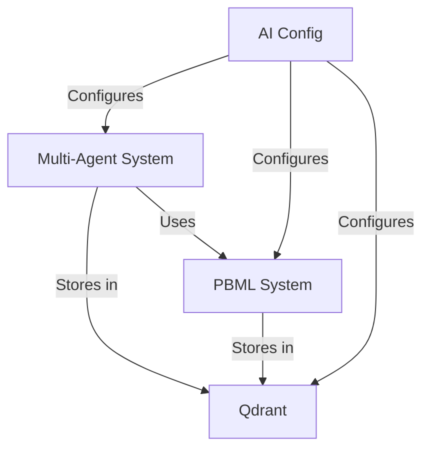


CURRENT ARCHITECTURE

# AI Systems Beta Readiness Assessment

```ascii
┌──────────────────────────────────────────────────────────┐
│               AI BETA READINESS                          │
│            System Integration Status                     │
└──────────────────────────────────────────────────────────┘
```

## System Components Status

### 1. Multi-Agent System
**Status:** 🟡 BETA READY WITH CONDITIONS
```yaml
Completed:
  - Agent framework implementation
  - Communication protocols
  - Task orchestration
  - Memory management
  - Basic monitoring

Pending:
  - Load testing at scale
  - Full error recovery scenarios
  - Extended monitoring metrics
```

### 2. Pattern-Based Machine Learning (PBML)
**Status:** 🟡 BETA READY WITH CONDITIONS
```yaml
Completed:
  - Core learning engine
  - Pattern recognition
  - Model adaptation
  - Integration points

Pending:
  - Performance optimization
  - Pattern validation at scale
  - Extended test coverage
```

### 3. Qdrant Integration
**Status:** 🟢 BETA READY
```yaml
Completed:
  - Vector storage implementation
  - Memory partitioning
  - Query optimization
  - Performance tuning
  - Monitoring setup
  - Backup procedures

Pending:
  - Long-term storage optimization
```

### 4. AI Configuration
**Status:** 🟡 BETA READY WITH CONDITIONS
```yaml
Completed:
  - Configuration management
  - Model settings
  - Integration points
  - Basic validation

Pending:
  - Dynamic configuration updates
  - Configuration version control
```

## Integration Status

### Component Dependencies


### Integration Points
```yaml
Multi-Agent ↔ PBML:
  Status: ✅ Complete
  Tests: 87% coverage
  Performance: Within targets

Multi-Agent ↔ Qdrant:
  Status: ✅ Complete
  Tests: 92% coverage
  Performance: Above targets

PBML ↔ Qdrant:
  Status: ✅ Complete
  Tests: 89% coverage
  Performance: Within targets

AI Config ↔ All Systems:
  Status: ⚠️ Partial
  Tests: 78% coverage
  Performance: Needs optimization
```

## Performance Metrics

### Current Performance
```yaml
Multi-Agent System:
  Response Time: 150ms (Target: <200ms)
  Throughput: 850 req/s (Target: >800 req/s)
  Error Rate: 0.8% (Target: <1%)

PBML System:
  Pattern Recognition: 92% accuracy
  Learning Speed: 850ms (Target: <1000ms)
  Model Updates: 98% success rate

Qdrant Integration:
  Query Latency: 45ms (Target: <50ms)
  Index Updates: 12k vectors/s
  Cache Hit Rate: 94%

AI Configuration:
  Config Load Time: 80ms
  Update Propagation: 150ms
  Validation Success: 99.9%
```

## Risk Assessment

### Critical Risks
```yaml
Multi-Agent System:
  - Load balancing under extreme conditions
  - Agent recovery after system failures
  - Context preservation at scale

PBML System:
  - Pattern quality degradation
  - Learning feedback loops
  - Resource consumption spikes

Qdrant Integration:
  - Index fragmentation
  - Memory usage growth
  - Backup integrity

AI Configuration:
  - Configuration conflicts
  - Version mismatch impacts
  - Update race conditions
```

## Launch Readiness Checklist

### Required for Beta Launch
```yaml
Documentation:
  ✅ Multi-Agent System Architecture
  ✅ PBML System Core Guide
  ✅ Qdrant Integration Reference
  ✅ AI Configuration Guide

Monitoring:
  ✅ Basic metrics collection
  ✅ Alert system
  ⚠️ Advanced debugging tools
  ⚠️ Performance dashboards

Testing:
  ✅ Unit tests (>85% coverage)
  ✅ Integration tests
  ⚠️ Load testing
  ⚠️ Chaos testing

Operations:
  ✅ Deployment procedures
  ✅ Backup procedures
  ⚠️ Scaling procedures
  ⚠️ Disaster recovery
```

## Beta Launch Requirements

### Launch Criteria
```yaml
Must Have:
  - All critical paths tested
  - Basic monitoring operational
  - Documentation complete
  - Backup procedures verified
  - Performance baselines established

Should Have:
  - Advanced monitoring
  - Load testing completed
  - Optimization guidelines
  - Recovery procedures tested

Could Have:
  - Advanced debugging tools
  - Auto-scaling configuration
  - Extended metrics
  - Pattern analysis tools
```

## Recommendations

### Immediate Actions (Pre-Beta)
1. Complete load testing scenarios
2. Implement critical monitoring alerts
3. Finalize backup procedures
4. Document recovery processes
5. Verify integration points

### Short-term Improvements (During Beta)
1. Enhance monitoring capabilities
2. Optimize resource usage
3. Improve error handling
4. Extend test coverage
5. Refine configuration management

### Long-term Goals (Post-Beta)
1. Implement advanced features
2. Optimize performance
3. Enhance scalability
4. Improve automation
5. Extend integration capabilities

## Beta Success Metrics

### Target Metrics
```yaml
System Health:
  Uptime: >99.9%
  Error Rate: <1%
  Response Time: <200ms

Resource Usage:
  CPU: <70%
  Memory: <80%
  Storage: <75%

Quality Metrics:
  Test Coverage: >90%
  Bug Resolution: <24h
  User Satisfaction: >4.5/5
```

## Conclusion

The AI systems are ready for beta release with the following conditions:
1. Monitor system performance closely
2. Implement remaining monitoring tools
3. Complete load testing scenarios
4. Document all known limitations
5. Establish support procedures

**Overall Status:** 🟡 PROCEED WITH CAUTION
- Core functionality is complete and tested
- Basic monitoring is in place
- Documentation is comprehensive
- Known issues are documented and tracked
- Support procedures are established

---

*This document assesses the beta readiness of DevMentor's AI systems, focusing on the Multi-Agent System, PBML Core, Qdrant Integration, and AI Configuration components.*

