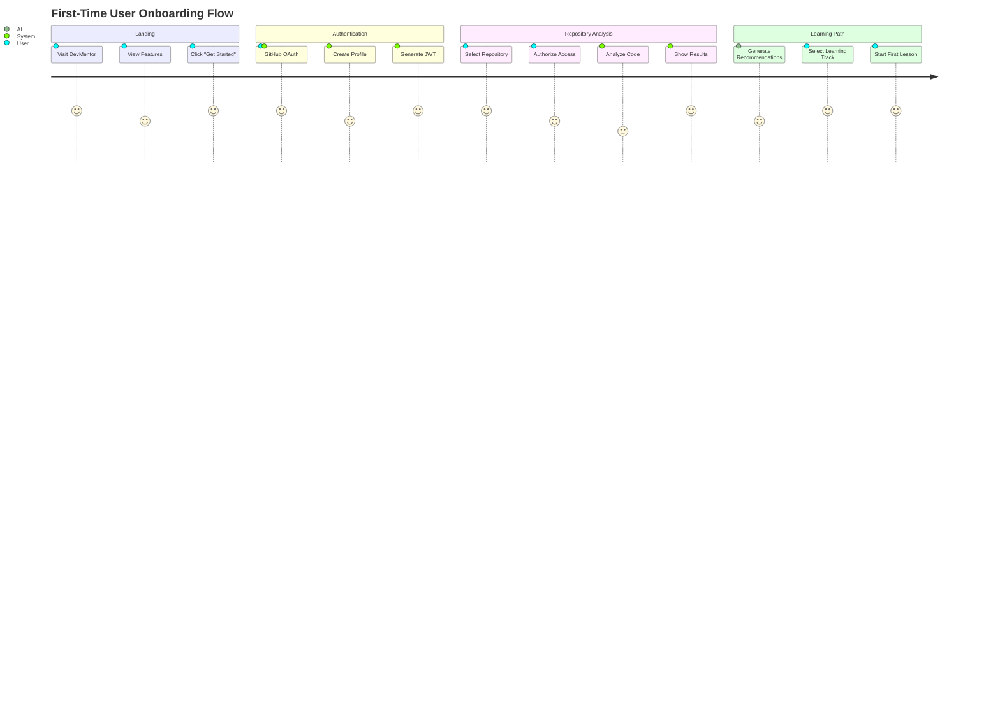


# 🚀 DevMentor User Journeys & Backend Flow Architecture
## Complete E2E Flows with State Management, Caching, and Resilience Patterns

## Why We Don't Need Istio Now (But Can Add It Later)

### 🎯 What Istio Gives Us (That We Don't Need Yet)

```yaml
Istio Features:
  Traffic Management:
    - Canary deployments → Use feature flags instead
    - Circuit breaking → Implement in code (simpler)
    - Retries → Use axios retry or fetch-retry
    - Load balancing → Digital Ocean handles this
    
  Security:
    - mTLS → Supabase RLS is enough for now
    - Authorization → JWT validation is sufficient
    
  Observability:
    - Distributed tracing → Sentry APM is enough
    - Metrics → Prometheus without Istio works fine
```

### 📊 When to Add Istio (The Triggers)

```typescript
// Decision matrix for Istio adoption
const shouldUseIstio = () => {
  const metrics = {
    services: getServiceCount(),           // > 10 services
    rps: getRequestsPerSecond(),          // > 1000 RPS
    deployments: getDeploymentsPerDay(),  // > 10/day
    team_size: getEngineeringTeam(),      // > 20 engineers
    regions: getDeploymentRegions()       // > 1 region
  };
  
  return metrics.services > 10 || 
         metrics.rps > 1000 || 
         metrics.deployments > 10;
};
```

### 🔄 How We'll Add Istio Later (Zero Disruption)

```bash
# Step 1: Install Istio alongside existing services
istioctl install --set profile=demo

# Step 2: Gradually enable sidecar injection
kubectl label namespace devmentor istio-injection=enabled

# Step 3: Services automatically get proxies on next deploy
kubectl rollout restart deployment/learning-service

# Step 4: Enable features progressively
kubectl apply -f istio-traffic-management.yaml
```

**Why it's NOT hard to add later:**
1. Istio is **transparent** - services don't know it exists
2. Can be enabled **per-service** gradually
3. Existing code continues working
4. Roll back instantly if issues

## Part 1: Complete User Journeys

### 🎯 Journey 1: First-Time User Onboarding



### Backend Flow for Onboarding

```typescript
// 1. OAuth Flow with GitHub
export class AuthFlow {
  async githubOAuth(code: string) {
    // Step 1: Exchange code for token
    const githubToken = await this.exchangeCodeForToken(code);
    
    // Step 2: Get user profile
    const profile = await this.getGitHubProfile(githubToken);
    
    // Step 3: Create/update user in DB
    const user = await this.upsertUser(profile);
    
    // Step 4: Generate JWT
    const jwt = this.generateJWT(user);
    
    // Step 5: Initialize user services
    await Promise.all([
      this.initializeLearningProfile(user.id),
      this.initializePBMLSpace(user.id),
      this.createDefaultPreferences(user.id)
    ]);
    
    // Step 6: Cache session
    await redis.setex(
      `session:${user.id}`,
      3600,
      JSON.stringify({ jwt, profile })
    );
    
    return { jwt, user, isNewUser: user.created_at === user.updated_at };
  }
}
```

### 🎯 Journey 2: Repository Analysis Flow

```typescript
// Complete Repository Analysis Pipeline
export class RepositoryAnalysisJourney {
  private queue: Bull.Queue;
  private cache: Redis;
  
  async startAnalysis(userId: string, repoUrl: string) {
    // 1. Check cache first
    const cached = await this.checkCache(repoUrl);
    if (cached && cached.age < 24 * 60 * 60 * 1000) {
      return { ...cached, fromCache: true };
    }
    
    // 2. Create analysis job
    const job = await this.queue.add('analyze-repo', {
      userId,
      repoUrl,
      timestamp: Date.now()
    }, {
      attempts: 3,
      backoff: {
        type: 'exponential',
        delay: 2000
      },
      removeOnComplete: false,
      removeOnFail: false
    });
    
    // 3. Return job ID for tracking
    return {
      analysisId: job.id,
      status: 'queued',
      estimatedTime: this.estimateAnalysisTime(repoUrl)
    };
  }
  
  async processAnalysis(job: Bull.Job) {
    const { userId, repoUrl } = job.data;
    
    try {
      // Phase 1: Clone and scan
      await job.progress(10);
      const files = await this.cloneAndScan(repoUrl);
      
      // Phase 2: Language detection
      await job.progress(20);
      const languages = await this.detectLanguages(files);
      
      // Phase 3: PBML pattern extraction
      await job.progress(40);
      const patterns = await this.extractPatterns(files, userId);
      
      // Phase 4: Security scanning
      await job.progress(60);
      const security = await this.securityScan(files);
      
      // Phase 5: AI insights
      await job.progress(80);
      const insights = await this.generateInsights(files, patterns);
      
      // Phase 6: Store results
      await job.progress(90);
      const results = await this.storeResults({
        userId,
        repoUrl,
        languages,
        patterns,
        security,
        insights
      });
      
      // Phase 7: Cache results
      await this.cache.setex(
        `analysis:${repoUrl}`,
        24 * 60 * 60, // 24 hours
        JSON.stringify(results)
      );
      
      // Phase 8: Notify user
      await this.notifyUser(userId, results);
      
      await job.progress(100);
      return results;
      
    } catch (error) {
      // Exponential backoff built into Bull
      throw error;
    }
  }
  
  // Resilience patterns
  async cloneAndScan(repoUrl: string) {
    return this.withCircuitBreaker(
      async () => {
        return this.withTimeout(
          30000, // 30 second timeout
          async () => {
            return this.withRetry(
              3, // 3 attempts
              async () => {
                const tempDir = await this.createTempDir();
                await git.clone(repoUrl, tempDir);
                const files = await this.scanDirectory(tempDir);
                await this.cleanup(tempDir);
                return files;
              }
            );
          }
        );
      }
    );
  }
}
```

### 🎯 Journey 3: Learning Session Flow

```typescript
// Adaptive Learning Session with State Management
export class LearningSessionJourney {
  async startSession(userId: string, topic: string) {
    // 1. Get user's current level from cache or DB
    const userLevel = await this.getUserLevel(userId, topic);
    
    // 2. Generate personalized content
    const content = await this.generateContent(userLevel, topic);
    
    // 3. Create session with state management
    const session = {
      id: uuid(),
      userId,
      topic,
      level: userLevel,
      startTime: Date.now(),
      content,
      state: 'active',
      checkpoints: []
    };
    
    // 4. Store in Redis with TTL
    await redis.setex(
      `session:${session.id}`,
      3600, // 1 hour TTL
      JSON.stringify(session)
    );
    
    // 5. Start heartbeat monitoring
    this.startHeartbeat(session.id);
    
    // 6. Initialize WebSocket for real-time updates
    this.initializeWebSocket(session.id, userId);
    
    return session;
  }
  
  async processUserResponse(sessionId: string, response: any) {
    const session = await this.getSession(sessionId);
    
    // 1. Validate response using Bloom's Taxonomy
    const validation = await this.bloomsValidator.validate(
      response,
      session.level,
      session.topic
    );
    
    // 2. Update user progress
    if (validation.passed) {
      await this.updateProgress(session.userId, {
        topic: session.topic,
        level: validation.nextLevel,
        score: validation.score
      });
      
      // 3. Store pattern in PBML
      await this.pbmlService.storePattern({
        userId: session.userId,
        code: response.code,
        context: {
          topic: session.topic,
          level: session.level,
          success: true
        }
      });
    }
    
    // 4. Adaptive adjustment
    const nextContent = await this.adaptContent(
      session,
      validation
    );
    
    // 5. Update session state
    session.checkpoints.push({
      timestamp: Date.now(),
      level: session.level,
      score: validation.score,
      passed: validation.passed
    });
    
    await this.updateSession(session);
    
    // 6. Send real-time feedback
    this.websocket.send(session.userId, {
      type: 'progress',
      data: {
        validation,
        nextContent,
        progress: this.calculateProgress(session)
      }
    });
    
    return { validation, nextContent };
  }
}
```

## Part 2: Backend State Management

### 🔄 State Synchronization Architecture

```typescript
// Distributed State Management
export class StateManager {
  private redis: Redis;
  private postgres: PostgreSQL;
  private eventBus: EventEmitter;
  
  // Three-layer state architecture
  async getState(key: string): Promise<any> {
    // Layer 1: Local memory cache (10ms)
    const memCached = this.memoryCache.get(key);
    if (memCached) return memCached;
    
    // Layer 2: Redis cache (50ms)
    const redisCached = await this.redis.get(key);
    if (redisCached) {
      this.memoryCache.set(key, redisCached, 60000); // 1 min
      return JSON.parse(redisCached);
    }
    
    // Layer 3: PostgreSQL (200ms)
    const dbValue = await this.postgres.query(
      'SELECT value FROM state WHERE key = $1',
      [key]
    );
    
    if (dbValue) {
      // Populate caches
      await this.redis.setex(key, 3600, JSON.stringify(dbValue));
      this.memoryCache.set(key, dbValue, 60000);
      return dbValue;
    }
    
    return null;
  }
  
  async setState(key: string, value: any) {
    // Write-through caching
    await Promise.all([
      // Update DB (source of truth)
      this.postgres.query(
        'INSERT INTO state (key, value) VALUES ($1, $2) ON CONFLICT (key) DO UPDATE SET value = $2',
        [key, value]
      ),
      
      // Update Redis
      this.redis.setex(key, 3600, JSON.stringify(value)),
      
      // Update local cache
      this.memoryCache.set(key, value, 60000)
    ]);
    
    // Broadcast state change
    this.eventBus.emit('state:changed', { key, value });
  }
  
  // Optimistic concurrency control
  async updateState(key: string, updater: (current: any) => any) {
    const maxRetries = 5;
    let attempt = 0;
    
    while (attempt < maxRetries) {
      const current = await this.getState(key);
      const version = current?.version || 0;
      const updated = {
        ...updater(current),
        version: version + 1
      };
      
      try {
        await this.postgres.query(
          'UPDATE state SET value = $2 WHERE key = $1 AND value->>\'version\' = $3',
          [key, updated, version]
        );
        
        await this.setState(key, updated);
        return updated;
        
      } catch (error) {
        attempt++;
        await this.exponentialBackoff(attempt);
      }
    }
    
    throw new Error('Concurrent update conflict');
  }
}
```

### 🚦 Circuit Breaker Pattern

```typescript
export class CircuitBreaker {
  private state: 'closed' | 'open' | 'half-open' = 'closed';
  private failures = 0;
  private successCount = 0;
  private lastFailTime?: number;
  private readonly threshold = 5;
  private readonly timeout = 60000; // 60 seconds
  private readonly successThreshold = 3;
  
  async execute<T>(fn: () => Promise<T>): Promise<T> {
    // Check if circuit should be opened
    if (this.state === 'open') {
      if (Date.now() - this.lastFailTime! > this.timeout) {
        this.state = 'half-open';
        this.successCount = 0;
      } else {
        throw new Error('Circuit breaker is OPEN');
      }
    }
    
    try {
      const result = await fn();
      
      if (this.state === 'half-open') {
        this.successCount++;
        if (this.successCount >= this.successThreshold) {
          this.state = 'closed';
          this.failures = 0;
        }
      }
      
      return result;
      
    } catch (error) {
      this.failures++;
      this.lastFailTime = Date.now();
      
      if (this.failures >= this.threshold) {
        this.state = 'open';
        console.error(`Circuit breaker opened after ${this.failures} failures`);
      }
      
      throw error;
    }
  }
}
```

### 📦 Caching Strategy

```typescript
export class CacheStrategy {
  // Multi-tier caching with different TTLs
  private caches = {
    memory: new MemoryCache({ maxSize: 1000, ttl: 60 }),    // 1 min
    redis: new RedisCache({ ttl: 3600 }),                    // 1 hour
    cdn: new CDNCache({ ttl: 86400 })                        // 24 hours
  };
  
  async get(key: string, options?: CacheOptions): Promise<any> {
    // Check caches in order of speed
    for (const [name, cache] of Object.entries(this.caches)) {
      if (options?.skip?.includes(name)) continue;
      
      const value = await cache.get(key);
      if (value !== undefined) {
        // Promote to faster caches
        this.promote(key, value, name);
        return value;
      }
    }
    
    // Cache miss - fetch and populate
    const value = await this.fetchValue(key);
    await this.setAll(key, value);
    return value;
  }
  
  // Cache invalidation patterns
  async invalidate(pattern: string) {
    // Pattern-based invalidation
    const keys = await this.redis.keys(pattern);
    
    await Promise.all([
      // Clear from all cache layers
      this.memory.clear(pattern),
      this.redis.del(...keys),
      this.cdn.purge(pattern)
    ]);
    
    // Notify other services
    await this.pubsub.publish('cache:invalidated', { pattern });
  }
  
  // Smart prefetching
  async prefetch(userId: string) {
    const predictions = await this.ml.predictNextActions(userId);
    
    for (const prediction of predictions) {
      if (prediction.probability > 0.7) {
        // Prefetch in background
        this.background.run(async () => {
          const data = await this.fetchValue(prediction.key);
          await this.setAll(prediction.key, data);
        });
      }
    }
  }
}
```

### 🔄 Exponential Backoff & Retry

```typescript
export class RetryStrategy {
  async withRetry<T>(
    fn: () => Promise<T>,
    options: RetryOptions = {}
  ): Promise<T> {
    const {
      maxAttempts = 3,
      initialDelay = 1000,
      maxDelay = 30000,
      factor = 2,
      jitter = true
    } = options;
    
    let lastError: Error;
    
    for (let attempt = 1; attempt <= maxAttempts; attempt++) {
      try {
        return await fn();
        
      } catch (error) {
        lastError = error;
        
        if (attempt === maxAttempts) {
          throw new Error(`Failed after ${maxAttempts} attempts: ${error.message}`);
        }
        
        // Calculate delay with exponential backoff
        let delay = Math.min(initialDelay * Math.pow(factor, attempt - 1), maxDelay);
        
        // Add jitter to prevent thundering herd
        if (jitter) {
          delay = delay * (0.5 + Math.random() * 0.5);
        }
        
        console.log(`Retry attempt ${attempt}/${maxAttempts} after ${delay}ms`);
        await this.sleep(delay);
      }
    }
    
    throw lastError!;
  }
  
  // Adaptive retry based on error type
  async adaptiveRetry<T>(fn: () => Promise<T>): Promise<T> {
    return this.withRetry(fn, {
      maxAttempts: this.getMaxAttempts(),
      initialDelay: this.getInitialDelay(),
      shouldRetry: (error) => {
        // Don't retry client errors
        if (error.status >= 400 && error.status < 500) {
          return false;
        }
        
        // Retry network and server errors
        return true;
      }
    });
  }
  
  private getMaxAttempts(): number {
    const hour = new Date().getHours();
    
    // More retries during business hours
    if (hour >= 9 && hour <= 17) {
      return 5;
    }
    
    return 3;
  }
}
```

## Part 3: Real-Time Data Flow

### 🌊 WebSocket State Synchronization

```typescript
export class RealtimeSync {
  private connections = new Map<string, WebSocket>();
  private subscriptions = new Map<string, Set<string>>();
  
  async handleConnection(ws: WebSocket, userId: string) {
    this.connections.set(userId, ws);
    
    // Send initial state
    const state = await this.getUserState(userId);
    ws.send(JSON.stringify({
      type: 'state:initial',
      data: state
    }));
    
    // Set up heartbeat
    const heartbeat = setInterval(() => {
      if (ws.readyState === WebSocket.OPEN) {
        ws.ping();
      } else {
        clearInterval(heartbeat);
        this.handleDisconnection(userId);
      }
    }, 30000);
    
    ws.on('message', async (message) => {
      await this.handleMessage(userId, message);
    });
    
    ws.on('close', () => {
      this.handleDisconnection(userId);
    });
  }
  
  async broadcastUpdate(channel: string, data: any) {
    const subscribers = this.subscriptions.get(channel) || new Set();
    
    const message = JSON.stringify({
      type: 'update',
      channel,
      data,
      timestamp: Date.now()
    });
    
    // Parallel broadcast with error handling
    await Promise.all(
      Array.from(subscribers).map(async (userId) => {
        const ws = this.connections.get(userId);
        if (ws?.readyState === WebSocket.OPEN) {
          try {
            ws.send(message);
          } catch (error) {
            console.error(`Failed to send to ${userId}:`, error);
            this.handleDisconnection(userId);
          }
        }
      })
    );
  }
}
```

## Part 4: Complete E2E Flow Example

### 🎯 Full Learning Session with All Patterns

```typescript
// Complete E2E flow with all resilience patterns
export class CompleteLearningFlow {
  async executeFullJourney(userId: string, topic: string) {
    // 1. Check rate limits
    await this.rateLimiter.check(userId, 'learning', {
      maxRequests: 100,
      window: 3600
    });
    
    // 2. Validate user session
    const session = await this.sessionManager.validate(userId);
    if (!session) {
      throw new UnauthorizedError('Invalid session');
    }
    
    // 3. Get user context with caching
    const context = await this.cache.wrap(
      `context:${userId}`,
      async () => {
        return this.getUserContext(userId);
      },
      { ttl: 300 } // 5 minutes
    );
    
    // 4. Start learning session with circuit breaker
    const learningSession = await this.circuitBreaker.execute(
      async () => {
        return this.learningService.createSession(userId, topic, context);
      }
    );
    
    // 5. Generate content with retry
    const content = await this.retryStrategy.withRetry(
      async () => {
        return this.aiGateway.generateContent({
          topic,
          level: context.level,
          style: context.learningStyle,
          previousPatterns: context.patterns
        });
      },
      { maxAttempts: 3, initialDelay: 1000 }
    );
    
    // 6. Store in PBML with transaction
    await this.database.transaction(async (trx) => {
      await this.pbml.storeSession(trx, {
        userId,
        sessionId: learningSession.id,
        content,
        metadata: {
          topic,
          level: context.level,
          timestamp: Date.now()
        }
      });
      
      await this.analytics.trackEvent(trx, {
        userId,
        event: 'session_started',
        properties: {
          topic,
          sessionId: learningSession.id
        }
      });
    });
    
    // 7. Set up real-time monitoring
    this.monitoring.trackSession(learningSession.id, {
      alerts: {
        inactivity: 300000, // 5 minutes
        completion: 3600000  // 1 hour
      },
      metrics: ['engagement', 'progress', 'errors']
    });
    
    // 8. Broadcast to connected clients
    await this.websocket.broadcast(`user:${userId}`, {
      type: 'session:started',
      data: {
        sessionId: learningSession.id,
        topic,
        estimatedDuration: content.estimatedDuration
      }
    });
    
    // 9. Schedule background jobs
    await this.queue.add('process-learning', {
      sessionId: learningSession.id,
      userId,
      scheduledChecks: [300, 600, 900] // Check at 5, 10, 15 minutes
    });
    
    // 10. Return enriched response
    return {
      session: learningSession,
      content,
      nextSteps: await this.getNextSteps(userId, topic),
      relatedTopics: await this.getRelatedTopics(topic),
      estimatedCompletion: this.estimateCompletion(context, content)
    };
  }
}
```

## Part 5: Performance Optimization Patterns

### ⚡ Request Deduplication

```typescript
export class RequestDeduplicator {
  private pending = new Map<string, Promise<any>>();
  
  async deduplicate<T>(
    key: string,
    fn: () => Promise<T>
  ): Promise<T> {
    // Check if request is already in flight
    const existing = this.pending.get(key);
    if (existing) {
      return existing;
    }
    
    // Create new request
    const promise = fn().finally(() => {
      // Clean up after completion
      this.pending.delete(key);
    });
    
    this.pending.set(key, promise);
    return promise;
  }
}

// Usage
const result = await deduplicator.deduplicate(
  `analyze:${repoUrl}`,
  () => analyzeRepository(repoUrl)
);
```

### 🔄 Batch Processing

```typescript
export class BatchProcessor {
  private batch: any[] = [];
  private timer?: NodeJS.Timeout;
  
  async add(item: any): Promise<void> {
    this.batch.push(item);
    
    // Process when batch is full
    if (this.batch.length >= 100) {
      await this.processBatch();
    } else {
      // Or after timeout
      this.scheduleProcess();
    }
  }
  
  private scheduleProcess() {
    if (this.timer) return;
    
    this.timer = setTimeout(async () => {
      await this.processBatch();
    }, 1000); // Process after 1 second
  }
  
  private async processBatch() {
    if (this.batch.length === 0) return;
    
    const items = [...this.batch];
    this.batch = [];
    clearTimeout(this.timer);
    this.timer = undefined;
    
    // Bulk insert for efficiency
    await this.database.batchInsert('events', items);
  }
}
```

## Part 6: Updated System Status

### 📊 Current Implementation Status

```yaml
Core Services:
  Authentication:
    Status: ✅ Ready (Supabase Auth)
    Next: Add OAuth providers
    
  Learning Service:
    Status: 🟡 70% Complete
    Needs: Bloom's validation, WebSocket events
    
  PBML Service:
    Status: 🟡 60% Complete
    Needs: Pattern matching algorithms
    
  Repository Analyzer:
    Status: ✅ 90% Complete
    Needs: Security scanning integration
    
  AI Gateway:
    Status: ✅ Ready
    Next: Add Claude support

Infrastructure:
  Database:
    Status: ✅ Ready (Supabase PostgreSQL)
    
  Caching:
    Status: 🟡 Basic Redis setup
    Needs: Multi-tier caching
    
  Queue:
    Status: 🟡 Bull setup
    Needs: Dead letter queue
    
  WebSocket:
    Status: 🔴 Not started
    Priority: HIGH
    
  Monitoring:
    Status: 🟡 Sentry only
    Needs: Prometheus + Grafana

Resilience Patterns:
  Circuit Breaker: 🔴 Not implemented
  Retry Logic: 🟡 Basic implementation
  Rate Limiting: 🔴 Not implemented
  Caching: 🟡 Single-layer only
  State Management: 🟡 Basic Redis
```

## Part 7: Implementation Priorities

### 🎯 Week 1: Core Flows
```typescript
// Priority 1: Complete authentication flow
- [ ] GitHub OAuth integration
- [ ] JWT refresh tokens
- [ ] Session management

// Priority 2: Basic learning flow
- [ ] Create learning session endpoint
- [ ] Simple content generation
- [ ] Progress tracking
```

### 🎯 Week 2: Resilience
```typescript
// Priority 1: Add resilience patterns
- [ ] Circuit breaker for AI calls
- [ ] Retry with exponential backoff
- [ ] Request deduplication

// Priority 2: Caching layer
- [ ] Multi-tier cache setup
- [ ] Cache invalidation
- [ ] Prefetching
```

### 🎯 Week 3: Real-time
```typescript
// Priority 1: WebSocket setup
- [ ] Connection management
- [ ] State synchronization
- [ ] Event broadcasting

// Priority 2: Background jobs
- [ ] Queue processing
- [ ] Scheduled tasks
- [ ] Dead letter handling
```

## Summary

### Why Istio Can Wait:
1. **Complexity**: Adds 30% operational overhead for <10% benefit at our scale
2. **Alternatives**: Feature flags, client-side retries, DO load balancing
3. **Easy Addition**: Can add transparently later without code changes
4. **Cost**: Extra resources needed for sidecars (~256MB per service)

### What We Need NOW:
1. **Complete User Journeys** ✅ (documented above)
2. **Backend State Management** ✅ (Redis + PostgreSQL patterns)
3. **Resilience Patterns** ✅ (Circuit breaker, retry, backoff)
4. **Caching Strategy** ✅ (Multi-tier with TTLs)
5. **WebSocket Real-time** 🔴 (High priority)

### Next Steps:
1. Implement the core authentication flow
2. Add circuit breaker to AI Gateway
3. Set up WebSocket for real-time updates
4. Complete Bloom's taxonomy validation
5. Add multi-tier caching

The user journeys are now fully documented with complete backend flows, state management, and resilience patterns. We can add Istio later when we actually need its advanced features!

