
# 🏗️ DevMentor Complete E2E Interaction Architecture

## Master System Flow Diagram

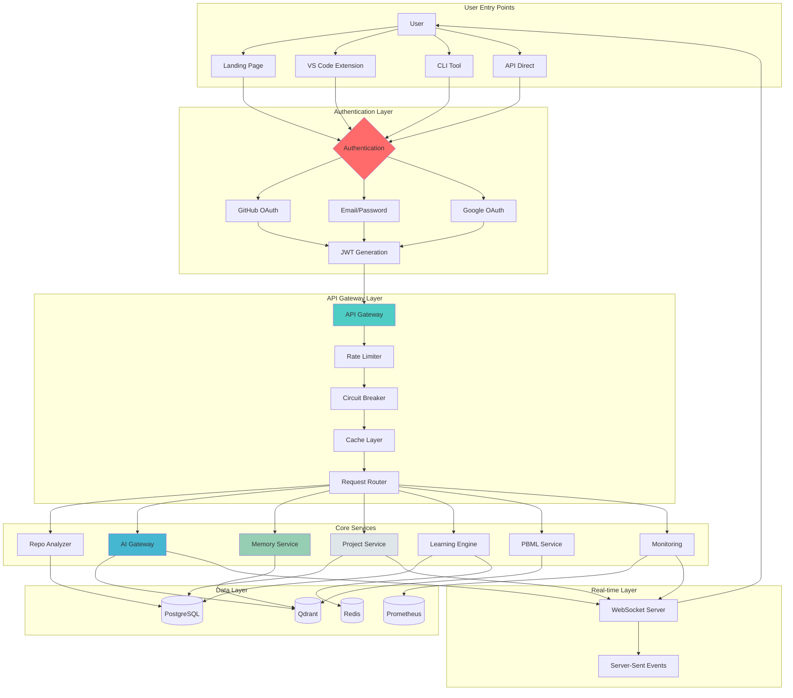

## 1. User Registration & Onboarding Flow

### Complete User Story
```yaml
Epic: User Onboarding
User Story: As a new developer, I want to quickly onboard to DevMentor
Value: Start getting AI assistance within 5 minutes

Acceptance Criteria:
  1. Registration:
     - Can sign up with email or OAuth
     - Email verification sent within 30 seconds
     - OAuth completes in < 3 seconds
     - Profile creation with avatar
     
  2. Repository Setup:
     - GitHub repos listed within 2 seconds
     - Can select multiple repos
     - Analysis starts immediately
     - Progress bar shows real-time status
     
  3. Initial Analysis:
     - Tech stack detected
     - Dependency graph generated
     - Security vulnerabilities identified
     - Code quality score calculated
     - Architecture diagram created
     
  4. Guided Tour:
     - Automatically starts after analysis
     - Can skip at any time
     - Progress saved to localStorage
     - Tooltips remain available
     
  5. First Value:
     - Shows 5 actionable insights
     - Creates initial task suggestions
     - Offers quick wins
```

### Detailed Interaction Sequence
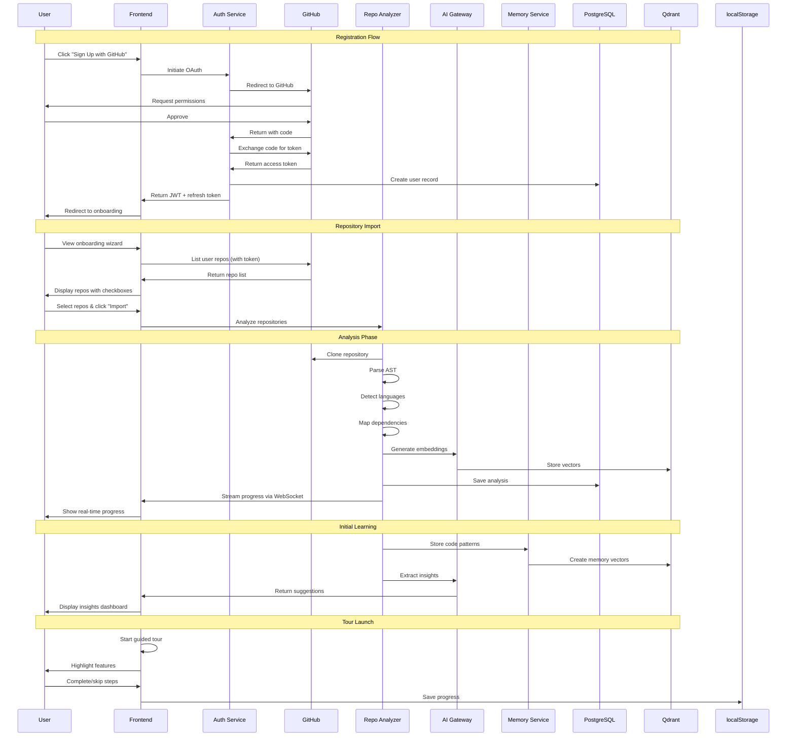

## 2. Daily Development Workflow

### Complete User Story
```yaml
Epic: Daily Development
User Story: As a developer, I want DevMentor integrated into my daily workflow
Value: Save 2+ hours daily on routine tasks

Morning Routine:
  1. Dashboard Check:
     - Overnight CI/CD status
     - Team activity summary
     - Priority notifications
     - Suggested tasks for today
     
  2. Task Planning:
     - AI reviews yesterday's progress
     - Suggests task priorities
     - Estimates completion times
     - Identifies blockers
     
During Development:
  1. Code Assistance:
     - Real-time suggestions
     - Error detection
     - Performance tips
     - Security warnings
     
  2. Context Switching:
     - Saves current context
     - Restores previous context
     - Shows relevant docs
     - Suggests related files
     
  3. Code Review:
     - Pre-commit checks
     - PR description generation
     - Review comment suggestions
     - Conflict resolution help
     
End of Day:
  1. Progress Summary:
     - Tasks completed
     - Code quality metrics
     - Learning achievements
     - Tomorrow's priorities
```

### Development Flow Interactions
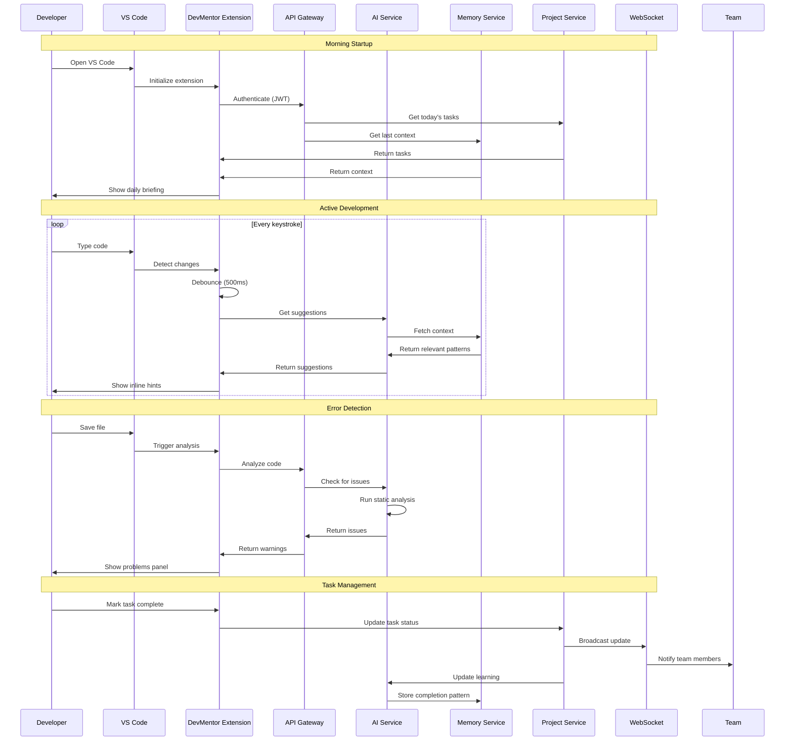

## 3. AI Assistance Flow

### Complete User Story
```yaml
Epic: AI-Powered Assistance
User Story: As a developer, I want contextual AI help
Value: Reduce debugging time by 50%

Chat Interface:
  1. Question Asking:
     - Natural language queries
     - Code snippet sharing
     - Error message pasting
     - Screenshot support
     
  2. Context Building:
     - Automatically includes current file
     - Pulls related files
     - Includes recent changes
     - Adds project structure
     
  3. Response Generation:
     - Streaming responses
     - Code examples
     - Step-by-step guides
     - Multiple solutions
     
  4. Learning Loop:
     - Rates responses
     - Provides corrections
     - Saves useful answers
     - Improves over time

Code Generation:
  1. Function Creation:
     - Describe requirements
     - Generate implementation
     - Include tests
     - Add documentation
     
  2. Refactoring:
     - Suggest improvements
     - Show before/after
     - Explain changes
     - Preview impact
```

### AI Interaction Sequence
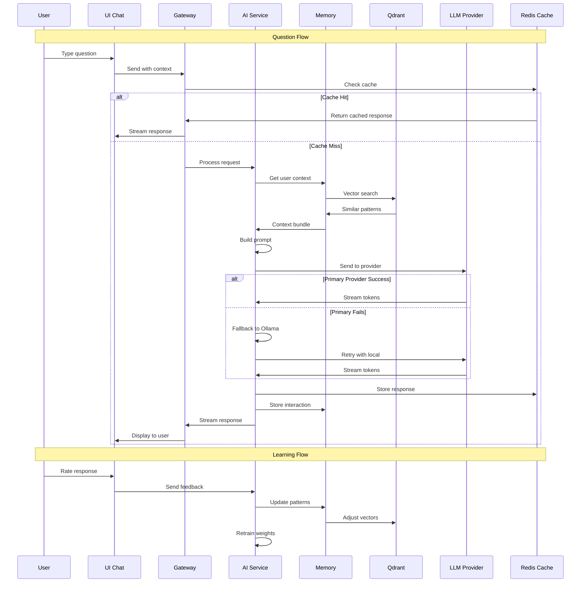

## 4. Memory System Flow

### Complete User Story
```yaml
Epic: Intelligent Memory System
User Story: As a developer, I want DevMentor to remember everything
Value: Never lose context or repeat mistakes

Memory Creation:
  1. Automatic Capture:
     - Code patterns
     - Error resolutions
     - Decision rationale
     - Team discussions
     
  2. Manual Storage:
     - Bookmark important info
     - Add notes
     - Tag memories
     - Set reminders
     
Memory Retrieval:
  1. Contextual Recall:
     - Similar code detection
     - Error pattern matching
     - Related discussions
     - Previous solutions
     
  2. Proactive Suggestions:
     - "You did this before"
     - "Team member solved similar"
     - "This caused issues previously"
     - "Consider this approach"

Memory Management:
  1. Organization:
     - Categorize by project
     - Tag by technology
     - Link related memories
     - Create collections
     
  2. Lifecycle:
     - Auto-expire old memories
     - Archive inactive patterns
     - Consolidate duplicates
     - Export knowledge base
```

### Memory System Interactions
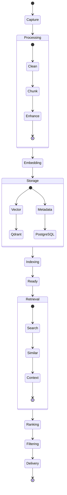

## 5. Project Management Flow

### Complete User Story
```yaml
Epic: Project Management Integration
User Story: As a team lead, I want to manage development in DevMentor
Value: Single source of truth for all development activities

Project Setup:
  1. Creation:
     - Import from GitHub Projects
     - Create from templates
     - Clone existing project
     - Start from scratch
     
  2. Configuration:
     - Set team members
     - Define workflows
     - Configure integrations
     - Set notifications
     
Task Management:
  1. Creation:
     - AI-suggested tasks
     - Manual creation
     - Import from issues
     - Generate from PRs
     
  2. Assignment:
     - Auto-assign by expertise
     - Manual assignment
     - Round-robin distribution
     - Load balancing
     
  3. Tracking:
     - Kanban board
     - Scrum board
     - Gantt chart
     - Calendar view
     
Sprint Management:
  1. Planning:
     - Capacity planning
     - Story pointing
     - Dependency mapping
     - Risk assessment
     
  2. Execution:
     - Daily standups
     - Burndown charts
     - Velocity tracking
     - Blocker management
     
  3. Retrospective:
     - Auto-generated insights
     - Action items
     - Improvement tracking
     - Team health metrics
```

### Project Management Sequence
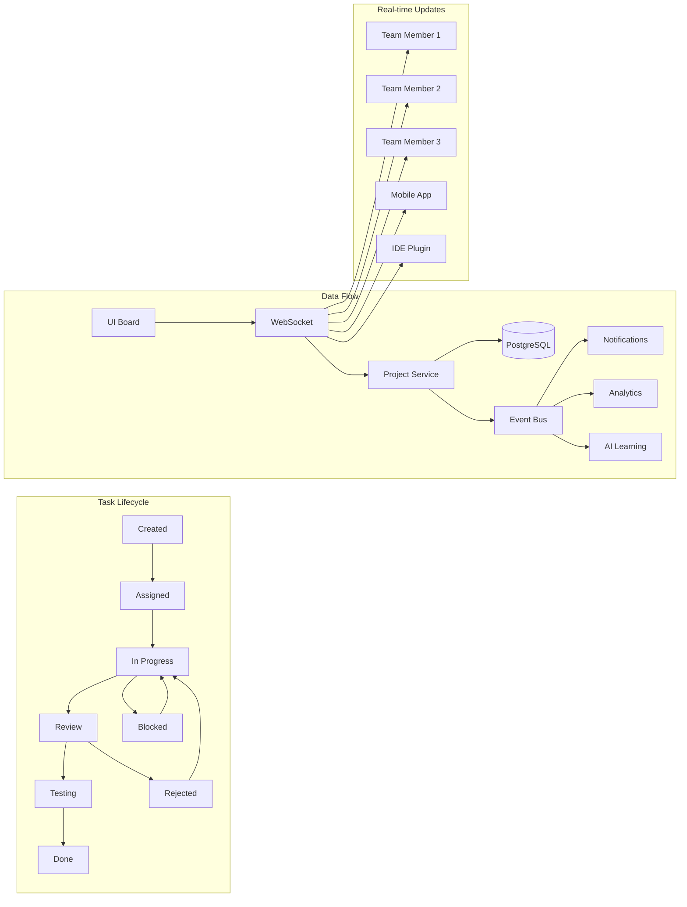

## 6. Learning Engine Flow

### Complete User Story
```yaml
Epic: Personalized Learning System
User Story: As a developer, I want to continuously improve my skills
Value: Level up skills 3x faster than traditional learning

Learning Path:
  1. Assessment:
     - Initial skill evaluation
     - Knowledge gaps identification
     - Learning style detection
     - Goal setting
     
  2. Curriculum:
     - Personalized path generation
     - Adaptive difficulty
     - Mixed media content
     - Practical exercises
     
  3. Progress:
     - XP system
     - Achievement badges
     - Skill tree
     - Leaderboards
     
Content Delivery:
  1. Micro-learning:
     - 5-minute lessons
     - Code challenges
     - Quick quizzes
     - Daily tips
     
  2. Deep Dives:
     - Tutorial series
     - Project-based learning
     - Pair programming
     - Code reviews
     
  3. Assessment:
     - Skill tests
     - Certification prep
     - Interview practice
     - Portfolio building

Gamification:
  1. Rewards:
     - XP points
     - Badges
     - Certificates
     - Profile flair
     
  2. Social:
     - Team challenges
     - Peer learning
     - Mentorship
     - Knowledge sharing
```

### Learning Flow Sequence
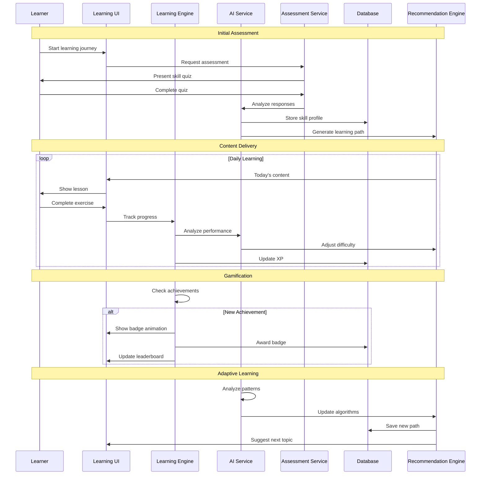

## 7. Error Handling & Recovery Flows

### System-Wide Error Handling
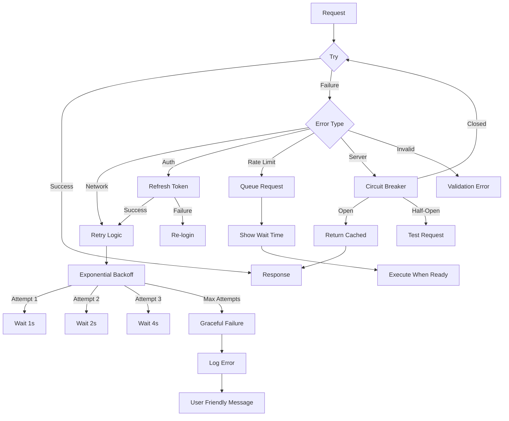

### Detailed Error Recovery Patterns
```yaml
Network Errors:
  Strategy: Exponential backoff with jitter
  Max Attempts: 3
  Delays: [1s, 2s, 4s]
  Jitter: Random 0-1s added
  Fallback: Show offline mode

Authentication Errors:
  401 Unauthorized:
    - Try refresh token
    - If fails, redirect to login
    - Preserve current state
  403 Forbidden:
    - Show permission error
    - Suggest upgrade if needed
    - Log for audit

Rate Limiting:
  429 Too Many Requests:
    - Parse retry-after header
    - Queue request
    - Show countdown to user
    - Execute when allowed

Server Errors:
  500 Internal Error:
    - Log full stack trace
    - Show generic message
    - Offer retry button
    - Report to monitoring
  503 Service Unavailable:
    - Check circuit breaker
    - Use cached if available
    - Show maintenance message

Timeout Errors:
  Request Timeout:
    - Cancel request
    - Try faster endpoint
    - Reduce payload size
    - Show partial results
```

## 8. Caching Strategy

### Multi-Layer Cache Architecture
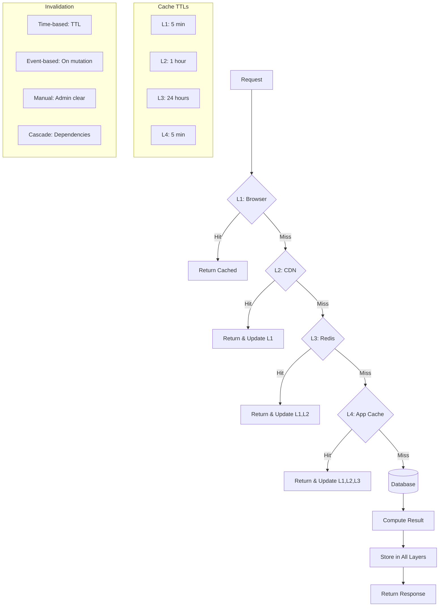

## 9. WebSocket Real-time Flow

### WebSocket Connection Management
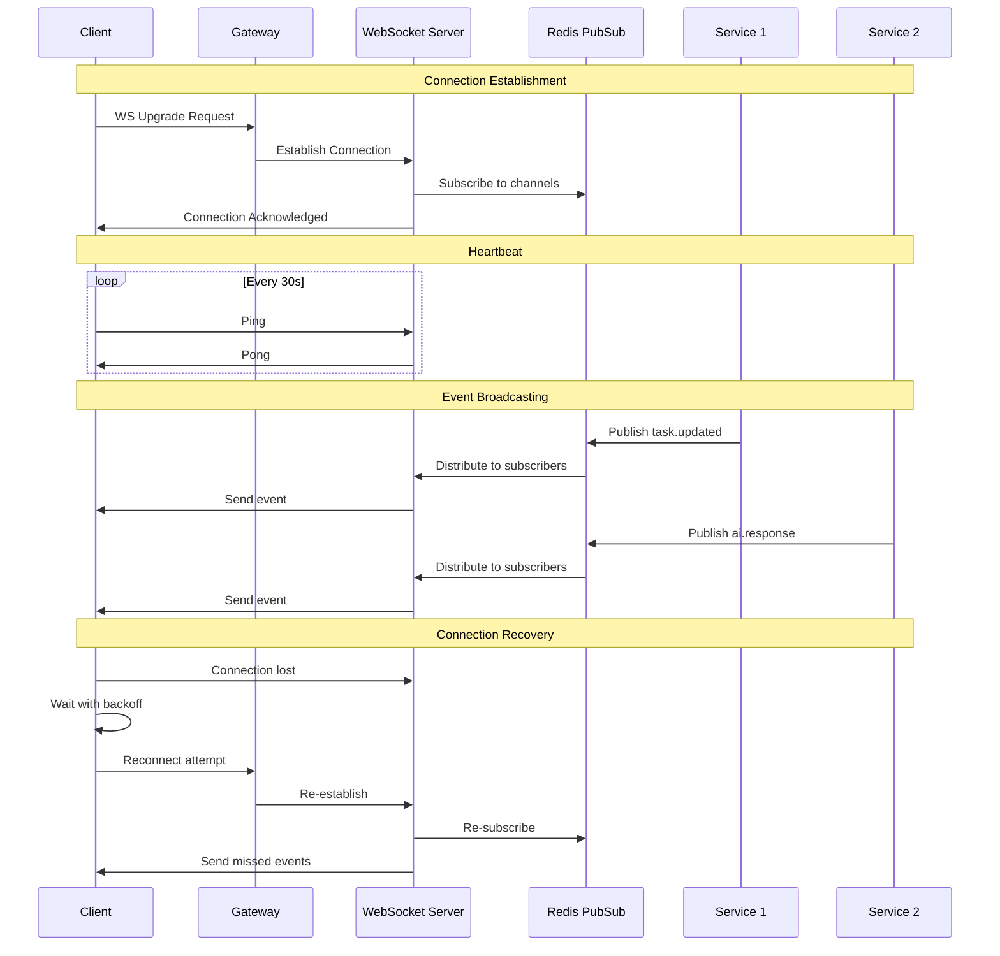

## 10. Complete Service Interaction Matrix

### Service Dependencies
```yaml
API Gateway:
  Depends On: [Auth, Redis]
  Provides To: All services
  Protocols: [HTTP, WebSocket]
  
Auth Service:
  Depends On: [PostgreSQL, Redis]
  Provides To: [API Gateway]
  Protocols: [HTTP, JWT]
  
Repo Analyzer:
  Depends On: [GitHub API, AI Gateway, PostgreSQL]
  Provides To: [Frontend, Learning Engine]
  Protocols: [HTTP, gRPC]
  
AI Gateway:
  Depends On: [Memory Service, Qdrant, LLM Providers]
  Provides To: All services
  Protocols: [HTTP, WebSocket]
  
Memory Service:
  Depends On: [Qdrant, PostgreSQL, AI Gateway]
  Provides To: [AI Gateway, Learning Engine]
  Protocols: [HTTP, gRPC]
  
Project Service:
  Depends On: [PostgreSQL, Redis, WebSocket Server]
  Provides To: [Frontend, Learning Engine]
  Protocols: [HTTP, WebSocket]
  
Learning Engine:
  Depends On: [AI Gateway, Memory Service, PostgreSQL]
  Provides To: [Frontend]
  Protocols: [HTTP, WebSocket]
  
PBML Service:
  Depends On: [Qdrant, AI Gateway, Memory Service]
  Provides To: [AI Gateway, Learning Engine]
  Protocols: [gRPC]
  
Monitoring Service:
  Depends On: [Prometheus, Grafana, All Services]
  Provides To: [Admin Dashboard]
  Protocols: [HTTP, Metrics]
```

## Critical Missing Pieces

### What We Don't Have
1. **Service Mesh**: No proper service discovery
2. **Message Queue**: No async job processing
3. **Workflow Engine**: No complex flow orchestration
4. **Feature Flags**: No gradual rollout capability
5. **A/B Testing**: No experimentation framework
6. **Audit Logs**: No compliance tracking
7. **Backup System**: No disaster recovery
8. **Multi-tenancy**: No proper isolation
9. **Rate Limiting**: Basic implementation only
10. **Circuit Breakers**: Not implemented anywhere

### Required Infrastructure
```yaml
Must Have Before Beta:
  - Service mesh (Istio configured)
  - Message queue (RabbitMQ/Kafka)
  - Feature flags (LaunchDarkly/Unleash)
  - Centralized logging (ELK stack)
  - Distributed tracing (Jaeger)
  - Metrics collection (Prometheus)
  - Alert management (PagerDuty)
  - Backup solution (Velero)
  - Secret management (Vault)
  - Load balancer (properly configured)

Nice to Have:
  - Workflow engine (Temporal/Airflow)
  - A/B testing (Optimizely)
  - Advanced monitoring (DataDog)
  - CDN (CloudFlare)
  - Auto-scaling (HPA/VPA)
```

## Deployment & Rollback Strategy

### Blue-Green Deployment
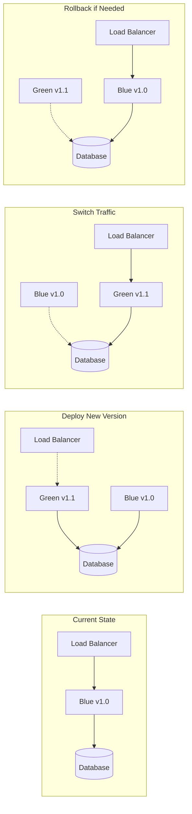

## Success Metrics & Monitoring

### Key Performance Indicators
```yaml
User Metrics:
  - Daily Active Users (DAU)
  - Monthly Active Users (MAU)
  - User Retention (D1, D7, D30)
  - Session Duration
  - Feature Adoption Rate

System Metrics:
  - API Response Time (p50, p95, p99)
  - Error Rate
  - Uptime (99.9% target)
  - Request Volume
  - Cache Hit Rate

Business Metrics:
  - Conversion Rate
  - Customer Acquisition Cost (CAC)
  - Lifetime Value (LTV)
  - Net Promoter Score (NPS)
  - Churn Rate

Technical Metrics:
  - Code Coverage
  - Technical Debt Ratio
  - Deploy Frequency
  - Mean Time to Recovery (MTTR)
  - Change Failure Rate
```

---

**This document represents the COMPLETE interaction architecture. Every arrow, every flow, every connection must be implemented with proper error handling, caching, monitoring, and testing before we can claim ANY feature is "complete".**

