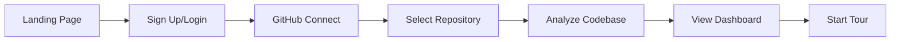


# DevMentor UI Journey & Service Mapping

## 🎯 Implementation Starting Point

**Goal**: Map every UI component to its backend service and define exact APIs needed for the user journey.

---

## 📍 User Journey Flow & Service Dependencies

### Journey 1: First-Time User Onboarding


**Required Services:**
1. **Auth Service** - User registration, JWT tokens
2. **GitHub Service** - OAuth, repo listing
3. **AI Gateway** - Code analysis
4. **Memory Service** - Store analysis results

---

## 🗺️ UI Pages to Service Mapping

### 1. Landing Page (`/`)
**UI Components:**
- Hero section with value proposition
- Feature highlights
- CTA buttons (Sign Up, Login)

**Backend Requirements:**
```typescript
// No backend needed - static content
```

---

### 2. Login/Signup Page (`/login`, `/signup`)
**UI Components:**
- LoginPageModern.tsx
- Email/password form
- GitHub OAuth button
- "Remember me" checkbox

**Backend Requirements:**
```typescript
// AUTH SERVICE (Port 8001)
POST /api/auth/register
{
  email: string,
  password: string,
  fullName: string
}
Response: { token, user }

POST /api/auth/login
{
  email: string,
  password: string
}
Response: { token, user, refreshToken }

POST /api/auth/github/oauth
Response: { redirectUrl }

POST /api/auth/github/callback
{
  code: string,
  state: string
}
Response: { token, user, repos }
```

---

### 3. Dashboard (`/dashboard`)
**UI Components:**
- DashboardLayout.tsx
- ProjectTasksWidget
- AIActivityNotifier
- MemoryBankWidget
- RecentActivityFeed

**Backend Requirements:**
```typescript
// PROJECT SERVICE (Port 8003)
GET /api/projects
Response: Project[]

GET /api/projects/:id/tasks
Response: Task[]

GET /api/projects/:id/activity
Response: ActivityEvent[]

// MEMORY SERVICE (Port 8005)
GET /api/memory/recent
Response: Memory[]

GET /api/memory/stats
Response: { totalMemories, searchQueries, patterns }

// AI GATEWAY (Port 8004)
GET /api/ai/activity
Response: AIActivity[]
```

**WebSocket Events:**
```typescript
// WEBSOCKET SERVICE (Port 8002)
- 'project:updated'
- 'task:created'
- 'task:updated'
- 'ai:thinking'
- 'memory:stored'
```

---

### 4. Project Management (`/projects`)
**UI Components:**
- ProjectWizard.tsx
- ProjectKanban.tsx
- TaskFormModal.tsx
- EpicManagement.tsx

**Backend Requirements:**
```typescript
// PROJECT SERVICE (Port 8003)
POST /api/projects
{
  name: string,
  description: string,
  githubRepo?: string,
  techStack: string[]
}

PUT /api/projects/:id
PATCH /api/projects/:id/status

// Epic Management
POST /api/projects/:id/epics
GET /api/projects/:id/epics
PUT /api/epics/:id

// Task Management
POST /api/epics/:id/tasks
{
  title: string,
  description: string,
  assignee?: string,
  priority: 'P0' | 'P1' | 'P2' | 'P3',
  dueDate?: Date
}

PUT /api/tasks/:id
PATCH /api/tasks/:id/status
{
  status: 'todo' | 'in_progress' | 'review' | 'done'
}

// Drag & Drop
POST /api/tasks/:id/move
{
  newStatus: string,
  newPosition: number
}
```

---

### 5. Memory Bank (`/memory-bank`)
**UI Components:**
- MemoryBank.tsx
- MemorySearch.tsx
- PatternVisualization.tsx
- ContextExplorer.tsx

**Backend Requirements:**
```typescript
// MEMORY SERVICE (Port 8005)
POST /api/memory/store
{
  content: string,
  type: 'code' | 'decision' | 'pattern' | 'learning',
  metadata: {
    project?: string,
    tags: string[],
    source: string
  }
}

GET /api/memory/search?q=query&limit=10
Response: {
  results: Memory[],
  embeddings: number[][],
  relevanceScores: number[]
}

POST /api/memory/rag/query
{
  question: string,
  context: string[],
  maxTokens: number
}
Response: {
  answer: string,
  sources: Memory[],
  confidence: number
}

GET /api/memory/patterns
Response: Pattern[]

DELETE /api/memory/:id
```

**Qdrant Integration:**
```typescript
// Vector Storage
- Collection: 'devmentor_memories'
- Dimensions: 1536 (OpenAI embeddings)
- Metadata: { userId, projectId, timestamp, type }
```

---

### 6. AI Assistant (`/ai`)
**UI Components:**
- AIAssistant.tsx
- PromptBuilder.tsx
- ResponseStreaming.tsx
- ContextPanel.tsx

**Backend Requirements:**
```typescript
// AI GATEWAY (Port 8004)
POST /api/ai/chat
{
  messages: ChatMessage[],
  context: {
    projectId?: string,
    files?: string[],
    memories?: string[]
  },
  model: 'gpt-4' | 'claude-3' | 'local'
}
Response: Stream<ChatResponse>

POST /api/ai/analyze/code
{
  code: string,
  language: string,
  analysisType: 'review' | 'refactor' | 'explain' | 'test'
}

POST /api/ai/generate
{
  type: 'code' | 'test' | 'docs',
  specification: string,
  context: Context
}

// Streaming Responses (SSE)
GET /api/ai/stream/:sessionId
```

---

### 7. Architecture Visualization (`/architecture`)
**UI Components:**
- SystemArchitectureVisualization.tsx
- MultiAgentVisualization.tsx
- DiagramEditor.tsx
- DecisionRecords.tsx

**Backend Requirements:**
```typescript
// AI GATEWAY (Port 8004)
POST /api/ai/architecture/analyze
{
  repositoryUrl: string,
  depth: 'shallow' | 'deep'
}

GET /api/ai/architecture/diagram/:projectId
Response: {
  nodes: Node[],
  edges: Edge[],
  layers: Layer[]
}

// PROJECT SERVICE (Port 8003)
POST /api/projects/:id/decisions
{
  title: string,
  description: string,
  rationale: string,
  alternatives: string[],
  consequences: string[]
}

GET /api/projects/:id/decisions
```

---

### 8. Learning Hub (`/learning`)
**UI Components:**
- InteractiveLearningDashboard.tsx (no quiz!)
- LearningPathRecommendations.tsx
- ProgressTracker.tsx
- ResourceLibrary.tsx

**Backend Requirements:**
```typescript
// LEARNING SERVICE (Port 8007)
GET /api/learning/paths/:userId
Response: LearningPath[]

POST /api/learning/recommend
{
  userId: string,
  skills: string[],
  goals: string[]
}

POST /api/learning/progress
{
  userId: string,
  pathId: string,
  moduleId: string,
  completed: boolean
}

GET /api/learning/resources?topic=string
Response: Resource[]
```

---

### 9. GitHub Integration (`/repos`)
**UI Components:**
- RepoAnalyzer.tsx
- CodebaseInsights.tsx
- PRReviewer.tsx
- CommitAnalyzer.tsx

**Backend Requirements:**
```typescript
// GITHUB SERVICE (Port 8006)
GET /api/github/repos
Response: Repository[]

POST /api/github/analyze
{
  owner: string,
  repo: string,
  branch?: string
}

GET /api/github/repo/:owner/:name/insights
Response: {
  languages: LanguageStats,
  contributors: Contributor[],
  complexity: ComplexityMetrics,
  techDebt: TechDebtAnalysis
}

POST /api/github/pr/review
{
  owner: string,
  repo: string,
  prNumber: number
}

// Webhooks
POST /api/github/webhook
{
  event: 'push' | 'pull_request' | 'issue',
  payload: GitHubPayload
}
```

---

## 🔌 WebSocket Real-Time Events

### WebSocket Service Implementation
```typescript
// WEBSOCKET SERVICE (Port 8002)
import { Server } from 'socket.io';

const io = new Server(8002, {
  cors: {
    origin: "http://localhost:3001"
  }
});

// Room Management
io.on('connection', (socket) => {
  // Join project room
  socket.on('join:project', (projectId) => {
    socket.join(`project:${projectId}`);
  });

  // Task events
  socket.on('task:update', (data) => {
    socket.to(`project:${data.projectId}`).emit('task:updated', data);
  });

  // AI events
  socket.on('ai:request', (data) => {
    socket.emit('ai:thinking');
    // Process...
    socket.emit('ai:response', response);
  });

  // Memory events
  socket.on('memory:query', async (query) => {
    const results = await searchMemories(query);
    socket.emit('memory:results', results);
  });
});
```

---

## 🚀 Implementation Order

### Week 1: Foundation
1. **Auth Service** - Login/Register/JWT
2. **Project Service** - CRUD with PostgreSQL
3. **WebSocket Service** - Basic events

### Week 2: Core Features
4. **Memory Service** - Qdrant integration
5. **AI Gateway** - OpenAI connection
6. **Real-time sync** - Connect WebSocket to services

### Week 3: Advanced
7. **GitHub Service** - OAuth & API
8. **Learning Service** - Recommendations
9. **TDD Service** - Test generation

---

## 📦 Microservice Contents

### Auth Service (Port 8001)
```
backend/services/auth/
├── src/
│   ├── index.ts           # Express server
│   ├── routes/
│   │   ├── auth.ts        # Login/register routes
│   │   └── oauth.ts       # GitHub OAuth
│   ├── middleware/
│   │   ├── jwt.ts         # JWT validation
│   │   └── rbac.ts        # Role-based access
│   ├── models/
│   │   └── user.ts        # User model
│   └── services/
│       ├── auth.service.ts
│       └── token.service.ts
├── Dockerfile
└── package.json
```

### Project Service (Port 8003)
```
backend/services/projects/
├── src/
│   ├── index.ts
│   ├── routes/
│   │   ├── projects.ts
│   │   ├── epics.ts
│   │   └── tasks.ts
│   ├── models/
│   │   ├── project.ts
│   │   ├── epic.ts
│   │   └── task.ts
│   ├── services/
│   │   └── project.service.ts
│   └── websocket/
│       └── events.ts
├── Dockerfile
└── package.json
```

### Memory Service (Port 8005)
```
backend/services/memory/
├── src/
│   ├── index.ts
│   ├── routes/
│   │   ├── memory.ts
│   │   └── rag.ts
│   ├── services/
│   │   ├── qdrant.service.ts
│   │   ├── embedding.service.ts
│   │   └── rag.service.ts
│   └── models/
│       └── memory.ts
├── Dockerfile
└── package.json
```

### AI Gateway (Port 8004)
```
backend/services/ai-gateway/
├── src/
│   ├── index.ts
│   ├── routes/
│   │   ├── chat.ts
│   │   ├── analyze.ts
│   │   └── generate.ts
│   ├── services/
│   │   ├── openai.service.ts
│   │   ├── claude.service.ts
│   │   └── context.service.ts
│   ├── streaming/
│   │   └── sse.ts
│   └── agents/
│       ├── code.agent.ts
│       ├── docs.agent.ts
│       └── architect.agent.ts
├── Dockerfile
└── package.json
```

---

## ✅ Success Metrics

1. **User can sign up and login** ✓
2. **User can connect GitHub** ✓
3. **User can create projects** ✓
4. **Tasks update in real-time** ✓
5. **AI responds to queries** ✓
6. **Memories are searchable** ✓
7. **Architecture is visualized** ✓
8. **Learning paths are personalized** ✓

---

## 🎬 Next Steps

1. **Today**: Create Auth Service with JWT
2. **Tomorrow**: Implement Project Service with PostgreSQL
3. **Day 3**: Add WebSocket server with events
4. **Day 4**: Connect Memory Service to Qdrant
5. **Day 5**: Integrate OpenAI in AI Gateway

**Start Here**: `backend/services/auth/` - It's the foundation everything else depends on!

