
# 🔍 DevMentor Observability Architecture

## 📚 Overview - The Three Pillars of Observability

Observability is built on **three fundamental pillars** that work together to give you complete visibility into your system:

### 1. **Metrics** 📈 (Numbers)
- **What**: Numeric measurements over time (CPU usage, request rates, memory consumption)
- **Tool**: **Prometheus** collects and stores metrics
- **Use Case**: "Is my system healthy? What's the trend?"

### 2. **Logs** 📝 (Events)
- **What**: Detailed text records of what happened (errors, debug info, user actions)
- **Tool**: **Loki** aggregates and indexes logs
- **Use Case**: "What exactly happened when the error occurred?"

### 3. **Traces** 🔗 (Journeys)
- **What**: The path of a request through multiple services
- **Tool**: **Jaeger** tracks distributed traces
- **Use Case**: "Why is this request slow? Where's the bottleneck?"

## 🏗️ Architecture Components

```mermaid
graph TB
    subgraph "Your Services"
        MS[Monitoring Service<br/>:3006]
        AS[Auth Service]
        PS[Project Service]
        UI[Frontend UI]
    end
    
    subgraph "Observability Stack"
        P[Prometheus<br/>:9090<br/>📈 Metrics]
        G[Grafana<br/>:3007<br/>📊 Dashboards]
        L[Loki<br/>:3100<br/>📝 Logs]
        J[Jaeger<br/>:16686<br/>🔗 Traces]
        K[Kiali<br/>:20001<br/>🕸️ Service Mesh]
        AM[AlertManager<br/>:9093<br/>🚨 Alerts]
    end
    
    subgraph "Data Collectors"
        PT[Promtail<br/>Log Shipper]
        NE[Node Exporter<br/>System Metrics]
        CA[cAdvisor<br/>Container Metrics]
    end
    
    MS --> P
    AS --> J
    PS --> J
    UI --> MS
    
    PT --> L
    NE --> P
    CA --> P
    
    P --> G
    L --> G
    J --> G
    P --> K
    J --> K
    P --> AM
    AM --> MS
    
    MS -.->|Unified API| UI
```



## 🎯 Tool Responsibilities

### **Prometheus** (Port 9090)
**Purpose**: Time-series database for metrics
- Scrapes metrics from services every 15 seconds
- Stores data efficiently with compression
- Provides PromQL query language
- **Learning Tip**: Think of it as your system's "vital signs monitor"

### **Grafana** (Port 3007)
**Purpose**: Visualization platform
- Creates beautiful dashboards from multiple data sources
- Combines metrics (Prometheus), logs (Loki), and traces (Jaeger)
- Provides alerting and annotations
- **Learning Tip**: Your "single pane of glass" for all observability data

### **Loki** (Port 3100)
**Purpose**: Log aggregation system
- Like Prometheus but for logs
- Indexes metadata, not full text (efficient!)
- Integrates seamlessly with Grafana
- **Learning Tip**: "grep on steroids" with time-based indexing

### **Jaeger** (Port 16686)
**Purpose**: Distributed tracing
- Tracks requests across microservices
- Shows latency breakdowns
- Identifies bottlenecks
- **Learning Tip**: Like a "GPS tracker" for your requests

### **Kiali** (Port 20001)
**Purpose**: Service mesh observability (Istio)
- Visualizes service communication
- Shows traffic flow and health
- Integrates with Istio telemetry
- **Learning Tip**: Your microservices "social network" viewer

### **AlertManager** (Port 9093)
**Purpose**: Alert routing and management
- Receives alerts from Prometheus
- Groups, deduplicates, and routes alerts
- Sends notifications (webhook, email, Slack)
- **Learning Tip**: Your system's "911 dispatcher"

## 🔄 Data Flow

### Metrics Collection Flow
```
Service → Prometheus Exporter → Prometheus → Grafana Dashboard
                                     ↓
                                AlertManager → Monitoring Service
```

### Log Collection Flow
```
Service → Log File → Promtail → Loki → Grafana Dashboard
                                   ↓
                            Monitoring Service API
```

### Trace Collection Flow
```
Service → OpenTelemetry/Jaeger Client → Jaeger → Grafana Dashboard
                                            ↓
                                    Monitoring Service API
```

## 📊 Monitoring Service Integration

Your monitoring service (port 3006) acts as a **unified gateway**:

### API Endpoints
- `/api/observability/dashboard` - Unified dashboard data
- `/api/observability/prometheus/query` - Query Prometheus metrics
- `/api/observability/loki/query` - Query Loki logs
- `/api/observability/jaeger/traces` - Get Jaeger traces
- `/api/observability/kiali/graph` - Get service mesh topology
- `/api/observability/alerts` - Get active alerts

### Real-time Updates
- WebSocket connection for live updates
- Alert notifications
- Metric streaming
- Incident management

## 🚀 Quick Start Guide

### 1. Start the Observability Stack
```bash
# Start all observability services
docker-compose -f docker-compose.observability.yml up -d

# Verify services are running
docker-compose -f docker-compose.observability.yml ps
```

### 2. Access the UIs
- **Grafana**: http://localhost:3007 (admin/devmentor123)
- **Prometheus**: http://localhost:9090
- **Jaeger**: http://localhost:16686
- **Kiali**: http://localhost:20001
- **AlertManager**: http://localhost:9093
- **Monitoring Service**: http://localhost:3006

### 3. Common Queries

#### Prometheus (PromQL)
```promql
# CPU usage percentage
100 - (avg(irate(node_cpu_seconds_total{mode="idle"}[5m])) * 100)

# Memory usage percentage
(1 - (node_memory_MemAvailable_bytes / node_memory_MemTotal_bytes)) * 100

# HTTP request rate
rate(http_requests_total[5m])

# Container memory usage
container_memory_usage_bytes{name="devmentor-monitoring-service-1"}
```

#### Loki (LogQL)
```logql
# Get all error logs
{job="devmentor"} |= "error"

# Get logs from specific service
{container_name="monitoring-service-1"} 

# Parse JSON and filter
{job="containerlogs"} | json | level="error"
```

## 🎓 Learning Resources

### Key Concepts to Master

1. **Time Series Data**: Data points indexed by time
2. **Cardinality**: Number of unique label combinations
3. **Service Level Indicators (SLIs)**: Metrics that matter
4. **Service Level Objectives (SLOs)**: Targets for SLIs
5. **RED Method**: Rate, Errors, Duration
6. **USE Method**: Utilization, Saturation, Errors
7. **Golden Signals**: Latency, Traffic, Errors, Saturation

### Best Practices

1. **Label Carefully**: High cardinality = high storage costs
2. **Alert on Symptoms**: Not causes
3. **Use Recording Rules**: Pre-compute expensive queries
4. **Implement SLOs**: Define what "good" looks like
5. **Correlate Signals**: Use all three pillars together

## 🔧 Troubleshooting Guide

### Service Not Appearing in Prometheus
```bash
# Check if service is exposing metrics
curl http://localhost:3006/metrics

# Check Prometheus targets
curl http://localhost:9090/api/v1/targets
```

### Logs Not Appearing in Loki
```bash
# Check Promtail status
docker logs devmentor-promtail

# Verify log path exists
docker exec devmentor-promtail ls -la /app/logs
```

### Traces Not Appearing in Jaeger
```bash
# Check if service is sending traces
docker logs your-service | grep jaeger

# Verify Jaeger is receiving data
curl http://localhost:16686/api/services
```

## 📈 Monitoring Dashboard Features

### Metrics Tab 📊
- **System Metrics**: CPU, Memory, Disk, Network
- **Service Health**: Up/Down status, response times
- **Custom Metrics**: Business KPIs, user activity
- **Tooltips**: Hover for explanations of each metric

### Logs Tab 📝
- **Live Log Stream**: Real-time log viewing
- **Search & Filter**: Query logs by service, level, content
- **Context View**: See logs before/after an event
- **Tooltips**: Understanding log levels and formats

### Traces Tab 🔗
- **Service Map**: Visual service dependencies
- **Trace Timeline**: Request flow visualization
- **Latency Analysis**: Identify slow services
- **Tooltips**: Learn about spans, traces, and timing

### Alerts Tab 🚨
- **Active Alerts**: Current issues
- **Alert History**: Past incidents
- **Silence Management**: Temporarily disable alerts
- **Tooltips**: Alert severity and response procedures

### Service Mesh Tab 🕸️
- **Traffic Flow**: Live request routing
- **Service Health**: Error rates, latencies
- **Configuration**: Istio policies and rules
- **Tooltips**: Service mesh concepts explained

## 🎯 Integration with DevMentor

The monitoring service provides:
1. **Unified API**: Single endpoint for all observability data
2. **Authentication**: Secure access to metrics
3. **Business Logic**: Smart alerting and predictions
4. **WebSocket Updates**: Real-time dashboard updates
5. **Incident Management**: Track and resolve issues

## 📚 Further Reading

- [Prometheus Documentation](https://prometheus.io/docs/)
- [Grafana Tutorials](https://grafana.com/tutorials/)
- [Loki Best Practices](https://grafana.com/docs/loki/latest/best-practices/)
- [Jaeger Documentation](https://www.jaegertracing.io/docs/)
- [Kiali Documentation](https://kiali.io/documentation/)
- [The RED Method](https://www.weave.works/blog/the-red-method-key-metrics-for-microservices-architecture/)
- [Google SRE Book](https://sre.google/sre-book/table-of-contents/)

