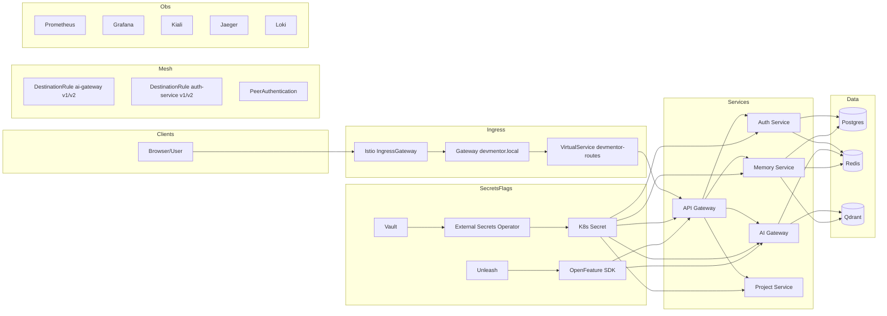


# Whiteboard Diagram Practice: Ingress, Egress, Secrets, Flags, Canary

Audience: Engineers learning/aligning on DevMentor runtime control and traffic patterns
Goal: Practice drawing the platform from memory and verify understanding using a consistent, repeatable checklist.

What you will draw (boxes + arrows)
- Clients & DNS
  - Browser/User
  - devmentor.local note: /etc/hosts → 127.0.0.1 (Kind) and port-forward istio-ingressgateway 80→localhost:8080
- Ingress & Mesh (Istio)
  - Istio IngressGateway
  - Gateway (host: devmentor.local)
  - VirtualService (/api/auth → auth-service, /api/ai → ai-gateway, /api/memory, /api/projects)
  - DestinationRules (ai-gateway, auth-service) subsets v1/v2 (Deployment labels: version: v1|v2)
  - PeerAuthentication: PERMISSIVE in dev (STRICT later)
- Core Services
  - API Gateway (8080), Auth (3002), AI Gateway (3001), Memory (3003), Project (3004)
- Data Stores
  - Postgres, Redis, Qdrant
- Secrets & Feature Flags
  - Vault → External Secrets Operator → K8s Secret → env vars in pods
  - Unleash → OpenFeature SDK (api-gateway, ai-gateway)
- Observability
  - Prometheus, Grafana, Kiali, Jaeger, Loki

Five flows to annotate (1–5)
1) Ingress flow
   Browser → IngressGateway → Gateway(devmentor.local) → VirtualService → Service (e.g., API Gateway) → Response
2) Egress flow (external AI API)
   AI Gateway → ServiceEntry (e.g., api.openai.com, api.anthropic.com) → External provider → Response
3) Secrets flow
   Vault → ESO → Kubernetes Secret → Pod env (e.g., REDIS_URL, JWT_SECRET)
4) Feature flags flow
   Unleash → OpenFeature SDK in service → Evaluate per request (userId) → Toggle behavior
5) Canary flow
   VirtualService weights (e.g., 90/10) → DestinationRule subsets v1/v2 → Two ReplicaSets labeled version: v1/v2

Gotchas to write on the side
- Service selector must NOT include version; subsets match pod labels (version: v1/v2)
- Add ServiceEntry for outbound domains or mesh won’t observe/allow egress
- Namespace needs istio-injection=enabled; restart pods for sidecars
- Start mTLS PERMISSIVE; flip to STRICT after stabilization
- Flags must default to safe values if provider is unavailable

Step-by-step practice (15–25 minutes)
Stage 1 — Boxes and lanes (5m)
- Draw the layers: Clients & DNS → Ingress → Mesh → Services → Data Stores → Secrets/Flags → Observability
- Place each component as a box. Keep space for arrows.

Stage 2 — Flows (10m)
- Add arrows for the five flows above. Number each arrow leg 1.x, 2.x, etc.
- On each arrow, add a 1–3 word verb: "route", "eval flag", "read secret", "egress allow".

Stage 3 — Canary math (3m)
- Under ai-gateway, draw two Deployment boxes: v1 (3 pods), v2 (1 pod) labeled version: v1/v2.
- In the VirtualService box, write "90/10"; in Kiali, expect 90%/10% split.

Stage 4 — Egress policy (3m)
- Draw a ServiceEntry box listing api.openai.com and api.anthropic.com.
- Note: Prefer OutboundTrafficPolicy REGISTRY_ONLY in prod with explicit ServiceEntries.

Stage 5 — Secrets & flags (3m)
- Draw Vault → ESO → K8s Secret → Pod env chain.
- Draw Unleash → OpenFeature → api-gateway/ai-gateway.

Self-check questions (write answers on the board)
- Which resource maps external host/path to a service? (VirtualService)
- Where do you specify canary subsets? (DestinationRule) How do pods match? (labels)
- How do you allow egress to OpenAI? (ServiceEntry)
- How do services get secrets without committing them? (Vault + ESO → K8s Secret → env)
- How can you toggle features per user, without restarts? (Unleash + OpenFeature)

Verification commands (after drawing; optional quick lab)
- Ingress:
  - kubectl -n istio-system port-forward svc/istio-ingressgateway 8080:80 &
  - curl -s http://localhost:8080/health | jq || true
- Mesh/Canary:
  - kubectl -n devmentor-app get virtualservice,destinationrule
  - Check Kiali graph (pf Kiali: 20001:20001) for v1/v2 split
- Egress:
  - kubectl -n devmentor-app get serviceentry
- Secrets:
  - kubectl -n devmentor-app get externalsecret,secret | grep -E "api-gateway|ai-gateway|auth"
- Flags (sanity):
  - PF Unleash (if deployed): kubectl -n devmentor-app port-forward svc/unleash 4242:4242 &

Acceptance checklist (tick these off)
- Layers complete: Clients/DNS, Ingress, Mesh, Services, Data Stores, Secrets/Flags, Observability
- All five flows drawn and numbered
- Canary subsets v1/v2 and 90/10 split annotated
- Egress ServiceEntry listed with real hosts
- Secrets chain and flag chain drawn end-to-end

Mermaid templates (optional, if you prefer text diagrams)
- Architecture skeleton:


- Canary routing skeleton:
```mermaid
flowchart LR
  VS[VirtualService /api/ai 90/10] --> DR[DestinationRule ai-gateway]
  DR -->|subset v1| V1[Deployment ai-gateway v1 (labels: version=v1)]
  DR -->|subset v2| V2[Deployment ai-gateway v2 (labels: version=v2)]
```

Common mistakes & quick fixes
- 503s during canary: subsets don’t match pod labels; add version: v1/v2 labels and reapply
- Only one subset gets traffic: Service selector included version; remove it to select both
- External calls blocked: missing ServiceEntry; add domains and verify
- Missing sidecars in Kiali: ensure istio-injection=enabled on namespace; restart pods
- Flags “stuck”: provider not reachable; ensure defaults are safe and retry logic is in place

When ready, snap a photo of your drawing and upload it. We’ll review and correct it using this same checklist.


