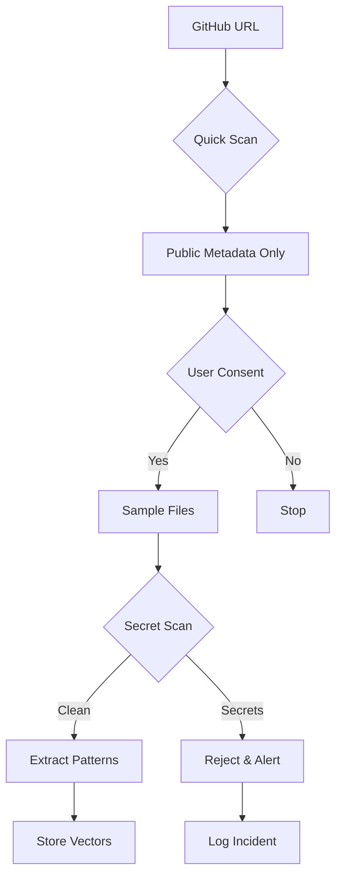


# 🔒 Security & Zero-Knowledge Architecture Runbook

## Table of Contents
1. [Overview](#overview)
2. [Zero-Knowledge Implementation](#zero-knowledge-implementation)
3. [Secret Detection](#secret-detection)
4. [Repository Analysis Security](#repository-analysis-security)
5. [Data Privacy Controls](#data-privacy-controls)
6. [Incident Response](#incident-response)
7. [Compliance Procedures](#compliance-procedures)
8. [Security Monitoring](#security-monitoring)

## Overview

DevMentor implements a **zero-knowledge security architecture** where we analyze code patterns without storing source code or sensitive data.

### Security Principles
1. **Minimal Data Collection** - Only patterns, never source
2. **Secret Auto-Rejection** - Automatic detection and blocking
3. **User-Controlled Access** - Granular permission controls
4. **Encryption Everywhere** - At rest and in transit
5. **Right to Deletion** - Complete data removal on demand

### Key Security Components
```
security/
├── zero-knowledge-analyzer/   # Pattern extraction
├── secret-detector/           # Secret scanning
├── encryption-manager/        # Multi-layer encryption
├── privacy-controls/          # User consent management
└── audit-logger/             # Security event logging
```

## Zero-Knowledge Implementation

### Pattern Extraction Pipeline

```typescript
// How we analyze without storing code
async function analyzeCode(code: string) {
  // Step 1: Scan for secrets
  await secretDetector.scan(code); // Throws if secrets found
  
  // Step 2: Sanitize
  const sanitized = sanitize(code);
  
  // Step 3: Extract patterns only
  const patterns = extractPatterns(sanitized);
  
  // Step 4: Convert to vectors (one-way)
  const vectors = toVectors(patterns);
  
  // Step 5: Destroy original
  secureDelete(code);
  secureDelete(sanitized);
  
  // Step 6: Store only vectors
  return encrypt(vectors);
}
```

### What We Extract vs What We Don't

```yaml
# ✅ We Extract (Patterns Only)
Patterns:
  - Indentation style (spaces/tabs)
  - Naming conventions (camelCase/snake_case)
  - Function length averages
  - Comment-to-code ratios
  - Framework usage patterns
  - Test coverage levels
  - Error handling styles

# ❌ We Never Store
Never:
  - Actual source code
  - String literals
  - Variable values
  - API endpoints
  - Business logic
  - Comments content
  - File paths with PII
```

### Secure Pattern Storage

```bash
# Pattern storage format
{
  "userId": "user_123",
  "patterns": {
    "codingStyle": {
      "vector": [0.23, 0.45, 0.67, ...],  # One-way transformation
      "confidence": 0.92
    }
  },
  "metadata": {
    "analyzed": "2024-01-20T10:30:00Z",
    "filesProcessed": 45,
    "secretsDetected": 0
  }
}
```

## Secret Detection

### Secret Scanner Configuration

```typescript
// config/secret-patterns.ts
export const secretPatterns = [
  // API Keys
  /(?:api[_-]?key|apikey)['\"]?\s*[:=]\s*['\"]?([A-Za-z0-9_\-]{20,})/gi,
  
  // AWS
  /AKIA[0-9A-Z]{16}/g,
  /(aws[_-]?secret[_-]?access[_-]?key)['\"]?\s*[:=]\s*['\"]?([A-Za-z0-9\/+=]{40})/gi,
  
  // Private Keys
  /-----BEGIN (RSA |EC |DSA |OPENSSH )?PRIVATE KEY-----/g,
  
  // GitHub
  /ghp_[A-Za-z0-9]{36}/g,
  /gho_[A-Za-z0-9]{36}/g,
  
  // Generic Secrets
  /(password|passwd|pwd)['\"]?\s*[:=]\s*['\"]([^'\"]+)['\"]?/gi,
  /(secret|token)['\"]?\s*[:=]\s*['\"]([^'\"]+)['\"]?/gi
];
```

### Secret Detection Workflow

```bash
# 1. Pre-scan file
npm run scan:secrets file.js

# 2. If secrets detected
> SECRET DETECTED: Rejecting file
> Type: API_KEY
> Action: BLOCKED
> File not processed

# 3. Log detection (not the secret!)
{
  "event": "secret_detected",
  "timestamp": "2024-01-20T10:30:00Z",
  "fileHash": "abc123...",
  "secretType": "api_key",
  "action": "rejected"
}
```

### Emergency Secret Response

```bash
# If secret accidentally processed
npm run security:emergency

# 1. Immediate actions
- Revoke user access
- Purge all user data
- Notify security team
- Log incident

# 2. Investigation
npm run security:investigate user_123

# 3. Report generation
npm run security:report --incident=INC-001
```

## Repository Analysis Security

### File Access Limits

```typescript
// config/repo-limits.ts
export const repoLimits = {
  files: {
    maxFiles: 100,              // Per scan
    maxFileSize: 500_000,       // 500KB
    maxTotalSize: 10_000_000,   // 10MB
    timeout: 30_000             // 30 seconds per file
  },
  
  excluded: [
    '*.env*',         // Environment files
    '*secret*',       // Secret files
    '*.key',          // Key files
    '*.pem',          // Certificates
    'node_modules/**', // Dependencies
    '.git/**',        // Git internals
    'dist/**',        // Build outputs
  ],
  
  rateLimits: {
    scansPerHour: 10,
    filesPerMinute: 100,
    concurrentScans: 3
  }
};
```

### GitHub OAuth Security

```bash
# Minimal permission scopes
GITHUB_SCOPES="read:user public_repo"  # Default
GITHUB_SCOPES_PRIVATE="repo"           # Only with explicit consent

# Token encryption
- Encrypted immediately after receipt
- Stored with user-specific key
- Auto-expires after 2 hours
- Refresh requires re-authentication
```

### Progressive Analysis Security



## Data Privacy Controls

### User Consent Management

```typescript
// User privacy settings
interface PrivacySettings {
  allowPrivateRepos: boolean;      // Default: false
  sharePatterns: boolean;          // Default: true (team only)
  dataRetention: number;           // Days (7, 30, 90)
  autoDelete: boolean;             // Default: true
  excludedFiles: string[];         // User-defined exclusions
}

// Consent levels
enum ConsentLevel {
  MINIMAL = "public_metadata_only",
  STANDARD = "public_repos_patterns",
  FULL = "include_private_repos"
}
```

### Data Retention Policy

```bash
# Automatic data deletion
- User patterns: 30 days (configurable)
- Session data: 7 days
- Audit logs: 90 days
- Encrypted tokens: 2 hours

# Manual deletion
POST /api/privacy/delete-all
{
  "userId": "user_123",
  "confirmation": "DELETE_ALL_MY_DATA"
}

# Response
{
  "deleted": {
    "patterns": 45,
    "sessions": 3,
    "tokens": 2,
    "auditLogs": 156
  },
  "timestamp": "2024-01-20T10:30:00Z"
}
```

### GDPR Compliance

```bash
# Data export (GDPR Article 20)
GET /api/privacy/export/user_123

# Returns
{
  "userData": {...},
  "patterns": [...],
  "activityLog": [...],
  "format": "json",
  "generated": "2024-01-20T10:30:00Z"
}

# Right to be forgotten (Article 17)
DELETE /api/privacy/user/user_123

# Deletion verification
npm run verify:deletion user_123
```

## Incident Response

### Security Incident Levels

```yaml
Level 1 - Critical:
  - Source code exposure
  - Secret/credential leak
  - Data breach
  Response: Immediate shutdown, notify all stakeholders

Level 2 - High:
  - Unauthorized access attempt
  - Pattern injection attack
  - Rate limit bypass
  Response: Block source, investigate, patch

Level 3 - Medium:
  - Suspicious activity patterns
  - Failed authentication spikes
  Response: Monitor, investigate if persists

Level 4 - Low:
  - Normal failed auth
  - Rate limit hits
  Response: Log and monitor
```

### Incident Response Procedure

```bash
# 1. Detect incident
Alert received or detected

# 2. Assess severity
npm run security:assess --incident=INC-001

# 3. Contain
npm run security:contain --user=user_123 --action=block

# 4. Investigate
npm run security:investigate --from="2024-01-20" --to="2024-01-21"

# 5. Remediate
npm run security:patch --issue=SEC-001

# 6. Report
npm run security:report --incident=INC-001 --format=pdf
```

### Emergency Contacts

```yaml
Security Team:
  email: security@devmentor.ai
  slack: #security-incidents
  pager: security-oncall

Data Protection Officer:
  email: dpo@devmentor.ai
  phone: +1-xxx-xxx-xxxx

Legal:
  email: legal@devmentor.ai
```

## Compliance Procedures

### SOC2 Compliance

```bash
# Access controls
- Multi-factor authentication required
- Role-based access control (RBAC)
- Audit logging for all access

# Change management
- All changes require PR review
- Security review for sensitive changes
- Automated testing required

# Monitoring
- 24/7 security monitoring
- Automated alerting
- Incident response SLA: 1 hour
```

### Privacy Shield / GDPR

```bash
# Data minimization
- Only collect necessary patterns
- Automatic data expiry
- User-controlled retention

# Transparency
- Clear privacy policy
- Data processing notifications
- Activity logs visible to users

# Security measures
- Encryption at rest (AES-256)
- Encryption in transit (TLS 1.3)
- Regular security audits
```

## Security Monitoring

### Real-time Monitoring

```yaml
# Prometheus alerts
groups:
  - name: security
    rules:
      - alert: SecretDetected
        expr: secret_detection_total > 0
        annotations:
          severity: critical
          summary: "Secret detected in user upload"
      
      - alert: UnauthorizedAccess
        expr: rate(auth_failed_total[5m]) > 10
        annotations:
          severity: high
          summary: "Multiple failed auth attempts"
      
      - alert: DataExfiltration
        expr: rate(data_export_bytes[5m]) > 1000000000
        annotations:
          severity: critical
          summary: "Unusual data export volume"
```

### Security Metrics Dashboard

```typescript
// Key metrics to track
const securityMetrics = {
  // Detection metrics
  secretsDetected: Counter,
  patternsExtracted: Counter,
  filesRejected: Counter,
  
  // Access metrics
  authAttempts: Counter,
  authFailures: Counter,
  tokensRevoked: Counter,
  
  // Privacy metrics
  dataDeleted: Counter,
  gdprRequests: Counter,
  consentChanges: Counter,
  
  // Performance metrics
  scanDuration: Histogram,
  encryptionTime: Histogram,
  patternExtractionTime: Histogram
};
```

### Security Audit Logs

```json
{
  "timestamp": "2024-01-20T10:30:00Z",
  "eventType": "security.scan.complete",
  "userId": "user_123",
  "metadata": {
    "filesScanned": 45,
    "secretsFound": 0,
    "patternsExtracted": 23,
    "duration": 1234,
    "rejected": false
  },
  "ip": "192.168.1.1",
  "userAgent": "Mozilla/5.0...",
  "requestId": "req_abc123"
}
```

## Security Testing

### Penetration Testing

```bash
# Run security test suite
npm run security:test

# Specific tests
npm run test:secret-detection
npm run test:pattern-extraction
npm run test:encryption
npm run test:rate-limiting

# Load testing for DoS prevention
npm run test:load --concurrent=100 --duration=60s
```

### Security Checklist

#### Daily Checks
- [ ] Review security alerts
- [ ] Check secret detection logs
- [ ] Monitor auth failures
- [ ] Verify encryption status

#### Weekly Checks
- [ ] Audit user permissions
- [ ] Review access logs
- [ ] Check compliance metrics
- [ ] Update security rules

#### Monthly Checks
- [ ] Rotate secrets
- [ ] Security scan dependencies
- [ ] Review security policies
- [ ] Conduct security training

## Appendix

### Generate Security Report

```bash
#!/bin/bash
# security-report.sh

echo "DevMentor Security Report"
echo "========================="
echo "Date: $(date)"
echo ""

echo "Secret Detection Stats:"
redis-cli GET "stats:secrets:detected"

echo "Pattern Extraction Stats:"
redis-cli GET "stats:patterns:extracted"

echo "Active Sessions:"
redis-cli SCARD "sessions:active"

echo "Failed Auth Attempts (24h):"
redis-cli GET "stats:auth:failed:daily"

echo "GDPR Requests (30d):"
redis-cli GET "stats:gdpr:requests:monthly"
```

### Emergency Shutdown

```bash
#!/bin/bash
# emergency-shutdown.sh

# Stop all services
kubectl scale deployment --all --replicas=0

# Revoke all tokens
redis-cli FLUSHDB

# Notify team
curl -X POST $SLACK_WEBHOOK \
  -d '{"text":"EMERGENCY: Security shutdown initiated"}'

# Generate incident report
npm run security:incident --severity=critical
```

---

**Last Updated**: 2025-08-25
**Version**: 1.0
**Classification**: CONFIDENTIAL
**Author**: DevMentor Security Team

