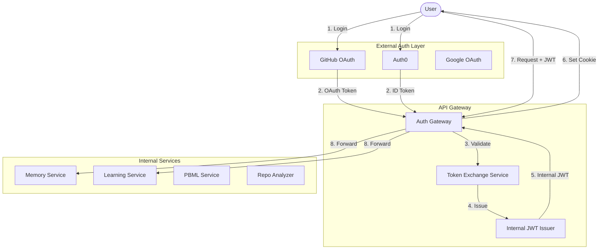
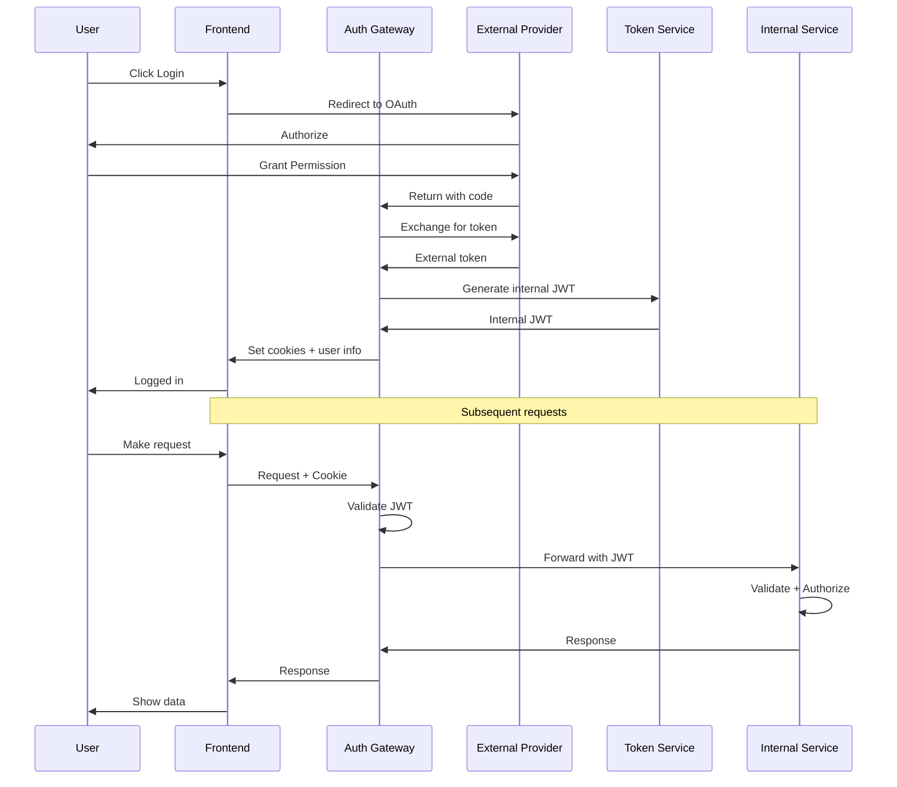


# 🔐 DevMentor Authentication Architecture: OAuth to Internal JWT

## Overview

DevMentor uses a **dual-token strategy** where external OAuth/Auth0 tokens are exchanged for internal cluster JWTs, providing security isolation between external and internal services.

## 🏗️ Architecture Overview



## 🔑 Token Exchange Implementation

### 1. Auth Gateway Service

```typescript
// infrastructure/services/auth-gateway/src/index.ts
import express from 'express';
import jwt from 'jsonwebtoken';
import { OAuth2Client } from 'google-auth-library';
import { Octokit } from '@octokit/rest';
import { ManagementClient } from 'auth0';

export class AuthGateway {
  private readonly internalJWTSecret = process.env.INTERNAL_JWT_SECRET!;
  private readonly internalJWTIssuer = 'devmentor-cluster';
  private readonly tokenExpiry = '2h';
  private readonly refreshExpiry = '7d';
  
  // External auth providers
  private githubClient: Octokit;
  private auth0Client: ManagementClient;
  private googleClient: OAuth2Client;
  
  constructor() {
    this.setupProviders();
    this.setupRoutes();
  }
  
  /**
   * Main token exchange endpoint
   * Converts external tokens to internal cluster JWT
   */
  async exchangeToken(req: express.Request, res: express.Response) {
    const { provider, token, refreshToken } = req.body;
    
    try {
      // Step 1: Validate external token
      const externalUser = await this.validateExternalToken(provider, token);
      
      // Step 2: Get or create internal user
      const internalUser = await this.mapToInternalUser(externalUser, provider);
      
      // Step 3: Generate internal cluster JWT
      const clusterTokens = this.generateClusterTokens(internalUser);
      
      // Step 4: Store token mapping for revocation
      await this.storeTokenMapping({
        externalToken: token,
        internalToken: clusterTokens.accessToken,
        userId: internalUser.id,
        provider,
        expiresAt: new Date(Date.now() + 7200000) // 2 hours
      });
      
      // Step 5: Set secure HTTP-only cookies
      this.setSecureCookies(res, clusterTokens);
      
      return res.json({
        success: true,
        user: {
          id: internalUser.id,
          email: internalUser.email,
          roles: internalUser.roles
        },
        // Don't send tokens in response body for security
        tokenSet: true
      });
      
    } catch (error) {
      console.error('Token exchange failed:', error);
      return res.status(401).json({ error: 'Authentication failed' });
    }
  }
  
  /**
   * Validate external OAuth/Auth0 tokens
   */
  private async validateExternalToken(provider: string, token: string): Promise<ExternalUser> {
    switch (provider) {
      case 'github':
        return this.validateGitHubToken(token);
      case 'auth0':
        return this.validateAuth0Token(token);
      case 'google':
        return this.validateGoogleToken(token);
      default:
        throw new Error(`Unsupported provider: ${provider}`);
    }
  }
  
  /**
   * GitHub token validation
   */
  private async validateGitHubToken(token: string): Promise<ExternalUser> {
    try {
      this.githubClient = new Octokit({ auth: token });
      const { data: user } = await this.githubClient.users.getAuthenticated();
      
      // Get user emails if available
      const { data: emails } = await this.githubClient.users.listEmailsForAuthenticated();
      const primaryEmail = emails.find(e => e.primary)?.email || user.email;
      
      return {
        externalId: `github_${user.id}`,
        email: primaryEmail,
        name: user.name || user.login,
        provider: 'github',
        metadata: {
          login: user.login,
          avatar: user.avatar_url,
          repos: user.public_repos,
          bio: user.bio
        }
      };
    } catch (error) {
      throw new Error('Invalid GitHub token');
    }
  }
  
  /**
   * Auth0 token validation
   */
  private async validateAuth0Token(token: string): Promise<ExternalUser> {
    try {
      // Verify JWT signature
      const decoded = jwt.verify(token, process.env.AUTH0_PUBLIC_KEY!, {
        algorithms: ['RS256'],
        issuer: `https://${process.env.AUTH0_DOMAIN}/`,
        audience: process.env.AUTH0_AUDIENCE
      }) as any;
      
      // Get full user profile from Auth0
      const user = await this.auth0Client.getUser({ id: decoded.sub });
      
      return {
        externalId: decoded.sub,
        email: user.email!,
        name: user.name || user.nickname || 'User',
        provider: 'auth0',
        metadata: {
          picture: user.picture,
          email_verified: user.email_verified,
          roles: user.app_metadata?.roles || []
        }
      };
    } catch (error) {
      throw new Error('Invalid Auth0 token');
    }
  }
  
  /**
   * Map external user to internal user model
   */
  private async mapToInternalUser(external: ExternalUser, provider: string): Promise<InternalUser> {
    // Check if user exists
    let user = await this.userRepository.findByExternalId(external.externalId);
    
    if (!user) {
      // Create new user
      user = await this.userRepository.create({
        externalId: external.externalId,
        email: external.email,
        name: external.name,
        provider,
        metadata: external.metadata,
        roles: ['user'], // Default role
        permissions: this.getDefaultPermissions(),
        createdAt: new Date()
      });
      
      // Trigger onboarding flow
      await this.eventBus.emit('user:created', user);
    } else {
      // Update last login
      await this.userRepository.updateLastLogin(user.id);
    }
    
    // Enhance with internal permissions
    return {
      ...user,
      permissions: await this.getPermissions(user.id),
      quotas: await this.getQuotas(user.id),
      features: await this.getEnabledFeatures(user.id)
    };
  }
  
  /**
   * Generate internal cluster JWT tokens
   */
  private generateClusterTokens(user: InternalUser): TokenSet {
    const payload: ClusterJWTPayload = {
      // User identification
      sub: user.id,
      email: user.email,
      name: user.name,
      
      // Cluster-specific claims
      cluster: {
        version: '1.0',
        issuer: this.internalJWTIssuer,
        services: this.getAllowedServices(user),
        quotas: user.quotas
      },
      
      // Roles and permissions
      roles: user.roles,
      permissions: user.permissions,
      features: user.features,
      
      // Security metadata
      iat: Math.floor(Date.now() / 1000),
      exp: Math.floor(Date.now() / 1000) + 7200, // 2 hours
      jti: this.generateJTI(), // JWT ID for revocation
      
      // Rate limiting
      rateLimit: {
        tier: user.tier || 'free',
        requestsPerMinute: 60,
        requestsPerHour: 1000
      }
    };
    
    // Sign tokens
    const accessToken = jwt.sign(payload, this.internalJWTSecret, {
      algorithm: 'HS256',
      issuer: this.internalJWTIssuer
    });
    
    const refreshPayload = {
      sub: user.id,
      type: 'refresh',
      jti: this.generateJTI()
    };
    
    const refreshToken = jwt.sign(refreshPayload, this.internalJWTSecret, {
      algorithm: 'HS256',
      expiresIn: this.refreshExpiry
    });
    
    return {
      accessToken,
      refreshToken,
      expiresIn: 7200,
      tokenType: 'Bearer'
    };
  }
  
  /**
   * Set secure HTTP-only cookies
   */
  private setSecureCookies(res: express.Response, tokens: TokenSet) {
    // Access token cookie (short-lived)
    res.cookie('devmentor_access', tokens.accessToken, {
      httpOnly: true,
      secure: process.env.NODE_ENV === 'production',
      sameSite: 'strict',
      maxAge: 7200000, // 2 hours
      path: '/'
    });
    
    // Refresh token cookie (long-lived)
    res.cookie('devmentor_refresh', tokens.refreshToken, {
      httpOnly: true,
      secure: process.env.NODE_ENV === 'production',
      sameSite: 'strict',
      maxAge: 604800000, // 7 days
      path: '/auth/refresh'
    });
    
    // CSRF token (readable by JS)
    const csrfToken = this.generateCSRFToken();
    res.cookie('devmentor_csrf', csrfToken, {
      httpOnly: false, // JS needs to read this
      secure: process.env.NODE_ENV === 'production',
      sameSite: 'strict',
      maxAge: 7200000
    });
  }
}
```

### 2. JWT Middleware for Internal Services

```typescript
// infrastructure/services/shared/auth-middleware.ts
import { Request, Response, NextFunction } from 'express';
import jwt from 'jsonwebtoken';
import { Redis } from 'ioredis';

export class InternalAuthMiddleware {
  private redis: Redis;
  private publicKey: string;
  
  constructor() {
    this.redis = new Redis(process.env.REDIS_URL!);
    this.publicKey = process.env.INTERNAL_JWT_SECRET!;
  }
  
  /**
   * Validate internal cluster JWT
   */
  async validateClusterToken(req: Request, res: Response, next: NextFunction) {
    try {
      // Get token from cookie or header
      const token = this.extractToken(req);
      
      if (!token) {
        return res.status(401).json({ error: 'No token provided' });
      }
      
      // Check if token is blacklisted (revoked)
      const isRevoked = await this.redis.get(`revoked:${token}`);
      if (isRevoked) {
        return res.status(401).json({ error: 'Token revoked' });
      }
      
      // Verify JWT
      const payload = jwt.verify(token, this.publicKey, {
        algorithms: ['HS256'],
        issuer: 'devmentor-cluster'
      }) as ClusterJWTPayload;
      
      // Check if service is allowed
      const serviceName = process.env.SERVICE_NAME;
      if (!payload.cluster.services.includes(serviceName)) {
        return res.status(403).json({ error: 'Service access denied' });
      }
      
      // Apply rate limiting
      const rateLimitOk = await this.checkRateLimit(payload.sub, payload.rateLimit);
      if (!rateLimitOk) {
        return res.status(429).json({ error: 'Rate limit exceeded' });
      }
      
      // Attach user context to request
      req.user = {
        id: payload.sub,
        email: payload.email,
        roles: payload.roles,
        permissions: payload.permissions,
        quotas: payload.cluster.quotas
      };
      
      next();
    } catch (error) {
      if (error.name === 'TokenExpiredError') {
        return res.status(401).json({ error: 'Token expired' });
      }
      return res.status(401).json({ error: 'Invalid token' });
    }
  }
  
  /**
   * Check specific permission
   */
  hasPermission(permission: string) {
    return (req: Request, res: Response, next: NextFunction) => {
      if (!req.user?.permissions?.includes(permission)) {
        return res.status(403).json({ error: `Missing permission: ${permission}` });
      }
      next();
    };
  }
  
  /**
   * Check role
   */
  hasRole(role: string) {
    return (req: Request, res: Response, next: NextFunction) => {
      if (!req.user?.roles?.includes(role)) {
        return res.status(403).json({ error: `Missing role: ${role}` });
      }
      next();
    };
  }
  
  /**
   * Service-to-service authentication
   */
  async validateServiceToken(req: Request, res: Response, next: NextFunction) {
    const token = req.headers['x-service-token'] as string;
    
    if (!token) {
      return res.status(401).json({ error: 'No service token' });
    }
    
    try {
      // Service tokens are different - they're signed with service-specific keys
      const payload = jwt.verify(token, process.env.SERVICE_SECRET!, {
        algorithms: ['HS256'],
        issuer: 'devmentor-service-mesh'
      }) as ServiceTokenPayload;
      
      req.service = {
        name: payload.service,
        permissions: payload.permissions
      };
      
      next();
    } catch (error) {
      return res.status(401).json({ error: 'Invalid service token' });
    }
  }
}
```

### 3. Token Refresh Strategy

```typescript
// infrastructure/services/auth-gateway/src/refresh.ts
export class TokenRefreshService {
  /**
   * Refresh expired access token using refresh token
   */
  async refreshAccessToken(refreshToken: string): Promise<TokenSet> {
    try {
      // Verify refresh token
      const payload = jwt.verify(refreshToken, this.internalJWTSecret) as any;
      
      if (payload.type !== 'refresh') {
        throw new Error('Invalid token type');
      }
      
      // Check if refresh token is revoked
      const isRevoked = await this.redis.get(`revoked:refresh:${payload.jti}`);
      if (isRevoked) {
        throw new Error('Refresh token revoked');
      }
      
      // Get user
      const user = await this.userRepository.findById(payload.sub);
      if (!user) {
        throw new Error('User not found');
      }
      
      // Check if external token is still valid
      const externalTokenValid = await this.checkExternalTokenStatus(user.externalId);
      if (!externalTokenValid) {
        // External token expired, need re-authentication
        throw new Error('External authentication expired');
      }
      
      // Generate new access token
      const newTokens = this.generateClusterTokens(user);
      
      // Rotate refresh token (security best practice)
      await this.revokeRefreshToken(payload.jti);
      
      return newTokens;
    } catch (error) {
      throw new Error('Token refresh failed');
    }
  }
  
  /**
   * Revoke tokens on logout
   */
  async revokeTokens(userId: string, tokens: { access?: string; refresh?: string }) {
    const multi = this.redis.multi();
    
    if (tokens.access) {
      const decoded = jwt.decode(tokens.access) as any;
      multi.setex(`revoked:${tokens.access}`, 7200, '1');
      multi.setex(`revoked:jti:${decoded.jti}`, 7200, '1');
    }
    
    if (tokens.refresh) {
      const decoded = jwt.decode(tokens.refresh) as any;
      multi.setex(`revoked:refresh:${decoded.jti}`, 604800, '1');
    }
    
    await multi.exec();
    
    // Clear user sessions
    await this.sessionStore.clearUserSessions(userId);
  }
}
```

### 4. Service Mesh Authentication

```typescript
// infrastructure/services/shared/service-auth.ts
export class ServiceMeshAuth {
  private serviceRegistry: Map<string, ServiceCredentials> = new Map();
  
  constructor() {
    this.registerServices();
  }
  
  /**
   * Generate service-to-service token
   */
  generateServiceToken(fromService: string, toService: string): string {
    const credentials = this.serviceRegistry.get(fromService);
    if (!credentials) {
      throw new Error(`Unknown service: ${fromService}`);
    }
    
    const payload: ServiceTokenPayload = {
      service: fromService,
      target: toService,
      permissions: this.getServicePermissions(fromService, toService),
      iat: Math.floor(Date.now() / 1000),
      exp: Math.floor(Date.now() / 1000) + 300, // 5 minutes
      nonce: crypto.randomBytes(16).toString('hex')
    };
    
    return jwt.sign(payload, credentials.secret, {
      algorithm: 'HS256',
      issuer: 'devmentor-service-mesh'
    });
  }
  
  /**
   * mTLS for service-to-service (optional extra security)
   */
  async establishMTLS(service1: string, service2: string) {
    const cert1 = await this.getCertificate(service1);
    const cert2 = await this.getCertificate(service2);
    
    return {
      ca: this.getCA(),
      cert: cert1,
      key: this.getPrivateKey(service1),
      requestCert: true,
      rejectUnauthorized: true
    };
  }
  
  /**
   * Service discovery with auth
   */
  async discoverService(serviceName: string, callerToken: string): Promise<ServiceEndpoint> {
    // Validate caller
    const caller = await this.validateServiceToken(callerToken);
    
    // Check if caller can access target service
    if (!this.canAccess(caller.service, serviceName)) {
      throw new Error('Service access denied');
    }
    
    // Return service endpoint with temporary credentials
    return {
      url: this.getServiceUrl(serviceName),
      token: this.generateServiceToken(caller.service, serviceName),
      expires: Date.now() + 300000 // 5 minutes
    };
  }
}
```

### 5. Frontend Integration

```typescript
// frontend/src/lib/auth/AuthProvider.tsx
import { createContext, useContext, useEffect, useState } from 'react';
import axios from 'axios';

export class AuthService {
  private refreshTimer?: NodeJS.Timeout;
  
  /**
   * Login with external provider
   */
  async loginWithProvider(provider: 'github' | 'auth0' | 'google') {
    // Redirect to provider
    window.location.href = `/api/auth/${provider}`;
  }
  
  /**
   * Handle OAuth callback
   */
  async handleCallback(provider: string, code: string, state: string) {
    try {
      // Exchange authorization code for tokens
      const response = await fetch('/api/auth/callback', {
        method: 'POST',
        credentials: 'include', // Important for cookies
        headers: {
          'Content-Type': 'application/json',
          'X-CSRF-Token': this.getCSRFToken() // CSRF protection
        },
        body: JSON.stringify({ provider, code, state })
      });
      
      if (!response.ok) throw new Error('Authentication failed');
      
      const data = await response.json();
      
      // Store user info (not tokens!)
      this.storeUserInfo(data.user);
      
      // Setup token refresh
      this.setupTokenRefresh();
      
      return data.user;
    } catch (error) {
      console.error('Auth callback failed:', error);
      throw error;
    }
  }
  
  /**
   * Setup axios interceptors for auth
   */
  setupAxiosInterceptors() {
    // Request interceptor - add CSRF token
    axios.interceptors.request.use((config) => {
      config.headers['X-CSRF-Token'] = this.getCSRFToken();
      config.withCredentials = true; // Send cookies
      return config;
    });
    
    // Response interceptor - handle token expiry
    axios.interceptors.response.use(
      (response) => response,
      async (error) => {
        if (error.response?.status === 401) {
          // Try to refresh token
          const refreshed = await this.refreshToken();
          if (refreshed) {
            // Retry original request
            return axios(error.config);
          } else {
            // Redirect to login
            window.location.href = '/login';
          }
        }
        return Promise.reject(error);
      }
    );
  }
  
  /**
   * Refresh access token
   */
  async refreshToken(): Promise<boolean> {
    try {
      const response = await fetch('/api/auth/refresh', {
        method: 'POST',
        credentials: 'include',
        headers: {
          'X-CSRF-Token': this.getCSRFToken()
        }
      });
      
      if (!response.ok) return false;
      
      // Token refreshed (set as cookie)
      this.setupTokenRefresh();
      return true;
    } catch (error) {
      console.error('Token refresh failed:', error);
      return false;
    }
  }
  
  /**
   * Setup automatic token refresh before expiry
   */
  private setupTokenRefresh() {
    // Clear existing timer
    if (this.refreshTimer) {
      clearTimeout(this.refreshTimer);
    }
    
    // Refresh 5 minutes before expiry
    const refreshIn = (7200 - 300) * 1000; // 1h 55m
    this.refreshTimer = setTimeout(() => {
      this.refreshToken();
    }, refreshIn);
  }
  
  /**
   * Get CSRF token from cookie
   */
  private getCSRFToken(): string {
    const match = document.cookie.match(/devmentor_csrf=([^;]+)/);
    return match ? match[1] : '';
  }
}
```

## 🔒 Security Features

### 1. Token Security
- **Short-lived access tokens** (2 hours)
- **Longer refresh tokens** (7 days)
- **HTTP-only cookies** (XSS protection)
- **CSRF tokens** for state-changing operations
- **Token revocation** on logout

### 2. Service Isolation
- **Internal tokens** never exposed to frontend
- **Service-specific permissions**
- **mTLS for service-to-service** (optional)
- **Rate limiting per token**

### 3. Multi-Factor Security
```typescript
// Optional MFA for sensitive operations
async requireMFA(userId: string, operation: string) {
  // Check if operation requires MFA
  if (this.sensitiveOperations.includes(operation)) {
    const mfaToken = await this.requestMFAToken(userId);
    return this.verifyMFAToken(userId, mfaToken);
  }
  return true;
}
```

## 📊 Token Claims Structure

### External Token (GitHub/Auth0)
```json
{
  "sub": "github|123456",
  "email": "user@example.com",
  "name": "John Doe",
  "provider": "github",
  "scope": "read:user public_repo"
}
```

### Internal Cluster JWT
```json
{
  "sub": "user_abc123",
  "email": "user@example.com",
  "name": "John Doe",
  "cluster": {
    "version": "1.0",
    "issuer": "devmentor-cluster",
    "services": ["memory", "learning", "repo-analyzer"],
    "quotas": {
      "maxRepos": 10,
      "maxFilesPerScan": 100,
      "apiCallsPerHour": 1000
    }
  },
  "roles": ["user", "developer"],
  "permissions": [
    "repo:read",
    "repo:analyze",
    "quiz:take",
    "memory:write"
  ],
  "features": ["basic", "learning"],
  "rateLimit": {
    "tier": "free",
    "requestsPerMinute": 60
  },
  "iat": 1234567890,
  "exp": 1234567890,
  "jti": "unique-jwt-id"
}
```

## 🔄 Complete Authentication Flow



## 🚀 Implementation Checklist

- [ ] Auth Gateway service
- [ ] Token exchange endpoint
- [ ] JWT generation/validation
- [ ] Cookie management
- [ ] CSRF protection
- [ ] Token refresh logic
- [ ] Service-to-service auth
- [ ] Rate limiting
- [ ] Token revocation
- [ ] MFA support (optional)
- [ ] Session management
- [ ] Audit logging

This architecture provides secure, scalable authentication while maintaining clean separation between external and internal auth systems!

