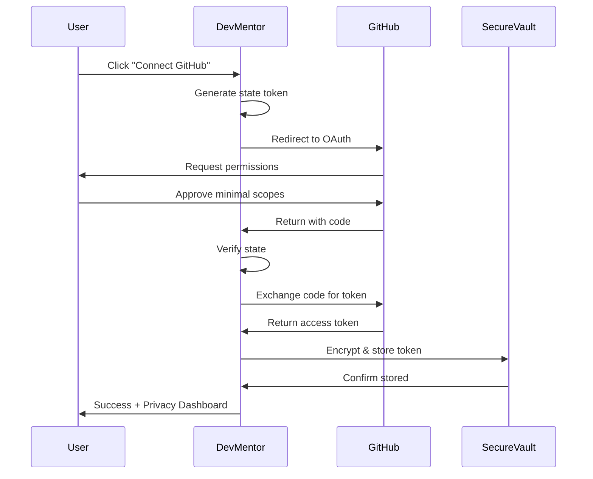


# 🔐 DevMentor Zero-Knowledge Security Architecture

## Executive Summary

DevMentor implements a **zero-knowledge security model** where we learn from your code without storing sensitive data. We analyze patterns, not secrets.

## 🛡️ Core Security Principles

1. **Minimal Data Collection**: Only what's needed for learning
2. **Pattern Extraction, Not Code Storage**: Store insights, not source
3. **User-Controlled Access**: You decide what we can see
4. **Encrypted at Rest**: All stored data is encrypted
5. **No Secrets Ever**: Automatic detection and rejection of sensitive data

## 🔑 GitHub OAuth Implementation

### OAuth Flow with Security Controls

```typescript
// src/auth/github-oauth.ts
export class GitHubOAuthService {
  // Minimal scope request - only what we need
  private readonly SCOPES = [
    'read:user',           // Basic profile
    'repo:status',         // Repository metadata only
    'public_repo'          // Public repos only by default
  ];
  
  // User can optionally grant more access
  private readonly OPTIONAL_SCOPES = [
    'repo'                 // Private repos (requires explicit consent)
  ];
  
  async initiateOAuth() {
    const state = generateCryptoRandomString(32);
    const params = {
      client_id: process.env.GITHUB_CLIENT_ID,
      redirect_uri: `${process.env.APP_URL}/auth/github/callback`,
      scope: this.SCOPES.join(' '),
      state,
      allow_signup: true
    };
    
    // Store state in encrypted session
    await this.storeState(state, { 
      expires: Date.now() + 600000, // 10 minutes
      ip: request.ip,
      fingerprint: generateFingerprint(request)
    });
    
    return `https://github.com/login/oauth/authorize?${querystring.stringify(params)}`;
  }
  
  async handleCallback(code: string, state: string) {
    // Verify state to prevent CSRF
    if (!await this.verifyState(state)) {
      throw new SecurityError('Invalid state parameter');
    }
    
    // Exchange code for token
    const token = await this.exchangeCodeForToken(code);
    
    // Encrypt token before storage
    const encryptedToken = await this.encryptToken(token);
    
    // Store with automatic expiration
    await this.storeToken(encryptedToken, {
      expires: Date.now() + 7200000, // 2 hours
      refreshable: true
    });
    
    return token;
  }
}
```

### Secure Token Management

```typescript
// src/security/token-manager.ts
export class SecureTokenManager {
  private readonly encryption = new AES256_GCM();
  
  async storeToken(token: string, userId: string) {
    // Never store raw tokens
    const encrypted = await this.encryption.encrypt(token, {
      key: await this.deriveUserKey(userId),
      additionalData: { userId, timestamp: Date.now() }
    });
    
    // Store in secure vault with automatic rotation
    await this.vault.store(`token:${userId}`, encrypted, {
      ttl: 7200, // 2 hours
      autoRotate: true
    });
  }
  
  async getToken(userId: string): Promise<string | null> {
    const encrypted = await this.vault.get(`token:${userId}`);
    if (!encrypted) return null;
    
    // Decrypt with user-specific key
    const token = await this.encryption.decrypt(encrypted, {
      key: await this.deriveUserKey(userId)
    });
    
    // Validate token is still valid
    if (await this.isTokenExpired(token)) {
      await this.refreshToken(userId);
    }
    
    return token;
  }
}
```

## 📊 Repository Access Limits

### Configurable Security Limits

```typescript
// src/config/security-limits.ts
export const REPO_ANALYSIS_LIMITS = {
  // File access limits
  files: {
    maxFilesPerScan: 100,        // Maximum files to analyze
    maxFileSize: 500_000,         // 500KB per file
    maxTotalSize: 10_000_000,     // 10MB total
    excludePatterns: [
      '*.env*',                  // Environment files
      '*secret*',                 // Files with 'secret' in name
      '*.key',                    // Key files
      '*.pem',                    // Certificates
      '.git/**',                  // Git internals
      'node_modules/**',          // Dependencies
      'vendor/**',                // Vendor code
      '*.min.js',                 // Minified files
      'dist/**',                  // Build outputs
    ]
  },
  
  // Content filtering
  content: {
    maxLineLength: 500,           // Skip files with long lines (likely minified)
    maxComplexity: 100,           // Skip overly complex files
    allowedExtensions: [
      '.js', '.jsx', '.ts', '.tsx',  // JavaScript/TypeScript
      '.py',                          // Python
      '.java',                        // Java
      '.go',                          // Go
      '.rs',                          // Rust
      '.md',                          // Documentation
      '.json',                        // Config (filtered)
      '.yml', '.yaml'                 // Config (filtered)
    ]
  },
  
  // API rate limits
  api: {
    maxRequestsPerMinute: 30,
    maxRequestsPerHour: 500,
    maxConcurrentAnalysis: 3
  },
  
  // Time limits
  time: {
    maxAnalysisTime: 300_000,     // 5 minutes max
    scanTimeout: 30_000,           // 30 seconds per file
    totalTimeout: 600_000          // 10 minutes absolute max
  }
};
```

### User Consent & Control Panel

```tsx
// src/components/PrivacyControls.tsx
export function PrivacyControls() {
  const [settings, setSettings] = useState({
    allowPrivateRepos: false,
    sharePatterns: true,        // Share learned patterns with team
    storeCode: false,           // Never store actual code
    analyticsEnabled: true,
    dataRetention: 30           // Days to retain data
  });
  
  return (
    <Card>
      <h2>🔐 Privacy & Security Settings</h2>
      
      <Section title="Repository Access">
        <Toggle
          label="Allow analysis of private repositories"
          checked={settings.allowPrivateRepos}
          onChange={(v) => updateSetting('allowPrivateRepos', v)}
        />
        <Info>
          We only analyze code structure and patterns, never storing source code.
        </Info>
      </Section>
      
      <Section title="Data Limits">
        <Slider
          label="Maximum files to analyze"
          min={10}
          max={500}
          value={settings.maxFiles}
          onChange={(v) => updateSetting('maxFiles', v)}
        />
        <MultiSelect
          label="File types to exclude"
          options={FILE_TYPES}
          selected={settings.excludedTypes}
          onChange={(v) => updateSetting('excludedTypes', v)}
        />
      </Section>
      
      <Section title="Data Retention">
        <Select
          label="Delete my data after"
          options={[
            { value: 7, label: '7 days' },
            { value: 30, label: '30 days' },
            { value: 90, label: '90 days' },
            { value: 0, label: 'Never (manual deletion only)' }
          ]}
          value={settings.dataRetention}
          onChange={(v) => updateSetting('dataRetention', v)}
        />
      </Section>
      
      <Section title="What We Learn (Not Store)">
        <LearnedPatterns>
          ✓ Coding style patterns
          ✓ Framework preferences  
          ✓ Test coverage levels
          ✓ Architectural patterns
          ✗ Actual source code
          ✗ Business logic
          ✗ API keys or secrets
          ✗ Proprietary algorithms
        </LearnedPatterns>
      </Section>
    </Card>
  );
}
```

## 🧬 Zero-Knowledge Pattern Learning

### How We Learn Without Storing Code

```typescript
// src/security/zero-knowledge-analyzer.ts
export class ZeroKnowledgeAnalyzer {
  async analyzeCode(code: string): Promise<Patterns> {
    // Step 1: Sanitize (remove all sensitive data)
    const sanitized = this.sanitize(code);
    
    // Step 2: Extract patterns (not content)
    const patterns = {
      syntaxPatterns: this.extractSyntaxPatterns(sanitized),
      structurePatterns: this.extractStructure(sanitized),
      stylePatterns: this.extractStyle(sanitized),
      complexityMetrics: this.calculateComplexity(sanitized)
    };
    
    // Step 3: Convert to vectors (one-way transformation)
    const vectors = this.patternsToVectors(patterns);
    
    // Step 4: Destroy original code
    sanitized.destroy(); // Securely overwrite memory
    
    // Step 5: Store only vectors
    return vectors;
  }
  
  private sanitize(code: string): SanitizedCode {
    return code
      .replace(/["'].*?["']/g, 'STRING')           // Replace all strings
      .replace(/\d+/g, 'NUMBER')                   // Replace all numbers
      .replace(/\/\*[\s\S]*?\*\//g, '')           // Remove comments
      .replace(/\/\/.*/g, '')                      // Remove line comments
      .replace(/\b[A-Z_]+\b/g, 'CONSTANT')        // Replace constants
      .replace(/\b\w+@\w+\.\w+\b/g, 'EMAIL')      // Replace emails
      .replace(/https?:\/\/[^\s]+/g, 'URL');      // Replace URLs
  }
  
  private extractPatterns(sanitized: SanitizedCode): Patterns {
    return {
      // We learn HOW you code, not WHAT you code
      indentationStyle: this.detectIndentation(sanitized),
      namingConvention: this.detectNaming(sanitized),
      functionLength: this.averageFunctionLength(sanitized),
      commentRatio: this.commentToCodeRatio(sanitized),
      testingStyle: this.detectTestingPatterns(sanitized),
      errorHandling: this.detectErrorPatterns(sanitized),
      asyncPatterns: this.detectAsyncUsage(sanitized)
    };
  }
}
```

### Secret Detection & Rejection

```typescript
// src/security/secret-detector.ts
export class SecretDetector {
  private patterns = [
    // API Keys
    /[a-zA-Z0-9]{32,}/,
    /sk_[a-zA-Z0-9]{32,}/,
    /pk_[a-zA-Z0-9]{32,}/,
    
    // AWS
    /AKIA[0-9A-Z]{16}/,
    
    // Private Keys
    /-----BEGIN (?:RSA )?PRIVATE KEY-----/,
    
    // Passwords
    /password\s*[:=]\s*["'][^"']+["']/i,
    
    // Tokens
    /token\s*[:=]\s*["'][^"']+["']/i,
    
    // Environment variables with sensitive names
    /(?:DATABASE_URL|API_KEY|SECRET|PASSWORD|TOKEN)/i
  ];
  
  async scan(content: string): Promise<ScanResult> {
    const detected = [];
    
    for (const pattern of this.patterns) {
      if (pattern.test(content)) {
        detected.push({
          type: 'potential_secret',
          pattern: pattern.source,
          action: 'rejected'
        });
      }
    }
    
    if (detected.length > 0) {
      // Log detection (not the secret itself!)
      await this.logDetection({
        timestamp: Date.now(),
        count: detected.length,
        types: detected.map(d => d.type)
      });
      
      // Reject the file completely
      throw new SecurityError('Potential secrets detected. File rejected for security.');
    }
    
    return { safe: true };
  }
}
```

## 🔒 Data Encryption Architecture

### Multi-Layer Encryption

```typescript
// src/security/encryption-manager.ts
export class EncryptionManager {
  // Layer 1: User-specific encryption
  async encryptUserData(data: any, userId: string) {
    const userKey = await this.deriveUserKey(userId);
    return this.aesEncrypt(data, userKey);
  }
  
  // Layer 2: Application-level encryption
  async encryptAppData(data: any) {
    const appKey = await this.getAppKey();
    return this.aesEncrypt(data, appKey);
  }
  
  // Layer 3: Database-level encryption (transparent)
  // Handled by database (PostgreSQL TDE or similar)
  
  private async deriveUserKey(userId: string): Promise<Buffer> {
    // User-specific key derivation
    return crypto.pbkdf2Sync(
      userId,
      process.env.USER_SALT!,
      100000,
      32,
      'sha256'
    );
  }
}
```

## 📈 Privacy Dashboard

### What Users See

```tsx
// src/components/PrivacyDashboard.tsx
export function PrivacyDashboard() {
  return (
    <Dashboard>
      <MetricCard
        title="Data Analyzed"
        value="1,234 patterns"
        subtitle="0 source files stored"
        icon={<Shield />}
      />
      
      <MetricCard
        title="Security Score"
        value="A+"
        subtitle="All data encrypted"
        icon={<Lock />}
      />
      
      <MetricCard
        title="Data Retention"
        value="30 days"
        subtitle="Auto-delete enabled"
        icon={<Clock />}
      />
      
      <DataFlowVisualization>
        {/* Visual showing data flow with encryption points */}
        Your Code → Pattern Extraction → Vectors → Encrypted Storage
                ↓                          ↓              ↓
            (destroyed)            (one-way)     (AES-256)
      </DataFlowVisualization>
      
      <ActivityLog>
        <LogEntry time="2 min ago">
          ✓ Repository scanned: 45 files analyzed, 0 secrets detected
        </LogEntry>
        <LogEntry time="5 min ago">
          ✓ Patterns extracted: Function style, naming conventions
        </LogEntry>
        <LogEntry time="10 min ago">
          ✓ Security check passed: No sensitive data found
        </LogEntry>
      </ActivityLog>
      
      <Actions>
        <Button onClick={downloadMyData}>
          📥 Download My Data
        </Button>
        <Button onClick={deleteMyData} variant="danger">
          🗑️ Delete All My Data
        </Button>
      </Actions>
    </Dashboard>
  );
}
```

## 🛡️ Security Headers & CSP

```typescript
// src/middleware/security.ts
export function securityMiddleware(app: Express) {
  app.use(helmet({
    contentSecurityPolicy: {
      directives: {
        defaultSrc: ["'self'"],
        scriptSrc: ["'self'", "'unsafe-inline'"], // Will tighten in production
        styleSrc: ["'self'", "'unsafe-inline'"],
        imgSrc: ["'self'", "data:", "https:"],
        connectSrc: ["'self'", "https://api.github.com"],
        fontSrc: ["'self'"],
        objectSrc: ["'none'"],
        mediaSrc: ["'none'"],
        frameSrc: ["'none'"],
      },
    },
    hsts: {
      maxAge: 31536000,
      includeSubDomains: true,
      preload: true
    }
  }));
  
  // Additional security headers
  app.use((req, res, next) => {
    res.setHeader('X-Frame-Options', 'DENY');
    res.setHeader('X-Content-Type-Options', 'nosniff');
    res.setHeader('Referrer-Policy', 'strict-origin-when-cross-origin');
    res.setHeader('Permissions-Policy', 'geolocation=(), microphone=(), camera=()');
    next();
  });
}
```

## 🔐 Authentication Flow



## 📊 What We Track vs What We Don't

### ✅ We Track (Patterns Only)
```javascript
{
  patterns: {
    codingStyle: "functional",
    indentation: "2 spaces",
    naming: "camelCase",
    testCoverage: 0.85,
    avgFunctionLength: 15,
    preferredFrameworks: ["React", "Node.js"],
    errorHandlingStyle: "try-catch",
    asyncPreference: "async-await"
  }
}
```

### ❌ We Never Store
```javascript
{
  // NEVER stored or transmitted
  sourceCode: "DESTROYED",
  businessLogic: "NEVER_CAPTURED",
  apiKeys: "AUTO_REJECTED",
  credentials: "BLOCKED",
  proprietaryAlgorithms: "IGNORED",
  customerData: "NEVER_ACCESSED",
  privateComments: "STRIPPED"
}
```

## 🚨 Security Audit Trail

```typescript
// Every security-relevant action is logged
interface SecurityAuditLog {
  timestamp: Date;
  userId: string;
  action: SecurityAction;
  result: 'allowed' | 'blocked';
  metadata: {
    ip: string;
    userAgent: string;
    requestId: string;
  };
}

// Examples:
{
  timestamp: "2024-01-20T10:30:00Z",
  userId: "user_123",
  action: "REPO_ACCESS",
  result: "allowed",
  metadata: {
    repoType: "public",
    filesScanned: 45,
    secretsDetected: 0
  }
}
```

## 🎯 Security Commitments

1. **Your code is your code** - We never store source
2. **Patterns, not secrets** - We learn how, not what
3. **You control access** - Granular permissions
4. **Transparent operations** - See everything we do
5. **Right to deletion** - Remove all data anytime
6. **Encrypted always** - At rest and in transit
7. **Regular audits** - Third-party security reviews

## 🔧 Implementation Checklist

- [ ] GitHub OAuth with minimal scopes
- [ ] Token encryption and rotation
- [ ] Secret detection and rejection
- [ ] File/size limits implementation
- [ ] Zero-knowledge pattern extraction
- [ ] Privacy control panel
- [ ] Audit logging system
- [ ] Data retention policies
- [ ] GDPR compliance tools
- [ ] Security headers (CSP, HSTS, etc.)

This architecture ensures DevMentor learns from your code while maintaining **complete privacy and security**!

