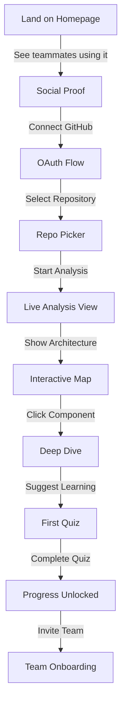
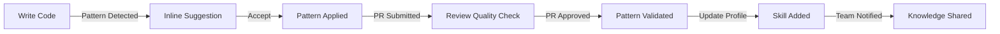
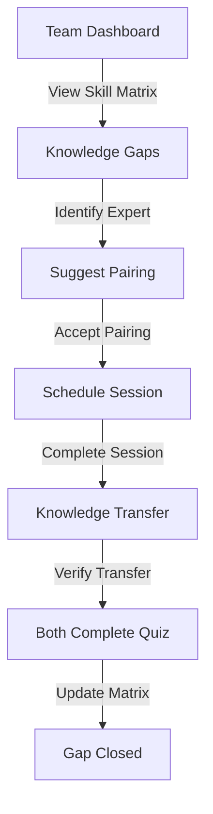


# DevMentor UX Flows & Touchpoint Mapping

## 🎨 Design Principles for Trust

### 1. **Progressive Engagement**
Never ask for everything upfront. Each step earns the next permission.

### 2. **Immediate Value**
Every interaction must provide value, even before sign-up.

### 3. **Transparent Intelligence**
Always explain WHY a suggestion is made, linking to actual code.

### 4. **Respectful Interruption**
Only interrupt when the value exceeds the disruption cost.

### 5. **Team-First Design**
Individual success is measured by team impact.

---

## 🚀 The First 10 Minutes Flow

### Minute 0-1: Landing & Hook
```yaml
User Sees: "Connect Your Repo, Get Your Team Map"
Action: GitHub OAuth (one-click)
Feedback: "Analyzing 1,247 files..."
Trust Signal: Shows actual file names scrolling
```

### Minute 1-3: Initial Analysis
```yaml
Loading State: Interactive preview building
Content: 
  - "Found 5 main services..."
  - "Detected React + Node.js stack..."
  - "Mapping team contributors..."
Visual: Animated architecture forming
Trust Signal: Accurate tech stack detection
```

### Minute 3-5: First Insight
```yaml
Reveal: Interactive architecture diagram
Interaction: Click on any component
Response: "This service was last updated by Sarah, 2 days ago"
CTA: "Want to understand how this works?"
Trust Signal: Real team member names, accurate timestamps
```

### Minute 5-7: Personalization
```yaml
Question: "What's your role?"
Options: [New to team] [Senior dev] [Team lead] [Just exploring]
Response: Customized dashboard based on role
Trust Signal: Different UI for different needs
```

### Minute 7-10: First Learning
```yaml
If New: "Let's start with the auth flow - it's the foundation"
If Senior: "Found 3 patterns you might want to refactor"
If Lead: "Your team's knowledge map shows 2 gaps"
Action: Interactive tutorial/insight
Trust Signal: Contextually relevant first lesson
```

---

## 🔄 Daily Engagement Flows

### Morning Check-in (9:00 AM)
```typescript
interface MorningUpdate {
  greeting: "Your team made 12 commits since yesterday";
  highlight: "New pattern introduced in auth service";
  suggestion: "Review Sarah's PR - uses pattern you mastered";
  metric: "Your review quality: 94% helpful";
}
```

### During Code Review
```typescript
interface ReviewAssist {
  detection: "This code is similar to /api/users/handler.ts";
  insight: "Team convention: use middleware for auth";
  suggestion: "Bob solved this pattern elegantly last week";
  learning: "Save this pattern to team playbook?";
}
```

### End of Day Reflection (5:00 PM)
```typescript
interface DailyProgress {
  summary: "You reviewed 3 PRs, wrote 200 lines";
  learning: "New pattern learned: Repository pattern";
  impact: "Your suggestion saved 2 hours for Alice";
  tomorrow: "Consider pairing on the Redis integration";
}
```

---

## 🎯 Critical User Flows

### Flow 1: Repository Connection → First Value



**Success Metrics:**
- 80% complete GitHub connection
- 60% interact with architecture map
- 40% complete first quiz
- 20% invite teammate same session

---

### Flow 2: Learning Detection → Skill Growth



**Touchpoints:**
1. **In-IDE:** Subtle tooltip appears
2. **In-PR:** "This pattern improved 40% faster than average"
3. **In-Dashboard:** "You've mastered Promise handling"
4. **In-Team View:** "John learned Redis caching today"

---

### Flow 3: Team Knowledge → Collaboration



**Key Interactions:**
- **Skill Matrix:** Visual heatmap of team knowledge
- **Pairing Suggestion:** "Alice (Redis expert) + Bob (needs Redis)"
- **Calendar Integration:** Auto-schedule pairing time
- **Success Validation:** Both members demonstrate skill

---

## 🎨 UI Component Patterns

### The Ambient Dashboard
```jsx
// Always visible, never intrusive
<AmbientBar position="top">
  <TeamActivity /> // "Sarah is reviewing your PR"
  <LearningProgress /> // "2 patterns from goal"
  <QuickActions /> // "Start code review"
</AmbientBar>
```

### The Context Panel
```jsx
// Appears alongside code
<ContextPanel trigger="onPatternDetect">
  <PatternExplanation />
  <TeamExamples />
  <RelatedDocs />
  <QuickQuiz />
</ContextPanel>
```

### The Growth Tracker
```jsx
// Weekly progress email/notification
<GrowthReport>
  <SkillsAdded /> // "+3 new patterns"
  <ImpactMetrics /> // "Saved team 8 hours"
  <NextGoals /> // "Master async patterns"
  <TeamRank /> // "#2 most helpful reviewer"
</GrowthReport>
```

---

## 📱 Multi-Channel Touchpoints

### 1. IDE Integration
- **VS Code Extension:** Real-time pattern suggestions
- **JetBrains Plugin:** Integrated learning panel
- **GitHub Copilot+:** Enhanced with team patterns

### 2. Browser Extension
- **GitHub PR Reviews:** Pattern detection in browser
- **Stack Overflow:** "Your team solved this differently"
- **Documentation:** "Your codebase example here"

### 3. Slack/Discord Bot
- **Daily Standup:** "Yesterday's learning highlights"
- **PR Notifications:** "New pattern introduced in #general"
- **Team Achievements:** "🎉 Team velocity up 20%"

### 4. Mobile App
- **Morning Brief:** Today's focus areas
- **Micro-Learning:** 2-minute pattern lessons
- **Team Updates:** Real-time collaboration alerts

---

## 🔔 Notification Strategy

### High Value (Push Immediately)
- "Your code review is blocking deployment"
- "Team member needs help with your expertise"
- "Breaking pattern detected in main branch"

### Medium Value (Badge/Email)
- "3 new patterns in your codebase this week"
- "Your learning streak: 7 days"
- "Team skill matrix updated"

### Low Value (Dashboard Only)
- "Documentation suggestions available"
- "Monthly progress report ready"
- "New team member onboarding"

---

## 🎭 Emotional Journey Mapping

### Week 1: Curiosity → Delight
> "Wow, it actually understands our spaghetti code!"

**Touchpoints:**
- Accurate architecture visualization
- First relevant suggestion
- Successful pattern application

### Month 1: Skepticism → Trust
> "Okay, this is actually making me better"

**Touchpoints:**
- Measurable PR quality improvement
- Colleague compliments code
- Time saved on debugging

### Quarter 1: Adoption → Advocacy
> "You HAVE to try DevMentor on your team"

**Touchpoints:**
- Team metrics improvement
- Successful team knowledge transfer
- Visible skill progression

### Year 1: Integration → Dependency
> "This is just how we develop now"

**Touchpoints:**
- Part of onboarding process
- Integrated in all workflows
- Team culture transformation

---

## 🚦 Friction Points & Solutions

### Friction: "Another tool to check"
**Solution:** Embed in existing workflows (IDE, GitHub, Slack)

### Friction: "Generic recommendations"
**Solution:** Always reference actual team code

### Friction: "Time investment concern"
**Solution:** 2-minute micro-interactions, async learning

### Friction: "Team adoption resistance"
**Solution:** Individual value first, team value emerges

### Friction: "Privacy concerns"
**Solution:** Clear data handling, on-premise option

---

## 📊 Engagement Metrics & Triggers

### Daily Active Use Triggers
1. **PR Created:** Auto-analyze for patterns
2. **PR Review:** Suggest improvements
3. **Build Failed:** Pattern-based debugging help
4. **Standup Time:** Learning summary
5. **Code Commit:** Pattern detection

### Weekly Retention Hooks
1. **Progress Report:** Visual skill growth
2. **Team Leaderboard:** Friendly competition
3. **Learning Streak:** Gamification element
4. **Peer Recognition:** "Most helpful reviewer"
5. **Knowledge Gaps:** "Learn this to level up"

### Monthly Value Proof
1. **Time Saved:** Hours of debugging avoided
2. **Quality Metrics:** Bug reduction percentage
3. **Team Velocity:** Sprint completion rate
4. **Knowledge Transfer:** Skills learned/taught
5. **Career Growth:** Skills added to profile

---

## 🎯 Conversion Flow Optimization

### Free → Trial
```yaml
Trigger: 3 valuable insights delivered
Message: "Unlock team features for 14 days free"
Value: "See how your whole team could improve"
Friction: No credit card required
```

### Trial → Paid
```yaml
Trigger: Day 10 of trial
Message: "Your team saved 18 hours this week"
Value: Concrete ROI demonstration
Friction: Team-wide discount available
```

### Individual → Team
```yaml
Trigger: 3 teammates mentioned in insights
Message: "Invite your team for better collaboration"
Value: "Unlock team knowledge sharing"
Friction: Free for first 3 invites
```

---

## 🔮 Future UX Innovations

### Voice Integration
"Hey DevMentor, explain this function"

### AR Code Reviews
Visualize code architecture in 3D space

### AI Pair Programming
Real-time coding assistance with context

### Predictive Debugging
"This will break in production because..."

### Team Sentiment Analysis
"Team morale low, suggest team building"

---

## ✅ UX Success Checklist

- [ ] First value in under 2 minutes
- [ ] Daily touchpoint that adds value
- [ ] Weekly progress visible
- [ ] Monthly ROI demonstrable
- [ ] Seamless workflow integration
- [ ] Team value emergence
- [ ] Trust built progressively
- [ ] Friction minimized constantly
- [ ] Delight moments designed
- [ ] Growth path clear

---

## 🎬 The Perfect User Story

> "I connected my repo out of curiosity. Within minutes, I saw our architecture like never before. The first suggestion it made actually improved my PR. Within a week, it helped me understand patterns I'd been copying without knowing why. After a month, my team lead commented on my code quality improvement. Now, three months in, our whole team uses it. We ship faster, break less, and actually enjoy code reviews. DevMentor didn't just teach me to code better—it made our whole team better. And we barely noticed it happening."

**That's the UX we're building.**

