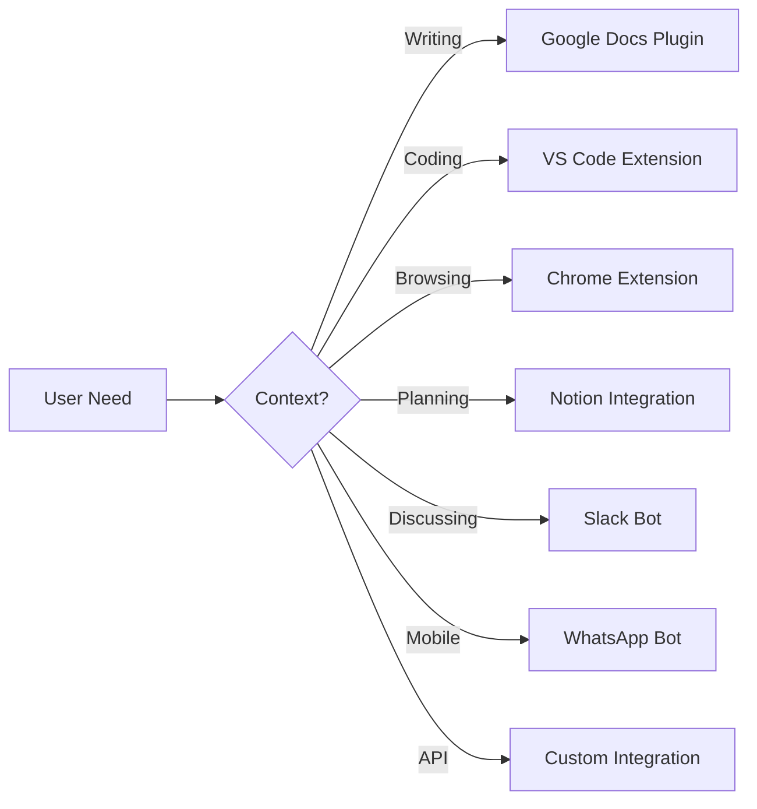


# Harvest.ai Differentiation Strategy

## Executive Summary
Harvest.ai's differentiation isn't about having more features—it's about being there at the exact moment of need, delivered in the right way, solving the real problem, and earning trust through transparency and reliability.

---

## 1. WHEN IT'S NEEDED: The Critical Moments

### The "Oh Shit" Moments
These are when users desperately need Harvest.ai:

#### 1. **The 11 PM Deadline Crisis**
```
Scenario: Marketing manager realizes they need 5 blog posts by morning
Traditional Solution: Panic, coffee, all-nighter
Harvest.ai Solution: 15 minutes to generate, 45 minutes to polish
Key Differentiator: Speed without sacrificing quality
```

#### 2. **The Blank Page Paralysis**
```
Scenario: Course creator staring at empty screen for 2 hours
Traditional Solution: Procrastination, anxiety, missed deadlines
Harvest.ai Solution: Start from any source material, get instant structure
Key Differentiator: Momentum generator, not just content creator
```

#### 3. **The Scale Nightmare**
```
Scenario: Startup needs to create 100 FAQs in 10 languages
Traditional Solution: $50,000 to agencies, 3-month timeline
Harvest.ai Solution: $500, 2 days, consistent quality
Key Differentiator: Exponential scaling without exponential cost
```

#### 4. **The Last-Minute Pivot**
```
Scenario: Client changes requirements 2 hours before presentation
Traditional Solution: Scramble, compromise quality, apologize
Harvest.ai Solution: Regenerate with new parameters in minutes
Key Differentiator: Adaptability at the speed of thought
```

### Timing Patterns We've Identified

```typescript
interface CriticalMoments {
  daily: {
    "9am": "Morning content planning",
    "2pm": "Post-lunch creative block",
    "4pm": "End-of-day deadline rush",
    "10pm": "Tomorrow's emergency prep"
  },
  weekly: {
    monday: "Week planning overwhelm",
    wednesday: "Mid-week content gap",
    friday: "Weekend prep rush",
    sunday: "Monday anxiety prep"
  },
  monthly: {
    start: "Content calendar panic",
    mid: "Performance review prep",
    end: "Report generation crisis"
  }
}
```

### Proactive Intervention Strategy

Instead of waiting for users to realize they need us:

1. **Predictive Alerts**
   - "Your blog usually publishes Tuesdays. Start generating Monday 3pm?"
   - "Q4 starts in 2 weeks. Ready to plan content?"
   - "Your audience engages most with quiz content. Generate some?"

2. **Contextual Appearance**
   - Browser extension that appears when detecting writer's block
   - Calendar integration suggesting content needs
   - Slack bot that offers help during planning discussions

---

## 2. WHO NEEDS IT: Beyond Demographics

### The Reluctant Innovator
**Profile**: Knows AI could help but fears complexity
```yaml
Pain Points:
  - Scared of looking stupid
  - Worried about AI replacing them
  - Overwhelmed by options
  
Our Solution:
  - Start with templates, not blank canvas
  - "AI assists, you create" messaging
  - One-click solutions for common tasks
  
Trust Builder:
  - Show their expertise enhanced, not replaced
  - Private mode for experimentation
  - Success stories from peers, not tech evangelists
```

### The Burned Creator
**Profile**: Tried other AI tools, disappointed
```yaml
Pain Points:
  - Generic, robotic output
  - Hidden costs that exploded
  - Tools that over-promised
  
Our Solution:
  - Radical cost transparency
  - Quality scores on every generation
  - "Not happy? Don't pay" guarantee
  
Trust Builder:
  - Show exact API costs upfront
  - Community-validated quality metrics
  - Public roadmap of what we won't promise
```

### The Scaling Entrepreneur
**Profile**: Growing faster than they can hire
```yaml
Pain Points:
  - Quality inconsistency with freelancers
  - Can't afford agency prices
  - No time to manage content team
  
Our Solution:
  - Brand voice training
  - Batch operations with consistency
  - API for integration into existing workflow
  
Trust Builder:
  - Case studies with real numbers
  - Direct founder support channel
  - Pay-as-you-scale pricing
```

### The Compliance-Constrained Enterprise
**Profile**: Needs content but lawyers say no
```yaml
Pain Points:
  - Data privacy concerns
  - Audit trail requirements
  - Brand safety fears
  
Our Solution:
  - On-premise deployment option
  - Complete audit logs
  - Pre-approval workflows
  
Trust Builder:
  - SOC 2 compliance
  - Legal review package
  - Enterprise SLA with penalties
```

---

## 3. HOW IT'S DELIVERED: Experience Architecture

### Delivery Philosophy: "Invisible Until Needed"

#### The Three Interfaces

1. **Panic Mode** (Emergency Interface)
```javascript
// One button, one result
interface PanicMode {
  input: "I need [X] by [time]"
  output: "Here's your [X], ready in [90 seconds]"
  
  // No options, no complexity
  // We choose optimal settings
  // User can refine after crisis passes
}
```

2. **Flow Mode** (Creative Interface)
```javascript
interface FlowMode {
  // Minimal UI, maximum focus
  input: StreamOfConsciousness
  process: GentleGuidance
  output: PolishedContent
  
  // No interruptions
  // Suggestions appear in periphery
  // Save everything automatically
}
```

3. **Power Mode** (Professional Interface)
```javascript
interface PowerMode {
  // All options exposed
  input: DetailedParameters
  process: FullControl
  output: BatchOperations
  
  // Keyboard shortcuts
  // Bulk operations
  // Custom workflows
}
```

### Delivery Channels: Meet Users Where They Are



### Progressive Disclosure Pattern

```typescript
class UserJourney {
  // Start simple
  day1 = {
    options: ["Generate Quiz", "Write Blog", "Create Summary"],
    complexity: "minimal",
    handholding: "maximum"
  }
  
  // Gradually reveal power
  week1 = {
    options: [...day1.options, "Customize Style", "Set Length"],
    complexity: "low",
    handholding: "high"
  }
  
  // Full power when ready
  month1 = {
    options: "everything",
    complexity: "user-choice",
    handholding: "on-demand"
  }
}
```

---

## 4. WHAT PROBLEM IT SOLVES: The Real Issues

### Surface Problem vs. Real Problem

| What Users Say | What They Really Mean | Our Solution |
|----------------|----------------------|--------------|
| "I need content" | "I need to look competent" | Quality assurance badges |
| "It's too expensive" | "I'm afraid of surprise costs" | Cost calculator upfront |
| "AI content is generic" | "I'll lose my unique voice" | Voice training from samples |
| "I don't trust AI" | "I don't trust companies" | Open source core |
| "It's too slow" | "I'm already behind schedule" | Generate while you type |

### The Problems Nobody Talks About

#### The Imposter Syndrome Problem
```yaml
Hidden Fear: "If I use AI, am I a fraud?"
Our Solution: 
  - "Enhanced by AI" badges to wear proudly
  - Show how top creators use AI
  - Emphasize human creativity amplified
```

#### The Consistency Trap
```yaml
Hidden Fear: "I'll become dependent and lose my skills"
Our Solution:
  - "Training mode" that teaches while assisting
  - Gradual complexity increase
  - Export your style model to own it
```

#### The Career Threat
```yaml
Hidden Fear: "This will make me replaceable"
Our Solution:
  - Focus on "AI + You > AI or You alone"
  - Skill development tracking
  - Certification program for AI-enhanced creators
```

---

## 5. WHY IT'S TRUSTED: Building Credibility

### Trust Architecture

#### Layer 1: Radical Transparency
```typescript
interface TrustDashboard {
  costs: {
    current: "$0.23",
    projected: "$2.10",
    breakdown: {
      api: "$0.20",
      storage: "$0.02",
      profit: "$0.01"
    }
  },
  
  quality: {
    score: 8.5,
    benchmark: "Industry: 7.2",
    factors: {
      readability: 9.1,
      originality: 8.2,
      accuracy: 8.3
    }
  },
  
  privacy: {
    dataStored: "None",
    dataProcessed: "Encrypted",
    dataSold: "Never",
    deleteButton: "One-click"
  }
}
```

#### Layer 2: Community Validation
```typescript
interface CommunityTrust {
  reviews: {
    source: "In-app",
    verified: true,
    negative: "Shown prominently"
  },
  
  openSource: {
    core: "MIT licensed",
    contributions: "Welcome",
    forks: "Encouraged"
  },
  
  publicMetrics: {
    uptime: "99.97%",
    responseTime: "1.2s avg",
    userCount: "12,453",
    generatedContent: "2.4M pieces"
  }
}
```

#### Layer 3: Professional Validation
```yaml
Certifications:
  - SOC 2 Type II
  - GDPR Compliant
  - CCPA Compliant

Partnerships:
  - Academic: "Stanford NLP Lab Verified"
  - Industry: "Content Marketing Institute Approved"
  - Legal: "Reviewed by DLA Piper"

Guarantees:
  - Quality: "Not satisfied? Full refund"
  - Privacy: "Data breach? $1000 payment"
  - Uptime: "Below 99%? Credits issued"
```

### Trust Through Behavior

#### The "No Bullshit" Policy
- Admit when AI isn't the right solution
- Recommend competitors when they're better
- Show failures alongside successes
- Never hide costs or limitations

#### The "You Own It" Promise
- Export everything anytime
- No vendor lock-in
- Your trained models are yours
- Delete means actually delete

---

## 6. DIFFERENTIATION MATRIX

### Where We Win vs. Competition

| Aspect | ChatGPT | Jasper | Copy.ai | **Harvest.ai** |
|--------|---------|--------|---------|----------------|
| **When Needed** | General purpose | Marketing focus | Copy focus | **Moment of crisis** |
| **Who Needs** | Everyone | Marketers | Copywriters | **Overwhelmed creators** |
| **How Delivered** | Chat interface | Web app | Web app | **Everywhere you work** |
| **Problem Solved** | Information | Content volume | Copy creation | **Time + Quality + Cost** |
| **Why Trusted** | OpenAI brand | Marketing focus | Simplicity | **Radical transparency** |

### Our Unique Position

```
"The content generation platform that appears 
exactly when you need it, costs exactly what 
we say, and delivers exactly what you expect."
```

---

## 7. IMPLEMENTATION STRATEGY

### Phase 1: Validate Core Differentiation (Week 1-2)
```typescript
const validation = {
  test1: "Crisis moment detection accuracy",
  test2: "Trust through transparency impact",
  test3: "Delivery channel preference",
  
  metrics: {
    activation: "Time to first successful generation",
    trust: "Percentage who verify our costs",
    retention: "Users who return during next crisis"
  }
}
```

### Phase 2: Build Trust Foundation (Week 3-4)
- Public cost calculator
- Live metrics dashboard
- Community review system
- Open source core modules

### Phase 3: Optimize Delivery (Week 5-6)
- Browser extension MVP
- Slack bot MVP
- API documentation
- Integration templates

### Phase 4: Scale Differentiation (Week 7-8)
- Partner validations
- Compliance certifications
- Success story documentation
- Referral program

---

## 8. MEASURING DIFFERENTIATION SUCCESS

### North Star Metrics

```typescript
interface SuccessMetrics {
  // Not just users, but grateful users
  nps: number > 70,
  
  // Not just retention, but advocacy
  referralRate: number > 0.3,
  
  // Not just usage, but dependency
  weeklyActiveRate: number > 0.8,
  
  // Not just satisfaction, but trust
  transparencyTrustScore: number > 9.0
}
```

### Differentiation Validation Questions

Every quarter, ask:
1. Are we still solving the urgent problem?
2. Are we still radically transparent?
3. Are we still where users need us?
4. Are we still earning trust daily?
5. Are we still the "thank god they exist" solution?

---

## 9. THE ANTI-PATTERNS: What We Won't Do

### We Won't
- Promise AGI or human-level writing
- Hide costs in complex pricing
- Lock users into annual contracts
- Claim ownership of generated content
- Build features just because competitors have them
- Use dark patterns for retention
- Sell or analyze user data
- Make users feel stupid for needing help

### We Will
- Under-promise, over-deliver
- Show exact costs per generation
- Let users leave anytime
- Make users own everything
- Build only what solves real problems
- Earn retention through value
- Protect user privacy religiously
- Celebrate users asking for help

---

## 10. THE DIFFERENTIATION STATEMENT

> **Harvest.ai exists for the moment when you realize you're drowning in content needs. We appear where you're already working, cost exactly what we show you upfront, and generate what you need without the BS. We're not another AI tool—we're your content emergency room, your 3 AM friend, your "I got you" platform.**

### In Different Contexts

**For Investors**: "We're building trust infrastructure for AI content generation."

**For Users**: "Generate content without the panic, cost anxiety, or quality compromise."

**For Partners**: "The transparent, reliable foundation for AI-enhanced workflows."

**For Team**: "We're solving the trust problem that stops AI adoption."

---

## Conclusion: Our Differentiation Moat

Our moat isn't technical—it's trust. It's being there at 11 PM when someone's career depends on content. It's showing costs to the penny when others hide fees. It's admitting when we're not the right solution. It's the thousand small decisions that say "we're on your side."

**The ultimate differentiation**: When users think "I need content help NOW," their muscle memory types "harvest.ai"—not because we marketed to them, but because we were there when they needed us most, transparent when they were scared of costs, and reliable when their job depended on it.

This isn't built overnight. It's earned, one crisis solved at a time.

