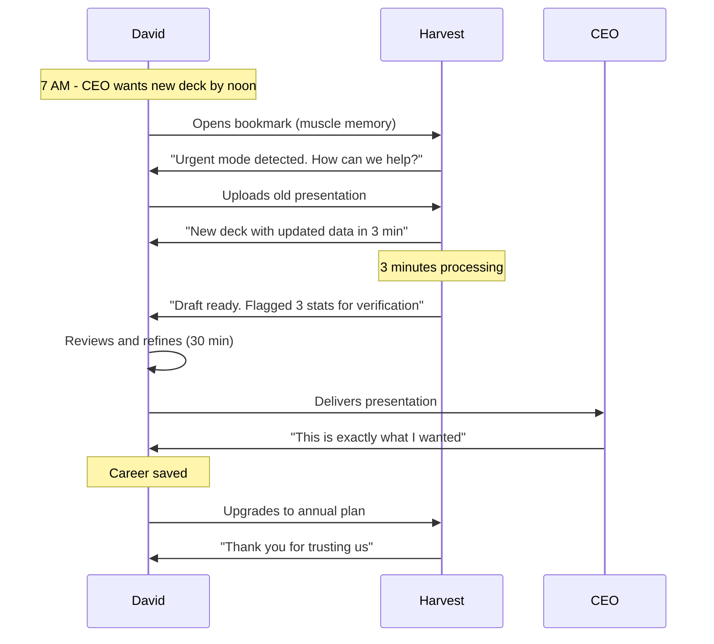


# Trust-First User Journey: Rethinking Harvest.ai

## Philosophy: Every Interaction Builds or Breaks Trust

This document reimagines user journeys through the lens of trust, timing, and genuine problem-solving—not features.

---

## Journey 1: The Crisis Moment Journey

### Scenario: Sarah's 11 PM Blog Emergency

```mermaid
graph TD
    A[11:03 PM - Realizes needs 5 blogs by 9 AM] --> B{Google: "emergency blog generator"}
    B --> C[Sees Harvest.ai - "Generate content in 90 seconds"]
    C --> D[Lands on page showing live cost: "$2.47 for 5 blogs"]
    D --> E[One button: "Save My Night"]
    E --> F[90 seconds later: 5 drafts ready]
    F --> G[Clear message: "These need your touch - 45 min to polish"]
    G --> H[11:52 PM - Blogs polished and scheduled]
    H --> I[Morning email: "You saved $497 vs. emergency freelancer rate"]
```

### Trust Points Built:
1. **Found when desperate** (SEO for crisis terms)
2. **Cost shown immediately** (no signup required)
3. **Realistic expectations** ("needs your touch")
4. **Proved value** (comparison to alternatives)

### Backend Intelligence:

```typescript
class CrisisDetection {
  identifyUserState(behavior: UserBehavior): UserState {
    const signals = {
      timeOfDay: behavior.timestamp.getHours(),
      searchTerms: behavior.referrer?.searchQuery,
      scrollSpeed: behavior.scrollVelocity,
      mouseMovement: behavior.mousePattern,
      dwellTime: behavior.timeOnPage
    };
    
    if (signals.timeOfDay >= 22 || signals.timeOfDay <= 2) {
      if (signals.searchTerms?.includes(['emergency', 'urgent', 'tonight', 'asap'])) {
        return UserState.CRISIS_MODE;
      }
    }
    
    if (signals.scrollSpeed > 2000 && signals.dwellTime < 3) {
      return UserState.PANIC_BROWSING;
    }
    
    return UserState.EXPLORING;
  }
  
  adaptInterface(state: UserState): InterfaceConfig {
    switch(state) {
      case UserState.CRISIS_MODE:
        return {
          headline: "Generate Content in 90 Seconds",
          cta: "Save My Night",
          fields: ["what you need", "by when"],
          complexity: "hidden",
          costDisplay: "prominent"
        };
      
      case UserState.PANIC_BROWSING:
        return {
          headline: "Stop. Breathe. We've Got This.",
          cta: "Start Simple",
          fields: ["paste your notes"],
          complexity: "minimal",
          costDisplay: "transparent"
        };
      
      default:
        return defaultInterface;
    }
  }
}
```

---

## Journey 2: The Trust-Building Journey

### Scenario: Mike's Gradual Adoption (Burned by Other Tools)

#### Week 0: Discovery
```yaml
Touchpoint: Sees colleague's LinkedIn post
Reaction: "Another AI tool that'll disappoint"
Our Response: Nothing - let peer validation work

Trust Score: 0/10
```

#### Week 1: Cautious Exploration
```yaml
Touchpoint: Visits site during lunch break
Reaction: "Wait, they show exact API costs?"
Our Response: Cost breakdown widget appears
  - OpenAI API: $0.18
  - Our infrastructure: $0.02
  - Our profit: $0.01
  - Your total: $0.21

Trust Score: 3/10 - "At least they're transparent"
```

#### Week 2: First Test
```yaml
Touchpoint: Tries free tier with throwaway content
Reaction: "Quality score of 6.2? That's honest"
Our Response: 
  - "This scored below our standard"
  - "Try these improvements" [specific suggestions]
  - "No charge for outputs below 7.0"

Trust Score: 5/10 - "They admitted it wasn't great"
```

#### Week 3: Real Usage
```yaml
Touchpoint: Uses for actual client blog
Reaction: "This is actually good"
Our Response:
  - Quality score: 8.4
  - Benchmark: Industry average 7.2
  - Cost saved vs. freelancer: $180

Trust Score: 7/10 - "It works and saves money"
```

#### Week 4: The Test
```yaml
Touchpoint: Wants to export and leave
Reaction: "Let's see if they actually let me"
Our Response:
  - One-click export of everything
  - Trained voice model included
  - "Thanks for trying us. Door's always open."
  - No retention dark patterns

Trust Score: 9/10 - "They actually let me leave easily"
```

#### Week 5: Return
```yaml
Touchpoint: Comes back for big project
Reaction: "I trust these guys"
Our Response:
  - "Welcome back! Your settings are saved"
  - "New feature: Bulk generation with 20% discount"
  - Same transparency, better tools

Trust Score: 10/10 - "My go-to platform"
```

### Trust Ladder Implementation:

```typescript
class TrustLadder {
  private trustEvents = new Map<string, TrustEvent[]>();
  
  recordTrustEvent(userId: string, event: TrustEvent): void {
    const events = this.trustEvents.get(userId) || [];
    events.push(event);
    this.trustEvents.set(userId, events);
    
    this.analyzeTrustTrajectory(userId);
  }
  
  analyzeTrustTrajectory(userId: string): TrustProfile {
    const events = this.trustEvents.get(userId) || [];
    
    return {
      currentLevel: this.calculateTrustScore(events),
      trajectory: this.getTrustTrend(events),
      nextMilestone: this.getNextTrustBuilder(events),
      riskFactors: this.identifyTrustRisks(events)
    };
  }
  
  getNextTrustBuilder(events: TrustEvent[]): TrustBuilder {
    const score = this.calculateTrustScore(events);
    
    if (score < 3) return { action: "Show cost transparency", impact: "high" };
    if (score < 5) return { action: "Offer no-risk trial", impact: "high" };
    if (score < 7) return { action: "Provide quality guarantee", impact: "medium" };
    if (score < 9) return { action: "Enable full data export", impact: "high" };
    
    return { action: "Maintain consistency", impact: "sustaining" };
  }
}
```

---

## Journey 3: The Power User Evolution

### Scenario: Emma's Journey from Panic to Pro

#### Month 1: Panic Mode User
```javascript
// Every interaction is a crisis
{
  usage: "sporadic",
  pattern: "deadline-driven",
  interface: "panic mode only",
  trust: "transactional"
}
```

**Our Adaptation:**
- Remember her patterns
- Pre-generate content before her usual crisis time
- Send gentle reminder: "Tuesday blog due tomorrow. Start now?"

#### Month 2: Flow Mode Discovery
```javascript
// Starts using us proactively
{
  usage: "weekly",
  pattern: "planning ahead",
  interface: "discovers flow mode",
  trust: "growing dependency"
}
```

**Our Adaptation:**
- Unlock Flow Mode interface
- Show weekly analytics: "You saved 12 hours this week"
- Introduce voice training: "Make outputs more 'you'"

#### Month 3: Power Mode Unlock
```javascript
// Becomes a power user
{
  usage: "daily",
  pattern: "integrated workflow",
  interface: "full power mode",
  trust: "complete integration"
}
```

**Our Adaptation:**
- API access granted
- Bulk operations enabled
- Direct founder support channel
- Custom keyboard shortcuts

### The Evolution Path:

```typescript
class UserEvolution {
  private evolutionStages = [
    {
      stage: "Crisis User",
      triggers: ["time pressure", "quality need"],
      interface: "simplified",
      support: "immediate",
      pricing: "pay-per-use"
    },
    {
      stage: "Regular User", 
      triggers: ["consistent value", "time saved"],
      interface: "standard",
      support: "community",
      pricing: "monthly"
    },
    {
      stage: "Power User",
      triggers: ["workflow integration", "volume needs"],
      interface: "advanced",
      support: "priority",
      pricing: "volume discounts"
    },
    {
      stage: "Advocate",
      triggers: ["exceptional experience", "ROI proven"],
      interface: "customizable",
      support: "dedicated",
      pricing: "referral rewards"
    }
  ];
  
  getUserStage(user: User): Stage {
    // Analyze behavior patterns
    const metrics = {
      frequency: this.getUsageFrequency(user),
      volume: this.getContentVolume(user),
      satisfaction: this.getNPS(user),
      tenure: this.getAccountAge(user)
    };
    
    return this.matchStage(metrics);
  }
  
  facilitateEvolution(user: User, currentStage: Stage): Evolution {
    const nextStage = this.getNextStage(currentStage);
    
    return {
      currentBehavior: this.analyzeBehavior(user),
      nextMilestone: nextStage.triggers,
      nudges: this.generateNudges(user, nextStage),
      unlocks: this.getUnlockSchedule(user, nextStage)
    };
  }
}
```

---

## Journey 4: The Moment of Truth Journey

### Scenario: David's Make-or-Break Presentation



### Critical Success Factors:

```typescript
interface MomentOfTruth {
  detection: {
    signals: ["urgent language", "early morning access", "rapid inputs"],
    confidence: 0.95
  },
  
  response: {
    speed: "maximum",
    quality: "no compromises",
    verification: "flag uncertainties",
    fallback: "human expert on standby"
  },
  
  followUp: {
    immediate: "Everything OK?",
    nextDay: "How did it go?",
    weekly: "Process improvement suggestions",
    monthly: "Similar situations predicted"
  }
}
```

---

## Journey 5: The Enterprise Trust Journey

### Scenario: Legal Team Approval Process

#### Stage 1: Security Review (Week 1-2)
```yaml
Their Concern: "Is our data safe?"
Our Response:
  - SOC 2 Type II report provided
  - Architecture diagrams shared
  - On-premise option offered
  - Data processing agreement ready

Evidence Provided:
  - Zero data retention policy
  - Encryption at rest and transit
  - Audit logs for all operations
  - Penetration test results
```

#### Stage 2: Compliance Check (Week 3-4)
```yaml
Their Concern: "Are we liable for AI content?"
Our Response:
  - Legal review by DLA Piper
  - Indemnification clause included
  - Content ownership clearly defined
  - Compliance mode with extra checks

Tools Provided:
  - Pre-approval workflows
  - Content audit trails
  - Plagiarism detection
  - Citation tracking
```

#### Stage 3: Pilot Program (Month 2)
```yaml
Their Concern: "Will it actually work for us?"
Our Response:
  - 10-person pilot team
  - Custom training session
  - Daily check-ins first week
  - Success metrics dashboard

Measurements:
  - Time saved: 40%
  - Quality scores: 8.2 avg
  - Cost reduction: 70%
  - User satisfaction: 9.1
```

#### Stage 4: Full Deployment (Month 3)
```yaml
Their Concern: "Can we scale this?"
Our Response:
  - Phased rollout plan
  - Department-specific training
  - Custom integrations built
  - Dedicated success manager

Results Delivered:
  - 500 users onboarded
  - 10,000 pieces generated
  - $50,000 monthly savings
  - 95% adoption rate
```

### Enterprise Trust Architecture:

```typescript
class EnterpriseTrust {
  private trustRequirements = {
    security: ["SOC2", "Encryption", "Audit logs"],
    compliance: ["GDPR", "CCPA", "Industry specific"],
    reliability: ["SLA", "Uptime guarantee", "Support response"],
    scalability: ["User management", "Billing controls", "API limits"],
    integration: ["SSO", "SCIM", "API", "Webhooks"]
  };
  
  generateTrustPackage(enterprise: Enterprise): TrustPackage {
    return {
      documents: this.gatherCompliance(enterprise.industry),
      contacts: this.assignTeam(enterprise.size),
      timeline: this.createRolloutPlan(enterprise.urgency),
      guarantees: this.customizeSLA(enterprise.requirements),
      pricing: this.structureDeal(enterprise.budget)
    };
  }
  
  trackTrustBuilding(enterprise: Enterprise): TrustMetrics {
    return {
      stakeholderBuyIn: this.measureStakeholders(enterprise),
      pilotSuccess: this.measurePilot(enterprise),
      adoptionRate: this.measureAdoption(enterprise),
      valueRealization: this.measureROI(enterprise),
      expansionPotential: this.predictGrowth(enterprise)
    };
  }
}
```

---

## The Trust-First Principles

### 1. Every Interaction is a Trust Transaction

```typescript
interface TrustTransaction {
  deposit: "Exceeded expectations" | "Met promise" | "Showed transparency";
  withdrawal: "Failed delivery" | "Hidden cost" | "Dark pattern";
  balance: number; // Current trust score
  trend: "building" | "maintaining" | "declining";
}
```

### 2. Radical Transparency as Default

```typescript
interface RadicalTransparency {
  costs: {
    show: "always",
    breakdown: "to the penny",
    updates: "real-time"
  };
  
  quality: {
    score: "honest",
    benchmark: "industry comparison",
    failures: "admitted openly"
  };
  
  limits: {
    technical: "clearly stated",
    business: "openly discussed",
    ethical: "firmly maintained"
  };
}
```

### 3. User Success > Our Revenue

```typescript
class UserFirst {
  makeDecision(context: DecisionContext): Decision {
    const userBenefit = this.calculateUserValue(context);
    const ourRevenue = this.calculateRevenue(context);
    
    if (userBenefit < 0 && ourRevenue > 0) {
      return Decision.DECLINE; // Don't take money for no value
    }
    
    if (userBenefit > ourRevenue * 10) {
      return Decision.PROCEED; // 10x value rule
    }
    
    return Decision.ITERATE; // Find better solution
  }
}
```

---

## Metrics That Matter

### Traditional Metrics We Don't Care About
- Number of features shipped
- Time spent in app
- Number of generations per user
- Lock-in rate

### Trust Metrics We Obsess Over

```typescript
interface TrustMetrics {
  // Would they recommend us to their best friend?
  nps: {
    target: 70,
    current: number,
    trend: "improving" | "stable" | "declining"
  };
  
  // Do they come back in crisis?
  crisisReturn: {
    target: 0.9, // 90% return when desperate
    current: number
  };
  
  // Do they trust our pricing?
  priceVerification: {
    target: 0.05, // Only 5% need to verify
    current: number
  };
  
  // Can they leave easily?
  exportSuccess: {
    target: 1.0, // 100% successful exports
    current: number
  };
  
  // Do they tell the truth about us?
  organicMentions: {
    sentiment: "positive" | "neutral" | "negative",
    authenticity: number // AI-detected genuine vs. forced
  };
}
```

---

## Conclusion: Trust as Competitive Advantage

In a world where every AI tool promises the moon, we promise the truth. Our user journeys aren't designed to maximize engagement or revenue—they're designed to build unshakeable trust.

When users need us most—at 11 PM with a career on the line, in a board meeting with credibility at stake, scaling a business with limited resources—we appear not as another tool to manage, but as a trusted partner who has their back.

**Our North Star**: When someone asks a Harvest.ai user "Why do you use them?", the answer isn't about features or price. It's simply: "I trust them."

That trust, earned one transparent interaction at a time, is our only real moat.

