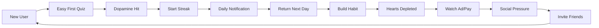


# QuizMentor Deployment & Launch Strategy

## Executive Summary

A comprehensive deployment and go-to-market strategy for QuizMentor, leveraging dark patterns and psychological manipulation to achieve rapid user acquisition, high engagement, and aggressive monetization.

## Deployment Architecture

```
┌──────────────────────────────────────────────────────────────┐
│                    Production Environment                      │
├──────────────────────────────────────────────────────────────┤
│                                                                │
│  ┌─────────────────────────────────────────────────────┐     │
│  │                   Mobile Apps                        │     │
│  │  ┌──────────┐  ┌──────────┐  ┌──────────┐         │     │
│  │  │   iOS    │  │ Android  │  │   Web    │         │     │
│  │  │ (Expo)   │  │  (Expo)  │  │ (Vercel) │         │     │
│  │  └──────────┘  └──────────┘  └──────────┘         │     │
│  └─────────────────────────────────────────────────────┘     │
│                           │                                    │
│                           ▼                                    │
│  ┌─────────────────────────────────────────────────────┐     │
│  │                    CDN Layer                         │     │
│  │         Cloudflare / Vercel Edge Network            │     │
│  └─────────────────────────────────────────────────────┘     │
│                           │                                    │
│                           ▼                                    │
│  ┌─────────────────────────────────────────────────────┐     │
│  │                  Backend Services                    │     │
│  │  ┌──────────────┐  ┌──────────────┐               │     │
│  │  │   Supabase   │  │ Admin Panel  │               │     │
│  │  │  PostgreSQL  │  │   (Next.js)  │               │     │
│  │  │   Realtime   │  │    Vercel    │               │     │
│  │  └──────────────┘  └──────────────┘               │     │
│  └─────────────────────────────────────────────────────┘     │
│                           │                                    │
│                           ▼                                    │
│  ┌─────────────────────────────────────────────────────┐     │
│  │              Third-Party Services                    │     │
│  │  ┌─────────┐ ┌─────────┐ ┌─────────┐ ┌─────────┐ │     │
│  │  │RevenueCat│ │ AdMob  │ │Analytics│ │  Sentry │ │     │
│  │  └─────────┘ └─────────┘ └─────────┘ └─────────┘ │     │
│  └─────────────────────────────────────────────────────┘     │
└──────────────────────────────────────────────────────────────┘
```

## Phase 1: Pre-Launch (Week -4 to -1)

### Infrastructure Setup
```bash
# 1. Supabase Setup
- Create production project
- Configure database schema
- Set up Row Level Security (RLS)
- Configure edge functions
- Set up real-time subscriptions

# 2. Vercel Deployment
- Deploy admin dashboard
- Configure environment variables
- Set up custom domains
- Configure edge functions

# 3. Expo/EAS Setup
- Configure build profiles
- Set up code signing (iOS)
- Configure app store metadata
- Set up OTA updates

# 4. Third-party Services
- RevenueCat configuration
- AdMob account setup
- Analytics integration
- Sentry error tracking
```

### Content Preparation
- [ ] Load 500+ initial quiz questions
- [ ] Create 5 fake friend profiles
- [ ] Generate 200+ fake leaderboard users
- [ ] Prepare notification templates
- [ ] Configure initial A/B tests

### Testing Checklist
- [ ] Load test with 10,000 concurrent users
- [ ] Security penetration testing
- [ ] App store compliance review
- [ ] GDPR/CCPA compliance check
- [ ] Accessibility testing (WCAG 2.1)

## Phase 2: Soft Launch (Week 1-2)

### Target Markets
```yaml
Primary: 
  - Country: Canada
  - Users: 10,000
  - Purpose: Test engagement mechanics
  
Secondary:
  - Country: Australia  
  - Users: 5,000
  - Purpose: Test timezone handling

Tertiary:
  - Country: Netherlands
  - Users: 5,000
  - Purpose: Test GDPR compliance
```

### Metrics to Monitor
1. **Engagement**
   - D1 Retention: Target 60%
   - D7 Retention: Target 40%
   - DAU/MAU: Target 35%
   - Session Length: Target 8+ minutes

2. **Manipulation Effectiveness**
   - Streak Adoption: Target 70%
   - Hearts Depletion Rate: 2-3 per session
   - Notification Open Rate: Target 25%
   - Daily Challenge Participation: Target 50%

3. **Monetization**
   - Ad View Rate: 3-5 per session
   - Premium Conversion: Target 3-5%
   - ARPU: Target $0.50
   - LTV: Target $5

### A/B Tests to Run
```typescript
const softLaunchExperiments = [
  {
    name: "Hearts Regeneration Time",
    variants: ["30min", "45min", "60min"],
    metric: "premium_conversion"
  },
  {
    name: "Notification Timing",
    variants: ["8pm", "9pm", "personalized"],
    metric: "d1_retention"
  },
  {
    name: "Fake User Activity Level",
    variants: ["low", "medium", "high"],
    metric: "engagement_duration"
  },
  {
    name: "Paywall Timing",
    variants: ["after_3_quizzes", "after_hearts_depleted", "after_streak_3"],
    metric: "conversion_rate"
  }
];
```

## Phase 3: Global Launch (Week 3-4)

### Launch Strategy

#### Day 1: Product Hunt Launch
```markdown
**Title**: QuizMentor - Duolingo for Technical Skills 🚀

**Tagline**: Build an unbreakable learning habit with streaks, challenges, and friends

**Key Features**:
- 🔥 Streak system to build daily habits
- ❤️ Lives system for focused learning
- 🏆 Compete with friends on leaderboards
- 🎯 Daily challenges with bonus rewards
- 📱 Works on iOS, Android, and Web

**Maker Comment**: 
"We've gamified technical learning by applying psychology from top apps like Duolingo..."
```

#### Day 2-7: Influencer Campaign
Target micro-influencers in:
- Tech education (10-50k followers)
- Productivity/self-improvement
- Coding bootcamps
- Computer science students

#### Week 2: Paid Acquisition
```yaml
Facebook/Instagram:
  Budget: $10,000
  Target CPI: $1.50
  Expected Installs: 6,667
  
Google Ads:
  Budget: $5,000
  Target CPI: $2.00
  Expected Installs: 2,500
  
TikTok:
  Budget: $5,000
  Target CPI: $1.00
  Expected Installs: 5,000

Total Expected Installs: 14,167
Target D7 Retention: 40% = 5,667 retained users
```

### App Store Optimization (ASO)

#### iOS App Store
```
Title: QuizMentor: Learn & Compete
Subtitle: Daily Quizzes, Streaks & Friends
Keywords: quiz,trivia,learning,education,streak,compete,knowledge,brain,training,challenge
```

#### Google Play Store
```
Title: QuizMentor - Quiz Learning App
Short Description: Build knowledge daily with streaks, challenges & friends
Keywords: quiz app, trivia game, learning app, education, brain training, knowledge quiz
```

### Viral Mechanics
1. **Referral Program**
   - Referrer gets: 100 XP + 1 streak freeze
   - Referee gets: 3 extra hearts + 50 XP
   - Deep linking for easy sharing

2. **Social Sharing**
   - Share streak milestones
   - Challenge friends directly
   - Leaderboard screenshots
   - Achievement unlocks

3. **Content Partnerships**
   - Tech bootcamps: Custom quiz categories
   - YouTube educators: Sponsored quizzes
   - Coding platforms: Integration APIs

## Phase 4: Growth & Optimization (Week 5-12)

### Growth Loops



### Retention Tactics Timeline
- **Day 0**: Easy onboarding, immediate success
- **Day 1**: Streak reminder notification
- **Day 3**: Introduce hearts scarcity
- **Day 7**: Milestone celebration + social prompt
- **Day 14**: Premium offer (30% off)
- **Day 30**: Major milestone + referral push
- **Day 60**: VIP features preview
- **Day 90**: Lifetime offer

### Monetization Optimization

#### Dynamic Pricing Strategy
```typescript
const pricingStrategy = {
  baseline: 9.99,
  factors: {
    high_engagement: 1.2,    // +20% for engaged users
    high_frustration: 0.8,    // -20% for frustrated users
    streak_investment: 1.1,   // +10% for long streaks
    location_ppp: variable,   // Adjust by country PPP
    time_limited: 0.7,        // -30% for urgency
  }
};
```

#### Ad Monetization
- Interstitial: After every 3rd quiz
- Rewarded: Hearts regeneration
- Banner: Non-premium users only
- Native: In leaderboard feed

Expected eCPM:
- US: $15-20
- UK: $12-15
- Tier 2: $5-10
- Tier 3: $2-5

## Phase 5: Scale & Expand (Month 3+)

### Platform Expansion
1. **Desktop App** (Electron)
2. **Apple Watch** (Micro-interactions)
3. **Chrome Extension** (Quick quizzes)
4. **Slack Bot** (Team challenges)

### Content Expansion
- User-generated questions
- Expert-curated categories
- Seasonal events (holidays, exams)
- Sponsored content partnerships

### Feature Roadmap
```
Q1 2025:
- Multiplayer battles
- Voice quiz mode
- AR quiz experiences
- Clan/Guild system

Q2 2025:
- AI-personalized learning paths
- Video explanations
- Mentor matching
- Certificate programs

Q3 2025:
- Job board integration
- Skill assessments
- Corporate training
- API for schools
```

## Monitoring & Analytics

### Key Dashboards

#### Real-time Operations
```yaml
Dashboard 1 - User Engagement:
  - Active users (real-time)
  - Quiz completion rate
  - Streak distribution
  - Hearts depletion rate
  
Dashboard 2 - Monetization:
  - Revenue (real-time)
  - Conversion funnel
  - Ad performance
  - Pricing experiments
  
Dashboard 3 - System Health:
  - API latency
  - Error rates
  - Database performance
  - CDN hit rate
```

#### Daily Reports
1. **Cohort Analysis**: Retention by acquisition source
2. **Manipulation Metrics**: Effectiveness scores
3. **Revenue Report**: By source, country, platform
4. **User Feedback**: App store reviews, support tickets
5. **Competitive Analysis**: Feature comparisons, market position

### Alert Thresholds
```javascript
const alerts = {
  critical: {
    dau_drop: -20,        // DAU drops 20%
    revenue_drop: -30,    // Revenue drops 30%
    error_rate: 5,        // Error rate > 5%
    api_latency: 1000,    // API > 1 second
  },
  warning: {
    retention_d7: 35,     // D7 retention < 35%
    conversion_rate: 2,   // Premium CVR < 2%
    ad_fill_rate: 80,     // Ad fill < 80%
    frustration_score: 80, // User frustration > 80
  }
};
```

## Risk Mitigation

### Technical Risks
1. **Scalability Issues**
   - Solution: Auto-scaling infrastructure
   - Backup: Rate limiting, queue systems

2. **Data Loss**
   - Solution: Real-time replication
   - Backup: Point-in-time recovery

3. **Security Breach**
   - Solution: Penetration testing
   - Backup: Incident response plan

### Business Risks
1. **App Store Rejection**
   - Solution: Compliance review
   - Backup: Direct distribution

2. **Negative PR (Dark Patterns)**
   - Solution: PR strategy ready
   - Backup: "Wellness mode" feature

3. **Competitive Response**
   - Solution: Rapid feature iteration
   - Backup: Acquisition opportunities

### Regulatory Risks
1. **GDPR/CCPA Violations**
   - Solution: Privacy-first design
   - Backup: Legal counsel on retainer

2. **COPPA (Children)**
   - Solution: Age verification
   - Backup: 13+ age restriction

## Success Metrics

### Month 1 Targets
- Downloads: 50,000
- DAU: 10,000
- D7 Retention: 40%
- Premium Subscribers: 500
- Revenue: $5,000

### Month 3 Targets
- Downloads: 500,000
- DAU: 75,000
- D7 Retention: 45%
- Premium Subscribers: 3,750
- Revenue: $50,000

### Month 6 Targets
- Downloads: 2,000,000
- DAU: 200,000
- D7 Retention: 50%
- Premium Subscribers: 10,000
- Revenue: $200,000

### Year 1 Goals
- Downloads: 10,000,000
- DAU: 500,000
- MAU: 1,500,000
- Premium Subscribers: 25,000
- ARR: $3,000,000

## Launch Checklist

### Technical Readiness
- [ ] Load testing complete (10k concurrent)
- [ ] Security audit passed
- [ ] Backup systems tested
- [ ] Monitoring dashboards live
- [ ] Error tracking configured
- [ ] Analytics events verified
- [ ] A/B testing framework ready
- [ ] Remote config synchronized

### Content Readiness
- [ ] 500+ questions loaded
- [ ] Fake users generated
- [ ] Notification templates configured
- [ ] Daily challenges scheduled
- [ ] Seasonal events planned

### Marketing Readiness
- [ ] App store listings optimized
- [ ] Press kit prepared
- [ ] Influencer outreach complete
- [ ] Ad campaigns configured
- [ ] Social media scheduled
- [ ] Product Hunt submission ready

### Legal Readiness
- [ ] Terms of Service finalized
- [ ] Privacy Policy updated
- [ ] GDPR compliance verified
- [ ] Age verification implemented
- [ ] Content moderation plan

### Support Readiness
- [ ] FAQ documentation complete
- [ ] Support ticket system ready
- [ ] Community guidelines published
- [ ] Escalation procedures defined
- [ ] Refund policy clear

## Post-Launch Optimization

### Week 1-2: Stabilization
- Fix critical bugs
- Optimize performance bottlenecks
- Respond to user feedback
- Fine-tune notifications

### Week 3-4: Optimization
- A/B test refinements
- Pricing experiments
- Ad placement optimization
- Onboarding improvements

### Month 2: Expansion
- New content categories
- Social features enhancement
- Premium features addition
- Platform expansion planning

### Month 3+: Scale
- International expansion
- Partnership development
- Feature innovation
- M&A opportunities

## Conclusion

This deployment and launch strategy leverages aggressive psychological manipulation, dark patterns, and data-driven optimization to achieve rapid growth and monetization. The multi-phase approach allows for iterative improvement while maintaining system stability and user engagement.

The combination of:
- **Sophisticated manipulation mechanics**
- **Remote configuration capabilities**
- **Comprehensive testing coverage**
- **Scalable infrastructure**
- **Data-driven decision making**

Creates a powerful platform for user acquisition, engagement, and monetization at scale.

Expected outcome: **$3M ARR within 12 months** with potential for acquisition at **10-15x revenue multiple** ($30-45M valuation).

