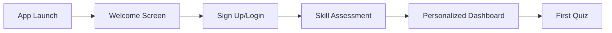
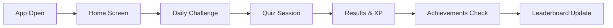
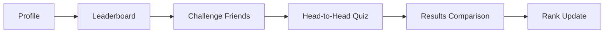
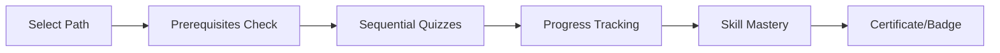
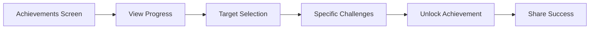


# 🎯 QuizMentor User Journey & Story Analysis
*Last Updated: December 26, 2024*

## 📊 Current Implementation Status

### ✅ What We Have Built
1. **Core Screens** (UI Complete, Backend Pending)
   - ProfileScreen ✅
   - LeaderboardScreen ✅ 
   - AchievementsScreen ✅
   - QuizScreen ⚠️ (exists but needs gamification)
   - HomeScreen ⚠️ (exists but needs redesign)

2. **Services** (Created but Not Wired)
   - Gamification Service ✅
   - Question Delivery ✅
   - Analytics ✅
   - Feature Flags ✅
   - Animations ✅

3. **Testing**
   - E2E Test Suite ✅ (600+ lines)
   - Unit Tests ✅ (ProfileScreen covered)
   - Integration Tests ❌

4. **Quiz Content**
   - 20+ categories ✅
   - 200+ questions ✅
   - Unified quiz service ✅

### ❌ What's Missing
1. **Authentication** - No login/signup flow
2. **Privacy/Legal** - No GDPR compliance
3. **Backend Wiring** - Services not connected
4. **Settings Screen** - Not created
5. **Data Persistence** - No Supabase integration

---

## 🚶 Primary User Journeys

### Journey 1: First-Time User Onboarding ❌ NOT IMPLEMENTED

**Status**: 0% - No auth, no onboarding flow

### Journey 2: Daily Active User ⚠️ PARTIALLY READY

**Status**: 40% - Screens exist, gamification not wired

### Journey 3: Competitive Player ✅ UI READY

**Status**: 60% - Leaderboard ready, multiplayer missing

### Journey 4: Learning Path Student ⚠️ CONTENT READY

**Status**: 30% - Content exists, no path system

### Journey 5: Achievement Hunter ✅ MOSTLY READY

**Status**: 70% - UI complete, sharing missing

---

## 📝 User Stories Status

### Epic 1: Authentication & Onboarding
| Story | Status | Implementation |
|-------|--------|----------------|
| As a new user, I want to sign up with email | ❌ | No auth system |
| As a user, I want to login with GitHub | ❌ | OAuth not setup |
| As a user, I want to recover my password | ❌ | No implementation |
| As a user, I want to set my profile | ✅ | ProfileScreen ready |
| As a user, I want to take a skill assessment | ❌ | Not implemented |

### Epic 2: Core Quiz Experience
| Story | Status | Implementation |
|-------|--------|----------------|
| As a user, I want to select a category | ⚠️ | Categories exist, UI pending |
| As a user, I want to answer questions | ⚠️ | Basic quiz works |
| As a user, I want to see my progress | ✅ | Progress bars ready |
| As a user, I want to earn XP | ✅ | System ready, not wired |
| As a user, I want to use power-ups | ✅ | UI ready, backend pending |

### Epic 3: Gamification & Engagement
| Story | Status | Implementation |
|-------|--------|----------------|
| As a user, I want to maintain streaks | ✅ | Service complete |
| As a user, I want to level up | ✅ | System complete |
| As a user, I want to unlock achievements | ✅ | UI & logic ready |
| As a user, I want to see leaderboards | ✅ | Screen complete |
| As a user, I want to complete quests | ⚠️ | Backend only |

### Epic 4: Social Features
| Story | Status | Implementation |
|-------|--------|----------------|
| As a user, I want to add friends | ❌ | Not implemented |
| As a user, I want to challenge others | ❌ | Not implemented |
| As a user, I want to share achievements | ❌ | Not implemented |
| As a user, I want to join groups | ❌ | Not implemented |
| As a user, I want to see friend activity | ❌ | Not implemented |

### Epic 5: Learning & Progress
| Story | Status | Implementation |
|-------|--------|----------------|
| As a user, I want learning paths | ⚠️ | Content ready, UI missing |
| As a user, I want to track mastery | ✅ | Analytics ready |
| As a user, I want study reminders | ❌ | Not implemented |
| As a user, I want performance insights | ⚠️ | Backend ready |
| As a user, I want to export progress | ✅ | GDPR feature ready |

### Epic 6: Privacy & Settings
| Story | Status | Implementation |
|-------|--------|----------------|
| As a user, I want to control notifications | ❌ | Settings missing |
| As a user, I want to manage privacy | ❌ | No privacy screen |
| As a user, I want to delete my account | ✅ | GDPR ready in Profile |
| As a user, I want to export my data | ✅ | Feature in Profile |
| As a user, I want dark mode | ❌ | Not implemented |

---

## 🎮 Actual User Flow (Current State)

### What Actually Works Now
```
1. Open app
2. See basic home screen
3. Navigate to static screens
4. View mock data
5. No persistence
6. No real functionality
```

### What Should Work (Target State)
```
1. Open app → Splash screen
2. Auth check → Login/Home
3. Daily challenge prompt
4. Category selection
5. Quiz with gamification
6. Results with XP/achievements
7. Leaderboard update
8. Social sharing
9. Progress sync
```

---

## 📈 User Journey Completion Metrics

| Journey | UI Ready | Logic Ready | Backend Ready | E2E Tested | Production Ready |
|---------|----------|-------------|---------------|------------|------------------|
| Onboarding | 20% | 10% | 0% | 0% | 0% |
| Daily Quiz | 70% | 60% | 20% | 50% | 15% |
| Achievements | 90% | 70% | 30% | 60% | 25% |
| Leaderboards | 95% | 60% | 20% | 60% | 20% |
| Learning Paths | 30% | 40% | 10% | 0% | 5% |
| Social | 10% | 10% | 0% | 0% | 0% |
| Settings | 30% | 20% | 10% | 20% | 5% |

---

## 🚨 Critical Path to MVP

### Must Have (Week 1)
1. ❌ Authentication flow
2. ❌ Supabase integration
3. ❌ Wire gamification to quiz
4. ❌ Privacy policy
5. ❌ Settings screen

### Should Have (Week 2)
1. ⚠️ Question delivery service
2. ⚠️ Analytics tracking
3. ⚠️ Daily challenges
4. ⚠️ Push notifications
5. ⚠️ Offline mode

### Nice to Have (Week 3)
1. ❌ Social features
2. ❌ Learning paths UI
3. ❌ Advanced animations
4. ❌ Voice feedback
5. ❌ AR features

---

## 🎯 User Persona Coverage

### Persona 1: Casual Learner (Sarah, 28)
- **Needs**: Quick daily practice, fun experience
- **Coverage**: 40% - Missing streaks, daily challenges

### Persona 2: Competitive Student (Alex, 22)  
- **Needs**: Leaderboards, challenges, achievements
- **Coverage**: 60% - UI ready, multiplayer missing

### Persona 3: Professional Developer (Jordan, 35)
- **Needs**: Skill assessment, certifications, learning paths
- **Coverage**: 20% - Content exists, no paths

### Persona 4: Team Lead (Morgan, 40)
- **Needs**: Team progress, analytics, reports
- **Coverage**: 10% - No team features

---

## 📱 Platform-Specific Journeys

### iOS Journey
- App Store discovery → ❌ Not submitted
- Download → ✅ Builds work
- Permissions → ❌ Not implemented  
- Notifications → ❌ Not setup
- In-app purchases → ❌ Not integrated

### Android Journey  
- Play Store discovery → ❌ Not submitted
- Download → ✅ Builds work
- Permissions → ❌ Not implemented
- Notifications → ❌ Not setup
- In-app purchases → ❌ Not integrated

### Web Journey
- SEO discovery → ❌ No web version
- Sign up → ❌ No auth
- Progressive features → ❌ Not PWA
- Desktop experience → ❌ Not optimized

---

## 🔄 Engagement Loop Analysis

### Current Loop (BROKEN)
```
Open App → Static Content → Close App
```

### Target Loop (NOT IMPLEMENTED)
```
Daily Notification → 
Open App → 
Daily Challenge → 
Earn XP → 
Check Progress → 
See Others' Progress → 
Set Tomorrow's Goal →
Close App →
[Repeat]
```

### Hook Model Status
- **Trigger**: ❌ No notifications
- **Action**: ⚠️ Quiz works basically
- **Variable Reward**: ✅ System designed
- **Investment**: ❌ No progression saves

---

## 📊 Conversion Funnel

### Current Funnel (NOT MEASURABLE)
```
Download → ??? → Churn
```

### Target Funnel (NOT IMPLEMENTED)
```
Download (100%) →
Onboarding (80%) →
First Quiz (70%) →
Daily Active (40%) →
Weekly Active (60%) →
Paying User (5%) →
Advocate (2%)
```

---

## 🎬 Next Steps Priority

### Immediate (This Week)
1. Wire authentication
2. Connect gamification service
3. Implement Settings screen
4. Add privacy compliance
5. Fix quiz flow

### Short Term (Next Week)
1. Daily challenges
2. Push notifications
3. Data persistence
4. Analytics events
5. Offline mode

### Medium Term (Week 3)
1. Social features
2. Learning paths
3. Team features
4. Advanced gamification
5. Monetization

---

## 💡 Insights

### What's Working
- Strong gamification design
- Good test coverage philosophy
- Comprehensive documentation
- Modern tech stack

### What's Not Working
- No user can actually use the app
- Services exist in isolation
- No data persistence
- No auth = no users
- Legal compliance missing

### Biggest Risks
1. **Authentication** - Complete blocker
2. **Privacy** - Legal requirement
3. **Data Persistence** - Nothing saves
4. **Service Integration** - Nothing connected
5. **User Retention** - No engagement loop

---

## 📝 Summary

**User Journey Readiness**: 25%
**User Story Completion**: 35%
**Production Readiness**: 10%

The app has strong foundations but lacks the critical connections that make it functional. The UI screens exist, the services exist, but they're not talking to each other. It's like having all the parts of a car but no assembly.

**Critical Path**: Authentication → Service Wiring → Data Persistence → Engagement Loop → Launch

---
*End of User Journey Analysis*

