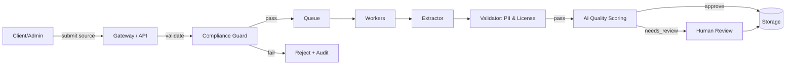


# QuizMentor Content Harvester and Compliance Pipeline

Goal: Safely ingest high-quality educational material that can be transformed into valid, pedagogically-sound quiz questions while respecting site policies, intellectual property, and user privacy.


## Overview

The pipeline is designed as a gated, policy-first ingestion flow:

1) Intake/Intent
- Accept a URL or pre-approved corpus reference (allowlist only)
- Require declaration of permission/ownership or approved license (e.g., CC BY)

2) Compliance Guards (hard gates)
- robots.txt check: obey Disallow, crawl-delay, user-agent directives
- meta robots and canonical checks: respect noindex, nofollow; prefer canonical
- Terms-of-Service policy: deny known disallowed sites via blocklist
- Rate limiting: polite crawling, backoff, max concurrency per host, retry budget
- Licensing: heuristic license detection (meta/license, text markers like “Creative Commons”); block if no clear right to use
- PII/Privacy filters: detect emails, phones, personal names; strip or block ingestion

3) Extraction and Normalization
- HTML to text with boilerplate removal (headings/sections preserved)
- Segment content into learning units; capture metadata (title, author, date, license, source URL)

4) AI Quality Pipeline (soft gates + scores)
- Clarity: grammar, ambiguity
- Answerability: content supports unambiguous answer
- Bloom alignment: map to level, check question-type appropriateness
- Educational fit: topic taxonomy, age-level suitability, toxicity check
- Deduplication: fingerprint + semantic similarity threshold
- Confidence bands: auto-approve, human-review, or reject

5) Storage, Audit, and Retention
- Store only derived learning units and minimal source metadata
- Keep audit trail: crawl timestamp, robots checks, license evidence, model decisions
- Retention defaults: minimize storage; delete raw HTML after processing

6) Serving & Governance
- Only expose approved, non-PII, rights-cleared content to question generators
- Provide API and dashboard to review/override flags


## Reference Architecture



Components:
- API Gateway: Accepts jobs, returns job status
- Compliance Guard: robots.txt + ToS + license + privacy pre-checks
- Workers: Fetch + extract + normalize content
- Validators: PII redaction + license verification
- AI Quality: scoring for clarity/answerability/Bloom alignment/toxicity/dedup
- Storage: Approved learning units + audit logs
- Review UI: human-in-the-loop for flagged items


## Legal and Compliance Guardrails

- robots.txt and meta robots
  - Always fetch and parse robots.txt; obey Disallow and crawl-delay
  - Respect <meta name="robots" content="noindex,nofollow"> and X-Robots-Tag headers
- Terms/Allowlist/Blocklist
  - Maintain explicit allowlist of sources or require proof of permission
  - Deny known disallowed or high-risk domains via blocklist
- Licensing
  - Attempt detection via:
    - Link rel="license"
    - Known license badges and CC text markers
    - Site policy pages (heuristic scan of /license, /legal, /terms)
  - Require explicit ownership/permission or recognized permissive license; otherwise block
- PII and Privacy
  - Block or redact emails, phone numbers, direct identifiers in raw text
  - Never store credentials or personal notes from private docs
  - Honor takedown requests and right to be forgotten
- Rate Limiting & Identification
  - Identify with a descriptive User-Agent and contact email
  - Per-host concurrency limit (e.g., 1-2 requests), backoff on 429/503
- Retention & Audit
  - Retain only derived learning units; delete raw HTML
  - Log evidence of robots/licensing/consent; store non-sensitive audit trails


## AI Quality Pipeline

Scoring dimensions (0.0 – 1.0):
- Clarity: grammar, readability, focused scope
- Answerability: content supports unambiguous question/answer
- BloomFit: target Bloom level aligned with question type
- Pedagogical: learning objective match, cognitive complexity
- Safety: toxicity/harassment bias check
- Similarity: near-duplicate detection to existing bank

Routing:
- approve if min(all) >= 0.75 and Safety >= 0.95 and Similarity <= 0.85
- human review if 0.5–0.75 band or borderline licensing/PII
- reject otherwise


## API Endpoints (QuizMentor)

- POST /api/harvest/submit
  - body: { sourceUrl, declaredLicense?, proof?, category?, ownerEmail? }
  - returns: { jobId }
- POST /api/harvest/validate-source
  - body: { sourceUrl }
  - returns: { ok, robots: {...}, license: {...}, allowed: boolean, reasons?: string[] }
- GET /api/harvest/jobs/{jobId}
  - returns: { status: queued|running|needs_review|approved|rejected, scores?, auditId }
- GET /api/harvest/policy
  - returns: { crawlPolicy, privacy, licensing, contact }


## Minimal Data Model

```ts
// Job
job: {
  id: string,
  sourceUrl: string,
  submittedBy: string | null,
  declaredLicense?: string,
  status: 'queued'|'running'|'needs_review'|'approved'|'rejected',
  createdAt: string,
  auditId: string
}

// Audit
audit: {
  id: string,
  robots: { allowed: boolean, crawlDelay?: number, reasons?: string[] },
  license: { status: 'ok'|'unknown'|'blocked', evidence: string[] },
  pii: { redacted: boolean, findings: string[] },
  scores?: { clarity: number, answerability: number, bloomFit: number, safety: number, similarity: number },
  reviewer?: { required: boolean, notes?: string },
  timestamp: string
}
```


## Example Worker (TypeScript pseudo-code)

```ts
// Respect robots and license before fetching
export async function gatekeep(sourceUrl: string) {
  const robots = await fetchRobots(sourceUrl);
  if (!robots.allowed) return { ok: false, reasons: ['robots disallow'] };

  const license = await detectLicense(sourceUrl);
  if (license.status === 'blocked' || license.status === 'unknown') {
    return { ok: false, reasons: ['license unknown/blocked'] };
  }

  return { ok: true, robots, license };
}

export async function pipeline(sourceUrl: string) {
  const guard = await gatekeep(sourceUrl);
  if (!guard.ok) return rejectWithAudit(guard);

  const html = await politeFetch(sourceUrl);
  const text = extractReadableText(html);
  const redacted = redactPII(text);

  const segments = segmentIntoLearningUnits(redacted);
  const candidates = generateQuestionCandidates(segments);

  const scored = await scoreCandidates(candidates); // clarity, answerability, bloomFit, safety, similarity

  const { approved, flagged, rejected } = partitionByPolicy(scored);
  await saveApproved(approved);
  await recordAudit({ robots: guard.robots, license: guard.license, scores: summarize(scored) });

  if (flagged.length) await enqueueHumanReview(flagged);
  return { approved: approved.length, flagged: flagged.length, rejected: rejected.length };
}
```


## Testing and Verification

- Unit tests: robots parser, license detector, PII redactor, scorer thresholds
- Integration tests: submit → status, validate-source happy/sad paths
- E2E: seed demo source, run worker, observe approved questions, verify audit
- Performance budgets: per-host crawl rate, job runtime < 90s, memory < 300MB
- Safety gates: block on 4xx/5xx bursts, exponential backoff, circuit breaker


## Compliance Checklist

- [ ] robots.txt obeyed; meta robots honored
- [ ] Allowlist/blocklist enforced; ToS respected
- [ ] License evidence captured; unknown licenses denied
- [ ] PII redacted; no sensitive fields stored
- [ ] Retention: raw HTML discarded, minimal metadata kept
- [ ] Audit trail for each decision
- [ ] Human-in-the-loop for borderline cases


## Operational Notes

- Identify with User-Agent: QuizMentorHarvester/1.0 (+contact@quizmentor.app)
- Provide public policy at /api/harvest/policy and docs page linking contact & takedown
- Log only non-sensitive IDs; never log full content or secrets

---

This pipeline is intentionally conservative: deny by default, require clear rights or ownership, and never store more than needed.


