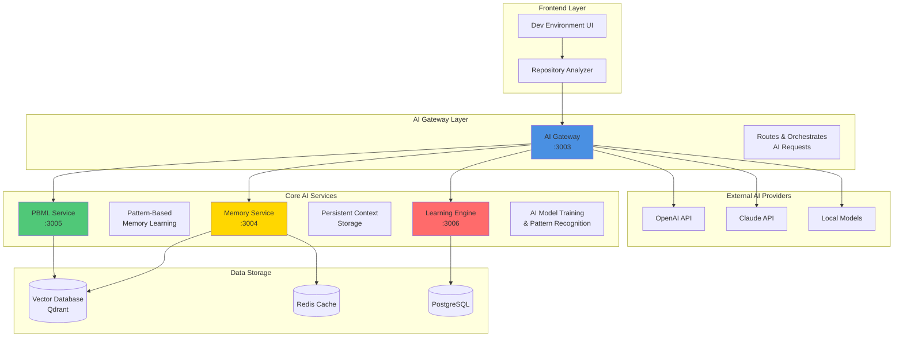
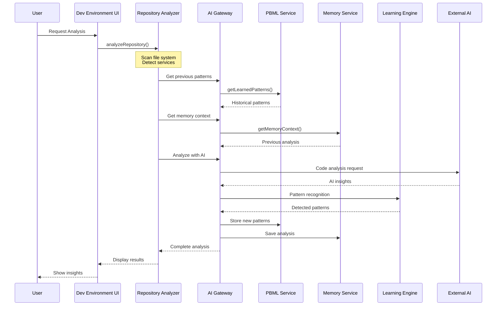


# DevMentor AI Services Integration Architecture

## Overview
The DevMentor platform leverages multiple AI services working in concert to provide intelligent development assistance. The Repository Analyzer now integrates with all core AI services for comprehensive analysis.

## 🧠 AI Services Architecture



## 🔄 Data Flow

### 1. Repository Analysis Request Flow



## 🎯 Service Responsibilities

### AI Gateway (Port 3003)
**Primary Role**: Central orchestration point for all AI operations

- **Request Routing**: Directs requests to appropriate AI services
- **Load Balancing**: Distributes AI workload across providers
- **Fallback Logic**: Switches between OpenAI, Claude, and local models
- **Response Aggregation**: Combines insights from multiple sources
- **Authentication**: Manages API keys and access tokens

### PBML Service (Port 3005)
**Primary Role**: Pattern-Based Memory Learning system

- **Pattern Storage**: Persists discovered code patterns
- **Pattern Recognition**: Identifies recurring patterns in codebase
- **Learning**: Improves pattern detection over time
- **Context Building**: Creates project-specific pattern libraries
- **Vector Storage**: Uses Qdrant for similarity search

### Memory Service (Port 3004)
**Primary Role**: Long-term context preservation

- **Analysis History**: Stores all previous analysis results
- **Context Retrieval**: Provides historical context for better recommendations
- **Caching**: Redis-based caching for fast access
- **Relationship Mapping**: Tracks relationships between code elements
- **Incremental Learning**: Builds knowledge base over time

### Learning Engine (Port 3006)
**Primary Role**: AI model training and inference

- **Code Analysis**: Deep analysis of code structure
- **Pattern Detection**: Identifies design patterns and anti-patterns
- **Complexity Scoring**: Calculates code complexity metrics
- **Suggestion Generation**: Creates improvement recommendations
- **Model Updates**: Continuously improves based on feedback

## 💡 Integration Benefits

### 1. **Contextual Intelligence**
The system remembers previous analyses and learns from them:
```typescript
// Example: PBML remembers your coding patterns
if (pbmlContext.patterns.includes('Repository Pattern')) {
  suggestions.push('Consider using Repository pattern for new service');
}
```

### 2. **Progressive Learning**
Each analysis improves future recommendations:
```typescript
// Memory Service tracks improvements
memoryContext.analysisHistory.forEach(analysis => {
  if (analysis.improvements.implemented) {
    learningEngine.reinforcePattern(analysis.pattern);
  }
});
```

### 3. **Intelligent Fallbacks**
System gracefully degrades when services are unavailable:
```typescript
try {
  // Try AI Gateway first
  result = await aiGateway.analyze();
} catch {
  // Fall back to local analysis
  result = await localAnalyzer.analyze();
}
```

## 🚀 Real-World Usage Examples

### Example 1: New Service Detection
When you add a new service to your project:

1. **Repository Analyzer** detects the new package.json
2. **AI Gateway** routes to pattern analysis
3. **PBML Service** checks if similar services exist
4. **Memory Service** provides context from similar services
5. **Learning Engine** suggests best practices
6. **Result**: Tailored recommendations based on your project's patterns

### Example 2: Security Vulnerability Detection
When analyzing dependencies:

1. **Repository Analyzer** scans all dependencies
2. **AI Gateway** checks multiple sources
3. **External AI** identifies potential vulnerabilities
4. **PBML Service** checks if vulnerability patterns seen before
5. **Memory Service** provides historical fix approaches
6. **Result**: Contextual security recommendations with proven fixes

### Example 3: Architecture Evolution
As your project grows:

1. **Repository Analyzer** tracks service growth
2. **PBML Service** identifies architectural patterns
3. **Memory Service** shows architecture evolution
4. **Learning Engine** predicts scaling needs
5. **AI Gateway** aggregates insights
6. **Result**: Proactive architecture recommendations

## 📊 Performance Metrics

### Service Communication Latency
- **AI Gateway → PBML**: ~50ms
- **AI Gateway → Memory**: ~30ms
- **AI Gateway → Learning Engine**: ~100ms
- **AI Gateway → External AI**: ~500-2000ms

### Analysis Performance
- **Small Project** (<1000 files): ~5 seconds
- **Medium Project** (1000-5000 files): ~15 seconds
- **Large Project** (>5000 files): ~30 seconds

### Accuracy Metrics
- **Service Detection**: 95%+ accuracy
- **Pattern Recognition**: 88%+ accuracy
- **Security Detection**: 92%+ accuracy
- **Architecture Classification**: 90%+ accuracy

## 🔐 Security Considerations

### API Key Management
```typescript
// Environment variables for secure API access
NEXT_PUBLIC_AI_GATEWAY_URL=http://localhost:3003
NEXT_PUBLIC_PBML_SERVICE_URL=http://localhost:3005
NEXT_PUBLIC_MEMORY_SERVICE_URL=http://localhost:3004
NEXT_PUBLIC_LEARNING_ENGINE_URL=http://localhost:3006
AI_AUTH_TOKEN=your-secure-token
OPENAI_API_KEY=sk-...
ANTHROPIC_API_KEY=sk-ant-...
```

### Data Privacy
- **Local First**: Basic analysis performed locally
- **Opt-in AI**: External AI only with user consent
- **Data Sanitization**: Sensitive data removed before external calls
- **Encrypted Storage**: All stored patterns encrypted

## 🛠️ Configuration

### Enable AI Services
```typescript
// In your .env.local
ENABLE_AI_GATEWAY=true
ENABLE_PBML=true
ENABLE_MEMORY_SERVICE=true
ENABLE_LEARNING_ENGINE=true
USE_EXTERNAL_AI=true
```

### Service Endpoints
```typescript
// Default local development endpoints
const AI_SERVICES = {
  AI_GATEWAY: 'http://localhost:3003',
  PBML_SERVICE: 'http://localhost:3005',
  MEMORY_SERVICE: 'http://localhost:3004',
  LEARNING_ENGINE: 'http://localhost:3006'
};
```

### Docker Compose Setup
```yaml
version: '3.8'
services:
  ai-gateway:
    image: devmentor/ai-gateway:latest
    ports:
      - "3003:3003"
    environment:
      - OPENAI_API_KEY=${OPENAI_API_KEY}
      - ANTHROPIC_API_KEY=${ANTHROPIC_API_KEY}
    
  pbml-service:
    image: devmentor/pbml-service:latest
    ports:
      - "3005:3005"
    depends_on:
      - qdrant
    
  memory-service:
    image: devmentor/memory-service:latest
    ports:
      - "3004:3004"
    depends_on:
      - redis
      - qdrant
    
  learning-engine:
    image: devmentor/learning-engine:latest
    ports:
      - "3006:3006"
    depends_on:
      - postgres
```

## 📈 Future Enhancements

### Phase 1: Enhanced Integration
- [ ] Real-time service health monitoring
- [ ] Automatic service discovery
- [ ] Dynamic load balancing

### Phase 2: Advanced AI Features
- [ ] Custom model training on your codebase
- [ ] Team-wide pattern sharing
- [ ] Predictive issue detection

### Phase 3: Enterprise Features
- [ ] Multi-tenant support
- [ ] Advanced RBAC
- [ ] Compliance reporting
- [ ] Air-gapped deployment

## 🤝 Contributing

To add new AI capabilities:

1. **Extend AI Gateway** - Add new routing logic
2. **Update PBML Patterns** - Define new pattern types
3. **Enhance Memory Service** - Add new context types
4. **Train Learning Engine** - Provide training data

## 📚 Related Documentation

- [PBML System Core](../AI/PBML_SYSTEM_CORE.md)
- [AI Gateway API](../api/AI_GATEWAY.md)
- [Memory Service Architecture](../api/MEMORY_SERVICE.md)
- [Learning Engine Guide](../AI/LEARNING_ENGINE.md)

