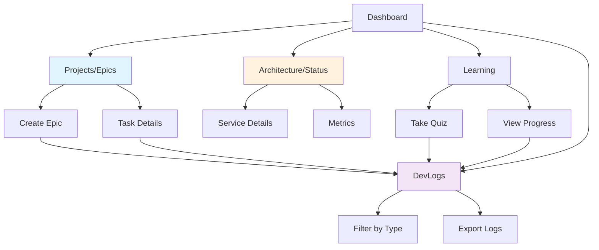


# 🗺️ DevMentor Navigation Structure & Page Mapping

## Core Navigation Philosophy

DevMentor's navigation is organized around **functional domains** rather than technical components. Each page serves a specific user journey stage.

## 📍 Main Navigation Structure

```
Dashboard (/)
├── 🏠 Home Dashboard
│   └── Overview of all activities, quick actions, notifications
│
├── 📊 Projects (/projects)
│   ├── Project List
│   ├── Epic Management (Project Manager View)
│   └── Task Board
│
├── 🏗️ Architecture (/architecture)
│   ├── System Status (Live Architecture View)
│   ├── Service Health
│   └── Dependency Graph
│
├── 🧠 Learning (/learning)
│   ├── Adaptive Quiz Engine
│   ├── Learning Paths
│   ├── Progress Tracking
│   └── Skill Assessment
│
├── 🔍 Code Analysis (/analyze)
│   ├── Repository Analyzer
│   ├── Pattern Detection
│   ├── Code Quality Insights
│   └── Team Patterns
│
├── 📝 DevLogs (/logs)
│   ├── Activity Stream
│   ├── Learning Events
│   ├── System Events
│   └── Pattern Detection Logs
│
├── 💾 Memory Bank (/memory)
│   ├── Knowledge Base
│   ├── Stored Patterns
│   ├── Context History
│   └── Search
│
├── ⚙️ Settings (/settings)
│   ├── Profile
│   ├── Integrations
│   ├── API Keys
│   └── Preferences
│
└── 📚 Documentation (/docs)
    ├── Getting Started
    ├── API Reference
    └── Tutorials
```

## 🎯 Page Purpose Mapping

### 1. **Epic Management** = Project Manager
**Location:** `/projects/epics` or `/projects/:projectId/epics`

```typescript
// This is your project management hub
interface EpicManagementPage {
  purpose: "Project and task management"
  features: [
    "Create/Edit/Delete Epics",
    "Task breakdown",
    "Progress tracking",
    "Team collaboration",
    "Milestone management"
  ]
  components: [
    "EpicManager",
    "TaskBoard",
    "ProgressChart",
    "TeamView"
  ]
}
```

### 2. **System Status** = Architecture Visualization
**Location:** `/architecture` or `/architecture/status`

```typescript
// This is your system architecture view
interface SystemStatusPage {
  purpose: "Live system architecture and health"
  features: [
    "Service topology",
    "Real-time health monitoring",
    "Dependency visualization",
    "Performance metrics",
    "Service interactions"
  ]
  components: [
    "LiveArchitectureDiagram",
    "ServiceHealthMonitor",
    "DependencyGraph",
    "MetricsDisplay"
  ]
}
```

### 3. **DevLogs** = Activity & Learning Stream
**Location:** `/logs` or `/devlogs`

```typescript
// This is your activity monitoring center
interface DevLogsPage {
  purpose: "Real-time system activity and learning events"
  features: [
    "Live activity stream",
    "Learning progress logs",
    "Pattern detection events",
    "Error tracking",
    "System events"
  ]
  components: [
    "DevLogsViewer",
    "LogFilters",
    "LogSearch",
    "LogExport"
  ]
}
```

## 🔄 Page Relationships



## 📱 Implementation Example

### Dashboard Integration
```tsx
// src/app/dashboard/page.tsx
export default function Dashboard() {
  return (
    <div className="dashboard-grid">
      {/* Quick Access Cards */}
      <Card href="/projects/epics" icon={<FolderKanban />}>
        <h3>Project Manager</h3>
        <p>Manage epics and tasks</p>
      </Card>
      
      <Card href="/architecture" icon={<Network />}>
        <h3>System Architecture</h3>
        <p>View live system status</p>
      </Card>
      
      <Card href="/logs" icon={<Activity />}>
        <h3>DevLogs</h3>
        <p>Monitor activity stream</p>
      </Card>
      
      <Card href="/learning" icon={<Brain />}>
        <h3>Learning Center</h3>
        <p>Adaptive learning & quizzes</p>
      </Card>
    </div>
  )
}
```

### Navigation Component
```tsx
// src/components/Navigation.tsx
const navItems = [
  { 
    label: 'Dashboard', 
    href: '/', 
    icon: Home 
  },
  { 
    label: 'Projects', 
    href: '/projects',
    icon: FolderKanban,
    children: [
      { label: 'Epic Manager', href: '/projects/epics' },
      { label: 'Task Board', href: '/projects/tasks' }
    ]
  },
  { 
    label: 'Architecture', 
    href: '/architecture',
    icon: Network,
    children: [
      { label: 'System Status', href: '/architecture/status' },
      { label: 'Service Health', href: '/architecture/health' }
    ]
  },
  { 
    label: 'Learning', 
    href: '/learning',
    icon: Brain,
    children: [
      { label: 'Take Quiz', href: '/learning/quiz' },
      { label: 'My Progress', href: '/learning/progress' }
    ]
  },
  { 
    label: 'DevLogs', 
    href: '/logs',
    icon: Activity,
    badge: 'LIVE'
  },
  { 
    label: 'Memory Bank', 
    href: '/memory',
    icon: Database
  }
]
```

## 🎨 UI/UX Principles

### 1. **Progressive Disclosure**
- Dashboard shows overview
- Click through for details
- Breadcrumbs for navigation

### 2. **Contextual Actions**
- Actions relevant to current page
- Quick access to related features
- Smart suggestions based on activity

### 3. **Live Updates**
- DevLogs show real-time activity
- Architecture shows live status
- Learning shows immediate feedback

### 4. **Unified Experience**
- Consistent navigation
- Shared components
- Connected data flow

## 🔗 Data Flow Between Pages

```typescript
// Example: Creating an epic flows through multiple pages
1. Projects/Epics → Create new epic
2. System analyzes (visible in DevLogs)
3. PBML learns pattern (Memory Bank updated)
4. Architecture view shows new service connections
5. Learning suggests related skills
```

## 📊 Page Priority for MVP

| Priority | Page | Why |
|----------|------|-----|
| 1 | Dashboard | Entry point, overview |
| 2 | Code Analysis | Core value prop |
| 3 | Learning/Quiz | Unique feature |
| 4 | DevLogs | Transparency & trust |
| 5 | Projects/Epics | Project management |
| 6 | Architecture | Advanced users |
| 7 | Memory Bank | Power users |

## 🚀 Next Steps

1. **Implement DevLogs page** at `/app/logs/page.tsx`
2. **Add navigation links** to existing nav component
3. **Connect WebSocket** for real-time logs
4. **Wire up filters** and search functionality
5. **Add export capability** for logs

The key insight: Each page serves a specific purpose in the user's journey, and they're all interconnected through the self-learning system that's constantly working in the background!

