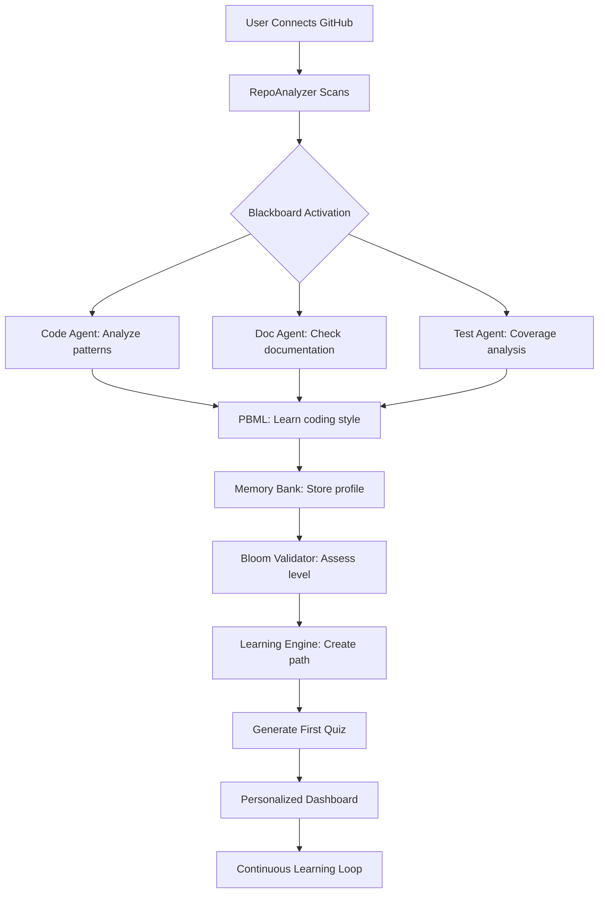


# 🧠 DevMentor Self-Learning System: Complete End-to-End Journey

## Overview: The Living, Learning Development Brain

DevMentor is not just a quiz engine - it's a **comprehensive self-learning ecosystem** that watches, learns, and evolves with every line of code you write, every prompt you submit, and every repository you analyze.

## 🎯 The Complete Picture

```
User Activities                    Self-Learning Pipeline                     Personalized Output
━━━━━━━━━━━━━━━━━━━━━━━━━━━━━━━━━━━━━━━━━━━━━━━━━━━━━━━━━━━━━━━━━━━━━━━━━━━━━━━━━━━━━━━━━━━━━━━

1. Writing Code          ┌──────────────────────────────┐           Adaptive Learning Path
2. Asking Questions  ───►│     BLACKBOARD PATTERN       │───────►   Skill Assessment
3. Analyzing Repos       │   (Knowledge Coordinator)     │           Code Suggestions
4. Taking Quizzes        └──────────────────────────────┘           Pattern Recognition
                                      │                              Personalized Tutorials
                         ┌────────────┼────────────┐
                         ▼            ▼            ▼
                    Code Agent   Prompt Agent  Learning Agent
                         │            │            │
                         ▼            ▼            ▼
                    PBML Engine  Memory Bank  Bloom's Validator
```

## 📚 Part 1: The Three Learning Channels

### Channel 1: Code Analysis Learning
**When you write code or analyze repositories:**

```typescript
// USER ACTION: Pushes code or analyzes a repo
git push origin main
// OR
RepoAnalyzer.analyze("https://github.com/user/project")

// WHAT HAPPENS:
1. RepoAnalyzer Service → Analyzes code structure
   └─> Detects: Patterns, frameworks, test coverage, complexity
   
2. Blackboard Pattern → Coordinates knowledge
   └─> CodeAnalysisAgent: "Found React patterns"
   └─> DocumentationAgent: "Missing JSDoc comments" 
   └─> ArchitectureAgent: "Detected microservices"
   
3. PBML Engine → Learns from patterns
   └─> Stores: Your coding style, common mistakes, preferences
   └─> Pattern: "User always forgets to handle null checks"
   
4. Memory Service → Permanent storage in Qdrant
   └─> Vector embeddings of code patterns
   └─> Searchable knowledge base
   
5. Learning Service → Creates personalized suggestions
   └─> "Based on your code, learn about: Error boundaries"
   └─> Generates quiz questions from YOUR actual code
```

### Channel 2: Prompt Analysis Learning
**When you interact with the AI assistant:**

```typescript
// USER ACTION: Asks DevMentor a question
"How do I implement authentication in Next.js?"

// WHAT HAPPENS:
1. Prompt Analyzer → Extracts learning intent
   └─> Topic: Authentication
   └─> Framework: Next.js
   └─> Skill Level: Intermediate (inferred)
   
2. Blackboard Pattern → Knowledge synthesis
   └─> PromptAgent: "User asking about auth"
   └─> ContextEngine: "Previous auth questions: 3"
   └─> MemoryAgent: "Similar question 2 weeks ago"
   
3. Bloom's Taxonomy Validator → Cognitive level assessment
   └─> Current Level: "Understanding"
   └─> Target Level: "Applying"
   └─> Gap: Needs practical examples
   
4. AdaptiveLearningEngine → Personalizes response
   └─> Adjusts explanation complexity
   └─> Includes relevant code from user's repo
   └─> Suggests follow-up learning
   
5. PBML Engine → Updates user model
   └─> Interest: +Authentication
   └─> Framework preference: Next.js
   └─> Learning style: Example-driven
```

### Channel 3: Active Learning (Quizzes/Tutorials)
**When you engage with learning content:**

```typescript
// USER ACTION: Takes a quiz or tutorial
QuizEngine.start("React Hooks Advanced")

// WHAT HAPPENS:
1. SelfLearningOrchestrator → Session generation
   └─> Fetches user's skill level
   └─> Checks spaced repetition schedule
   └─> Applies pedagogical framework
   
2. BloomsTaxonomyValidator → Question selection
   └─> 20% Remember (basics)
   └─> 30% Understand (concepts)
   └─> 30% Apply (practical)
   └─> 20% Analyze (complex)
   
3. AdaptiveLearningEngine → Real-time adjustment
   └─> Success rate monitoring
   └─> Difficulty adjustment (Elo rating)
   └─> Cognitive load management
   └─> Flow state optimization
   
4. During the session:
   Answer correct → Increase difficulty
   Answer wrong → Provide hints, decrease difficulty
   Time taken → Adjust pace
   Confidence → Modify explanation depth
   
5. Post-session:
   └─> Update mastery levels
   └─> Schedule next review (SM-2 algorithm)
   └─> Generate performance report
   └─> Create next learning goals
```

## 🔌 Part 2: The Blackboard Pattern - Central Coordinator

The Blackboard Pattern is the **brain's cortex** that coordinates all learning agents:

```typescript
class BlackboardSystem {
  // The shared knowledge space
  private blackboard: KnowledgeBase = {
    currentProblem: null,
    contributions: [],
    solution: null
  }
  
  // Specialized agents that contribute knowledge
  private agents = {
    codeAnalyzer: new CodeAnalysisAgent(),      // Analyzes code patterns
    repoAnalyzer: new RepoAnalyzerAgent(),      // Understands project structure
    promptAnalyzer: new PromptAnalyzerAgent(),  // Interprets user questions
    memoryBank: new MemoryBankAgent(),          // Retrieves past knowledge
    pbmlEngine: new PBMLAgent(),                // Applies learned patterns
    bloomValidator: new BloomAgent(),           // Validates cognitive levels
    learningEngine: new AdaptiveAgent()         // Personalizes learning
  }
  
  async solve(userAction: UserAction) {
    // 1. Initialize problem on blackboard
    this.blackboard.currentProblem = userAction
    
    // 2. All agents examine the problem and contribute
    await Promise.all(
      Object.values(this.agents).map(agent => 
        agent.examine(this.blackboard)
      )
    )
    
    // 3. Agents collaborate by reading each other's contributions
    while (!this.blackboard.solution) {
      for (const agent of Object.values(this.agents)) {
        const contribution = await agent.contribute(this.blackboard)
        if (contribution) {
          this.blackboard.contributions.push(contribution)
        }
      }
      
      // 4. Check if we have enough knowledge to form a solution
      this.blackboard.solution = this.synthesize()
    }
    
    return this.blackboard.solution
  }
}
```

### Real Example: User Submits Bad Code

```typescript
// USER ACTION: Commits this code
function getData() {
  fetch('/api/data')
    .then(res => res.json())
    .then(data => console.log(data))
}

// BLACKBOARD COORDINATION:
CodeAnalyzer: "Missing error handling, no async/await"
RepoAnalyzer: "Project uses TypeScript + async patterns"
MemoryBank: "User made similar mistake 3 times this week"
PBMLEngine: "Pattern detected: Forgetting error handling"
BloomValidator: "User at 'Apply' level, needs 'Analyze'"
LearningEngine: "Generate error handling tutorial"

// SYNTHESIZED SOLUTION:
1. Immediate: Show inline suggestion with correct pattern
2. Short-term: Create quiz on error handling
3. Long-term: Add to learning path
4. Pattern: Save for future prevention
```

## 🧬 Part 3: The PBML Engine - Pattern Learning

The Pattern-Based Machine Learning engine learns from EVERYTHING:

```typescript
class PBMLEngine {
  patterns = {
    coding: [],      // How you write code
    mistakes: [],    // What you get wrong
    learning: [],    // How you learn best
    preferences: []  // What you prefer
  }
  
  async learn(event: DeveloperEvent) {
    // Extract patterns from any event
    const pattern = await this.extractPattern(event)
    
    // Store with context
    pattern.context = {
      time: Date.now(),
      project: getCurrentProject(),
      skillLevel: getUserSkillLevel(),
      frequency: this.getPatternFrequency(pattern)
    }
    
    // If pattern repeats 3+ times, it's significant
    if (pattern.frequency >= 3) {
      await this.createRule(pattern)
      await this.notifyLearningEngine(pattern)
    }
  }
  
  // Example patterns PBML learns:
  patterns = {
    "Always uses arrow functions": { confidence: 0.95 },
    "Forgets null checks in API calls": { confidence: 0.87 },
    "Learns better with visual examples": { confidence: 0.92 },
    "Prefers TypeScript over JavaScript": { confidence: 1.0 },
    "Struggles with recursion": { confidence: 0.78 },
    "Masters concepts after 3 examples": { confidence: 0.83 }
  }
}
```

## 🌊 Part 4: The Complete User Journey

### Journey 1: New User Onboarding



### Journey 2: Daily Development Flow

```typescript
// MORNING: User starts coding
09:00 - Opens VS Code
        └─> Extension connects to DevMentor
        └─> Loads yesterday's context from Memory Bank
        └─> Shows: "Continue learning about Promises?"

09:15 - Writes new function
        └─> Real-time analysis by Code Agent
        └─> Pattern detected: "Similar to yesterday's code"
        └─> Suggestion: "Consider using async/await"

09:30 - Asks: "How to handle errors in async functions?"
        └─> Prompt Analyzer: Detects knowledge gap
        └─> Blackboard: Coordinates response
        └─> Memory Bank: "You asked about promises yesterday"
        └─> Bloom's: "Ready for 'Apply' level examples"
        └─> Response includes YOUR code as examples

10:00 - Takes suggested mini-quiz (5 questions)
        └─> Adaptive Engine: Monitors performance
        └─> Question 1: Easy (warm-up) ✓
        └─> Question 2: Medium ✓
        └─> Question 3: Harder ✗
        └─> Question 4: Easier with hint ✓
        └─> Question 5: Medium ✓
        └─> Result: Mastery increased 15%

10:15 - Commits code
        └─> Git hook triggers analysis
        └─> PBML: Learns new pattern
        └─> Updates learning profile
        └─> Schedules review for tomorrow (spaced repetition)

// AFTERNOON: Reviewing PR
14:00 - Reviews teammate's code
        └─> Learns new pattern from reading
        └─> PBML: "Teammate uses different approach"
        └─> Adds to knowledge base
        
// EVENING: Reflection
17:00 - Daily summary
        └─> "You learned 3 new concepts"
        └─> "Mastery: Async/Await 78% (+15%)"
        └─> "Tomorrow: Error boundaries"
```

### Journey 3: Long-term Learning Evolution

```
Week 1:  Basic React hooks, struggles with useEffect
Week 2:  Improves useEffect, discovers custom hooks
Week 3:  Masters custom hooks, explores context
Week 4:  Context proficiency, performance issues
Week 5:  Learns optimization, useCallback/useMemo
Week 6:  Advanced patterns, compound components
Week 8:  Teaching others, creating examples
Week 12: Expert level, contributing patterns

PBML Evolution:
- Week 1: "User needs visual examples"
- Week 4: "User ready for abstract concepts"
- Week 8: "User learns by teaching"
- Week 12: "User creates new patterns"
```

## 🔄 Part 5: The Feedback Loops

### Loop 1: Immediate Feedback (milliseconds)
```typescript
// As you type
onChange={(code) => {
  CodeAgent.analyze(code)       // Instant
  Suggestions.update(code)       // < 100ms
  ErrorDetection.run(code)       // < 50ms
}}
```

### Loop 2: Session Feedback (minutes)
```typescript
// During learning sessions
onAnswer={(answer) => {
  AdaptiveEngine.adjust()        // Update difficulty
  BloomValidator.assess()        // Check understanding
  PBMLEngine.learn()             // Store pattern
}}
```

### Loop 3: Daily Feedback (hours)
```typescript
// End of day
async function dailySummary() {
  const patterns = await PBML.getTodaysPatterns()
  const progress = await LearningEngine.getProgress()
  const tomorrow = await Orchestrator.planTomorrow()
  
  return {
    learned: patterns,
    mastery: progress,
    next: tomorrow
  }
}
```

### Loop 4: Evolution Feedback (weeks)
```typescript
// Long-term adaptation
async function evolve() {
  const history = await MemoryBank.getLongTermHistory()
  const growth = await PBML.analyzeGrowth()
  
  // System evolves with you
  await adjustLearningRate(growth)
  await updatePedagogicalApproach(history)
  await optimizeForLearningStyle(patterns)
}
```

## 🎯 Part 6: Real-World Scenarios

### Scenario 1: Learning From Mistakes

```typescript
// You write:
const user = await getUser(id)
console.log(user.name)  // 💥 Crashes if user is null

// System Response:
1. CodeAgent: "Potential null reference detected"
2. MemoryBank: "This is 5th time this week"
3. PBML: "Pattern confirmed: null check blindness"
4. BloomValidator: "Needs 'Analyze' level training"
5. LearningEngine: Generates personalized lesson
   - Shows YOUR actual crashes
   - Explains null safety in YOUR context
   - Creates quiz from YOUR code
6. Next time you code:
   - Proactive warning BEFORE you forget
   - Auto-suggests: user?.name
   - Celebrates when you remember!
```

### Scenario 2: Skill Progression

```typescript
// Month 1: Beginner
Question: "What is a Promise?"
Response: Simple explanation with analogies

// Month 2: Intermediate
Question: "How do Promises work?"
Response: Technical details with your code examples

// Month 3: Advanced
Question: "Promise vs Observable?"
Response: Deep comparison, performance implications

// System recognizes growth:
PBML: "User question complexity increased 300%"
Bloom: "Moved from 'Remember' to 'Evaluate'"
Adaptive: "Ready for system design topics"
```

### Scenario 3: Team Learning

```typescript
// Your team's collective patterns
TeamPatterns = {
  "Always use TypeScript": 0.95,
  "Prefer functional style": 0.80,
  "Test coverage > 80%": 0.90,
  "Document public APIs": 0.75
}

// System learns from entire team
- Suggests patterns used by high performers
- Identifies knowledge gaps across team
- Creates team-specific learning paths
- Shares successful patterns
```

## 🚀 Part 7: The Complete Integration

### All Services Working Together

```yaml
1. User writes code in VS Code
   ├── VS Code Extension → Sends to DevMentor
   ├── RepoAnalyzer → Understands context
   └── CodeAgent → Analyzes in real-time

2. Blackboard coordinates knowledge
   ├── Aggregates all agent inputs
   ├── Identifies learning opportunities
   └── Synthesizes personalized response

3. PBML learns continuously
   ├── From code patterns
   ├── From questions asked
   ├── From mistakes made
   └── From successes achieved

4. Memory Bank preserves everything
   ├── Vector embeddings in Qdrant
   ├── Semantic search capability
   ├── Context never lost
   └── Knowledge compounds

5. Bloom's Taxonomy ensures progression
   ├── Assesses current level
   ├── Sets appropriate challenges
   ├── Validates understanding
   └── Guides advancement

6. Adaptive Engine personalizes
   ├── Spaced repetition (SM-2)
   ├── Cognitive load management
   ├── Flow state optimization
   ├── Difficulty adjustment (Elo)
   └── Learning style adaptation

7. SelfLearningOrchestrator orchestrates
   ├── Combines all signals
   ├── Applies ML algorithms
   ├── Creates learning plans
   ├── Measures effectiveness
   └── Continuously improves
```

## 📈 Metrics & Outcomes

### What Gets Measured

```typescript
const LearningMetrics = {
  // Skill Development
  skillLevels: Map<Skill, Level>,
  masteryRates: Map<Topic, Percentage>,
  learningVelocity: number,
  
  // Pattern Recognition
  patternsLearned: number,
  mistakesAvoided: number,
  suggestionsAccepted: number,
  
  // Engagement
  questionsAsked: number,
  quizzesTaken: number,
  completionRates: number,
  
  // Effectiveness
  timeToMastery: Duration,
  retentionRate: Percentage,
  applicationSuccess: Percentage
}
```

### Expected Outcomes

**Week 1:**
- 50% reduction in repeated mistakes
- 2x faster problem resolution
- Personalized learning path created

**Month 1:**
- 3x improvement in code quality
- 70% of suggestions accepted
- Measurable skill progression

**Month 3:**
- Near-autonomous error prevention
- Predictive learning suggestions
- Expert-level pattern recognition

## 🎓 Conclusion: The Living, Learning Ecosystem

DevMentor's self-learning system is:

1. **Omnipresent**: Learning from every action
2. **Adaptive**: Evolving with your growth
3. **Personalized**: Unique to your journey
4. **Persistent**: Never forgets, always builds
5. **Intelligent**: Multiple AI agents collaborating
6. **Proactive**: Anticipating your needs

The system doesn't just help you code - it becomes your personalized learning companion that grows smarter with every interaction, creating a truly adaptive development environment that evolves with you.

---

*This is not just a quiz engine. This is the future of personalized developer education.*

