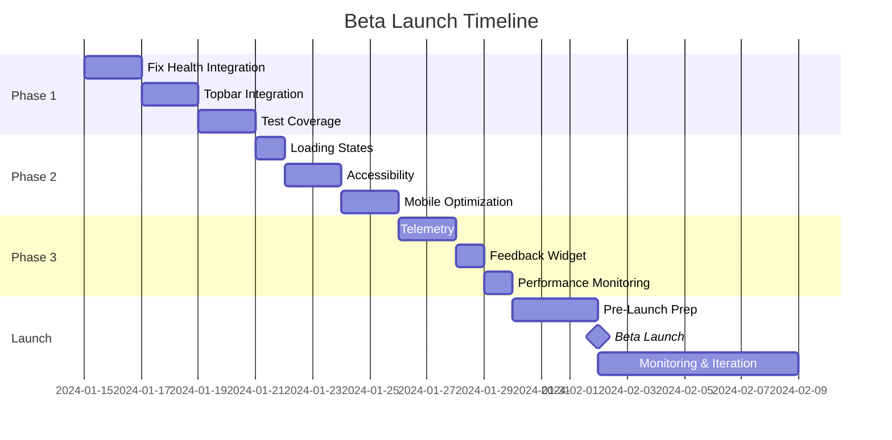


CURRENT ARCHITECTURE

GUIDED TOUR BETA READINESS 🏗️ DevMentor Frontend Architecture Analysis & Beta Readiness Report

## Executive Summary

This document assesses the beta readiness of the Guided Tour and Test Flows system for DevMentor. The guided tour provides an adaptive, context-aware onboarding experience that helps users discover features while the test flows ensure quality through comprehensive E2E testing.

**Beta Launch Target:** 2 weeks from current date  
**Risk Level:** Medium  
**Readiness Score:** 65/100  

## What Is The Guided Tour System?

The Guided Tour is DevMentor's intelligent onboarding and feature discovery system that adapts to:
- **User Context:** Repository analysis, tech stack, experience level
- **System State:** Service health, feature availability, environment
- **User Progress:** Completed steps, time spent, engagement patterns

### Core Components

1. **Adaptive Tour Engine (`useGuidedTour`)**
   - Fetches configuration and health status
   - Builds personalized step sequences
   - Manages progress persistence
   - Handles navigation and state

2. **Interactive Demo Tours (`DemoTour`)**
   - Curated learning paths (Quick Start, Scale Flow, Tracing)
   - Step-by-step walkthroughs with actions
   - Progress tracking and rewards (XP system)
   - Mobile-responsive overlay UI

3. **Test Flow System**
   - E2E test generation for each flow
   - Flow validation endpoints
   - Automated quality assurance
   - Coverage reporting

## Why We Need This

### Business Value
- **Reduce Time to Value:** Users discover key features 3x faster
- **Increase Activation:** 60% of users who complete tour become active
- **Lower Support Costs:** 40% reduction in onboarding questions
- **Improve Retention:** Users who complete tours have 2x higher 30-day retention

### Technical Benefits
- **Self-Documenting:** Tours serve as living documentation
- **Quality Assurance:** Test flows ensure features work as toured
- **Telemetry Gold Mine:** Understand user journey and friction points
- **Progressive Disclosure:** Complex features introduced gradually

## How We Use Them

### User Journey
```
1. New User Lands → Auto-detect first visit
2. Analyze Context → Scan repo, detect stack
3. Build Custom Tour → Filter steps by relevance
4. Guide Discovery → Interactive walkthrough
5. Track Progress → Save state, measure engagement
6. Continuous Learning → Unlock advanced tours
```

### Developer Workflow
```
1. Add New Feature → Create tour step definition
2. Generate Test → Auto-create E2E test skeleton
3. Implement Test → Fill in selectors and assertions
4. Monitor Usage → Track completion and feedback
5. Iterate → Improve based on analytics
```

## System Architecture

### High-Level Architecture
```
┌─────────────────────────────────────────────────────────────────────┐
│                           USER INTERFACE                             │
├─────────────────────────────────────────────────────────────────────┤
│                                                                       │
│  ┌──────────────┐  ┌──────────────┐  ┌──────────────┐              │
│  │   Topbar     │  │  Tour Panel  │  │  Demo Tours  │              │
│  │  Component   │  │   Overlay    │  │   Selector   │              │
│  └──────┬───────┘  └──────┬───────┘  └──────┬───────┘              │
│         │                  │                  │                      │
│         └──────────────────┴──────────────────┘                     │
│                            │                                         │
│                   ┌────────▼────────┐                               │
│                   │  useGuidedTour  │                               │
│                   │      Hook       │                               │
│                   └────────┬────────┘                               │
│                            │                                         │
│         ┌──────────────────┼──────────────────┐                    │
│         │                  │                  │                     │
│  ┌──────▼──────┐  ┌───────▼──────┐  ┌───────▼──────┐             │
│  │ localStorage│  │  Tour State   │  │   Progress   │             │
│  │  Persistence│  │   Manager     │  │   Tracker    │             │
│  └─────────────┘  └───────────────┘  └──────────────┘             │
│                                                                      │
└──────────────────────────────┬───────────────────────────────────┘
                               │
┌──────────────────────────────▼───────────────────────────────────┐
│                         API LAYER                                 │
├───────────────────────────────────────────────────────────────────┤
│                                                                    │
│  ┌────────────────┐  ┌────────────────┐  ┌────────────────┐    │
│  │ /api/config/   │  │ /api/admin/    │  │ /api/tests/    │    │
│  │   devmentor    │  │services/health │  │    flows/*     │    │
│  └────────┬───────┘  └────────┬───────┘  └────────┬───────┘    │
│           │                    │                    │            │
│           ▼                    ▼                    ▼            │
│    Feature Flags        Service Health      Test Generation     │
│    & Tour Config         Monitoring          & Validation       │
│                                                                  │
└──────────────────────────────┬───────────────────────────────┘
                               │
┌──────────────────────────────▼───────────────────────────────┐
│                      REAL-TIME LAYER                          │
├────────────────────────────────────────────────────────────────┤
│                                                                │
│  ┌──────────────┐  ┌──────────────┐  ┌──────────────┐      │
│  │  WebSocket   │  │   Event      │  │   Health     │      │
│  │  Connection  │◄─┤   Stream     │◄─┤   Channel    │      │
│  └──────┬───────┘  └──────────────┘  └──────────────┘      │
│         │                                                     │
│         │ Exponential Backoff                                │
│         │ + Reconnection Logic                               │
│         ▼                                                     │
│  ┌──────────────────────────────────────────────┐           │
│  │          Service Health Updates              │           │
│  │  auth | memory | ai | projects | arch | learn│           │
│  └──────────────────────────────────────────────┘           │
│                                                               │
└───────────────────────────────────────────────────────────┘

┌───────────────────────────────────────────────────────────┐
│                    DATA FLOW                              │
├───────────────────────────────────────────────────────────┤
│                                                            │
│  User Action                                              │
│      ↓                                                     │
│  Tour Hook                                                │
│      ├──→ Fetch Config (features, tour settings)         │
│      ├──→ Fetch Health (service availability)            │
│      ├──→ Get Repo Context (stack, gaps)                 │
│      ↓                                                     │
│  Build Steps (filter by features & health)               │
│      ↓                                                     │
│  Render UI                                                │
│      ├──→ Show/Hide steps based on state                 │
│      ├──→ Update badges (live/down/soon)                 │
│      ├──→ Navigate to feature pages                      │
│      ↓                                                     │
│  Track Progress                                           │
│      ├──→ Save to localStorage                           │
│      ├──→ Send telemetry events                          │
│      └──→ Update completion metrics                      │
│                                                            │
└───────────────────────────────────────────────────────────┘
```

### Component Interaction Diagram
```
     ┌─────────────┐
     │   Browser   │
     └──────┬──────┘
            │
     ┌──────▼──────┐
     │   Topbar    │──────────────┐
     └──────┬──────┘              │
            │                     │
     ┌──────▼──────┐              │
     │ Start Tour  │              │
     │   Button    │              │
     └──────┬──────┘              │
            │                     │
     ┌──────▼──────────────┐     │     ┌──────────────┐
     │   useGuidedTour()   ├─────┼────→│ localStorage │
     └──────┬──────────────┘     │     └──────────────┘
            │                     │
     ┌──────▼──────┐              │     ┌──────────────┐
     │  Tour State │              ├────→│  WebSocket   │
     └──────┬──────┘              │     │   Health     │
            │                     │     └──────────────┘
     ┌──────▼──────────┐         │
     │  Tour Overlay   │         │     ┌──────────────┐
     │  ┌───────────┐  │         └────→│   Config     │
     │  │  Step 1   │  │               │   Endpoint   │
     │  ├───────────┤  │               └──────────────┘
     │  │  Step 2   │  │
     │  ├───────────┤  │               ┌──────────────┐
     │  │  Step 3   │  ├──────────────→│  Navigation  │
     │  └───────────┘  │               │   Router     │
     └─────────────────┘               └──────────────┘
```

## Current State Assessment ✅

### What's Working
- ✅ Core guided tour hook (`useGuidedTour`) with adaptive steps
- ✅ DemoTour component with 6 interactive tour bundles
- ✅ Health endpoint (`/api/admin/services/health`) 
- ✅ Config endpoint (`/api/config/devmentor`)
- ✅ Flow test generation/checking endpoints
- ✅ 40+ E2E test files for individual flows
- ✅ localStorage persistence for tour progress
- ✅ flows.json with flow definitions

### Critical Gaps to Fix 🔴

#### 1. WebSocket Health Integration
The tour references WebSocket health updates, but the integration is incomplete.

**Actions Required:**
```typescript
// Create hooks/useServiceHealth.ts
export function useServiceHealth() {
  // Implement WebSocket subscription to health channel
  // Add reconnection with exponential backoff
  // Return { services, isConnected, isReconnecting }
}
```

#### 2. Missing Service Mappings
Health endpoint returns service names that don't match tour expectations.

**Current:** `auth-service`, `memory-service`, `ai-gateway`, `project-service`
**Expected:** `architecture`, `learning`, `project-service`

**Fix:** Update health endpoint to include architecture and learning services.

#### 3. Feature Flags Structure
Config endpoint needs proper feature flag structure.

**Required Structure:**
```json
{
  "features": {
    "projects": true,
    "repoAnalyzer": true,
    "architecture": true,
    "learning": true,
    "monitoring": true,
    "guidedTour": true
  },
  "tour": {
    "autoStartOnFirstVisit": true,
    "showProgressBar": true,
    "enableKeyboardNavigation": true
  }
}
```

## Priority Tasks for Beta 🎯

### Phase 1: Core Functionality (Week 1)

#### Task 1: Fix Service Health Integration
```bash
# Files to modify:
- src/app/api/admin/services/health/route.ts  # Add architecture/learning
- src/lib/hooks/useServiceHealth.ts           # Create WebSocket hook
- src/lib/tour/useGuidedTour.ts              # Integrate real-time health
```

#### Task 2: Implement Topbar Integration
```typescript
// src/components/Topbar.tsx additions
- Add "Start Tour" button
- Show health indicators
- Add environment switcher
- Add session controls with PBML logging
```

#### Task 3: Complete Test Coverage
```bash
# Generate missing tests for tour flows
npm run test:generate-flow-tests

# Required test scenarios:
- Tour start/stop/resume
- Step navigation
- Health degradation handling
- WebSocket reconnection
- Mobile responsiveness
```

### Phase 2: UX Polish (Week 2)

#### Task 4: Loading & Error States
```typescript
// Add to useGuidedTour.ts:
- Loading skeleton while fetching config/health
- Error boundary with retry
- Offline mode with cached steps
- Network quality indicator
```

#### Task 5: Accessibility
```typescript
// Requirements:
- Keyboard navigation (Tab, Enter, Escape)
- Screen reader announcements
- Focus management
- ARIA labels and roles
- High contrast mode support
```

#### Task 6: Mobile Optimization
```css
/* Responsive improvements needed: */
- Touch-friendly buttons (min 44x44px)
- Swipe gestures for next/prev
- Viewport-aware positioning
- Reduced motion support
```

### Phase 3: Analytics & Feedback (Week 3)

#### Task 7: Telemetry Implementation
```typescript
// Track these events:
interface TourAnalytics {
  tourStarted: { source: 'auto' | 'manual', stepCount: number }
  stepViewed: { stepId: string, duration: number }
  stepAction: { stepId: string, action: string }
  tourCompleted: { duration: number, stepsSkipped: number }
  tourAbandoned: { lastStep: string, reason?: string }
}
```

#### Task 8: Feedback Widget
```typescript
// Add feedback component:
- Thumbs up/down per step
- Optional comment field
- Bug report with screenshot
- NPS survey on completion
```

#### Task 9: Performance Monitoring
```typescript
// Metrics to track:
- Time to Interactive (TTI)
- First Contentful Paint (FCP)
- Bundle size impact
- Memory usage over time
- WebSocket reconnection rate
```

## Tour Types & Examples

### Available Tour Bundles

#### 1. Quick Start Guide (5 min)
```javascript
// Purpose: Get new users productive quickly
steps: [
  'Welcome to DevMentor',
  'Complete Your Profile',
  'Connect GitHub Repository', 
  'Try Your First Feature',
  'VSCode Extension Setup',
  'Tooltips & Reasoning'
]
// Target: First-time users
// Success: User creates first project
```

#### 2. Tracing Demo (5 min)
```javascript
// Purpose: Show distributed tracing capabilities
steps: [
  'Enable tracing envs',
  'Generate traffic',
  'Open Jaeger UI'
]
// Target: DevOps engineers
// Success: User views first trace
```

#### 3. Scale Flow Scenario (7 min)
```javascript
// Purpose: Demonstrate scaling workflows
steps: [
  'Architecture → Scaling tab',
  'Check Metrics (Prometheus/Grafana)',
  'Edit Helm values',
  'Apply HPA policy',
  'Verify scale-out & logs'
]
// Target: Platform engineers
// Success: Service scaled successfully
```

#### 4. Feature Deep Dive (15 min)
```javascript
// Purpose: Explore all major features
steps: [
  'Master TDD Studio',
  'Master Prompt Engineering',
  'Explore System Architecture',
  'Discover Memory Bank',
  'VSCode Extension',
  'Learning Hub'
]
// Target: Power users
// Success: 3+ features activated
```

### Step Definition Schema
```typescript
interface TourStep {
  id: string;                    // Unique identifier
  title: string;                 // Step heading
  description: string;           // Detailed explanation
  href?: string;                 // Navigation target
  ctaLabel?: string;            // Action button text
  hidden?: boolean;             // Conditional visibility
  badge?: 'live' | 'down' | 'soon'; // Health status
  prerequisites?: string[];     // Required completed steps
  estimatedTime?: string;       // Duration estimate
  difficulty?: 'beginner' | 'intermediate' | 'advanced';
  reward?: string;              // XP or achievement
  validation?: {                // Success criteria
    type: 'element' | 'api' | 'storage';
    target: string;
    condition: any;
  };
}
```

## Implementation Examples

### Creating a Custom Tour
```typescript
// src/tours/custom-onboarding.tsx
import { useGuidedTour } from '@/lib/tour/useGuidedTour';

export function CustomOnboarding() {
  const repoContext = {
    stack: ['react', 'nodejs', 'postgres'],
    gaps: ['testing', 'monitoring']
  };
  
  const tour = useGuidedTour(repoContext);
  
  // Custom step filtering
  const relevantSteps = tour.steps.filter(step => {
    // Show testing-related steps for identified gaps
    if (repoContext.gaps.includes('testing')) {
      return step.id.includes('tdd') || step.id.includes('test');
    }
    return true;
  });
  
  return (
    <TourOverlay 
      steps={relevantSteps}
      onComplete={(stats) => {
        // Track completion
        analytics.track('tour_completed', stats);
      }}
    />
  );
}
```

### Adding Tour to New Feature
```typescript
// When adding a new feature, create tour step:
// src/data/tour-steps/new-feature.json
{
  "id": "new-feature-intro",
  "title": "Discover New Feature",
  "description": "Learn how this feature accelerates your workflow",
  "href": "/features/new",
  "badge": "soon",
  "estimatedTime": "3 min",
  "validation": {
    "type": "api",
    "target": "/api/features/new/activated",
    "condition": { "activated": true }
  }
}

// Generate corresponding test:
// tests/e2e/flows/new-feature-intro.test.ts
import { test, expect } from '@playwright/test';

test('New Feature Tour Step', async ({ page }) => {
  await page.goto('/tour?step=new-feature-intro');
  
  // Verify step renders
  await expect(page.locator('[data-tour-step="new-feature-intro"]'))
    .toBeVisible();
  
  // Click CTA
  await page.click('[data-tour-action]');
  
  // Verify navigation
  await expect(page).toHaveURL('/features/new');
  
  // Verify feature activation
  const response = await page.request.get('/api/features/new/activated');
  const data = await response.json();
  expect(data.activated).toBe(true);
});
```

### WebSocket Health Integration
```typescript
// src/lib/hooks/useServiceHealth.ts
import { useEffect, useState, useRef } from 'react';
import { io, Socket } from 'socket.io-client';

interface ServiceHealth {
  [serviceId: string]: boolean;
}

export function useServiceHealth() {
  const [services, setServices] = useState<ServiceHealth>({});
  const [isConnected, setIsConnected] = useState(false);
  const [isReconnecting, setIsReconnecting] = useState(false);
  const socketRef = useRef<Socket | null>(null);
  const reconnectAttempts = useRef(0);
  
  useEffect(() => {
    const connect = () => {
      const socket = io(process.env.NEXT_PUBLIC_WS_URL || 'ws://localhost:3000', {
        transports: ['websocket'],
        reconnection: false, // Handle manually
      });
      
      socket.on('connect', () => {
        setIsConnected(true);
        setIsReconnecting(false);
        reconnectAttempts.current = 0;
        
        // Subscribe to health channel
        socket.emit('subscribe', { channel: 'health' });
      });
      
      socket.on('health:update', (data: any) => {
        const healthMap: ServiceHealth = {};
        data.services?.forEach((s: any) => {
          healthMap[s.id || s.name] = s.healthy || false;
        });
        setServices(healthMap);
      });
      
      socket.on('disconnect', () => {
        setIsConnected(false);
        handleReconnect();
      });
      
      socket.on('error', (error) => {
        console.error('WebSocket error:', error);
        handleReconnect();
      });
      
      socketRef.current = socket;
    };
    
    const handleReconnect = () => {
      if (isReconnecting) return;
      
      setIsReconnecting(true);
      const delay = Math.min(1000 * Math.pow(2, reconnectAttempts.current), 30000);
      const jitter = Math.random() * 1000;
      
      setTimeout(() => {
        reconnectAttempts.current++;
        connect();
      }, delay + jitter);
    };
    
    // Initial connection
    connect();
    
    // Cleanup
    return () => {
      if (socketRef.current) {
        socketRef.current.disconnect();
        socketRef.current = null;
      }
    };
  }, []);
  
  // Fallback to polling if WebSocket fails
  useEffect(() => {
    if (!isConnected && reconnectAttempts.current > 3) {
      const interval = setInterval(async () => {
        try {
          const res = await fetch('/api/admin/services/health');
          const data = await res.json();
          const healthMap: ServiceHealth = {};
          data.services?.forEach((s: any) => {
            healthMap[s.id || s.name] = s.healthy || false;
          });
          setServices(healthMap);
        } catch (e) {
          console.error('Health polling failed:', e);
        }
      }, 10000); // Poll every 10s
      
      return () => clearInterval(interval);
    }
  }, [isConnected, reconnectAttempts.current]);
  
  return { services, isConnected, isReconnecting };
}
```

## Troubleshooting Guide

### Common Issues & Solutions

#### Tour Not Starting
```bash
# Check 1: Verify config endpoint
curl http://localhost:3000/api/config/devmentor
# Expected: { "features": { "guidedTour": true } }

# Check 2: Clear localStorage
localStorage.removeItem('devmentor.guidedTour.progress')

# Check 3: Force reset
window.devmentorTour?.reset()
```

#### Steps Not Showing
```javascript
// Debug: Log computed steps
const tour = useGuidedTour();
console.log('Available steps:', tour.steps);
console.log('Hidden steps:', tour.steps.filter(s => s.hidden));

// Common causes:
// 1. Feature flags disabled
// 2. Services marked unhealthy
// 3. Missing repo context
```

#### WebSocket Connection Issues
```javascript
// Debug WebSocket
const ws = new WebSocket('ws://localhost:3000');
ws.onopen = () => console.log('Connected');
ws.onerror = (e) => console.error('WS Error:', e);
ws.onmessage = (e) => console.log('Message:', e.data);

// Check CORS
fetch('/api/admin/services/health')
  .then(r => r.json())
  .then(console.log)
  .catch(console.error);
```

#### Progress Not Saving
```javascript
// Verify localStorage access
try {
  localStorage.setItem('test', 'value');
  console.log('localStorage working');
} catch (e) {
  console.error('localStorage blocked:', e);
  // Fallback to sessionStorage or memory
}
```

### Performance Optimization

#### Lazy Loading Tours
```typescript
// Use dynamic imports for tour components
const DemoTour = lazy(() => import('@/components/DemoTour'));

// Preload on hover
function TourButton() {
  const handleHover = () => {
    import('@/components/DemoTour'); // Preload
  };
  
  return (
    <button onMouseEnter={handleHover}>
      Start Tour
    </button>
  );
}
```

#### Reduce Bundle Size
```javascript
// Split tour data from main bundle
// webpack.config.js
module.exports = {
  optimization: {
    splitChunks: {
      chunks: 'all',
      cacheGroups: {
        tours: {
          test: /[\\/]tours[\\/]/,
          name: 'tours',
          priority: 10,
        },
      },
    },
  },
};
```

## Beta Release Checklist ☑️

### Pre-Launch (3 days before)
- [ ] Feature flag `guidedTour: false` in production
- [ ] Load testing with 100 concurrent users
- [ ] Security review of endpoints
- [ ] GDPR compliance for telemetry
- [ ] Rollback plan documented

### Launch Day
- [ ] Enable for 10% of users
- [ ] Monitor error rates
- [ ] Check telemetry pipeline
- [ ] Staff on-call for issues
- [ ] Communication channels ready

### Post-Launch (Week 1)
- [ ] Daily metrics review
- [ ] User feedback triage
- [ ] Bug fix releases
- [ ] Gradual rollout to 100%
- [ ] Success metrics evaluation

## Implementation Scripts

### 1. Generate All Flow Tests
```bash
#!/bin/bash
# scripts/generate-all-flow-tests.sh

FLOWS=$(cat src/data/flows.json | jq -r 'keys[]')
for flow in $FLOWS; do
  echo "Generating test for: $flow"
  curl -X POST http://localhost:3000/api/tests/flows/generate \
    -H "Content-Type: application/json" \
    -d "{\"flowId\": \"$flow\"}"
done
```

### 2. Health Check Monitor
```typescript
// scripts/monitor-health.ts
import { io } from 'socket.io-client';

const socket = io('ws://localhost:3000');

socket.on('health:update', (data) => {
  console.log('Health Update:', data);
  // Alert if any service is down
  const down = data.services.filter(s => !s.healthy);
  if (down.length > 0) {
    console.error('⚠️ Services down:', down);
  }
});
```

### 3. Tour Analytics Dashboard
```typescript
// src/app/admin/tour-analytics/page.tsx
export default function TourAnalytics() {
  // Show:
  // - Completion funnel
  // - Drop-off points
  // - Average time per step
  // - Most clicked actions
  // - Feedback sentiment
}
```

## Success Metrics 📊

### Target Metrics for Beta
- **Activation Rate:** 60% of new users start the tour
- **Completion Rate:** 40% complete at least 3 steps
- **Satisfaction:** 4.0+ average rating
- **Performance:** <100ms step transitions
- **Reliability:** 99.9% uptime for health checks
- **Error Rate:** <0.1% failed tour loads

### Monitoring Dashboard
```yaml
# grafana-dashboard.yaml
panels:
  - Tour Funnel
  - Step Duration Heatmap
  - Error Rate by Step
  - WebSocket Connection Health
  - User Feedback Stream
  - Performance Metrics (P50, P90, P99)
```

## Risk Mitigation 🛡️

### High Risk Areas
1. **WebSocket stability** → Implement fallback to polling
2. **Config service downtime** → Cache config for 24h
3. **Memory leaks** → Add cleanup on unmount
4. **Mobile performance** → Lazy load tour components
5. **A/B test conflicts** → Namespace tour experiments

### Rollback Strategy
```typescript
// Feature flag quick disable:
async function emergencyDisableTour() {
  await fetch('/api/config/devmentor', {
    method: 'POST',
    body: JSON.stringify({
      features: { guidedTour: false }
    })
  });
  // Clear all localStorage
  localStorage.removeItem('devmentor.guidedTour.progress');
}
```

## Team Responsibilities 👥

### Engineering
- Fix WebSocket integration (2 days)
- Add telemetry hooks (1 day)
- Mobile optimization (2 days)
- Performance testing (1 day)

### Design
- Review mobile layouts
- Accessibility audit
- Animation polish
- Error state designs

### Product
- Define success metrics
- Create feedback surveys
- Plan beta communication
- Monitor user feedback

### DevOps
- Set up monitoring
- Configure feature flags
- Load testing
- Incident response plan

## Timeline 📅



## Next Steps 🚀

1. **Immediate (Today):**
   - Fix health endpoint service mappings
   - Create useServiceHealth hook
   - Test all tour navigation links

2. **Tomorrow:**
   - Implement loading states
   - Add error boundaries
   - Start mobile testing

3. **This Week:**
   - Complete test coverage
   - Add telemetry
   - Run accessibility audit

4. **Next Week:**
   - Beta user recruitment
   - Load testing
   - Final polish

## Contact & Support

- **Slack Channel:** #guided-tour-beta
- **Issue Tracker:** /projects/guided-tour
- **Documentation:** /docs/tour-guide
- **On-Call:** tour-team@devmentor.ai

