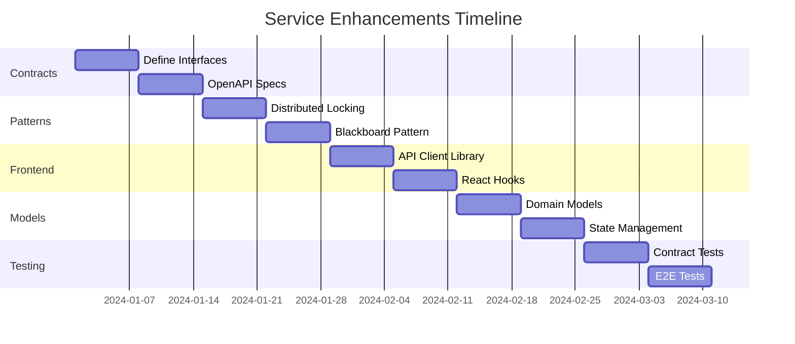


# Epic: Service Enhancements & Frontend Integration

## Epic Overview
**Epic ID**: SE-001  
**Status**: In Planning  
**Priority**: Critical  
**Timeline**: 6 weeks  
**Owner**: Platform Team  

### Goal
Enhance existing microservices with proper business contracts, architectural patterns, and create seamless integration with the frontend application.

## Current State Analysis

### What's Working ✅
- Services are deployed and running in Kubernetes
- Basic functionality exists for auth, AI, learning
- Frontend has 100+ API routes defined
- E2E test framework ready with Playwright

### Critical Gaps ❌
- No formal service contracts (interfaces)
- Missing distributed locking mechanisms
- No blackboard pattern for AI collaboration
- Frontend not connected to backend services
- No unified data models across services

## Epic Breakdown

### Sprint 1: Service Contract Definitions (Week 1-2)

#### 1.1 Define Service Interfaces
```typescript
// contracts/IAuthService.ts
export interface IAuthService {
  authenticate(credentials: Credentials): Promise<AuthToken>;
  validateToken(token: string): Promise<TokenValidation>;
  refreshToken(refreshToken: string): Promise<AuthToken>;
  revokeToken(token: string): Promise<void>;
  
  // Session management
  createSession(userId: string): Promise<Session>;
  validateSession(sessionId: string): Promise<boolean>;
  terminateSession(sessionId: string): Promise<void>;
}

// contracts/IProjectService.ts
export interface IProjectService {
  // CRUD operations
  create(data: CreateProjectDTO): Promise<Project>;
  findById(id: string): Promise<Project>;
  update(id: string, data: UpdateProjectDTO): Promise<Project>;
  delete(id: string): Promise<void>;
  
  // Claim/Release pattern
  claim(projectId: string, userId: string): Promise<ClaimToken>;
  release(token: ClaimToken): Promise<void>;
  isLocked(projectId: string): Promise<boolean>;
  
  // Collaboration
  addCollaborator(projectId: string, userId: string): Promise<void>;
  removeCollaborator(projectId: string, userId: string): Promise<void>;
}

// contracts/IAIGatewayService.ts
export interface IAIGatewayService {
  // Analysis operations
  analyzeCode(code: string, context: AnalysisContext): Promise<CodeAnalysis>;
  generateSuggestions(input: SuggestionInput): Promise<Suggestion[]>;
  
  // Blackboard collaboration
  initializeBlackboard(problemId: string): Promise<Blackboard>;
  contributeKnowledge(blackboardId: string, knowledge: Knowledge): Promise<void>;
  synthesizeSolution(blackboardId: string): Promise<Solution>;
  
  // Chat operations
  startConversation(userId: string): Promise<Conversation>;
  sendMessage(conversationId: string, message: Message): Promise<Response>;
  streamResponse(conversationId: string): AsyncGenerator<Token>;
}

// contracts/ILearningService.ts
export interface ILearningService {
  // Learning paths
  getPath(userId: string): Promise<LearningPath>;
  updateProgress(userId: string, progress: Progress): Promise<void>;
  
  // Quiz management
  getQuiz(quizId: string): Promise<Quiz>;
  submitAnswer(quizId: string, answer: Answer): Promise<QuizResult>;
  getRecommendations(userId: string): Promise<Recommendation[]>;
}

// contracts/IMemoryService.ts
export interface IMemoryService {
  // Storage operations
  store(key: string, data: any, ttl?: number): Promise<void>;
  retrieve(key: string): Promise<any>;
  delete(key: string): Promise<void>;
  
  // Vector operations (for AI)
  storeEmbedding(id: string, vector: number[]): Promise<void>;
  findSimilar(vector: number[], limit: number): Promise<SimilarItem[]>;
  
  // Distributed cache
  invalidate(pattern: string): Promise<void>;
  flush(): Promise<void>;
}
```

#### 1.2 Implementation Tasks
- [ ] Create TypeScript interface definitions
- [ ] Generate OpenAPI specifications from interfaces
- [ ] Create mock implementations for testing
- [ ] Set up contract testing framework
- [ ] Document service contracts

### Sprint 2: Distributed Patterns Implementation (Week 2-3)

#### 2.1 Distributed Locking System
```typescript
// services/distributed-lock/RedisLockManager.ts
export class RedisLockManager implements ILockManager {
  private redis: Redis;
  private locks: Map<string, Lock>;
  
  async acquireLock(
    resource: string, 
    ttl: number = 30000
  ): Promise<Lock> {
    const lockId = uuid();
    const lockKey = `lock:${resource}`;
    
    // Use SET NX EX for atomic lock acquisition
    const acquired = await this.redis.set(
      lockKey, 
      lockId, 
      'NX', 
      'EX', 
      Math.floor(ttl / 1000)
    );
    
    if (!acquired) {
      throw new LockAcquisitionError(`Resource ${resource} is locked`);
    }
    
    const lock = new Lock(lockId, resource, ttl);
    this.locks.set(lockId, lock);
    
    // Set up auto-renewal
    lock.startAutoRenewal(this.redis);
    
    return lock;
  }
  
  async releaseLock(lock: Lock): Promise<boolean> {
    // Use Lua script for atomic release
    const script = `
      if redis.call("get", KEYS[1]) == ARGV[1] then
        return redis.call("del", KEYS[1])
      else
        return 0
      end
    `;
    
    const result = await this.redis.eval(
      script, 
      1, 
      `lock:${lock.resource}`, 
      lock.id
    );
    
    lock.stopAutoRenewal();
    this.locks.delete(lock.id);
    
    return result === 1;
  }
}
```

#### 2.2 Blackboard Pattern for AI
```typescript
// services/ai-gateway/blackboard/BlackboardSystem.ts
export class BlackboardSystem {
  private blackboard: SharedKnowledgeBase;
  private knowledgeSources: Map<string, IKnowledgeSource>;
  private controller: BlackboardController;
  private redis: Redis;
  
  async initializeProblem(problem: Problem): Promise<string> {
    const blackboardId = uuid();
    
    // Initialize shared knowledge base in Redis
    await this.redis.hset(`blackboard:${blackboardId}`, {
      problem: JSON.stringify(problem),
      status: 'initializing',
      createdAt: Date.now()
    });
    
    // Register knowledge sources (AI agents)
    this.registerKnowledgeSources([
      new CodeAnalysisAgent(),
      new DocumentationAgent(),
      new ArchitectureAgent(),
      new TestGenerationAgent()
    ]);
    
    return blackboardId;
  }
  
  async contribute(
    blackboardId: string, 
    source: string, 
    knowledge: Knowledge
  ): Promise<void> {
    // Store contribution in Redis Stream for persistence
    await this.redis.xadd(
      `blackboard:${blackboardId}:stream`,
      '*',
      'source', source,
      'knowledge', JSON.stringify(knowledge),
      'timestamp', Date.now()
    );
    
    // Notify controller of new knowledge
    await this.controller.evaluateProgress(blackboardId);
  }
  
  async synthesizeSolution(blackboardId: string): Promise<Solution> {
    // Retrieve all contributions
    const contributions = await this.redis.xrange(
      `blackboard:${blackboardId}:stream`,
      '-',
      '+'
    );
    
    // Use controller to synthesize final solution
    return this.controller.synthesize(contributions);
  }
}
```

#### 2.3 Implementation Tasks
- [ ] Implement Redis-based lock manager
- [ ] Create lock auto-renewal mechanism
- [ ] Implement blackboard pattern for AI
- [x] Set up Redis Streams for blackboard persistence
- [x] Create knowledge source interface
- [ ] Implement synthesis controller

### Sprint 3: Frontend Integration Layer (Week 3-4)

#### 3.1 API Client Library
```typescript
// frontend/lib/api/client.ts
export class DevMentorAPIClient {
  private baseURL: string;
  private websocket: WebSocket;
  private eventSource: EventSource;
  
  constructor(config: APIConfig) {
    this.baseURL = config.apiGatewayURL || 'http://localhost:8080';
    this.initializeConnections();
  }
  
  // Service proxies
  auth = new AuthServiceProxy(this);
  projects = new ProjectServiceProxy(this);
  ai = new AIServiceProxy(this);
  learning = new LearningServiceProxy(this);
  memory = new MemoryServiceProxy(this);
  
  // Real-time connections
  async connectWebSocket(): Promise<void> {
    this.websocket = new WebSocket(`${this.baseURL.replace('http', 'ws')}/ws`);
    // Set up handlers
  }
  
  async subscribeToEvents(): Promise<void> {
    this.eventSource = new EventSource(`${this.baseURL}/api/events`);
    // Set up handlers
  }
}

// frontend/lib/api/services/ProjectServiceProxy.ts
export class ProjectServiceProxy implements IProjectService {
  constructor(private client: APIClient) {}
  
  async create(data: CreateProjectDTO): Promise<Project> {
    const response = await this.client.post('/api/v1/projects', data);
    return response.data;
  }
  
  async claim(projectId: string, userId: string): Promise<ClaimToken> {
    const response = await this.client.post(
      `/api/v1/projects/${projectId}/claim`,
      { userId }
    );
    return response.data;
  }
  
  // ... other methods
}
```

#### 3.2 React Hooks for Services
```typescript
// frontend/hooks/useProject.ts
export function useProject(projectId: string) {
  const client = useAPIClient();
  const [project, setProject] = useState<Project | null>(null);
  const [isLocked, setIsLocked] = useState(false);
  const [claimToken, setClaimToken] = useState<ClaimToken | null>(null);
  
  // Claim project for editing
  const claim = useCallback(async () => {
    try {
      const token = await client.projects.claim(projectId, userId);
      setClaimToken(token);
      setIsLocked(true);
      
      // Auto-release on unmount
      return () => {
        client.projects.release(token);
      };
    } catch (error) {
      if (error.code === 'RESOURCE_LOCKED') {
        toast.error('Project is being edited by another user');
      }
      throw error;
    }
  }, [projectId, userId]);
  
  // Subscribe to real-time updates
  useEffect(() => {
    const unsubscribe = client.subscribeToProject(projectId, (update) => {
      setProject(update);
      setIsLocked(update.isLocked);
    });
    
    return unsubscribe;
  }, [projectId]);
  
  return { project, isLocked, claim, release, update };
}
```

#### 3.3 Implementation Tasks
- [ ] Create unified API client library
- [ ] Implement service proxies for each service
- [ ] Create React hooks for service integration
- [ ] Set up real-time subscriptions
- [ ] Implement optimistic updates
- [ ] Add retry and error handling

### Sprint 4: Data Models & State Management (Week 4-5)

#### 4.1 Domain Models
```typescript
// models/domain/Project.ts
export class Project extends AggregateRoot {
  private _id: ProjectId;
  private _name: string;
  private _status: ProjectStatus;
  private _owner: UserId;
  private _collaborators: Set<UserId>;
  private _locks: Map<string, Lock>;
  private _version: number;
  
  // Domain events
  static Events = {
    Created: 'project.created',
    Updated: 'project.updated',
    Claimed: 'project.claimed',
    Released: 'project.released',
    Deleted: 'project.deleted'
  };
  
  // Business logic
  claim(userId: UserId): ClaimToken {
    if (this.isLocked()) {
      throw new DomainError('Project is already locked');
    }
    
    const token = new ClaimToken(this._id, userId);
    this._locks.set(token.id, new Lock(userId, Date.now()));
    
    this.addEvent({
      type: Project.Events.Claimed,
      projectId: this._id,
      userId,
      timestamp: Date.now()
    });
    
    return token;
  }
  
  release(token: ClaimToken): void {
    const lock = this._locks.get(token.id);
    if (!lock || lock.userId !== token.userId) {
      throw new DomainError('Invalid claim token');
    }
    
    this._locks.delete(token.id);
    
    this.addEvent({
      type: Project.Events.Released,
      projectId: this._id,
      userId: token.userId,
      timestamp: Date.now()
    });
  }
}
```

#### 4.2 State Management (Zustand)
```typescript
// frontend/stores/projectStore.ts
interface ProjectStore {
  projects: Map<string, Project>;
  activeProject: Project | null;
  claimTokens: Map<string, ClaimToken>;
  
  // Actions
  loadProject: (id: string) => Promise<void>;
  createProject: (data: CreateProjectDTO) => Promise<Project>;
  claimProject: (projectId: string) => Promise<ClaimToken>;
  releaseProject: (token: ClaimToken) => Promise<void>;
  updateProject: (id: string, data: UpdateProjectDTO) => Promise<void>;
  
  // Real-time subscriptions
  subscribeToUpdates: (projectId: string) => () => void;
}

export const useProjectStore = create<ProjectStore>((set, get) => ({
  projects: new Map(),
  activeProject: null,
  claimTokens: new Map(),
  
  loadProject: async (id) => {
    const project = await api.projects.findById(id);
    set((state) => ({
      projects: new Map(state.projects).set(id, project),
      activeProject: project
    }));
  },
  
  claimProject: async (projectId) => {
    const token = await api.projects.claim(projectId, getCurrentUserId());
    set((state) => ({
      claimTokens: new Map(state.claimTokens).set(projectId, token)
    }));
    return token;
  },
  
  // ... other actions
}));
```

#### 4.3 Implementation Tasks
- [ ] Define domain models with business logic
- [ ] Implement aggregate roots and entities
- [ ] Create value objects
- [ ] Set up Zustand stores
- [ ] Implement optimistic updates
- [ ] Add state persistence

### Sprint 5: Testing & Integration (Week 5-6)

#### 5.1 Contract Testing
```typescript
// tests/contracts/ProjectService.contract.test.ts
describe('ProjectService Contract', () => {
  let provider: ProjectService;
  let consumer: ProjectServiceProxy;
  
  beforeEach(() => {
    provider = new ProjectService();
    consumer = new ProjectServiceProxy();
  });
  
  describe('claim/release pattern', () => {
    it('should prevent concurrent claims', async () => {
      const projectId = 'test-project';
      
      // First user claims
      const token1 = await provider.claim(projectId, 'user1');
      expect(token1).toBeDefined();
      
      // Second user tries to claim
      await expect(
        provider.claim(projectId, 'user2')
      ).rejects.toThrow('Resource is locked');
      
      // First user releases
      await provider.release(token1);
      
      // Now second user can claim
      const token2 = await provider.claim(projectId, 'user2');
      expect(token2).toBeDefined();
    });
  });
});
```

#### 5.2 E2E Tests
```typescript
// tests/e2e/project-collaboration.spec.ts
test('collaborative project editing', async ({ page, context }) => {
  // User 1 opens project
  const page1 = await context.newPage();
  await page1.goto('/projects/123');
  
  // User 1 claims project
  await page1.click('[data-testid="edit-button"]');
  await expect(page1.locator('[data-testid="editing-indicator"]')).toBeVisible();
  
  // User 2 tries to edit
  const page2 = await context.newPage();
  await page2.goto('/projects/123');
  await page2.click('[data-testid="edit-button"]');
  
  // Should show locked message
  await expect(page2.locator('[data-testid="locked-message"]')).toBeVisible();
  await expect(page2.locator('[data-testid="locked-by"]')).toContainText('User 1');
  
  // User 1 releases
  await page1.click('[data-testid="save-button"]');
  
  // User 2 can now edit
  await page2.click('[data-testid="edit-button"]');
  await expect(page2.locator('[data-testid="editing-indicator"]')).toBeVisible();
});
```

#### 5.3 Implementation Tasks
- [ ] Write contract tests for all services
- [ ] Create E2E tests for critical flows
- [ ] Add integration tests
- [ ] Performance testing
- [ ] Load testing for concurrent operations
- [ ] Security testing

## Success Metrics

### Technical Metrics
- [ ] 100% service contract coverage
- [ ] Zero race conditions in distributed operations
- [ ] < 100ms API response time (p95)
- [ ] < 50ms WebSocket latency
- [ ] 99.9% availability

### Business Metrics
- [ ] Seamless frontend-backend integration
- [ ] Real-time collaboration working
- [ ] AI blackboard solving problems effectively
- [ ] No data inconsistencies
- [ ] Improved developer experience

## Dependencies

### Technical Dependencies
- Redis 7.0+ (for distributed locking and streams)
- PostgreSQL 14+ (for persistent storage)
- TypeScript 5.0+
- Node.js 18+
- React 18+

### Service Dependencies
- All microservices deployed and healthy
- Istio service mesh configured
- Monitoring stack operational

## Risks & Mitigation

| Risk | Impact | Probability | Mitigation |
|------|--------|-------------|------------|
| Distributed lock deadlocks | High | Medium | Implement timeout and auto-release |
| Race conditions | High | Medium | Use optimistic locking with versioning |
| Service contract breaking changes | High | Low | Version all APIs, maintain compatibility |
| Performance degradation | Medium | Medium | Load testing, caching strategy |
| Complex state management | Medium | High | Clear documentation, debugging tools |

## Timeline



## Team Allocation

- **Backend Team** (2 engineers): Service contracts, distributed patterns
- **Frontend Team** (2 engineers): API client, React integration
- **Platform Team** (1 engineer): Infrastructure, deployment
- **QA Team** (1 engineer): Testing strategy, E2E tests

## Definition of Done

- [ ] All service contracts defined and documented
- [ ] Distributed locking implemented and tested
- [ ] Blackboard pattern operational for AI
- [ ] Frontend connected to all backend services
- [ ] Real-time updates working (WebSocket + SSE)
- [ ] All tests passing (unit, integration, E2E)
- [ ] Performance benchmarks met
- [ ] Documentation complete
- [ ] Code reviewed and approved
- [ ] Deployed to staging environment

