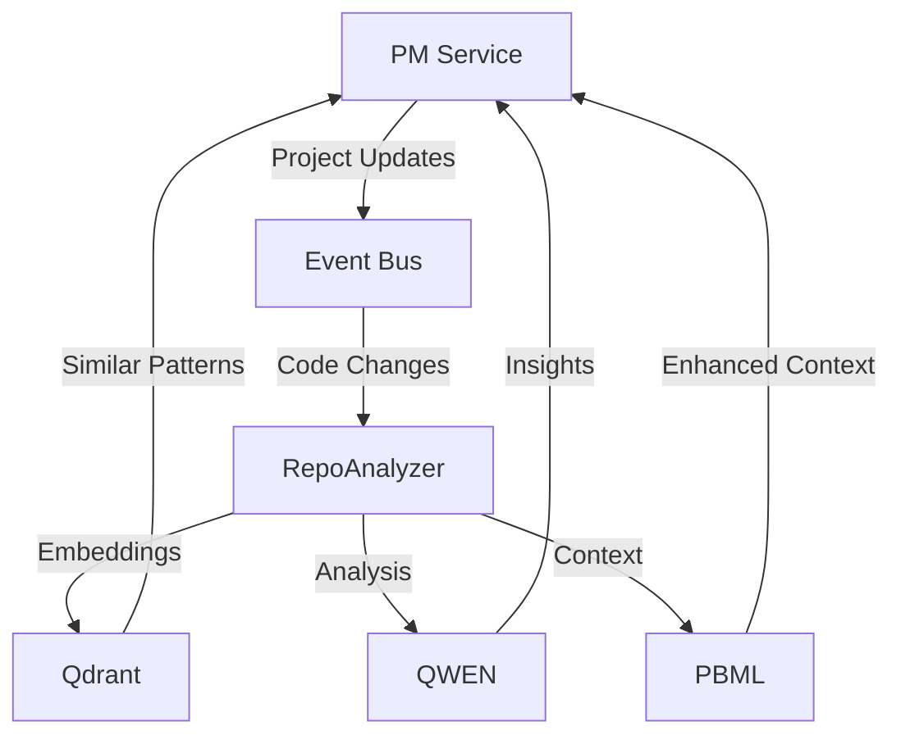


# PM Service AI Integration

## Architecture Overview



## Integration Components

### 1. AI Service Clients

```typescript
// src/clients/ai/index.ts
export interface AIClients {
  qwen: QWENClient;
  pbml: PBMLClient;
  qdrant: QdrantClient;
}

@Injectable()
export class AIClientsProvider {
  constructor(private config: ConfigService) {}

  getClients(): AIClients {
    return {
      qwen: new QWENClient(this.config.get('qwen')),
      pbml: new PBMLClient(this.config.get('pbml')),
      qdrant: new QdrantClient(this.config.get('qdrant'))
    };
  }
}
```

### 2. Project Analysis Pipeline

```typescript
// src/services/analysis/ProjectAnalyzer.ts
@Injectable()
export class ProjectAnalyzer {
  constructor(
    private readonly aiClients: AIClients,
    private readonly eventBus: EventBus
  ) {}

  async analyzeProject(projectId: string): Promise<ProjectAnalysis> {
    // Get project data
    const project = await this.projectRepository.findById(projectId);

    // Generate embeddings for project content
    const embeddings = await this.aiClients.qwen.generateEmbeddings({
      content: project.content,
      type: 'project_analysis'
    });

    // Store embeddings
    await this.aiClients.qdrant.store('projects', {
      vectors: embeddings,
      metadata: {
        projectId,
        timestamp: new Date()
      }
    });

    // Build PBML context
    const context = await this.aiClients.pbml.buildContext({
      projectId,
      embeddings,
      metadata: project.metadata
    });

    // Generate insights
    const insights = await this.aiClients.qwen.analyze({
      context,
      type: 'project_insights'
    });

    return {
      embeddings,
      context,
      insights
    };
  }
}
```

### 3. Task Intelligence

```typescript
// src/services/tasks/TaskIntelligence.ts
@Injectable()
export class TaskIntelligence {
  constructor(private readonly aiClients: AIClients) {}

  async enhanceTask(task: Task): Promise<EnhancedTask> {
    // Get project context
    const context = await this.aiClients.pbml.getContext(task.projectId);

    // Analyze task with QWEN
    const analysis = await this.aiClients.qwen.analyzeTask({
      task,
      context,
      features: [
        'complexity',
        'dependencies',
        'estimation',
        'risks'
      ]
    });

    // Find similar tasks
    const similarTasks = await this.aiClients.qdrant.search('tasks', {
      vector: analysis.embedding,
      limit: 5
    });

    return {
      ...task,
      analysis,
      similarTasks,
      suggestedAssignees: analysis.suggestedAssignees,
      estimatedDuration: analysis.estimatedDuration,
      potentialRisks: analysis.risks
    };
  }
}
```

## Event Handlers

### 1. Project Events

```typescript
// src/events/handlers/ProjectEventHandlers.ts
@Injectable()
export class ProjectEventHandlers {
  @EventPattern('project.created')
  async handleProjectCreated(event: ProjectCreatedEvent) {
    const analysis = await this.projectAnalyzer.analyzeProject(event.projectId);
    
    await this.projectRepository.updateAnalysis(
      event.projectId,
      analysis
    );
  }

  @EventPattern('project.updated')
  async handleProjectUpdated(event: ProjectUpdatedEvent) {
    // Re-analyze if significant changes
    if (this.shouldReanalyze(event.changes)) {
      await this.projectAnalyzer.analyzeProject(event.projectId);
    }
  }
}
```

### 2. Task Events

```typescript
// src/events/handlers/TaskEventHandlers.ts
@Injectable()
export class TaskEventHandlers {
  @EventPattern('task.created')
  async handleTaskCreated(event: TaskCreatedEvent) {
    const enhancedTask = await this.taskIntelligence.enhanceTask(event.task);
    
    await this.taskRepository.update(
      event.task.id,
      enhancedTask
    );
  }
}
```

## AI-Enhanced Features

### 1. Smart Task Creation

```typescript
// src/controllers/TaskController.ts
@Controller('tasks')
export class TaskController {
  @Post()
  async createTask(@Body() taskData: CreateTaskDTO): Promise<Task> {
    // Create basic task
    const task = await this.taskService.create(taskData);

    // Enhance with AI
    const enhanced = await this.taskIntelligence.enhanceTask(task);

    // Update task with AI insights
    return await this.taskService.update(task.id, enhanced);
  }
}
```

### 2. Project Insights

```typescript
// src/controllers/ProjectInsightsController.ts
@Controller('projects/:projectId/insights')
export class ProjectInsightsController {
  @Get()
  async getInsights(@Param('projectId') projectId: string): Promise<ProjectInsights> {
    // Get project context
    const context = await this.aiClients.pbml.getContext(projectId);

    // Generate insights
    const insights = await this.aiClients.qwen.generateInsights({
      context,
      features: [
        'progress',
        'bottlenecks',
        'risks',
        'recommendations'
      ]
    });

    return insights;
  }
}
```

### 3. Code Search

```typescript
// src/services/search/CodeSearchService.ts
@Injectable()
export class CodeSearchService {
  async searchCode(query: string, projectId: string): Promise<SearchResults> {
    // Generate query embedding
    const embedding = await this.aiClients.qwen.embed(query);

    // Search in vector store
    const results = await this.aiClients.qdrant.search('code', {
      vector: embedding,
      filter: { projectId }
    });

    // Enhance results with context
    const enhanced = await this.aiClients.pbml.enhanceResults(results);

    return enhanced;
  }
}
```

## Configuration

```typescript
// src/config/ai.config.ts
export const aiConfig = {
  qwen: {
    endpoint: process.env.QWEN_ENDPOINT,
    apiKey: process.env.QWEN_API_KEY,
    model: 'qwen-14b-chat',
    maxTokens: 8192
  },
  
  pbml: {
    endpoint: process.env.PBML_ENDPOINT,
    contextWindow: 'infinite',
    updateInterval: 300
  },
  
  qdrant: {
    host: process.env.QDRANT_HOST,
    port: process.env.QDRANT_PORT,
    collections: {
      projects: { dimension: 1536 },
      tasks: { dimension: 1536 },
      code: { dimension: 1536 }
    }
  }
};
```

## Error Handling

```typescript
// src/errors/AIError.ts
export class AIError extends Error {
  constructor(
    message: string,
    public readonly component: 'QWEN' | 'PBML' | 'Qdrant',
    public readonly code: string,
    public readonly retryable: boolean = false
  ) {
    super(message);
  }
}

// src/middleware/AIErrorHandler.ts
@Injectable()
export class AIErrorHandler {
  @Catch(AIError)
  async handle(error: AIError) {
    logger.error({
      component: error.component,
      code: error.code,
      message: error.message
    });

    if (error.retryable) {
      await this.retryOperation(error);
    }
  }
}
```

## Monitoring

```typescript
// src/monitoring/AIMetrics.ts
@Injectable()
export class AIMetrics {
  private readonly metrics = {
    qwenLatency: new Histogram({
      name: 'qwen_request_duration_seconds',
      help: 'QWEN API request duration'
    }),
    
    pbmlContextUpdates: new Counter({
      name: 'pbml_context_updates_total',
      help: 'Number of PBML context updates'
    }),
    
    qdrantSearches: new Counter({
      name: 'qdrant_searches_total',
      help: 'Number of vector searches'
    })
  };

  recordQwenLatency(duration: number) {
    this.metrics.qwenLatency.observe(duration);
  }
}
```

## Usage Examples

### 1. Create Project with AI Analysis

```typescript
// Example usage
const project = await projectService.create({
  name: 'New Project',
  repositoryUrl: 'https://github.com/org/repo',
  enableAI: true
});

const analysis = await projectAnalyzer.analyzeProject(project.id);
console.log('AI Insights:', analysis.insights);
```

### 2. Smart Task Management

```typescript
// Example task creation with AI
const task = await taskService.createWithAI({
  title: 'Implement Authentication',
  description: 'Add OAuth2 support',
  projectId: 'project-123'
});

console.log('Estimated Duration:', task.estimatedDuration);
console.log('Suggested Assignees:', task.suggestedAssignees);
```

---

*Last Updated: August 18, 2024*
*Version: 2.0.0*

