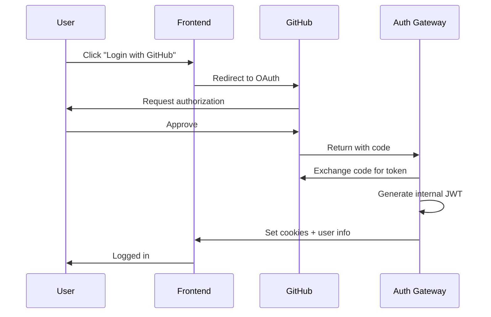


# 🔐 Authentication System Runbook

## Table of Contents
1. [Overview](#overview)
2. [Quick Start](#quick-start)
3. [Setup Guide](#setup-guide)
4. [Operations](#operations)
5. [Troubleshooting](#troubleshooting)
6. [Security Procedures](#security-procedures)
7. [Monitoring](#monitoring)

## Overview

DevMentor uses a dual-token authentication system that converts external OAuth tokens (GitHub, Auth0, Google) to internal cluster JWTs for secure microservice communication.

### Architecture Components
- **Auth Gateway**: Central authentication service
- **Token Exchange**: Converts external → internal tokens
- **JWT Issuer**: Generates cluster-specific JWTs
- **Session Manager**: Handles user sessions
- **Token Revocation**: Manages token blacklists

### Key Files & Locations
```
infrastructure/services/auth-gateway/
├── src/
│   ├── index.ts           # Main auth gateway
│   ├── token-exchange.ts  # Token conversion logic
│   ├── jwt-issuer.ts      # Internal JWT generation
│   └── providers/         # OAuth provider integrations
│       ├── github.ts
│       ├── auth0.ts
│       └── google.ts
```

## Quick Start

### 1. Environment Setup
```bash
# Copy environment template
cp .env.example .env

# Required environment variables
INTERNAL_JWT_SECRET=<generate-256-bit-secret>
GITHUB_CLIENT_ID=<from-github-oauth-app>
GITHUB_CLIENT_SECRET=<from-github-oauth-app>
AUTH0_DOMAIN=<your-auth0-domain>
AUTH0_CLIENT_ID=<from-auth0>
AUTH0_CLIENT_SECRET=<from-auth0>
REDIS_URL=redis://localhost:6379
```

### 2. Generate Secrets
```bash
# Generate JWT secret
openssl rand -base64 32

# Generate service secrets
npm run generate:service-secrets
```

### 3. Start Services
```bash
# Start auth gateway
cd infrastructure/services/auth-gateway
npm install
npm run dev

# Start Redis (for token revocation)
docker run -d -p 6379:6379 redis:alpine
```

## Setup Guide

### Step 1: Configure OAuth Providers

#### GitHub OAuth Setup
1. Go to GitHub Settings → Developer settings → OAuth Apps
2. Create new OAuth App:
   ```
   Application name: DevMentor
   Homepage URL: https://devmentor.ai
   Authorization callback URL: https://devmentor.ai/auth/github/callback
   ```
3. Copy Client ID and Client Secret to `.env`

#### Auth0 Setup
1. Create Auth0 Application (Single Page Application)
2. Configure:
   ```
   Allowed Callback URLs: https://devmentor.ai/auth/auth0/callback
   Allowed Logout URLs: https://devmentor.ai
   Allowed Web Origins: https://devmentor.ai
   ```
3. Copy Domain, Client ID, and Client Secret

### Step 2: Configure Internal JWT

```typescript
// config/jwt.config.ts
export const jwtConfig = {
  secret: process.env.INTERNAL_JWT_SECRET,
  issuer: 'devmentor-cluster',
  accessTokenExpiry: '2h',
  refreshTokenExpiry: '7d',
  algorithm: 'HS256'
};
```

### Step 3: Setup Service Registry

```typescript
// config/services.config.ts
export const services = {
  'memory-service': {
    url: process.env.MEMORY_SERVICE_URL,
    secret: process.env.MEMORY_SERVICE_SECRET,
    permissions: ['read', 'write']
  },
  'learning-service': {
    url: process.env.LEARNING_SERVICE_URL,
    secret: process.env.LEARNING_SERVICE_SECRET,
    permissions: ['read', 'write', 'analyze']
  },
  // ... other services
};
```

## Operations

### User Login Flow



### Token Exchange Process

```bash
# 1. External token comes in
POST /api/auth/exchange
{
  "provider": "github",
  "token": "gho_xxxxxxxxxxxx"
}

# 2. Validate with provider
GET https://api.github.com/user
Authorization: token gho_xxxxxxxxxxxx

# 3. Map to internal user
{
  "externalId": "github_123456",
  "email": "user@example.com",
  "internalId": "user_abc123"
}

# 4. Generate internal JWT
{
  "sub": "user_abc123",
  "cluster": {
    "services": ["memory", "learning"],
    "quotas": { "maxRepos": 10 }
  },
  "exp": 1234567890
}

# 5. Set secure cookies
Set-Cookie: devmentor_access=xxx; HttpOnly; Secure; SameSite=Strict
Set-Cookie: devmentor_refresh=xxx; HttpOnly; Secure; Path=/auth/refresh
Set-Cookie: devmentor_csrf=xxx; Secure; SameSite=Strict
```

### Token Refresh

```bash
# Automatic refresh 5 minutes before expiry
POST /api/auth/refresh
Cookie: devmentor_refresh=xxx
X-CSRF-Token: xxx

# Response: New access token in cookie
Set-Cookie: devmentor_access=new_token; HttpOnly; Secure
```

### Logout Process

```bash
# 1. Call logout endpoint
POST /api/auth/logout
Cookie: devmentor_access=xxx
X-CSRF-Token: xxx

# 2. Revoke tokens
- Add access token to Redis blacklist
- Add refresh token to Redis blacklist
- Clear user sessions

# 3. Clear cookies
Set-Cookie: devmentor_access=; Max-Age=0
Set-Cookie: devmentor_refresh=; Max-Age=0
```

## Troubleshooting

### Common Issues

#### Issue: "Invalid token" errors
```bash
# Check token expiry
jwt decode <token>

# Check if revoked
redis-cli GET "revoked:<token>"

# Verify secret matches
echo $INTERNAL_JWT_SECRET
```

#### Issue: "Service access denied"
```bash
# Check service permissions in JWT
jwt decode <token> | jq '.cluster.services'

# Verify service is registered
cat config/services.config.ts
```

#### Issue: OAuth callback fails
```bash
# Check callback URL matches
curl https://api.github.com/applications/:client_id

# Verify state parameter
redis-cli GET "oauth_state:<state>"

# Check redirect URI
echo $GITHUB_CALLBACK_URL
```

### Debug Mode

```bash
# Enable debug logging
DEBUG=auth:* npm start

# Test token exchange
curl -X POST http://localhost:3000/api/auth/exchange \
  -H "Content-Type: application/json" \
  -d '{"provider":"github","token":"xxx"}'

# Test JWT validation
curl http://localhost:3000/api/auth/verify \
  -H "Cookie: devmentor_access=xxx"
```

## Security Procedures

### Rotate JWT Secret

```bash
# 1. Generate new secret
NEW_SECRET=$(openssl rand -base64 32)

# 2. Update dual-signing period (accept both)
INTERNAL_JWT_SECRET=$NEW_SECRET
INTERNAL_JWT_SECRET_OLD=$OLD_SECRET

# 3. Deploy to all services
kubectl set env deployment/auth-gateway INTERNAL_JWT_SECRET=$NEW_SECRET

# 4. After all tokens expire (2h), remove old secret
kubectl set env deployment/auth-gateway INTERNAL_JWT_SECRET_OLD-
```

### Revoke User Access

```bash
# Immediate revocation
redis-cli SADD "revoked_users" "user_123"

# Revoke all user tokens
npm run revoke:user user_123

# Block at gateway level
redis-cli HSET "blocked_users" "user_123" "reason"
```

### Security Audit

```bash
# Check for expired tokens still in use
npm run audit:tokens

# List all active sessions
npm run list:sessions

# Check for suspicious activity
npm run security:scan

# Generate security report
npm run security:report
```

## Monitoring

### Key Metrics

```yaml
# Prometheus metrics
auth_login_total{provider="github",status="success"}
auth_token_exchange_duration_seconds
auth_jwt_generation_duration_seconds
auth_token_refresh_total
auth_logout_total
auth_failed_attempts_total{reason="invalid_token"}
```

### Alerts

```yaml
# AlertManager rules
- alert: HighAuthFailureRate
  expr: rate(auth_failed_attempts_total[5m]) > 10
  annotations:
    summary: "High authentication failure rate"

- alert: TokenRefreshFailures
  expr: rate(auth_token_refresh_total{status="failed"}[5m]) > 5
  annotations:
    summary: "Token refresh failures detected"
```

### Logs to Monitor

```bash
# Authentication logs
tail -f /var/log/auth-gateway/auth.log | grep ERROR

# Successful logins
grep "LOGIN_SUCCESS" /var/log/auth-gateway/auth.log

# Failed attempts
grep "AUTH_FAILED" /var/log/auth-gateway/auth.log

# Token revocations
grep "TOKEN_REVOKED" /var/log/auth-gateway/auth.log
```

## Maintenance Tasks

### Daily
- [ ] Check auth failure rate
- [ ] Monitor active sessions count
- [ ] Review security alerts

### Weekly
- [ ] Audit user permissions
- [ ] Check token expiry distribution
- [ ] Review OAuth provider status

### Monthly
- [ ] Rotate service secrets
- [ ] Clean up expired sessions
- [ ] Security audit
- [ ] Update OAuth provider settings

## Emergency Procedures

### Complete Auth System Failure

```bash
# 1. Enable bypass mode (EMERGENCY ONLY)
kubectl set env deployment/auth-gateway BYPASS_AUTH=true

# 2. Investigate root cause
kubectl logs deployment/auth-gateway --tail=100

# 3. Restore from backup if needed
kubectl apply -f backups/auth-gateway-backup.yaml

# 4. Disable bypass mode
kubectl set env deployment/auth-gateway BYPASS_AUTH-
```

### Mass Token Revocation

```bash
# Revoke all tokens (nuclear option)
redis-cli FLUSHDB

# Restart all services to clear cache
kubectl rollout restart deployment/auth-gateway
kubectl rollout restart deployment/api-gateway
```

## Testing

### Integration Tests

```bash
# Run auth integration tests
npm run test:integration

# Test specific provider
npm run test:github
npm run test:auth0

# Load testing
npm run test:load
```

### Manual Testing Checklist

- [ ] Login with GitHub
- [ ] Login with Auth0
- [ ] Token refresh works
- [ ] Logout clears all cookies
- [ ] Rate limiting enforced
- [ ] Service-to-service auth works
- [ ] Token revocation immediate
- [ ] CSRF protection active

## Appendix

### Generate Test Tokens

```javascript
// scripts/generate-test-token.js
const jwt = require('jsonwebtoken');

const token = jwt.sign({
  sub: 'test_user',
  email: 'test@example.com',
  cluster: {
    services: ['memory', 'learning'],
    quotas: { maxRepos: 10 }
  }
}, process.env.INTERNAL_JWT_SECRET, {
  expiresIn: '2h'
});

console.log(token);
```

### Validate Token

```bash
# Online JWT debugger (dev only!)
echo $TOKEN | pbcopy
open https://jwt.io

# CLI validation
jwt verify -k $INTERNAL_JWT_SECRET $TOKEN
```

---

**Last Updated**: 2025-08-25
**Version**: 1.0
**Author**: DevMentor Team

