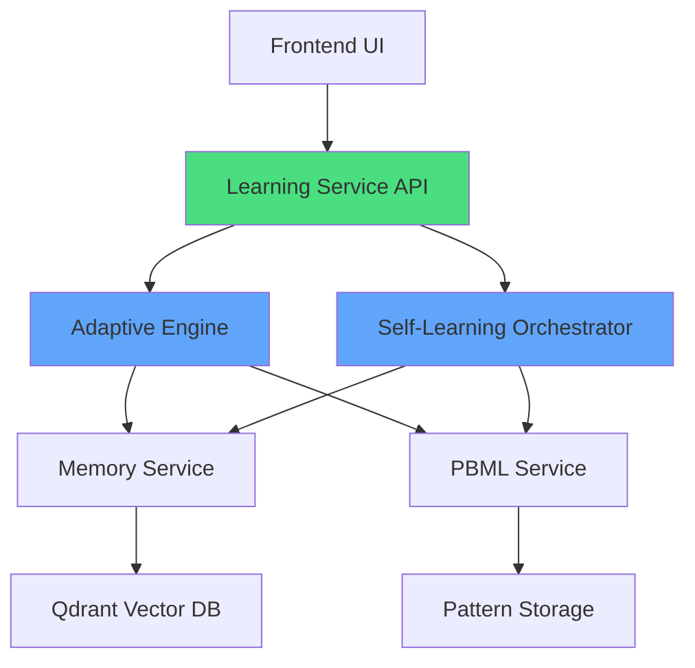


# 🧠 Self-Learning Algorithm Integration Status

## Executive Summary

The QuizMentor self-learning algorithms provide DevMentor with sophisticated adaptive learning capabilities that enhance the platform's educational features. This integration transforms DevMentor from a development platform into an intelligent learning ecosystem.

## 🎯 How It Ties Into DevMentor

### 1. **Enhanced Learning Engine Service**
The existing Learning Engine service (70% complete) will be enhanced with:
- **Adaptive Learning Engine**: Personalized question selection and difficulty adjustment
- **Self-Learning Orchestrator**: Bloom's Taxonomy validation and pedagogical frameworks
- **Spaced Repetition**: Optimal review timing for knowledge retention

### 2. **Integration with Existing Services**



**Memory Service** (✅ CODE COMPLETE):
- Stores learning history and progress
- Provides context for adaptive algorithms
- Tracks user performance patterns

**PBML Service** (🔨 PARTIAL):
- Stores learned patterns from quiz sessions
- Identifies knowledge gaps
- Provides pattern-based recommendations

**AI Gateway** (🔨 PARTIAL):
- Generates dynamic questions
- Provides AI-powered hints
- Analyzes learning patterns

### 3. **Frontend Components Integration**

From the demo archive analysis, we can integrate:
- **LearningTracker.tsx** - Already exists in archive, perfect for progress visualization
- **PromptEngineeringPanel.tsx** - Can be enhanced with adaptive difficulty
- **MultiAgentVisualization.tsx** - Shows learning agents working together

## 📊 Current State vs. Target State

### Current State (As of 2025-08-25)
```yaml
Services:
  learning-engine: 70% complete
  memory-service: 100% complete (needs deployment)
  pbml-service: Minimal implementation
  ai-gateway: Partial implementation
  
Frontend:
  TDD Service: Complete
  WebSocket: Complete
  AI Service: Multi-provider support ready
  
Infrastructure:
  PostgreSQL: Running
  Redis: Running
  Qdrant: Running
```

### Target State (With Self-Learning)
```yaml
Services:
  learning-service: NEW - Hosts adaptive algorithms
  learning-engine: Enhanced with orchestration
  memory-service: Integrated with learning history
  pbml-service: Enhanced with pattern learning
  
Frontend:
  Learning Dashboard: NEW - Analytics and progress
  Adaptive Quiz Interface: NEW - Dynamic sessions
  Learning Path Visualizer: NEW - Progress tracking
  
Features:
  - Personalized learning paths
  - Adaptive difficulty adjustment
  - Spaced repetition scheduling
  - Flow state optimization
  - Bloom's Taxonomy validation
  - ML-based recommendations
```

## 🚀 Implementation Roadmap

### Phase 1: Foundation (Days 1-2) ✅ READY
- [x] Document self-learning algorithms
- [x] Create integration guide
- [ ] Set up learning-service structure
- [ ] Copy algorithm files from QuizMentor

### Phase 2: Service Integration (Days 3-4)
- [ ] Create Learning Service API
- [ ] Integrate with Memory Service
- [ ] Connect to PBML Service
- [ ] Deploy to Kubernetes cluster

### Phase 3: Frontend Development (Days 5-6)
- [ ] Port LearningTracker from demo archive
- [ ] Create Learning Dashboard component
- [ ] Implement quiz interface
- [ ] Add progress visualization

### Phase 4: Testing & Optimization (Days 7-8)
- [ ] Unit tests for algorithms
- [ ] Integration tests for service
- [ ] E2E tests for user flows
- [ ] Performance optimization

## 💡 Value Proposition

### For Users
1. **Personalized Learning Experience**
   - Adapts to individual pace and style
   - Maintains optimal challenge level (75% success rate)
   - Prevents cognitive overload

2. **Better Knowledge Retention**
   - Spaced repetition based on forgetting curves
   - Review timing optimized per user
   - Long-term memory enhancement

3. **Engagement & Motivation**
   - Flow state optimization keeps users engaged
   - Gamification with XP and achievements
   - Clear progress tracking

### For DevMentor Platform
1. **Differentiation**
   - Unique ML-powered adaptive learning
   - Research-backed pedagogical approaches
   - Enterprise-ready learning analytics

2. **Data Insights**
   - Rich analytics on learning patterns
   - Identify common knowledge gaps
   - Improve content based on performance

3. **Scalability**
   - Works across all skill levels
   - Supports multiple learning styles
   - Grows with user base

## 📈 Success Metrics

```typescript
interface SuccessMetrics {
  // User Engagement
  dailyActiveUsers: number;        // Target: 1000+
  averageSessionTime: number;      // Target: 15+ minutes
  completionRate: number;          // Target: 80%+
  
  // Learning Effectiveness
  knowledgeRetention: number;      // Target: 85% after 30 days
  masteryImprovement: number;      // Target: 20% per month
  flowStateFrequency: number;      // Target: 70% of sessions
  
  // Platform Growth
  userRetention: number;           // Target: 60% at 30 days
  contentEngagement: number;       // Target: 5+ sessions/week
  recommendationAccuracy: number;  // Target: 80%+
}
```

## 🔗 Integration Points

### With Existing Features
1. **Dev Environment Page**: Add learning recommendations based on code analysis
2. **Repository Analyzer**: Suggest learning paths based on tech stack
3. **AI Services Dashboard**: Show learning algorithm performance
4. **System Health Monitor**: Track learning service metrics

### With Demo Archive Components
1. **MultiAgentVisualization**: Show learning agents in action
2. **PromptEngineeringPanel**: Practice with adaptive difficulty
3. **LearningTracker**: Visualize progress with existing component
4. **DigitalBookcase**: Recommend resources based on performance

## ⚠️ Risks & Mitigations

| Risk | Impact | Mitigation |
|------|--------|------------|
| Algorithm complexity | High dev time | Use existing QuizMentor implementation |
| Database performance | Slow queries | Implement caching, optimize indexes |
| User adoption | Low engagement | Gradual rollout, A/B testing |
| Content quality | Poor learning | Validate with Bloom's Taxonomy |

## 📊 Current System Readiness

### ✅ Ready Components
- PostgreSQL for user data
- Redis for caching
- Qdrant for vector similarity
- Memory Service implementation
- WebSocket for real-time updates
- Frontend AI service

### 🔨 Needs Work
- PBML Service enhancement
- AI Gateway completion
- Learning Service creation
- Frontend dashboard components

### 🚀 Quick Wins
- Port LearningTracker from demo archive (1 day)
- Deploy Memory Service (already complete)
- Create basic Learning API (2 days)

## 🎯 Next Actions

### Immediate (Today)
1. Create learning-service directory structure
2. Copy algorithm files from QuizMentor
3. Set up basic Express server

### This Week
1. Complete Learning Service API
2. Deploy to Kubernetes
3. Create frontend dashboard
4. Integration testing

### Next Week
1. Full system integration
2. Performance optimization
3. User testing
4. Documentation updates

## 📝 Documentation Updates Needed

- [ ] Update SYSTEM_STATUS.md with Learning Service
- [ ] Add to API documentation
- [ ] Update frontend component guide
- [ ] Create user documentation
- [ ] Update deployment guides

## 🏁 Definition of Done

The self-learning integration is complete when:
1. Learning Service is deployed and running
2. Adaptive algorithms are generating personalized sessions
3. Frontend dashboard shows analytics
4. Integration tests pass
5. Documentation is complete
6. Performance metrics meet targets

---

**Status**: Planning Complete, Ready for Implementation  
**Timeline**: 8-10 days to production  
**Priority**: High - Core differentiator for platform  
**Owner**: DevMentor Team  
**Last Updated**: 2025-08-25 20:55 UTC

