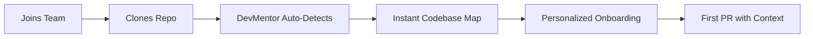
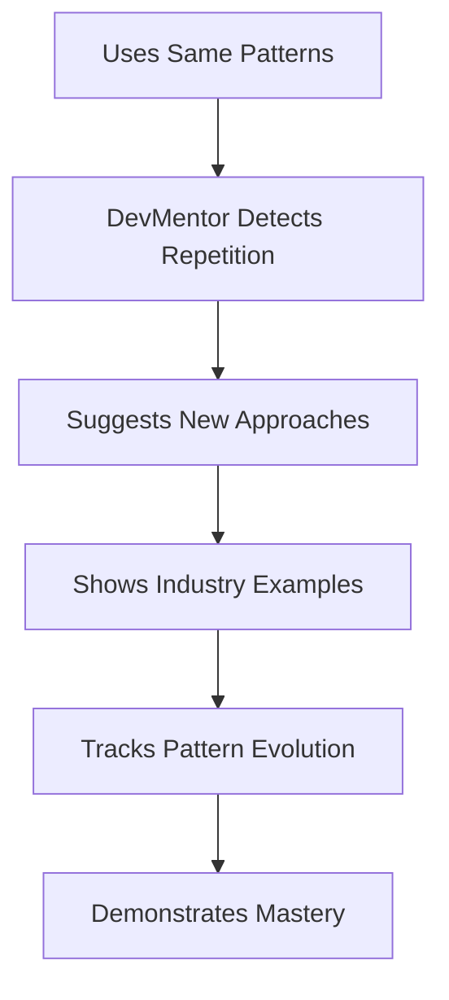
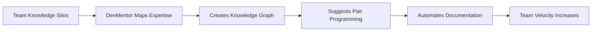
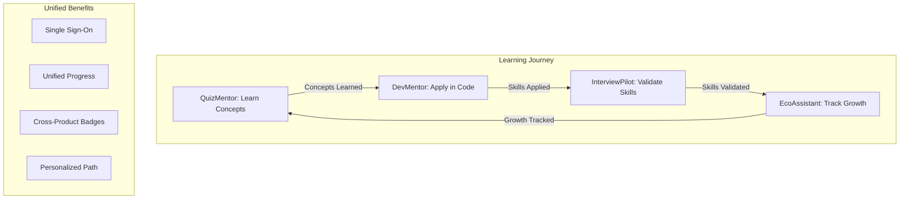


# DevMentor User Journey & Differentiation Strategy

## 🎯 Core Differentiation Philosophy

**Not about features, but about:**
- **When it's needed** → At the moment of confusion or learning opportunity
- **Who needs it** → Developers transitioning between skill levels
- **How it's delivered** → Contextually, progressively, and non-intrusively  
- **What problem it solves** → The gap between knowing syntax and understanding architecture
- **Why it's trusted** → Because it learns from YOUR code and YOUR patterns

---

## 🗺️ Primary User Journeys

### Journey 1: The Overwhelmed New Team Member
**Day 1-7: Discovery Phase**



**When Needed:** First week on a new project
**Trust Building:** Shows immediate value without setup
**Delivery:** GitHub integration auto-triggers analysis

#### Touchpoints:
1. **Hour 1:** Repository detected → "Want a tour of this codebase?"
2. **Hour 2:** Interactive architecture visualization appears
3. **Hour 4:** First quiz: "Test your understanding of the auth flow"
4. **Day 2:** "Yesterday you looked at auth, today let's explore the API layer"
5. **Day 3:** "You're ready for your first task" → AI suggests appropriate issues
6. **Week 1:** "You've learned 5 key patterns. Here's your progress report"

---

### Journey 2: The Senior Dev Hitting Plateau
**Month 1-3: Growth Acceleration**



**When Needed:** When growth stagnates
**Trust Building:** References their own code evolution
**Delivery:** Subtle suggestions in PR comments

#### Touchpoints:
1. **Pattern Detection:** "You've used this pattern 12 times. Consider this alternative..."
2. **Peer Learning:** "3 teammates solved this differently. Compare approaches?"
3. **Industry Insights:** "Netflix handles this pattern at scale like this..."
4. **Growth Tracking:** "Your code complexity handling has improved 40% this quarter"
5. **Certification Ready:** "You're demonstrating Sr. Principal patterns. Document them?"

---

### Journey 3: The Team Lead Scaling Knowledge
**Ongoing: Team Intelligence Amplification**



**When Needed:** When team growth outpaces knowledge transfer
**Trust Building:** Quantifiable team metrics improvement
**Delivery:** Dashboard insights and automated suggestions

#### Touchpoints:
1. **Morning:** "Alice knows Redux best, Bob needs Redux help → Suggest pairing?"
2. **Sprint Planning:** "Based on last sprint, these stories need 30% more time"
3. **Code Review:** "This PR introduces a pattern Charlie struggled with last week"
4. **Retrospective:** "Team learned 3 new patterns, saved 12 hours via knowledge sharing"
5. **Quarterly:** "Team skill matrix evolution report with growth recommendations"

---

## 🔄 The Unified Ecosystem Journey

### Cross-Product Intelligence Flow



---

## 💡 Differentiation by Delivery Mechanism

### 1. **Contextual Learning** (Not Courses)
- **Traditional:** "Take this 40-hour React course"
- **DevMentor:** "You're editing a React component. Here's the pattern you need now."

### 2. **Progressive Disclosure** (Not Information Dump)
- **Traditional:** 500-page documentation
- **DevMentor:** "You've mastered basics. Ready for advanced patterns?"

### 3. **Social Proof from YOUR Team** (Not Generic Examples)
- **Traditional:** "Best practices say..."
- **DevMentor:** "Your senior devs solve this like..."

### 4. **Measurable Growth** (Not Vanity Metrics)
- **Traditional:** "You completed 10 tutorials"
- **DevMentor:** "Your PR quality improved 40%, merge time decreased 2 days"

---

## 🎭 Trust Building Mechanisms

### Phase 1: Immediate Value (Day 1)
```javascript
// First interaction
const firstValue = {
  action: "Analyze repository",
  result: "Interactive map in 30 seconds",
  trust: "Wow, it actually understands my code"
};
```

### Phase 2: Personalization (Week 1)
```javascript
// Learning their style
const personalization = {
  observed: "You prefer functional components",
  suggested: "Here's a functional approach to this problem",
  trust: "It knows how I like to code"
};
```

### Phase 3: Growth Evidence (Month 1)
```javascript
// Showing progress
const growth = {
  before: "5 bugs per PR average",
  after: "1 bug per PR average",
  trust: "It's actually making me better"
};
```

### Phase 4: Team Impact (Quarter 1)
```javascript
// Collective improvement
const teamImpact = {
  metric: "Team velocity +30%",
  reason: "Knowledge sharing via DevMentor suggestions",
  trust: "It's making our whole team better"
};
```

---

## 🚀 Competitive Differentiation

### What Others Do vs. What We Do

| Aspect | Others | DevMentor |
|--------|--------|-----------|
| **Learning Trigger** | User initiates | System detects need |
| **Content Source** | Generic tutorials | Your actual codebase |
| **Progress Tracking** | Course completion | Code quality metrics |
| **Knowledge Validation** | Quizzes on theory | PRs that get approved |
| **Team Integration** | Individual accounts | Team knowledge graph |
| **ROI Measurement** | Time in app | Time saved coding |

---

## 🎯 Key Success Metrics

### User-Centric Metrics
1. **Time to First Value:** < 2 minutes from repo connection
2. **Daily Active Learning:** 1 insight consumed per day
3. **Knowledge Application Rate:** 70% of suggestions implemented
4. **Team Knowledge Velocity:** 20% increase in shared patterns

### Business Metrics
1. **Activation Rate:** 80% connect GitHub within first session
2. **Retention:** 60% weekly active after 1 month
3. **Expansion:** 40% invite teammates within 2 weeks
4. **Cross-Product Usage:** 30% use 2+ ecosystem products

---

## 🔮 Future Journey Evolutions

### Near Term (3 months)
- **AI Pair Programming:** Real-time coding assistance
- **Team Retro Automation:** AI-generated retrospective insights
- **Cross-Repo Learning:** Learn from all company repositories

### Medium Term (6 months)
- **Industry Benchmarking:** Compare team patterns with industry
- **Predictive Issues:** "This pattern will cause problems in 3 months"
- **Automated Refactoring:** One-click pattern improvements

### Long Term (12 months)
- **Organization Brain:** Complete knowledge graph of company expertise
- **Career Pathing:** Personalized growth plans based on market demand
- **AI Team Member:** Virtual developer that learns team style

---

## 📝 Implementation Priority

### Phase 1: Foundation (Current)
✅ Unified authentication
✅ Repository analysis  
✅ Basic learning tracking
⏳ Team dashboard

### Phase 2: Intelligence (Next)
- [ ] Pattern detection engine
- [ ] Personalization algorithm
- [ ] Knowledge graph builder
- [ ] Progress analytics

### Phase 3: Scale (Future)
- [ ] Multi-team support
- [ ] Enterprise features
- [ ] API marketplace
- [ ] White-label options

---

## 🎬 The "Aha!" Moments

### Moment 1: "It sees what I don't"
> "I never realized our auth flow was this complex until DevMentor visualized it"

### Moment 2: "It knows my team"
> "DevMentor suggested I pair with Sarah on Redis. She'd just learned it last week!"

### Moment 3: "It made me better"
> "My code reviews went from 10 comments to 2 after DevMentor's pattern suggestions"

### Moment 4: "It saved our sprint"
> "DevMentor warned us this refactor would take 3x longer based on similar past work"

---

## 🏆 Why Developers Will Trust DevMentor

1. **It starts with THEIR code, not generic examples**
2. **It learns THEIR patterns, not enforces others**
3. **It measures REAL improvement, not vanity metrics**
4. **It respects THEIR time with just-in-time learning**
5. **It amplifies THEIR team's collective intelligence**

---

## 🔑 The Ultimate Differentiation

**DevMentor doesn't teach coding. It teaches YOUR coding.**

Every suggestion, every quiz, every insight is derived from:
- Your repositories
- Your team's patterns  
- Your technology choices
- Your business context
- Your growth trajectory

This isn't a learning platform. It's a growth accelerator that happens to teach.

---

## 📊 Success Story Template

```markdown
### Before DevMentor
- 2 weeks to onboard new developer
- Knowledge silos between team members  
- 40% of PR comments about style/patterns
- No visibility into team skill gaps

### After 3 Months with DevMentor
- 3 days to productive new developer
- Automatic knowledge sharing via suggestions
- 10% of PR comments (focused on logic)
- Clear skill matrix with growth paths

### ROI
- 11 days saved per new hire
- 30% increase in team velocity
- 50% reduction in bugs
- 2x faster feature delivery
```

---

## 🚦 Go-to-Market Differentiation

### Not Another Dev Tool
- **Position:** "Your Team's AI Growth Coach"
- **Tagline:** "Learn from your code, not from tutorials"
- **Promise:** "Be productive in days, not weeks"

### Distribution Strategy
1. **GitHub Marketplace:** Instant discovery
2. **Team Virality:** One user brings team
3. **Ecosystem Lock-in:** Multiple products, one account
4. **Content Marketing:** Real team transformation stories

---

## 💬 The Elevator Pitch

> "DevMentor is like having a senior developer watching over your shoulder, except it learns from your entire team's knowledge, suggests improvements exactly when you need them, and proves you're getting better with real metrics. It's not about learning to code—it's about coding better with what you already know."

---

## 🎯 North Star

**When every developer thinks:**
> "I don't know how I coded without DevMentor"

**That's when we've succeeded.**

