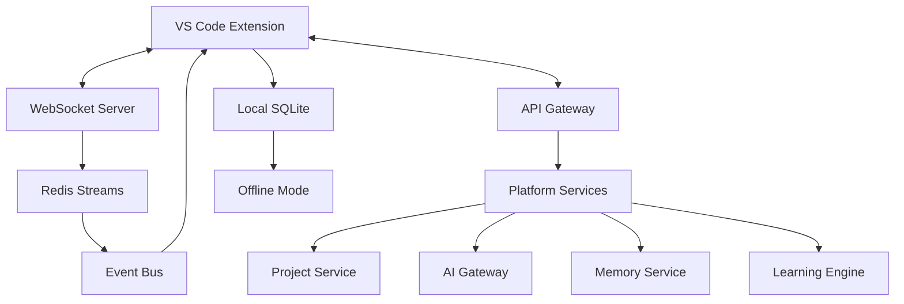
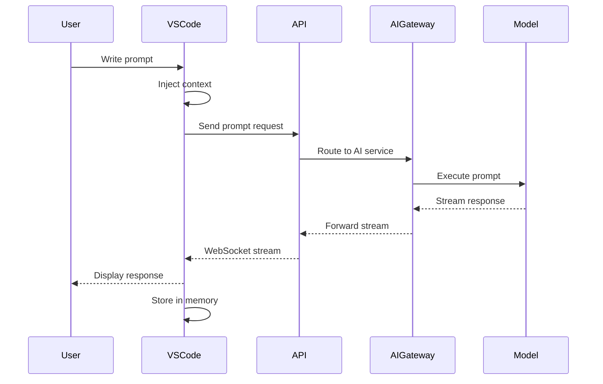


# DevMentor VS Code Extension - Full Platform Integration Architecture

## 🚀 Vision
Transform the VS Code extension into a complete DevMentor platform client that brings ALL platform capabilities directly into the IDE - project management, AI assistance, prompt engineering, memory systems, learning paths, and real-time collaboration.

## 🏗️ Platform Integration Architecture

```
DevMentor Platform + VS Code Extension Ecosystem
├── 🎮 VS Code Extension (Platform Gateway)
│   ├── 🔌 Platform Connection Layer
│   │   ├── WebSocket Client (Real-time bi-directional)
│   │   ├── REST API Client (CRUD operations)
│   │   ├── GraphQL Client (Complex queries)
│   │   └── Event Stream (SSE for updates)
│   │
│   ├── 🎯 Project Management Integration
│   │   ├── Project Explorer (Full CRUD in IDE)
│   │   ├── Epic & Task Management (Kanban in VS Code)
│   │   ├── Sprint Planning (Velocity tracking)
│   │   ├── Real-time Collaboration (Shared sessions)
│   │   └── Git Integration (Branch → Task linking)
│   │
│   ├── 🤖 AI & Prompt Engineering
│   │   ├── Prompt Library (Searchable templates)
│   │   ├── Prompt Builder (Visual prompt crafting)
│   │   ├── Multi-Model Gateway (GPT/Claude/Llama)
│   │   ├── Context Injection (Code → Prompt)
│   │   ├── Response Streaming (Real-time AI)
│   │   └── Prompt Analytics (Performance tracking)
│   │
│   ├── 🧠 Memory & Learning System
│   │   ├── Code Pattern Recognition
│   │   ├── Personal Knowledge Base
│   │   ├── Team Knowledge Sharing
│   │   ├── Learning Path Progress
│   │   ├── Skill Assessment
│   │   └── Contextual Suggestions
│   │
│   ├── 📊 Architecture & Analysis
│   │   ├── Live Architecture Diagrams
│   │   ├── Dependency Visualization
│   │   ├── Code Quality Metrics
│   │   ├── Performance Profiling
│   │   └── Security Scanning
│   │
│   └── 📝 Documentation & Compliance
│       ├── Auto-Documentation
│       ├── Runbook Integration
│       ├── ADR Management
│       ├── Compliance Checking
│       └── Audit Trail
│
├── 🌐 DevMentor Platform Services
│   ├── API Gateway (8080)
│   ├── Auth Service (3002)
│   ├── Project Service (3004)
│   ├── AI Gateway (3001)
│   ├── Memory Service (3003)
│   ├── Learning Engine (3005)
│   └── PBML Service (3006)
│
└── 💾 Data Synchronization
    ├── Local Cache (SQLite)
    ├── Offline Mode Support
    ├── Conflict Resolution
    └── Real-time Sync
```

## 🔧 Core Platform Features in VS Code

### 1. Project Management System

```typescript
interface ProjectManagementProvider {
  // Project Operations
  createProject(data: ProjectInput): Promise<Project>;
  getProjects(): Promise<Project[]>;
  updateProject(id: string, data: Partial<Project>): Promise<Project>;
  deleteProject(id: string): Promise<void>;
  
  // Epic Management
  createEpic(projectId: string, data: EpicInput): Promise<Epic>;
  updateEpicStatus(epicId: string, status: EpicStatus): Promise<Epic>;
  moveEpic(epicId: string, newProjectId: string): Promise<Epic>;
  
  // Task Management with Kanban
  createTask(epicId: string, data: TaskInput): Promise<Task>;
  updateTaskStatus(taskId: string, status: TaskStatus): Promise<Task>;
  assignTask(taskId: string, userId: string): Promise<Task>;
  
  // Sprint Management
  createSprint(projectId: string, data: SprintInput): Promise<Sprint>;
  addTaskToSprint(taskId: string, sprintId: string): Promise<void>;
  startSprint(sprintId: string): Promise<Sprint>;
  closeSprint(sprintId: string): Promise<SprintReport>;
  
  // Real-time Collaboration
  joinSession(projectId: string): Promise<CollaborationSession>;
  broadcastCursorPosition(position: Position): void;
  broadcastSelection(selection: Selection): void;
  broadcastEdit(edit: Edit): void;
}

// VS Code UI Components
class ProjectExplorerProvider implements vscode.TreeDataProvider<ProjectItem> {
  // Tree view showing:
  // - Projects
  //   - Epics
  //     - Tasks (with status indicators)
  //       - Subtasks
  //   - Sprints
  //     - Active Sprint
  //     - Backlog
  //   - Team Members
  //   - Recent Activity
}

class KanbanViewProvider implements vscode.WebviewViewProvider {
  // Interactive Kanban board in sidebar
  // Drag & drop task management
  // Real-time updates via WebSocket
}
```

### 2. AI & Prompt Engineering System

```typescript
interface AIPromptSystem {
  // Prompt Library Management
  getPromptTemplates(): Promise<PromptTemplate[]>;
  savePromptTemplate(template: PromptTemplate): Promise<void>;
  sharePromptTemplate(templateId: string, teamId: string): Promise<void>;
  
  // Prompt Builder
  buildPrompt(components: PromptComponent[]): ComposedPrompt;
  injectContext(prompt: string, context: CodeContext): string;
  validatePrompt(prompt: string): PromptValidation;
  estimateTokens(prompt: string): TokenEstimate;
  
  // Multi-Model Execution
  executePrompt(prompt: string, options: {
    model: 'gpt-4' | 'claude-3' | 'llama-3' | 'qwen-2.5';
    temperature?: number;
    maxTokens?: number;
    streaming?: boolean;
  }): Promise<AIResponse>;
  
  // Advanced Features
  chainPrompts(prompts: Prompt[]): Promise<ChainResult>;
  parallelExecute(prompts: Prompt[]): Promise<ParallelResult[]>;
  compareModels(prompt: string, models: string[]): Promise<Comparison>;
  
  // Analytics & Optimization
  trackPromptPerformance(execution: PromptExecution): void;
  getPromptAnalytics(timeRange: TimeRange): PromptAnalytics;
  suggestOptimizations(prompt: string): Optimization[];
}

// VS Code Command Palette Integration
class PromptCommandProvider {
  // Quick prompt execution from command palette
  registerCommands() {
    vscode.commands.registerCommand('devmentor.prompt.quick', this.quickPrompt);
    vscode.commands.registerCommand('devmentor.prompt.fromSelection', this.promptFromSelection);
    vscode.commands.registerCommand('devmentor.prompt.explain', this.explainCode);
    vscode.commands.registerCommand('devmentor.prompt.refactor', this.refactorCode);
    vscode.commands.registerCommand('devmentor.prompt.test', this.generateTests);
    vscode.commands.registerCommand('devmentor.prompt.document', this.documentCode);
  }
}

// Interactive Prompt Builder Webview
class PromptBuilderWebview {
  // Visual prompt construction with:
  // - Drag & drop components
  // - Variable injection
  // - Context preview
  // - Token counter
  // - Model selector
  // - Response preview
}
```

### 3. Memory & Learning Integration

```typescript
interface MemorySystemIntegration {
  // Personal Memory Bank
  storeCodePattern(pattern: CodePattern): Promise<void>;
  retrieveSimilarPatterns(code: string): Promise<CodePattern[]>;
  updatePreference(preference: DeveloperPreference): Promise<void>;
  getPersonalizedSuggestions(): Promise<Suggestion[]>;
  
  // Team Knowledge Sharing
  shareKnowledge(knowledge: Knowledge): Promise<void>;
  searchTeamKnowledge(query: string): Promise<Knowledge[]>;
  subscribeToExpertise(expertise: string): Promise<void>;
  
  // Learning Path Integration
  getCurrentLearningPath(): Promise<LearningPath>;
  updateProgress(moduleId: string, progress: number): Promise<void>;
  getNextLesson(): Promise<Lesson>;
  submitQuizAnswer(quizId: string, answer: Answer): Promise<QuizResult>;
  
  // Contextual Intelligence
  analyzeCurrentContext(): Promise<ContextAnalysis>;
  suggestRelevantDocs(): Promise<Documentation[]>;
  findSimilarSolutions(): Promise<Solution[]>;
  recommendExperts(topic: string): Promise<Expert[]>;
}

// VS Code Learning Assistant
class LearningAssistantProvider {
  // Inline learning suggestions
  // Code review based on best practices
  // Real-time mentoring
  // Skill gap analysis
}
```

### 4. Architecture & Analysis Tools

```typescript
interface ArchitectureAnalysisTools {
  // Live Visualization
  generateArchitectureDiagram(): Promise<Diagram>;
  visualizeDependencies(): Promise<DependencyGraph>;
  showDataFlow(): Promise<DataFlowDiagram>;
  renderSystemMap(): Promise<SystemMap>;
  
  // Code Analysis
  analyzeComplexity(): Promise<ComplexityReport>;
  detectPatterns(): Promise<PatternReport>;
  findAntiPatterns(): Promise<AntiPatternReport>;
  suggestRefactoring(): Promise<RefactoringPlan>;
  
  // Performance Profiling
  profilePerformance(): Promise<PerformanceReport>;
  identifyBottlenecks(): Promise<Bottleneck[]>;
  suggestOptimizations(): Promise<Optimization[]>;
  
  // Security Scanning
  scanVulnerabilities(): Promise<SecurityReport>;
  checkCompliance(): Promise<ComplianceReport>;
  auditDependencies(): Promise<DependencyAudit>;
}

// VS Code Architecture Panel
class ArchitecturePanel implements vscode.WebviewViewProvider {
  // Interactive architecture visualization
  // Real-time updates as code changes
  // Zoom, pan, filter capabilities
  // Export to various formats
}
```

### 5. Platform Configuration & Settings

```json
{
  "contributes": {
    "configuration": {
      "title": "DevMentor Platform",
      "properties": {
        // Connection Settings
        "devmentor.platform.apiUrl": {
          "type": "string",
          "default": "http://localhost:8080",
          "description": "DevMentor API Gateway URL"
        },
        "devmentor.platform.wsUrl": {
          "type": "string",
          "default": "ws://localhost:3001",
          "description": "WebSocket server URL"
        },
        
        // Project Management
        "devmentor.projects.autoSync": {
          "type": "boolean",
          "default": true,
          "description": "Automatically sync projects with platform"
        },
        "devmentor.projects.defaultView": {
          "type": "string",
          "enum": ["tree", "kanban", "list"],
          "default": "tree",
          "description": "Default project view"
        },
        
        // AI & Prompts
        "devmentor.ai.defaultModel": {
          "type": "string",
          "enum": ["gpt-4", "claude-3", "llama-3", "qwen-2.5"],
          "default": "gpt-4",
          "description": "Default AI model for prompts"
        },
        "devmentor.ai.streamResponses": {
          "type": "boolean",
          "default": true,
          "description": "Stream AI responses in real-time"
        },
        "devmentor.prompts.library": {
          "type": "array",
          "default": [],
          "description": "Personal prompt library"
        },
        
        // Memory & Learning
        "devmentor.memory.capturePatterns": {
          "type": "boolean",
          "default": true,
          "description": "Automatically capture code patterns"
        },
        "devmentor.learning.showInlineSuggestions": {
          "type": "boolean",
          "default": true,
          "description": "Show learning suggestions inline"
        },
        
        // Documentation
        "devmentor.docs.autoDocument": {
          "type": "boolean",
          "default": true,
          "description": "Automatically document development activities"
        },
        
        // Collaboration
        "devmentor.collaboration.sharePresence": {
          "type": "boolean",
          "default": true,
          "description": "Share cursor and selection with team"
        }
      }
    }
  }
}
```

## 🎨 UI/UX Design

### Integrated Platform View in VS Code

```
VS Code Activity Bar
├── 🚀 DevMentor Platform
│   ├── 📁 Projects & Tasks
│   │   ├── My Projects
│   │   │   ├── Project Alpha [75%]
│   │   │   │   ├── 📝 Epic: Authentication
│   │   │   │   │   ├── ✅ Task: Setup OAuth
│   │   │   │   │   ├── 🔄 Task: JWT Implementation
│   │   │   │   │   └── ⏳ Task: Testing
│   │   │   │   └── 📝 Epic: API Development
│   │   │   └── Project Beta [30%]
│   │   ├── 🏃 Active Sprint (Day 5/14)
│   │   │   ├── In Progress (3)
│   │   │   ├── Review (2)
│   │   │   └── Done (5)
│   │   └── 📊 Quick Stats
│   │       ├── Velocity: 23 pts
│   │       └── Completion: 67%
│   │
│   ├── 🤖 AI Assistant
│   │   ├── 💬 Quick Prompt
│   │   ├── 📚 Prompt Library
│   │   │   ├── Code Explanation
│   │   │   ├── Refactoring
│   │   │   ├── Test Generation
│   │   │   └── + Custom Prompts
│   │   ├── 🔄 Recent Conversations
│   │   └── 📊 Token Usage: 1.2k/10k
│   │
│   ├── 🧠 Memory & Learning
│   │   ├── 📐 My Patterns (42)
│   │   ├── 🎯 Learning Path
│   │   │   ├── Current: System Design
│   │   │   └── Progress: 65%
│   │   ├── 💡 Suggestions
│   │   └── 🏆 Achievements
│   │
│   ├── 🏗️ Architecture
│   │   ├── 📊 System Overview
│   │   ├── 🔍 Dependencies
│   │   ├── ⚡ Performance
│   │   └── 🔒 Security
│   │
│   └── 📝 Documentation
│       ├── 📖 Runbooks
│       ├── 📋 ADRs
│       └── 📊 Reports
```

### Command Palette Integration

```
Ctrl+Shift+P → DevMentor Commands

> DevMentor: Create New Project
> DevMentor: Quick AI Prompt
> DevMentor: Generate Tests for Current File
> DevMentor: Explain Selected Code
> DevMentor: Start TDD Cycle
> DevMentor: View Architecture Diagram
> DevMentor: Search Team Knowledge
> DevMentor: Start Pair Programming Session
> DevMentor: Generate Documentation
> DevMentor: Analyze Performance
```

### Status Bar Integration

```
[🚀 DevMentor Connected] [📝 Sprint: Day 5/14] [🤖 GPT-4] [🧠 Learning: 65%] [👥 Team: 3 Online]
```

## 🔄 Data Flow Architecture

### Real-time Synchronization



### Prompt Execution Flow



## 🚦 Implementation Roadmap

### Phase 1: Platform Foundation (Week 1)
- [ ] Establish WebSocket connection to platform
- [ ] Implement authentication flow
- [ ] Create project tree view provider
- [ ] Basic CRUD operations for projects/tasks

### Phase 2: AI Integration (Week 2)
- [ ] Prompt library management
- [ ] Quick prompt execution
- [ ] Context injection system
- [ ] Response streaming

### Phase 3: Advanced Features (Week 3)
- [ ] Kanban board webview
- [ ] Architecture visualization
- [ ] Memory pattern capture
- [ ] Learning path integration

### Phase 4: Collaboration (Week 4)
- [ ] Real-time cursor sharing
- [ ] Pair programming mode
- [ ] Team knowledge search
- [ ] Shared debugging sessions

## 🔐 Security & Authentication

### Authentication Flow
```typescript
class AuthenticationProvider {
  async authenticate(): Promise<AuthToken> {
    // 1. Check for existing token
    const stored = await this.keytar.getPassword('devmentor', 'token');
    if (stored && !this.isExpired(stored)) return stored;
    
    // 2. OAuth flow via browser
    const authUrl = `${this.platform}/auth/vscode`;
    await vscode.env.openExternal(authUrl);
    
    // 3. Listen for callback
    const token = await this.waitForCallback();
    
    // 4. Store securely
    await this.keytar.setPassword('devmentor', 'token', token);
    
    return token;
  }
}
```

### Data Security
- **Token Storage**: OS keychain via Keytar
- **Connection**: TLS/WSS in production
- **Code Context**: Never send sensitive files
- **Prompt Sanitization**: Remove secrets before sending

## 📊 Analytics & Metrics

### Usage Tracking
```typescript
interface ExtensionMetrics {
  dailyActiveUsers: number;
  promptsExecuted: number;
  averageResponseTime: number;
  taskCompletionRate: number;
  learningProgress: number;
  collaborationSessions: number;
  documentationGenerated: number;
}
```

### Performance Monitoring
- Command execution time
- WebSocket latency
- Cache hit rate
- Memory usage
- Extension activation time

## 🎯 Success Criteria

### User Experience
- **Seamless Integration**: < 3 clicks to any platform feature
- **Response Time**: < 100ms for local operations
- **AI Response**: < 2s for first token
- **Sync Latency**: < 500ms for real-time updates

### Platform Adoption
- **Feature Usage**: 80% of platform features accessible
- **Daily Active Usage**: 90% of developers use daily
- **Prompt Library**: 50+ shared team prompts
- **Knowledge Base**: 1000+ captured patterns

### Developer Productivity
- **Task Completion**: 30% faster with AI assistance
- **Documentation**: 50% reduction in manual documentation
- **Code Quality**: 25% fewer bugs with pattern recognition
- **Learning**: 2x faster skill acquisition

---

*This architecture transforms the VS Code extension into a complete platform client, bringing the full power of DevMentor directly into the developer's IDE. Every platform feature is accessible, every AI capability is at their fingertips, and all collaboration happens in real-time.*

