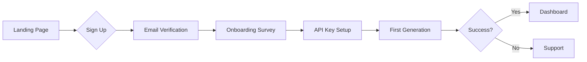
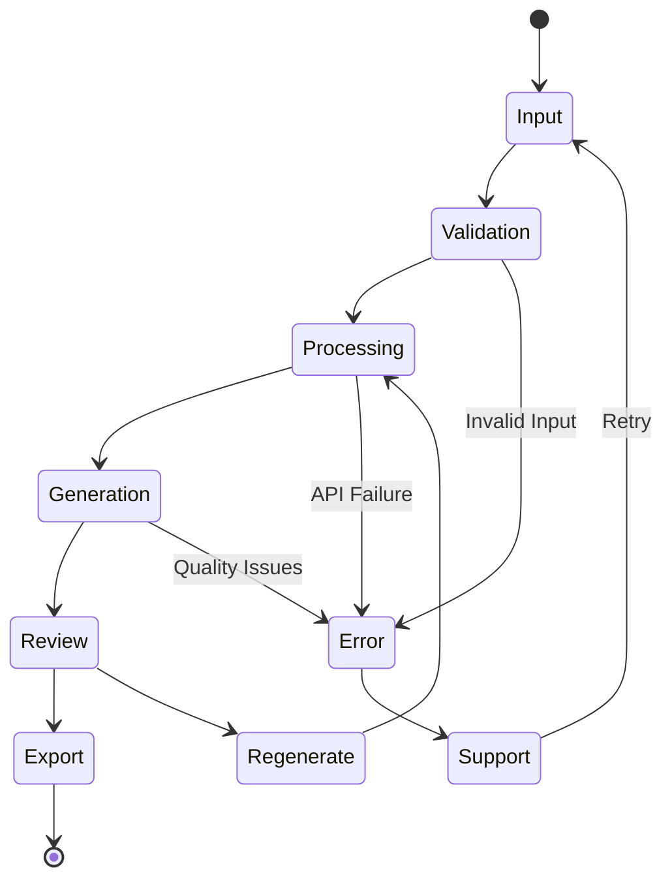
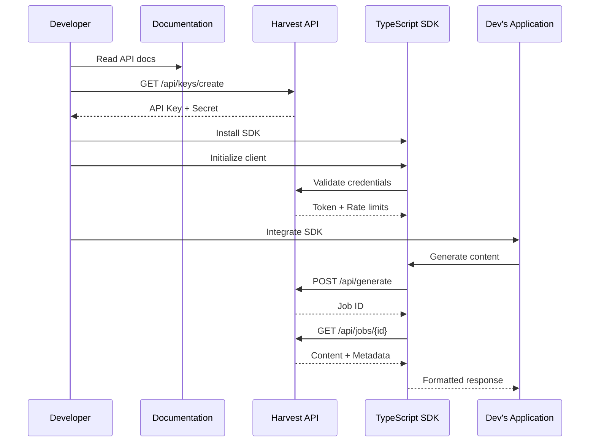
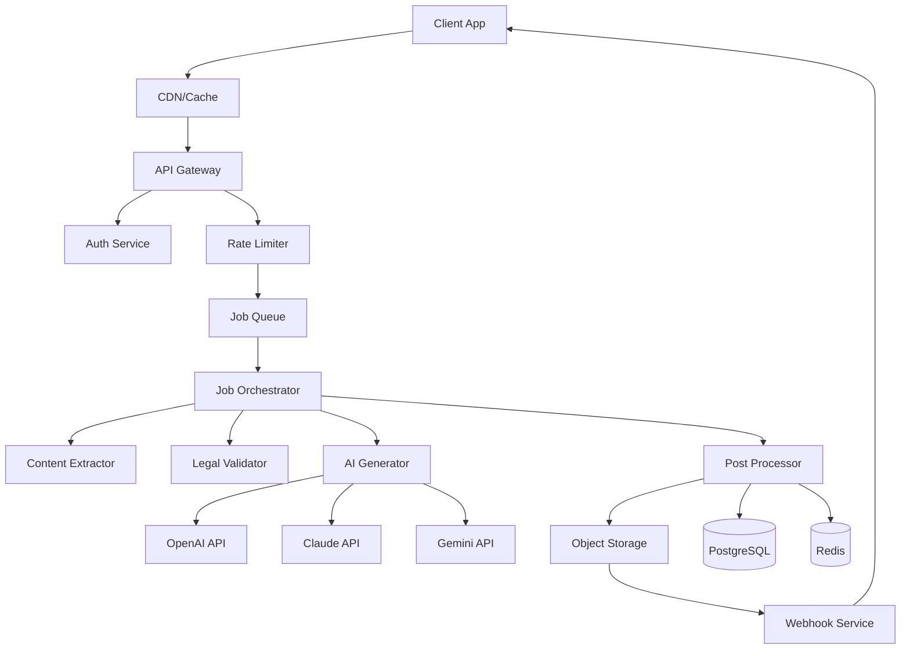
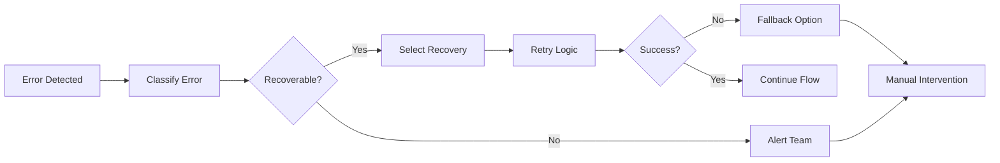


# Harvest.ai User Journeys Documentation

## Executive Summary
This document outlines comprehensive user journeys for Harvest.ai, covering all key personas, their goals, pain points, and interactions with the system. Each journey includes detailed state transitions, UI flows, and backend orchestration.

## Table of Contents
1. [User Personas](#user-personas)
2. [Journey Maps](#journey-maps)
3. [State Transitions](#state-transitions)
4. [Backend Orchestration](#backend-orchestration)
5. [Error Handling](#error-handling)
6. [Success Metrics](#success-metrics)

## User Personas

### 1. Content Creator (Primary)
**Profile**: Bloggers, educators, course creators
**Goals**: Generate high-quality content quickly
**Pain Points**: Writer's block, research time, consistency
**Technical Level**: Low to medium

### 2. Developer (Secondary)
**Profile**: Software engineers building content apps
**Goals**: Integrate content generation via API
**Pain Points**: Complex APIs, poor documentation, rate limits
**Technical Level**: High

### 3. Enterprise User (Growth)
**Profile**: Marketing teams, training departments
**Goals**: Scale content production with compliance
**Pain Points**: Brand consistency, legal compliance, ROI tracking
**Technical Level**: Medium

### 4. Educational Institution (Expansion)
**Profile**: Schools, universities, training centers
**Goals**: Generate assessments and learning materials
**Pain Points**: Curriculum alignment, accessibility, bulk generation
**Technical Level**: Low to medium

## Journey Maps

### Journey 1: First-Time User Registration and Onboarding



**Detailed Steps:**

1. **Discovery Phase** (0-2 minutes)
   - User lands on homepage via search/referral
   - Views hero section with value proposition
   - Watches 30-second demo video
   - Reads testimonials and use cases
   - **Backend State**: Session created, source tracked
   - **Metrics**: Time on page, scroll depth, video engagement

2. **Registration Phase** (2-5 minutes)
   - Clicks "Start Free Trial" CTA
   - Enters email and password
   - Selects account type (Personal/Team/Enterprise)
   - Agrees to terms and privacy policy
   - **Backend State**: User record created (PENDING_VERIFICATION)
   - **API Calls**: 
     ```typescript
     POST /api/auth/register
     {
       email: string,
       password: string,
       accountType: 'personal' | 'team' | 'enterprise',
       source: string,
       referrer?: string
     }
     ```

3. **Verification Phase** (1-3 minutes)
   - Receives verification email
   - Clicks verification link
   - Returns to platform
   - **Backend State**: User updated (VERIFIED)
   - **Cache**: User session cached for 24 hours

4. **Onboarding Phase** (3-5 minutes)
   - Completes profile survey:
     - Primary use case
     - Content types needed
     - Volume expectations
     - Technical expertise
   - **Backend State**: User profile enriched
   - **Personalization**: ML model trained on preferences

5. **API Key Configuration** (2-3 minutes)
   - Option 1: Use Harvest.ai credits (free tier)
   - Option 2: BYOK (Bring Your Own Keys)
     - OpenAI API key
     - Anthropic API key
     - Google AI key
   - Key validation and testing
   - **Backend State**: Keys encrypted and stored
   - **Security**: Keys validated against provider APIs

6. **First Content Generation** (3-5 minutes)
   - Guided tutorial overlay
   - Template selection
   - Input source content (URL/text/file)
   - Configure parameters
   - Generate content
   - **Backend State**: Job created (QUEUED → PROCESSING → COMPLETE)
   - **Monitoring**: Latency, success rate, token usage

### Journey 2: Content Generation Workflow



**Detailed Flow:**

1. **Content Input Stage**
   ```typescript
   interface ContentInput {
     type: 'url' | 'text' | 'file' | 'api';
     source: string | File | URL;
     metadata: {
       title?: string;
       category?: string;
       tags?: string[];
     };
   }
   ```
   - User selects input method
   - Provides source content
   - Sets generation parameters
   - **Validation**: URL accessibility, file format, text length

2. **Processing Stage**
   ```typescript
   interface ProcessingState {
     jobId: string;
     status: 'queued' | 'processing' | 'generating' | 'complete' | 'failed';
     progress: number; // 0-100
     estimatedTime: number; // seconds
     steps: ProcessingStep[];
   }
   
   interface ProcessingStep {
     name: string;
     status: 'pending' | 'running' | 'complete' | 'failed';
     duration?: number;
     output?: any;
   }
   ```
   - Content extraction
   - Legal compliance check
   - Chunking and preprocessing
   - **Real-time updates**: WebSocket connection for progress

3. **Generation Stage**
   ```typescript
   interface GenerationConfig {
     model: 'gpt-4' | 'claude-3' | 'gemini-pro';
     temperature: number;
     maxTokens: number;
     outputFormat: 'quiz' | 'blog' | 'summary' | 'script';
     style: 'formal' | 'casual' | 'academic' | 'creative';
     language: string;
     customPrompt?: string;
   }
   ```
   - AI model selection
   - Prompt engineering
   - Multi-pass generation
   - Quality scoring
   - **Caching**: Results cached for 7 days

4. **Review and Edit Stage**
   - Preview generated content
   - AI-powered suggestions
   - Manual editing capability
   - Version history
   - Collaboration features (teams)
   - **Auto-save**: Every 30 seconds

5. **Export Stage**
   ```typescript
   interface ExportOptions {
     format: 'json' | 'markdown' | 'html' | 'pdf' | 'docx';
     includes: {
       metadata: boolean;
       sources: boolean;
       analytics: boolean;
     };
     destination: 'download' | 'email' | 'api' | 'integration';
   }
   ```
   - Format selection
   - Bulk export options
   - Integration push (Zapier, Make, etc.)
   - **Rate limiting**: Max 100 exports per hour

### Journey 3: Developer API Integration



**Implementation Steps:**

1. **Discovery and Documentation**
   ```typescript
   // SDK Installation
   npm install @harvestai/sdk
   
   // Quick Start
   import { HarvestClient } from '@harvestai/sdk';
   
   const client = new HarvestClient({
     apiKey: process.env.HARVEST_API_KEY,
     apiSecret: process.env.HARVEST_API_SECRET,
     environment: 'production' // or 'sandbox'
   });
   ```

2. **Authentication Setup**
   ```typescript
   interface AuthConfig {
     apiKey: string;
     apiSecret: string;
     options?: {
       timeout: number;
       retries: number;
       rateLimitHandling: 'queue' | 'error' | 'backoff';
     };
   }
   ```

3. **Content Generation via API**
   ```typescript
   // Simple generation
   const result = await client.generate({
     source: 'https://example.com/article',
     outputType: 'quiz',
     questions: 10,
     difficulty: 'medium'
   });
   
   // Advanced with webhooks
   const job = await client.generateAsync({
     source: { type: 'text', content: '...' },
     outputType: 'blog',
     config: {
       tone: 'professional',
       length: 1500,
       keywords: ['AI', 'automation'],
       webhook: {
         url: 'https://myapp.com/webhook',
         events: ['completed', 'failed'],
         secret: 'webhook_secret'
       }
     }
   });
   ```

4. **Webhook Integration**
   ```typescript
   interface WebhookPayload {
     event: 'job.completed' | 'job.failed' | 'job.progress';
     jobId: string;
     timestamp: string;
     data: {
       status: string;
       result?: any;
       error?: string;
       metadata: Record<string, any>;
     };
     signature: string; // HMAC-SHA256
   }
   ```

5. **Rate Limiting and Quotas**
   ```typescript
   interface RateLimits {
     requests: {
       limit: number;
       remaining: number;
       reset: Date;
     };
     tokens: {
       limit: number;
       used: number;
       reset: Date;
     };
     concurrent: {
       limit: number;
       active: number;
     };
   }
   ```

### Journey 4: Enterprise Bulk Operations

**Workflow for generating 1000+ pieces of content:**

1. **Bulk Upload Preparation**
   ```typescript
   interface BulkJob {
     id: string;
     name: string;
     items: BulkItem[];
     config: BulkConfig;
     status: BulkStatus;
     results: BulkResults;
   }
   
   interface BulkItem {
     id: string;
     source: ContentInput;
     config?: Partial<GenerationConfig>;
     priority: 'high' | 'normal' | 'low';
   }
   ```

2. **Processing Pipeline**
   - CSV/Excel import with validation
   - Batch size optimization (50-100 items)
   - Parallel processing with rate limiting
   - Progress tracking and partial results
   - Error recovery and retry logic

3. **Quality Assurance**
   - Automated quality scoring
   - Sampling for manual review
   - Brand voice consistency check
   - Plagiarism detection
   - Compliance validation

4. **Delivery and Reporting**
   - Bulk download in multiple formats
   - Email delivery with zip archives
   - API webhook notifications
   - Analytics dashboard
   - Cost breakdown report

## State Transitions

### User Account States
```typescript
enum UserState {
  PENDING_VERIFICATION = 'pending_verification',
  VERIFIED = 'verified',
  ACTIVE = 'active',
  SUSPENDED = 'suspended',
  DELETED = 'deleted'
}

interface StateTransition {
  from: UserState;
  to: UserState;
  trigger: string;
  conditions?: string[];
  sideEffects?: string[];
}

const transitions: StateTransition[] = [
  {
    from: UserState.PENDING_VERIFICATION,
    to: UserState.VERIFIED,
    trigger: 'email_verified',
    sideEffects: ['send_welcome_email', 'create_default_workspace']
  },
  {
    from: UserState.VERIFIED,
    to: UserState.ACTIVE,
    trigger: 'first_generation_complete',
    sideEffects: ['track_activation', 'unlock_features']
  },
  {
    from: UserState.ACTIVE,
    to: UserState.SUSPENDED,
    trigger: 'violation_detected',
    conditions: ['severity_high', 'multiple_violations'],
    sideEffects: ['notify_user', 'pause_jobs', 'alert_support']
  }
];
```

### Job Processing States
```typescript
enum JobState {
  CREATED = 'created',
  VALIDATED = 'validated',
  QUEUED = 'queued',
  PROCESSING = 'processing',
  GENERATING = 'generating',
  POST_PROCESSING = 'post_processing',
  COMPLETE = 'complete',
  FAILED = 'failed',
  CANCELLED = 'cancelled'
}

interface JobStateMachine {
  currentState: JobState;
  history: StateChange[];
  context: JobContext;
  
  transition(event: JobEvent): void;
  canTransition(to: JobState): boolean;
  rollback(): void;
}
```

## Backend Orchestration

### Request Flow Architecture


### Service Components

1. **API Gateway (Kong/Express Gateway)**
   - Request routing
   - Authentication
   - Rate limiting
   - Request/response transformation
   - Logging and analytics

2. **Job Orchestrator (BullMQ/Temporal)**
   ```typescript
   class JobOrchestrator {
     async processJob(job: Job): Promise<JobResult> {
       const pipeline = [
         this.validate,
         this.extractContent,
         this.checkCompliance,
         this.generateContent,
         this.postProcess,
         this.deliverResults
       ];
       
       for (const step of pipeline) {
         try {
           job = await step(job);
           await this.updateProgress(job);
         } catch (error) {
           await this.handleError(job, error, step.name);
           throw error;
         }
       }
       
       return job.result;
     }
   }
   ```

3. **Content Extractor Service**
   - Web scraping (Puppeteer/Playwright)
   - PDF parsing (pdf-parse)
   - Video transcription (Whisper API)
   - Image OCR (Tesseract)
   - Markdown/HTML parsing

4. **AI Generator Service**
   ```typescript
   class AIGeneratorService {
     private strategies: Map<string, GenerationStrategy>;
     
     async generate(config: GenerationConfig): Promise<Content> {
       const strategy = this.selectStrategy(config);
       const provider = this.selectProvider(config);
       
       try {
         const result = await strategy.execute(provider, config);
         await this.cacheResult(result);
         return result;
       } catch (error) {
         if (this.shouldRetry(error)) {
           return this.retryWithFallback(config);
         }
         throw error;
       }
     }
     
     private selectProvider(config: GenerationConfig): AIProvider {
       // Load balancing and failover logic
       const providers = this.getHealthyProviders();
       return this.leastLoaded(providers);
     }
   }
   ```

5. **Caching Layer**
   ```typescript
   class CacheManager {
     private l1Cache: Map<string, any>; // In-memory
     private l2Cache: Redis; // Redis
     private l3Cache: CDN; // CloudFlare
     
     async get(key: string): Promise<any> {
       // L1 Check
       if (this.l1Cache.has(key)) {
         return this.l1Cache.get(key);
       }
       
       // L2 Check
       const l2Result = await this.l2Cache.get(key);
       if (l2Result) {
         this.l1Cache.set(key, l2Result);
         return l2Result;
       }
       
       // L3 Check
       const l3Result = await this.l3Cache.get(key);
       if (l3Result) {
         await this.promote(key, l3Result);
         return l3Result;
       }
       
       return null;
     }
   }
   ```

## Error Handling

### Error Categories and Recovery

1. **Input Errors**
   ```typescript
   class InputError extends BaseError {
     constructor(message: string, details: any) {
       super(message, 'INPUT_ERROR', 400);
       this.details = details;
       this.recoverable = true;
       this.userMessage = this.getUserFriendlyMessage();
     }
     
     getUserFriendlyMessage(): string {
       const messages = {
         'INVALID_URL': 'The URL provided cannot be accessed. Please check and try again.',
         'FILE_TOO_LARGE': 'File exceeds 10MB limit. Please use a smaller file.',
         'UNSUPPORTED_FORMAT': 'This file format is not supported. Try PDF, DOCX, or TXT.'
       };
       return messages[this.details.code] || 'Invalid input provided.';
     }
   }
   ```

2. **API Errors**
   - Rate limiting → Queue and retry
   - Token limits → Split and batch
   - Service down → Fallback provider
   - Timeout → Increase timeout and retry

3. **System Errors**
   - Database connection → Circuit breaker
   - Memory overflow → Restart worker
   - Disk full → Alert and cleanup
   - Network issues → Exponential backoff

### Error Recovery Flow


## Success Metrics

### Key Performance Indicators (KPIs)

1. **Activation Metrics**
   - Time to first generation: < 5 minutes
   - Onboarding completion rate: > 80%
   - Day 1 retention: > 70%
   - Week 1 retention: > 50%

2. **Usage Metrics**
   - Daily active users (DAU)
   - Generations per user per day
   - API calls per developer
   - Content quality score (user rated)

3. **Performance Metrics**
   - P50 generation time: < 5 seconds
   - P95 generation time: < 15 seconds
   - P99 generation time: < 30 seconds
   - API uptime: > 99.9%
   - Error rate: < 0.1%

4. **Business Metrics**
   - Free to paid conversion: > 10%
   - Monthly recurring revenue (MRR)
   - Customer lifetime value (CLV)
   - Customer acquisition cost (CAC)
   - Net promoter score (NPS): > 50

### Monitoring Dashboard
```typescript
interface MetricsDashboard {
  realtime: {
    activeUsers: number;
    activeJobs: number;
    apiRequests: number;
    errorRate: number;
    avgLatency: number;
  };
  
  hourly: {
    generations: number;
    newUsers: number;
    revenue: number;
    tokenUsage: number;
    cacheHitRate: number;
  };
  
  daily: {
    dau: number;
    conversions: number;
    churn: number;
    supportTickets: number;
    systemHealth: number;
  };
}
```

## Implementation Checklist

### Phase 1: Foundation (Week 1)
- [ ] User authentication system
- [ ] Basic job queue setup
- [ ] Single AI provider integration
- [ ] Simple web scraping
- [ ] Basic error handling

### Phase 2: Core Features (Week 2)
- [ ] Multiple AI providers
- [ ] BYOK support
- [ ] Content extraction pipeline
- [ ] Job progress tracking
- [ ] Basic caching layer

### Phase 3: Enhancement (Week 3)
- [ ] Advanced error recovery
- [ ] Rate limiting
- [ ] Webhook system
- [ ] Quality scoring
- [ ] Analytics tracking

### Phase 4: Scale (Week 4)
- [ ] Load balancing
- [ ] Multi-tier caching
- [ ] Bulk operations
- [ ] API SDK
- [ ] Performance optimization

### Phase 5: Polish (Week 5-6)
- [ ] A/B testing framework
- [ ] Advanced analytics
- [ ] Enterprise features
- [ ] Documentation
- [ ] Launch preparation

## Conclusion

This comprehensive user journey documentation provides the foundation for building a robust, scalable, and user-friendly content generation platform. Each journey has been designed with clear state transitions, error handling, and success metrics to ensure a smooth user experience and maintainable system architecture.

Regular updates to these journeys based on user feedback and analytics will ensure the platform continues to meet user needs and business objectives.

