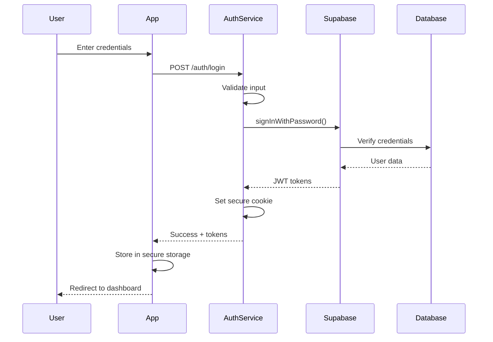


# Authentication System Technical Design
*Created: December 26, 2024*
*Status: DESIGN PHASE*

## 🎯 Overview
Complete technical design for QuizMentor authentication system using Supabase Auth with JWT tokens, OAuth, and comprehensive security measures.

---

## 🏗️ Architecture

### System Components
```
┌─────────────────┐     ┌──────────────────┐     ┌────────────────┐
│                 │────▶│                  │────▶│                │
│  React Native   │     │   Auth Service   │     │   Supabase     │
│   Client App    │◀────│   (Middleware)   │◀────│   Auth API     │
│                 │     │                  │     │                │
└─────────────────┘     └──────────────────┘     └────────────────┘
        │                        │                        │
        │                        │                        │
        ▼                        ▼                        ▼
┌─────────────────┐     ┌──────────────────┐     ┌────────────────┐
│  Local Storage  │     │   Rate Limiter   │     │   PostgreSQL   │
│  (Secure Keys)  │     │     (Redis)      │     │   (User Data)  │
└─────────────────┘     └──────────────────┘     └────────────────┘
```

### Authentication Flow


---

## 🔐 Security Implementation

### JWT Token Structure
```typescript
interface AccessToken {
  // Header
  alg: 'HS256';
  typ: 'JWT';
  
  // Payload
  sub: string;           // User ID
  email: string;         // User email
  role: 'user' | 'admin';// User role
  iat: number;           // Issued at
  exp: number;           // Expires (15 min)
  aud: string;           // Audience
  iss: string;           // Issuer
  
  // Custom claims
  metadata: {
    level: number;
    premium: boolean;
    verified: boolean;
  };
}

interface RefreshToken {
  tokenId: string;       // Unique token ID
  userId: string;        // User reference
  exp: number;           // Expires (7 days)
  family: string;        // Token family for rotation
}
```

### Token Management
```typescript
// services/auth/tokenManager.ts
class TokenManager {
  private readonly ACCESS_TOKEN_TTL = 15 * 60;      // 15 minutes
  private readonly REFRESH_TOKEN_TTL = 7 * 24 * 60 * 60; // 7 days
  private readonly REFRESH_THRESHOLD = 5 * 60;      // 5 minutes

  async refreshTokens(refreshToken: string): Promise<TokenPair> {
    // Implement refresh token rotation
    // Invalidate old token family on reuse detection
  }

  async validateAccessToken(token: string): Promise<DecodedToken> {
    // Verify signature
    // Check expiration
    // Validate claims
  }

  setupAutoRefresh(): void {
    // Background token refresh before expiry
  }
}
```

---

## 🔑 API Endpoints

### Authentication Endpoints
```yaml
POST /api/auth/register
  Body:
    email: string (required, email format)
    password: string (required, min 8 chars)
    username: string (required, 3-20 chars)
  Response:
    user: User object
    message: "Verification email sent"
  Errors:
    400: Invalid input
    409: Email already exists
    429: Rate limit exceeded

POST /api/auth/login
  Body:
    email: string
    password: string
    remember: boolean (optional)
  Response:
    user: User object
    accessToken: JWT string
    refreshToken: string (httpOnly cookie)
  Errors:
    401: Invalid credentials
    403: Account locked
    429: Rate limit exceeded

POST /api/auth/logout
  Headers:
    Authorization: Bearer <token>
  Response:
    message: "Logged out successfully"
  Side Effects:
    - Revoke refresh token
    - Clear server session
    - Broadcast logout event

POST /api/auth/refresh
  Body:
    refreshToken: string
  Response:
    accessToken: new JWT
    refreshToken: new token (rotated)
  Errors:
    401: Invalid refresh token
    403: Token family revoked (reuse detected)

POST /api/auth/forgot-password
  Body:
    email: string
  Response:
    message: "Reset email sent if account exists"
  Rate Limit:
    3 requests per hour per email

POST /api/auth/reset-password
  Body:
    token: string (from email)
    password: string (new password)
  Response:
    message: "Password updated"
  Side Effects:
    - Revoke all refresh tokens
    - Send confirmation email

GET /api/auth/verify-email
  Query:
    token: string
  Response:
    message: "Email verified"
    redirect: "/login?verified=true"

POST /api/auth/resend-verification
  Body:
    email: string
  Rate Limit:
    3 requests per hour
```

### OAuth Endpoints
```yaml
GET /api/auth/oauth/github
  Redirects to GitHub OAuth

GET /api/auth/oauth/github/callback
  Query:
    code: string
    state: string
  Response:
    Redirects to app with tokens

GET /api/auth/oauth/google
  Redirects to Google OAuth

GET /api/auth/oauth/google/callback
  Query:
    code: string
    state: string
  Response:
    Redirects to app with tokens
```

---

## 🛡️ Security Measures

### Rate Limiting
```typescript
// config/rateLimits.ts
export const rateLimits = {
  login: {
    windowMs: 15 * 60 * 1000, // 15 minutes
    max: 5,                    // 5 attempts
    skipSuccessfulRequests: true
  },
  register: {
    windowMs: 60 * 60 * 1000,  // 1 hour
    max: 5                      // 5 accounts per hour
  },
  passwordReset: {
    windowMs: 60 * 60 * 1000,  // 1 hour
    max: 3                      // 3 resets per hour
  },
  api: {
    windowMs: 60 * 1000,        // 1 minute
    max: 100                    // 100 requests per minute
  }
};
```

### Account Security
```typescript
// services/auth/accountSecurity.ts
class AccountSecurity {
  private readonly MAX_LOGIN_ATTEMPTS = 5;
  private readonly LOCKOUT_DURATION = 30 * 60; // 30 minutes
  
  async checkAccountLock(userId: string): Promise<boolean> {
    const attempts = await redis.get(`login_attempts:${userId}`);
    return parseInt(attempts) >= this.MAX_LOGIN_ATTEMPTS;
  }
  
  async recordFailedAttempt(email: string): Promise<void> {
    const key = `login_attempts:${email}`;
    await redis.incr(key);
    await redis.expire(key, this.LOCKOUT_DURATION);
    
    // Log security event
    await auditLog.record({
      event: 'FAILED_LOGIN',
      email,
      ip: request.ip,
      userAgent: request.headers['user-agent']
    });
  }
  
  async detectSuspiciousActivity(userId: string): Promise<boolean> {
    // Check for:
    // - Multiple IPs in short time
    // - Unusual location
    // - Rapid password changes
    // - Token reuse attempts
  }
}
```

### Password Requirements
```typescript
// validators/password.ts
export const passwordPolicy = {
  minLength: 8,
  maxLength: 128,
  requireUppercase: true,
  requireLowercase: true,
  requireNumbers: true,
  requireSpecialChars: false, // Optional
  
  validate(password: string): ValidationResult {
    const errors = [];
    
    if (password.length < this.minLength) {
      errors.push(`Minimum ${this.minLength} characters`);
    }
    
    if (this.requireUppercase && !/[A-Z]/.test(password)) {
      errors.push('At least one uppercase letter');
    }
    
    if (this.requireNumbers && !/\d/.test(password)) {
      errors.push('At least one number');
    }
    
    // Check against common passwords
    if (commonPasswords.includes(password.toLowerCase())) {
      errors.push('Password too common');
    }
    
    return { valid: errors.length === 0, errors };
  }
};
```

---

## 💾 Database Schema

### Users Table
```sql
CREATE TABLE users (
  id UUID PRIMARY KEY DEFAULT uuid_generate_v4(),
  email VARCHAR(255) UNIQUE NOT NULL,
  username VARCHAR(50) UNIQUE NOT NULL,
  password_hash TEXT NOT NULL,
  email_verified BOOLEAN DEFAULT FALSE,
  email_verified_at TIMESTAMP,
  created_at TIMESTAMP DEFAULT NOW(),
  updated_at TIMESTAMP DEFAULT NOW(),
  last_login_at TIMESTAMP,
  
  -- Security fields
  mfa_enabled BOOLEAN DEFAULT FALSE,
  mfa_secret TEXT,
  password_changed_at TIMESTAMP,
  locked_until TIMESTAMP,
  failed_login_count INTEGER DEFAULT 0,
  
  -- Profile fields
  avatar_url TEXT,
  display_name VARCHAR(100),
  bio TEXT,
  
  -- Indexes
  INDEX idx_users_email (email),
  INDEX idx_users_username (username),
  INDEX idx_users_created_at (created_at)
);
```

### Sessions Table
```sql
CREATE TABLE sessions (
  id UUID PRIMARY KEY DEFAULT uuid_generate_v4(),
  user_id UUID REFERENCES users(id) ON DELETE CASCADE,
  token_family VARCHAR(255) NOT NULL,
  refresh_token_hash TEXT NOT NULL,
  
  ip_address INET,
  user_agent TEXT,
  device_info JSONB,
  
  created_at TIMESTAMP DEFAULT NOW(),
  expires_at TIMESTAMP NOT NULL,
  revoked_at TIMESTAMP,
  revoked_reason VARCHAR(50),
  
  INDEX idx_sessions_user_id (user_id),
  INDEX idx_sessions_token_family (token_family),
  INDEX idx_sessions_expires_at (expires_at)
);
```

### Audit Log Table
```sql
CREATE TABLE auth_audit_log (
  id UUID PRIMARY KEY DEFAULT uuid_generate_v4(),
  user_id UUID REFERENCES users(id),
  event_type VARCHAR(50) NOT NULL,
  event_data JSONB,
  
  ip_address INET,
  user_agent TEXT,
  
  created_at TIMESTAMP DEFAULT NOW(),
  
  -- Indexes for common queries
  INDEX idx_audit_user_id (user_id),
  INDEX idx_audit_event_type (event_type),
  INDEX idx_audit_created_at (created_at)
);

-- Event types:
-- LOGIN_SUCCESS, LOGIN_FAILED, LOGOUT,
-- REGISTER, PASSWORD_RESET, PASSWORD_CHANGE,
-- MFA_ENABLED, MFA_DISABLED, ACCOUNT_LOCKED,
-- TOKEN_REFRESHED, TOKEN_REVOKED
```

---

## 📱 Client Implementation

### React Native Auth Hook
```typescript
// hooks/useAuth.ts
import { create } from 'zustand';
import AsyncStorage from '@react-native-async-storage/async-storage';

interface AuthState {
  user: User | null;
  isAuthenticated: boolean;
  isLoading: boolean;
  error: string | null;
  
  login: (email: string, password: string) => Promise<void>;
  logout: () => Promise<void>;
  register: (data: RegisterData) => Promise<void>;
  refreshToken: () => Promise<void>;
  checkAuth: () => Promise<void>;
}

export const useAuth = create<AuthState>((set, get) => ({
  user: null,
  isAuthenticated: false,
  isLoading: true,
  error: null,
  
  login: async (email, password) => {
    set({ isLoading: true, error: null });
    
    try {
      const response = await authService.login(email, password);
      
      // Store tokens securely
      await SecureStore.setItemAsync('accessToken', response.accessToken);
      await SecureStore.setItemAsync('refreshToken', response.refreshToken);
      
      // Set user state
      set({ 
        user: response.user,
        isAuthenticated: true,
        isLoading: false 
      });
      
      // Start token refresh timer
      tokenManager.setupAutoRefresh();
      
    } catch (error) {
      set({ 
        error: error.message,
        isLoading: false 
      });
    }
  },
  
  // ... other methods
}));
```

### Protected Route Component
```typescript
// components/ProtectedRoute.tsx
export function ProtectedRoute({ children }) {
  const { isAuthenticated, isLoading, checkAuth } = useAuth();
  const navigation = useNavigation();
  
  useEffect(() => {
    checkAuth();
  }, []);
  
  useEffect(() => {
    if (!isLoading && !isAuthenticated) {
      navigation.navigate('Login');
    }
  }, [isAuthenticated, isLoading]);
  
  if (isLoading) {
    return <LoadingScreen />;
  }
  
  return isAuthenticated ? children : null;
}
```

---

## 🔄 Session Management

### Session Lifecycle
```typescript
// services/auth/sessionManager.ts
class SessionManager {
  async createSession(userId: string, deviceInfo: DeviceInfo): Promise<Session> {
    const tokenFamily = crypto.randomUUID();
    const refreshToken = this.generateRefreshToken();
    
    const session = await db.sessions.create({
      user_id: userId,
      token_family: tokenFamily,
      refresh_token_hash: await hash(refreshToken),
      ip_address: deviceInfo.ip,
      user_agent: deviceInfo.userAgent,
      device_info: deviceInfo.metadata,
      expires_at: new Date(Date.now() + REFRESH_TOKEN_TTL)
    });
    
    return { session, refreshToken };
  }
  
  async validateSession(sessionId: string): Promise<boolean> {
    const session = await db.sessions.findById(sessionId);
    
    if (!session) return false;
    if (session.revoked_at) return false;
    if (session.expires_at < new Date()) return false;
    
    return true;
  }
  
  async revokeSessionFamily(tokenFamily: string, reason: string): Promise<void> {
    // Revoke all tokens in the family (potential token reuse)
    await db.sessions.updateMany({
      where: { token_family: tokenFamily },
      data: { 
        revoked_at: new Date(),
        revoked_reason: reason
      }
    });
    
    // Log security event
    await auditLog.record({
      event: 'TOKEN_FAMILY_REVOKED',
      reason,
      token_family: tokenFamily
    });
  }
}
```

---

## 🔔 Multi-Factor Authentication (Future)

### MFA Flow
```typescript
// services/auth/mfa.ts
class MFAService {
  async setupMFA(userId: string): Promise<MFASetup> {
    const secret = speakeasy.generateSecret({
      name: 'QuizMentor',
      length: 32
    });
    
    const qrCode = await QRCode.toDataURL(secret.otpauth_url);
    
    // Store encrypted secret
    await db.users.update({
      where: { id: userId },
      data: { 
        mfa_secret: encrypt(secret.base32),
        mfa_enabled: false // Enable after verification
      }
    });
    
    return { qrCode, secret: secret.base32 };
  }
  
  async verifyMFA(userId: string, token: string): Promise<boolean> {
    const user = await db.users.findById(userId);
    const secret = decrypt(user.mfa_secret);
    
    const verified = speakeasy.totp.verify({
      secret,
      encoding: 'base32',
      token,
      window: 2 // Allow 2 time steps tolerance
    });
    
    if (verified) {
      await db.users.update({
        where: { id: userId },
        data: { mfa_enabled: true }
      });
    }
    
    return verified;
  }
}
```

---

## 📊 Monitoring & Alerts

### Key Metrics to Track
```yaml
Authentication Metrics:
  - Login success rate
  - Login failure rate
  - Average login time
  - Password reset requests
  - Registration conversions
  - Token refresh rate
  - Session duration

Security Metrics:
  - Failed login attempts per user
  - Account lockouts
  - Suspicious activity detected
  - Token reuse attempts
  - Unusual location logins
  - MFA adoption rate

Performance Metrics:
  - Auth endpoint response time
  - Token validation time
  - Database query time
  - Cache hit rate
  - Redis connection pool usage
```

### Alert Thresholds
```yaml
Critical Alerts:
  - Login success rate < 95%
  - Auth service down
  - Database connection failures
  - Token signing key compromise
  - Mass account lockouts (>10 in 5min)

Warning Alerts:
  - Failed login spike (>50 in 5min)
  - Slow auth response (>1s P95)
  - High token refresh rate
  - Redis memory usage >80%
  - Unusual geographic patterns
```

---

## 🚀 Implementation Checklist

### Phase 1: Basic Auth (Week 1)
- [ ] Setup Supabase project
- [ ] Create database tables
- [ ] Implement register endpoint
- [ ] Implement login endpoint
- [ ] Implement logout endpoint
- [ ] Basic JWT validation
- [ ] Password hashing
- [ ] Email validation

### Phase 2: Security (Week 2)
- [ ] Rate limiting
- [ ] Account lockout
- [ ] Refresh token rotation
- [ ] Audit logging
- [ ] Secure token storage
- [ ] CORS configuration
- [ ] HTTPS enforcement
- [ ] Security headers

### Phase 3: Features (Week 3)
- [ ] Password reset flow
- [ ] Email verification
- [ ] OAuth (GitHub)
- [ ] Remember me option
- [ ] Session management
- [ ] Device tracking
- [ ] Auto token refresh
- [ ] Logout from all devices

### Phase 4: Production (Week 4)
- [ ] Error handling
- [ ] Monitoring setup
- [ ] Performance optimization
- [ ] Load testing
- [ ] Security audit
- [ ] Documentation
- [ ] Admin tools
- [ ] Support workflows

---

## 🔧 Environment Configuration

### Required Environment Variables
```bash
# .env.production
SUPABASE_URL=https://xxx.supabase.co
SUPABASE_ANON_KEY=xxx
SUPABASE_SERVICE_KEY=xxx # Server only
JWT_SECRET=xxx # 256-bit key
REFRESH_TOKEN_SECRET=xxx
SESSION_SECRET=xxx

# OAuth
GITHUB_CLIENT_ID=xxx
GITHUB_CLIENT_SECRET=xxx
GOOGLE_CLIENT_ID=xxx
GOOGLE_CLIENT_SECRET=xxx

# Security
BCRYPT_ROUNDS=12
TOKEN_EXPIRY=900 # 15 minutes
REFRESH_TOKEN_EXPIRY=604800 # 7 days

# Redis
REDIS_URL=redis://xxx
REDIS_PASSWORD=xxx

# Email
SMTP_HOST=smtp.sendgrid.net
SMTP_PORT=587
SMTP_USER=xxx
SMTP_PASS=xxx
FROM_EMAIL=noreply@quizmentor.com

# Monitoring
SENTRY_DSN=xxx
DATADOG_API_KEY=xxx
```

---

## ⚠️ Common Pitfalls to Avoid

1. **Storing tokens in localStorage** - Use secure storage
2. **Not rotating refresh tokens** - Implement rotation
3. **Weak password requirements** - Enforce strong passwords
4. **No rate limiting** - Protect against brute force
5. **Missing audit logs** - Track all auth events
6. **Synchronous token validation** - Use caching
7. **No account recovery** - Implement password reset
8. **Ignoring token expiry** - Handle expiration gracefully
9. **Plain text secrets** - Always encrypt sensitive data
10. **No monitoring** - Track metrics and alerts

---

*This design document should be reviewed and approved before implementation begins.*

