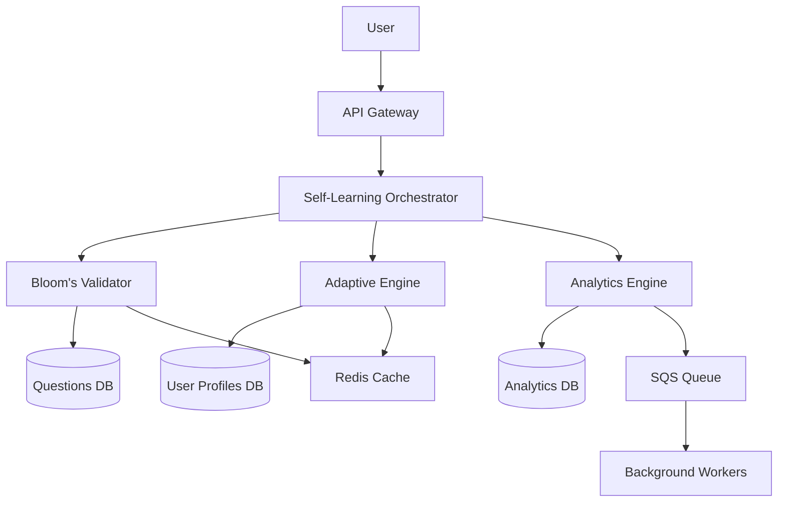


# 📚 Self-Learning System Operational Runbook

## Table of Contents
1. [System Overview](#system-overview)
2. [How It Works](#how-it-works)
3. [Architecture Deep Dive](#architecture-deep-dive)
4. [Operational Procedures](#operational-procedures)
5. [Monitoring & Alerts](#monitoring--alerts)
6. [Troubleshooting Guide](#troubleshooting-guide)
7. [Incident Response](#incident-response)
8. [Performance Tuning](#performance-tuning)
9. [Data Management](#data-management)
10. [Security Operations](#security-operations)

---

# 🎯 System Overview

## What Is This System?

The QuizMentor Self-Learning System is an AI-powered educational platform that:
- **Validates** questions using Bloom's Taxonomy (6 cognitive levels)
- **Adapts** to each user's learning style and performance
- **Optimizes** for flow state (70-85% success rate)
- **Personalizes** learning paths with ML algorithms
- **Tracks** progress with comprehensive analytics

## Key Components



## Core Metrics
- **Response Time**: < 200ms (p50), < 1s (p99)
- **Accuracy**: 90%+ validation accuracy
- **Flow State**: 30%+ achievement rate
- **Availability**: 99.9% uptime target
- **Cost**: < $0.001 per session

---

# 🔄 How It Works

## 1. Question Validation Flow

### Step-by-Step Process:

```typescript
// 1. Question enters system
POST /api/questions/validate
{
  "text": "Analyze the impact of climate change",
  "type": "essay",
  "difficulty": 4
}

// 2. Bloom's Validator processes
BloomValidator → Classify → Analyze → Score → Suggest

// 3. Returns classification
{
  "level": "Analyze",
  "confidence": 0.85,
  "complexity": 0.72,
  "suggestions": ["Add rubric", "Include examples"]
}
```

### How Bloom's Classification Works:

1. **Text Analysis**
   - Scans for keyword indicators (analyze, evaluate, create, etc.)
   - Identifies cognitive verbs
   - Matches against taxonomy patterns

2. **Complexity Calculation**
   ```
   Complexity = (0.1 × WordCount) + 
                (0.2 × ConceptCount) + 
                (0.3 × RelationshipComplexity) +
                (0.2 × AbstractionLevel) +
                (0.2 × ProblemComplexity)
   ```

3. **Confidence Scoring**
   - Clear keyword matches: +5% per match
   - Question type alignment: +15%
   - Learning objective present: +10%
   - Low ambiguity: +10%

## 2. Adaptive Learning Algorithm

### The Magic Formula:

```typescript
OptimalDifficulty = CurrentSkill + (0.3 × PerformanceTrend)
```

### How It Adapts:

1. **Initial Assessment**
   ```
   New User → Baseline Test → Skill Level (1-5)
   ```

2. **Question Selection Strategy**
   ```
   30% - Spaced Repetition (review old content)
   25% - Knowledge Gaps (target weaknesses)
   20% - Difficulty Curve (gradual progression)
   15% - Learning Style (visual/verbal/logical)
   10% - Novel Content (exploration)
   ```

3. **Real-Time Adjustment**
   ```
   If (2 wrong in a row) → Reduce difficulty by 0.5
   If (3 correct in a row) → Increase difficulty by 0.3
   If (accuracy < 60%) → Activate comeback mode
   ```

## 3. Flow State Optimization

### The Flow Curve:

```
Difficulty
    ^
  5 |      Peak
  4 |    /    \
  3 |   /      \
  2 |  /        \
  1 | /          \
    +--------------> Questions
      1  2  3  4  5  6  7
```

### Implementation:
1. **Warm-up** (Q1-2): Easy questions to build confidence
2. **Build-up** (Q3-4): Gradual difficulty increase
3. **Peak** (Q5): Maximum challenge at 70% position
4. **Cool-down** (Q6-7): Easier questions to end positively

## 4. Learning Plan Generation

### Milestone Calculation:

```typescript
function generateMilestones(current: number, target: number, days: number) {
  const gap = target - current;
  const milestones = Math.max(3, gap * 2);
  
  for (let i = 0; i < milestones; i++) {
    const progress = (i + 1) / milestones;
    yield {
      level: current + (gap * progress),
      mastery: 0.7 + (progress * 0.2),
      sessions: 5 + (i * 2),
      xp: 100 * (i + 1)
    };
  }
}
```

---

# 🏗️ Architecture Deep Dive

## Service Architecture

### 1. Self-Learning Orchestrator
**Purpose**: Central coordinator for all learning features

**Responsibilities**:
- Session generation
- Learning plan creation
- Analytics processing
- Feedback loop management

**Key Methods**:
```typescript
generateOptimalSession(userId, categoryId, preferences)
createLearningPlan(userId, targetLevel, timeframe)
analyzeLearningPatterns(userId)
processFeedbackLoop(userId, results)
```

### 2. Bloom's Taxonomy Validator
**Purpose**: Pedagogical validation of questions

**Process**:
1. Text analysis for cognitive indicators
2. Knowledge dimension classification
3. Complexity calculation
4. Suggestion generation

**Validation Rules**:
- Must have learning objective (weight: 30%)
- Appropriate complexity (weight: 25%)
- Valid assessment type (weight: 25%)
- Clear instructions (weight: 20%)

### 3. Adaptive Learning Engine
**Purpose**: Personalization and optimization

**Core Algorithms**:
- **SM-2 Spaced Repetition**: Forgetting curve modeling
- **Elo Rating System**: Skill level calculation
- **Flow State Optimizer**: Challenge-skill balance
- **Knowledge Gap Detector**: Weakness identification

## Data Flow Architecture

```yaml
Input Layer:
  - User Actions
  - Question Submissions
  - Performance Data

Processing Layer:
  - Validation Pipeline
  - Adaptation Engine
  - Analytics Processor

Storage Layer:
  - Questions (DynamoDB/Postgres)
  - User Profiles (DynamoDB/Postgres)
  - Analytics (TimeSeries DB)
  - Cache (Redis)

Output Layer:
  - Personalized Sessions
  - Learning Plans
  - Analytics Dashboard
  - Recommendations
```

## Caching Strategy

### L1 Cache (Memory - 5 min TTL)
```typescript
LRUCache: {
  max: 500 items,
  ttl: 300 seconds,
  updateAgeOnGet: true
}
```

### L2 Cache (Redis - 1 hour TTL)
```typescript
Redis: {
  questions: 3600s TTL,
  userProfiles: 1800s TTL,
  sessions: 900s TTL
}
```

### Cache Invalidation
- On question update → Delete question:${id}
- On user progress → Delete user:${id}:profile
- On session complete → Delete session:${id}

---

# 📋 Operational Procedures

## Daily Operations

### Morning Checklist (9 AM)
```bash
# 1. Check system health
curl https://api.quizmentor.com/health

# 2. Review overnight metrics
npm run metrics:daily

# 3. Check error rates
npm run logs:errors --since="12 hours ago"

# 4. Verify cache performance
redis-cli INFO stats | grep hit_rate

# 5. Review queue depth
aws sqs get-queue-attributes --queue-url $QUEUE_URL
```

### Afternoon Review (2 PM)
```bash
# 1. Check active sessions
npm run sessions:active

# 2. Monitor response times
npm run metrics:performance

# 3. Review user feedback
npm run feedback:recent

# 4. Check database connections
npm run db:connections
```

### End of Day (6 PM)
```bash
# 1. Generate daily report
npm run report:daily

# 2. Backup critical data
npm run backup:daily

# 3. Clear old cache entries
npm run cache:cleanup

# 4. Archive logs
npm run logs:archive
```

## Deployment Procedures

### Pre-Deployment Checklist
```bash
# 1. Run all tests
npm run test:all

# 2. Check test coverage
npm run test:coverage
# Minimum: 80% coverage required

# 3. Run performance tests
npm run test:performance
# Verify: p99 < 1s

# 4. Validate configuration
npm run config:validate

# 5. Create backup
npm run backup:pre-deploy
```

### Deployment Steps
```bash
# 1. Blue-Green Deployment
./deploy.sh blue-green production

# 2. Smoke Tests
npm run test:smoke --env=production

# 3. Monitor metrics (15 minutes)
npm run monitor:deployment

# 4. Gradual traffic shift
./traffic-shift.sh 10 25 50 100

# 5. Full validation
npm run test:e2e --env=production
```

### Rollback Procedure
```bash
# If issues detected:

# 1. Immediate rollback
./rollback.sh immediate

# 2. Verify rollback
npm run health:check

# 3. Analyze failure
npm run logs:deployment --failed

# 4. Create incident report
npm run incident:create
```

## Database Operations

### Schema Migrations
```bash
# 1. Test migration locally
npm run db:migrate:test

# 2. Backup production
npm run db:backup:prod

# 3. Run migration
npm run db:migrate:prod

# 4. Verify migration
npm run db:verify
```

### Data Cleanup
```sql
-- Weekly cleanup tasks

-- 1. Remove old sessions (>30 days)
DELETE FROM sessions 
WHERE created_at < NOW() - INTERVAL '30 days';

-- 2. Archive analytics (>90 days)
INSERT INTO analytics_archive 
SELECT * FROM analytics 
WHERE created_at < NOW() - INTERVAL '90 days';

-- 3. Vacuum tables
VACUUM ANALYZE questions;
VACUUM ANALYZE user_profiles;
```

---

# 📊 Monitoring & Alerts

## Key Metrics to Monitor

### Application Metrics
```yaml
Response Time:
  - Target: < 200ms (p50)
  - Alert: > 500ms (p50)
  - Critical: > 1s (p50)

Error Rate:
  - Target: < 0.1%
  - Alert: > 1%
  - Critical: > 5%

Throughput:
  - Target: 1000 req/s
  - Alert: < 100 req/s
  - Critical: < 10 req/s
```

### Business Metrics
```yaml
Flow State Achievement:
  - Target: > 30%
  - Alert: < 20%
  - Critical: < 10%

Question Validation Accuracy:
  - Target: > 90%
  - Alert: < 80%
  - Critical: < 70%

User Engagement:
  - Target: > 15 min/session
  - Alert: < 10 min/session
  - Critical: < 5 min/session
```

## Alert Configuration

### CloudWatch Alarms
```typescript
// High error rate alarm
{
  MetricName: 'Errors',
  Threshold: 10,
  Period: 300,
  EvaluationPeriods: 2,
  Actions: ['SNS:PagerDuty']
}

// High latency alarm
{
  MetricName: 'Latency',
  Threshold: 1000,
  Period: 60,
  EvaluationPeriods: 3,
  Actions: ['SNS:Slack']
}
```

### Custom Metrics
```typescript
// Track Bloom's validation performance
metrics.timing('bloom.validation.duration', duration);
metrics.increment('bloom.validation.count');
metrics.gauge('bloom.validation.confidence', confidence);

// Track adaptive learning
metrics.histogram('adaptive.session.questions', questionCount);
metrics.gauge('adaptive.flow.achievement', flowRate);
metrics.timing('adaptive.generation.time', generationTime);
```

---

# 🔧 Troubleshooting Guide

## Common Issues & Solutions

### Issue 1: Slow Response Times
```bash
# Diagnosis
npm run diagnostics:performance

# Check cache hit rate
redis-cli INFO stats | grep keyspace_hits

# Check database slow queries
npm run db:slow-queries

# Solutions:
1. Increase cache TTL
2. Add database indexes
3. Scale read replicas
4. Implement query optimization
```

### Issue 2: Low Flow State Achievement
```typescript
// Check current settings
const config = await getConfig('adaptive.flow');

// Adjust parameters
await updateConfig('adaptive.flow', {
  optimalChallenge: 0.75,  // Adjust ±0.05
  challengeWindow: 0.15,    // Increase window
  sweetSpotQuestions: 7     // Optimal count
});

// Monitor results
await monitorFlowState(userId, 24); // 24 hours
```

### Issue 3: Inaccurate Bloom's Classification
```typescript
// Retrain validation patterns
await retrainValidator({
  additionalKeywords: ['examine', 'investigate'],
  adjustWeights: {
    keywords: 0.45,      // Increase from 0.4
    questionType: 0.35,  // Increase from 0.3
    cognitiveProcess: 0.2
  }
});

// Validate improvements
const testSet = await getTestQuestions();
const results = await validateBatch(testSet);
console.log('Accuracy:', results.accuracy);
```

### Issue 4: Memory Leaks
```bash
# Detect memory leaks
npm run monitor:memory

# Profile heap usage
node --inspect app.js
# Open chrome://inspect

# Common fixes:
1. Clear event listeners
2. Dispose unused subscriptions
3. Limit cache size
4. Implement proper cleanup
```

## Debug Commands

```bash
# Enable debug logging
DEBUG=learning:* npm start

# Trace specific user
npm run trace:user --id=user123

# Analyze session
npm run analyze:session --id=session456

# Export metrics
npm run metrics:export --format=json

# Generate performance report
npm run report:performance --days=7
```

---

# 🚨 Incident Response

## Severity Levels

### SEV 1 - Critical (Response: Immediate)
- Complete service outage
- Data loss or corruption
- Security breach
- Flow state < 5%

### SEV 2 - Major (Response: 15 minutes)
- Partial service degradation
- Response time > 2s
- Error rate > 5%
- Cache failure

### SEV 3 - Minor (Response: 1 hour)
- Single feature failure
- Non-critical alerts
- Performance degradation
- UI issues

## Incident Response Playbook

### Step 1: Assess (5 minutes)
```bash
# Quick health check
./scripts/incident-assess.sh

# Check status page
curl https://status.quizmentor.com

# Review recent deployments
git log --oneline -10

# Check monitoring dashboard
open https://monitoring.quizmentor.com
```

### Step 2: Mitigate (10 minutes)
```bash
# Option 1: Rollback
./rollback.sh immediate

# Option 2: Scale up
./scale.sh up 200%

# Option 3: Enable circuit breaker
./circuit-breaker.sh enable

# Option 4: Redirect traffic
./traffic.sh redirect backup-region
```

### Step 3: Investigate (30 minutes)
```bash
# Collect logs
./collect-logs.sh --incident-id=INC001

# Generate timeline
./timeline.sh --start="2 hours ago"

# Analyze metrics
./analyze-incident.sh --id=INC001

# Create report
./incident-report.sh create
```

### Step 4: Resolve
```bash
# Apply fix
git checkout -b hotfix/INC001
# ... make changes ...
git commit -m "fix: resolve INC001"

# Deploy fix
./deploy.sh hotfix production

# Verify resolution
./verify-fix.sh INC001

# Update status page
./status-update.sh resolved
```

### Step 5: Post-Mortem
```markdown
# Incident Post-Mortem Template

## Summary
- Incident ID: INC001
- Duration: 45 minutes
- Impact: 2000 users affected
- Root Cause: Cache invalidation bug

## Timeline
- 14:00 - Alert triggered
- 14:05 - Team notified
- 14:15 - Mitigation applied
- 14:45 - Full resolution

## Root Cause Analysis
- Primary: Race condition in cache update
- Contributing: Insufficient testing

## Action Items
1. Add distributed locks
2. Increase test coverage
3. Improve monitoring

## Lessons Learned
- Need better cache invalidation strategy
- Require load testing before deploy
```

---

# ⚡ Performance Tuning

## Query Optimization

### Optimize Bloom's Validation
```sql
-- Add indexes for common queries
CREATE INDEX idx_questions_bloom_level ON questions(bloom_level);
CREATE INDEX idx_questions_category_difficulty ON questions(category_id, difficulty);
CREATE INDEX idx_questions_created ON questions(created_at DESC);

-- Optimize user queries
CREATE INDEX idx_users_last_active ON user_profiles(last_active);
CREATE INDEX idx_sessions_user_date ON sessions(user_id, created_at DESC);
```

### Caching Strategies
```typescript
// Implement read-through cache
async function getQuestion(id: string) {
  // Check L1 cache
  let question = memCache.get(`q:${id}`);
  if (question) return question;
  
  // Check L2 cache
  question = await redis.get(`question:${id}`);
  if (question) {
    memCache.set(`q:${id}`, question);
    return JSON.parse(question);
  }
  
  // Load from database
  question = await db.questions.findById(id);
  
  // Update both caches
  await redis.setex(`question:${id}`, 3600, JSON.stringify(question));
  memCache.set(`q:${id}`, question);
  
  return question;
}
```

## Resource Optimization

### Memory Management
```typescript
// Implement connection pooling
const pool = new Pool({
  max: 20,              // Maximum connections
  min: 5,               // Minimum connections
  idleTimeoutMillis: 30000,
  connectionTimeoutMillis: 2000
});

// Implement request batching
const batcher = new DataLoader(async (ids) => {
  const results = await db.questions.findByIds(ids);
  return ids.map(id => results.find(r => r.id === id));
});
```

### CPU Optimization
```typescript
// Use worker threads for heavy computation
const worker = new Worker('./bloom-worker.js');

async function validateBatch(questions: Question[]) {
  return new Promise((resolve) => {
    worker.postMessage({ cmd: 'validate', questions });
    worker.once('message', resolve);
  });
}

// Implement request debouncing
const debouncedValidate = debounce(validate, 100);
```

---

# 📁 Data Management

## Backup Strategy

### Daily Backups
```bash
#!/bin/bash
# Daily backup script

DATE=$(date +%Y%m%d)
BACKUP_DIR="/backups/daily"

# Backup databases
pg_dump $DATABASE_URL > $BACKUP_DIR/postgres_$DATE.sql
mongodump --uri $MONGO_URL --out $BACKUP_DIR/mongo_$DATE

# Backup Redis
redis-cli --rdb $BACKUP_DIR/redis_$DATE.rdb

# Compress and upload to S3
tar -czf $BACKUP_DIR/backup_$DATE.tar.gz $BACKUP_DIR/*_$DATE*
aws s3 cp $BACKUP_DIR/backup_$DATE.tar.gz s3://backups/daily/

# Keep only 30 days of backups
find $BACKUP_DIR -mtime +30 -delete
```

### Recovery Procedures
```bash
# Restore from backup
./restore.sh --date=20240825 --type=full

# Point-in-time recovery
./restore.sh --timestamp="2024-08-25 14:30:00"

# Selective restore
./restore.sh --table=questions --date=20240825
```

## Data Retention

### Retention Policies
```yaml
User Data:
  - Active: Indefinite
  - Inactive (1 year): Archive
  - Deleted: 30 days then purge

Session Data:
  - Active: 30 days
  - Completed: 90 days
  - Archive: 1 year

Analytics:
  - Raw: 90 days
  - Aggregated: 2 years
  - Reports: Indefinite
```

### GDPR Compliance
```typescript
// User data export
async function exportUserData(userId: string) {
  const data = {
    profile: await db.users.findById(userId),
    sessions: await db.sessions.find({ userId }),
    analytics: await db.analytics.find({ userId }),
    questions: await db.userQuestions.find({ userId })
  };
  
  return generateGDPRReport(data);
}

// User data deletion
async function deleteUserData(userId: string) {
  await db.users.softDelete(userId);
  await db.sessions.anonymize({ userId });
  await db.analytics.remove({ userId });
  
  // Schedule hard delete after 30 days
  await scheduleHardDelete(userId, 30);
}
```

---

# 🔒 Security Operations

## Security Checklist

### API Security
```typescript
// Rate limiting
app.use(rateLimit({
  windowMs: 15 * 60 * 1000, // 15 minutes
  max: 100, // Max requests
  message: 'Too many requests'
}));

// Input validation
app.use(helmet());
app.use(express.json({ limit: '10mb' }));
app.use(mongoSanitize());

// Authentication
app.use(jwt({
  secret: process.env.JWT_SECRET,
  algorithms: ['HS256']
}));
```

### Data Protection
```typescript
// Encryption at rest
const encrypted = crypto.AES.encrypt(
  JSON.stringify(data),
  process.env.ENCRYPTION_KEY
).toString();

// Encryption in transit
app.use(enforce.HTTPS());

// Sensitive data masking
function maskSensitive(data: any) {
  const masked = { ...data };
  if (masked.email) masked.email = mask(masked.email);
  if (masked.apiKey) masked.apiKey = '***';
  return masked;
}
```

## Security Monitoring

### Audit Logging
```typescript
// Log all critical operations
async function auditLog(action: string, details: any) {
  await db.auditLogs.create({
    timestamp: new Date(),
    action,
    userId: details.userId,
    ip: details.ip,
    userAgent: details.userAgent,
    details: maskSensitive(details)
  });
}

// Monitor suspicious activity
async function detectAnomaly(userId: string) {
  const recentActivity = await getRecentActivity(userId);
  
  if (recentActivity.failedLogins > 5) {
    await lockAccount(userId);
    await notifySecurityTeam(userId, 'Multiple failed logins');
  }
  
  if (recentActivity.requestRate > 1000) {
    await enableRateLimiting(userId);
    await notifySecurityTeam(userId, 'Unusual request rate');
  }
}
```

---

# 📈 Capacity Planning

## Growth Projections

```yaml
Current (Month 1):
  - Users: 1,000
  - Sessions/day: 5,000
  - Storage: 10GB
  - Cost: $0-10/month

Growth (Month 6):
  - Users: 10,000
  - Sessions/day: 50,000
  - Storage: 100GB
  - Cost: $70/month

Scale (Month 12):
  - Users: 50,000
  - Sessions/day: 250,000
  - Storage: 500GB
  - Cost: $200/month
```

## Scaling Triggers

```yaml
Auto-Scaling Rules:
  CPU > 70%: Scale up 50%
  Memory > 80%: Scale up 25%
  Queue Depth > 1000: Add worker
  Response Time > 500ms: Add instance
  
Scale-Down Rules:
  CPU < 30%: Scale down 25%
  Memory < 40%: Scale down 25%
  Queue Depth < 100: Remove worker
  Response Time < 100ms: Remove instance
```

---

# 📝 Appendix

## Configuration Files

### Environment Variables
```bash
# .env.production
NODE_ENV=production
DATABASE_URL=postgresql://...
REDIS_URL=redis://...
JWT_SECRET=...
ENCRYPTION_KEY=...
SENTRY_DSN=...
AWS_REGION=us-east-1
S3_BUCKET=quizmentor-prod
SQS_QUEUE_URL=...
```

### Docker Configuration
```dockerfile
# Dockerfile
FROM node:18-alpine
WORKDIR /app
COPY package*.json ./
RUN npm ci --only=production
COPY . .
RUN npm run build
EXPOSE 3000
CMD ["npm", "start"]
```

### Kubernetes Deployment
```yaml
apiVersion: apps/v1
kind: Deployment
metadata:
  name: learning-system
spec:
  replicas: 3
  selector:
    matchLabels:
      app: learning
  template:
    metadata:
      labels:
        app: learning
    spec:
      containers:
      - name: app
        image: quizmentor/learning:latest
        ports:
        - containerPort: 3000
        env:
        - name: NODE_ENV
          value: production
        resources:
          requests:
            memory: "256Mi"
            cpu: "250m"
          limits:
            memory: "512Mi"
            cpu: "500m"
        livenessProbe:
          httpGet:
            path: /health
            port: 3000
          initialDelaySeconds: 30
          periodSeconds: 10
        readinessProbe:
          httpGet:
            path: /ready
            port: 3000
          initialDelaySeconds: 5
          periodSeconds: 5
```

## Useful Scripts

### Health Check Script
```bash
#!/bin/bash
# health-check.sh

echo "🔍 Checking System Health..."

# API Health
API_STATUS=$(curl -s -o /dev/null -w "%{http_code}" https://api.quizmentor.com/health)
if [ $API_STATUS -eq 200 ]; then
    echo "✅ API: Healthy"
else
    echo "❌ API: Unhealthy (Status: $API_STATUS)"
fi

# Database Health
DB_STATUS=$(psql $DATABASE_URL -c "SELECT 1" > /dev/null 2>&1 && echo "ok" || echo "fail")
if [ "$DB_STATUS" = "ok" ]; then
    echo "✅ Database: Connected"
else
    echo "❌ Database: Connection Failed"
fi

# Redis Health
REDIS_STATUS=$(redis-cli ping 2>/dev/null)
if [ "$REDIS_STATUS" = "PONG" ]; then
    echo "✅ Redis: Connected"
else
    echo "❌ Redis: Connection Failed"
fi

# Queue Depth
QUEUE_DEPTH=$(aws sqs get-queue-attributes --queue-url $QUEUE_URL --attribute-names ApproximateNumberOfMessages --query 'Attributes.ApproximateNumberOfMessages' --output text)
echo "📊 Queue Depth: $QUEUE_DEPTH messages"

# Active Sessions
SESSIONS=$(redis-cli get active_sessions 2>/dev/null || echo "0")
echo "👥 Active Sessions: $SESSIONS"

echo "✨ Health Check Complete!"
```

### Performance Test Script
```bash
#!/bin/bash
# perf-test.sh

echo "⚡ Running Performance Tests..."

# Test Bloom's Validation
echo "Testing Bloom's Validation..."
ab -n 1000 -c 10 -T application/json -p test-question.json \
   https://api.quizmentor.com/validate

# Test Session Generation
echo "Testing Session Generation..."
ab -n 100 -c 5 -T application/json -p test-session.json \
   https://api.quizmentor.com/session/generate

# Test Analytics Query
echo "Testing Analytics..."
ab -n 500 -c 10 \
   https://api.quizmentor.com/analytics/user/test

echo "✅ Performance Tests Complete!"
```

## Contact Information

### Escalation Matrix
```yaml
Level 1 (Business Hours):
  - Slack: #learning-system
  - Email: support@quizmentor.com
  - Response: 1 hour

Level 2 (Critical):
  - PagerDuty: learning-oncall
  - Phone: +1-XXX-XXX-XXXX
  - Response: 15 minutes

Level 3 (Emergency):
  - Incident Commander: John Doe
  - Phone: +1-XXX-XXX-XXXX
  - Backup: Jane Smith
  - Response: Immediate
```

### Team Responsibilities
```yaml
Learning Team:
  - Bloom's Validation
  - Adaptive Algorithms
  - Learning Plans

Platform Team:
  - Infrastructure
  - Monitoring
  - Deployments

Data Team:
  - Analytics
  - Reporting
  - ML Models

Security Team:
  - Access Control
  - Compliance
  - Auditing
```

---

## Quick Reference Card

```bash
# 🚀 Common Commands
npm run dev                      # Start development
npm run test:all                 # Run all tests
npm run deploy:prod              # Deploy to production
npm run rollback                 # Rollback deployment
npm run logs:tail                # Tail logs
npm run metrics:dashboard        # Open metrics dashboard
npm run incident:create          # Create incident
npm run backup:now               # Create backup

# 🔍 Debugging
DEBUG=learning:* npm start       # Enable debug logs
npm run trace:user --id=123      # Trace user activity
npm run analyze:session --id=456 # Analyze session
npm run db:explain --query="..." # Explain query

# 📊 Monitoring
npm run health:check             # Health check
npm run metrics:export           # Export metrics
npm run report:daily             # Generate daily report
npm run alerts:test              # Test alerts

# 🔧 Maintenance
npm run cache:clear              # Clear cache
npm run db:vacuum                # Vacuum database
npm run logs:archive             # Archive old logs
npm run cleanup:old-sessions     # Clean old sessions
```

---

*Last Updated: August 2024*
*Version: 1.0.0*
*Next Review: September 2024*

