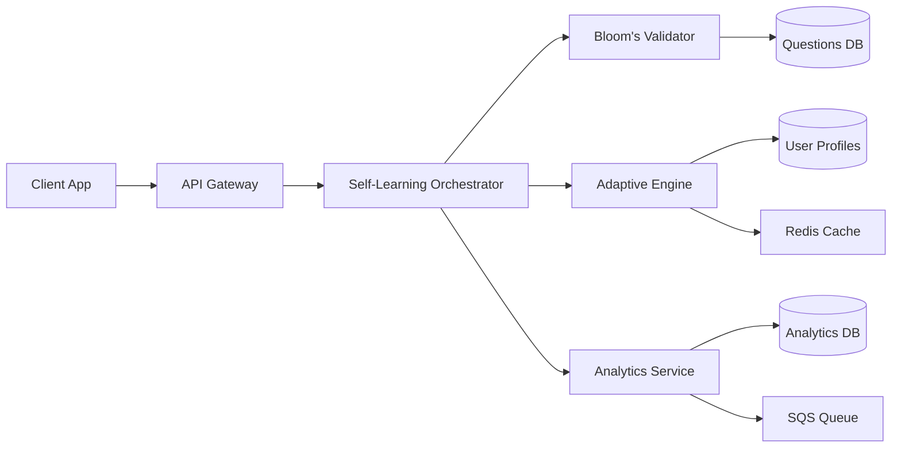


# 🎓 QuizMentor Self-Learning System: Complete User & Developer Guide

## Table of Contents
- [For Educators](#for-educators)
- [For Developers](#for-developers)
- [For Students](#for-students)
- [System Concepts](#system-concepts)
- [API Reference](#api-reference)
- [Integration Guide](#integration-guide)
- [Best Practices](#best-practices)
- [FAQ](#faq)

---

# 👩‍🏫 For Educators

## Understanding the System

### What Makes Our System Special?

Our self-learning system uses **three core innovations**:

1. **Bloom's Taxonomy Validation**: Every question is automatically classified into one of 6 cognitive levels
2. **Adaptive Learning**: The system adjusts difficulty in real-time based on student performance
3. **Flow State Optimization**: Maintains 70-85% success rate for optimal learning

### The 6 Levels of Learning (Bloom's Taxonomy)

```
Level 1: REMEMBER 🧠
├─ Keywords: Define, List, Name, Recall
├─ Example: "What is the capital of France?"
└─ Assessment: Multiple choice, True/False

Level 2: UNDERSTAND 💡
├─ Keywords: Explain, Summarize, Compare
├─ Example: "Explain how photosynthesis works"
└─ Assessment: Short answer, Essay

Level 3: APPLY 🔧
├─ Keywords: Solve, Use, Demonstrate
├─ Example: "Calculate compound interest"
└─ Assessment: Problem-solving, Calculations

Level 4: ANALYZE 🔍
├─ Keywords: Analyze, Differentiate, Examine
├─ Example: "Analyze causes of climate change"
└─ Assessment: Case studies, Research

Level 5: EVALUATE ⚖️
├─ Keywords: Judge, Critique, Defend
├─ Example: "Evaluate AI ethics in healthcare"
└─ Assessment: Debates, Reviews

Level 6: CREATE 🎨
├─ Keywords: Design, Develop, Invent
├─ Example: "Design a sustainable city"
└─ Assessment: Projects, Portfolios
```

## Creating Effective Questions

### Question Quality Checklist

✅ **Good Question Example**:
```json
{
  "text": "Analyze the relationship between supply and demand in determining market prices. Provide examples from real markets.",
  "type": "essay",
  "learningObjective": "Students will analyze economic principles",
  "bloomLevel": 4,
  "rubric": {
    "excellent": "Identifies multiple relationships with clear examples",
    "good": "Identifies main relationship with some examples",
    "needsWork": "Basic understanding but lacks depth"
  }
}
```

❌ **Poor Question Example**:
```json
{
  "text": "What is economics?",
  "type": "essay"  // Mismatch: Remember level with essay type
}
```

### Tips for Each Bloom Level

#### Level 1-2 (Remember & Understand)
- Use clear, unambiguous language
- Provide multiple choice options
- Include visual aids when possible
- Keep questions focused on single concepts

#### Level 3-4 (Apply & Analyze)
- Present real-world scenarios
- Require multi-step thinking
- Include data or charts to analyze
- Ask for evidence-based reasoning

#### Level 5-6 (Evaluate & Create)
- Pose open-ended challenges
- Require original thinking
- Include rubrics for assessment
- Allow creative solutions

## Monitoring Student Progress

### Understanding the Analytics Dashboard

```
Student Performance Metrics:
┌─────────────────────────────────────┐
│ Overall Accuracy:       75%         │
│ Current Bloom Level:    3 (Apply)   │
│ Flow State Frequency:   35%         │
│ Learning Velocity:      +0.5/week   │
│ Engagement Time:        18 min/day  │
└─────────────────────────────────────┘

Bloom's Mastery Distribution:
Remember:    ████████████ 95%
Understand:  ██████████   85%
Apply:       ███████      70%
Analyze:     ████         40%
Evaluate:    ██           20%
Create:      █            10%
```

### Interpreting Key Metrics

- **Flow State Frequency**: How often students are in optimal learning zone (target: >30%)
- **Learning Velocity**: Rate of progression through levels (positive = improving)
- **Engagement Time**: Average session duration (target: 15-20 minutes)

---

# 👨‍💻 For Developers

## System Architecture Overview



## Quick Start Integration

### 1. Install the SDK

```bash
npm install @quizmentor/self-learning-sdk
```

### 2. Initialize the System

```typescript
import { SelfLearningSDK } from '@quizmentor/self-learning-sdk';

const sdk = new SelfLearningSDK({
  apiKey: process.env.QUIZMENTOR_API_KEY,
  environment: 'production'
});
```

### 3. Validate Questions

```typescript
// Single question validation
const validation = await sdk.validateQuestion({
  text: "Analyze the impact of social media on society",
  type: "essay",
  difficulty: 4
});

console.log(`Bloom Level: ${validation.level}`);
console.log(`Confidence: ${validation.confidence}%`);
console.log(`Suggestions: ${validation.suggestions}`);
```

### 4. Generate Adaptive Session

```typescript
// Generate personalized learning session
const session = await sdk.generateSession({
  userId: 'student123',
  category: 'mathematics',
  targetDuration: 15 // minutes
});

// Session includes:
// - Optimized question order
// - Personalized hints
// - Difficulty progression
// - Learning objectives
```

### 5. Track Progress

```typescript
// Submit session results
await sdk.submitResults({
  sessionId: session.id,
  answers: [
    { questionId: 'q1', correct: true, timeSpent: 45 },
    { questionId: 'q2', correct: false, timeSpent: 60 }
  ]
});

// Get analytics
const analytics = await sdk.getAnalytics('student123');
console.log(`Current Level: ${analytics.currentLevel}`);
console.log(`Flow State: ${analytics.flowStateRate}%`);
```

## Core Algorithms Explained

### 1. Bloom's Classification Algorithm

```typescript
function classifyQuestion(question: Question): BloomLevel {
  // Step 1: Keyword Analysis (40% weight)
  const keywordScore = analyzeKeywords(question.text);
  
  // Step 2: Question Type Matching (30% weight)
  const typeScore = matchQuestionType(question.type);
  
  // Step 3: Cognitive Process Detection (30% weight)
  const processScore = detectCognitiveProcess(question);
  
  // Weighted combination
  const finalScore = (keywordScore * 0.4) + 
                    (typeScore * 0.3) + 
                    (processScore * 0.3);
  
  return determineLevel(finalScore);
}
```

### 2. Adaptive Difficulty Algorithm

```typescript
function calculateOptimalDifficulty(user: UserProfile): number {
  // Base formula
  const optimal = user.currentSkill + (0.3 * user.performanceTrend);
  
  // Adjustments
  if (user.consecutiveWrong >= 2) {
    return optimal - 0.5; // Comeback mode
  }
  
  if (user.consecutiveCorrect >= 3) {
    return optimal + 0.3; // Challenge mode
  }
  
  return optimal;
}
```

### 3. Flow State Optimization

```typescript
function optimizeForFlow(questions: Question[]): Question[] {
  // Create flow curve
  const flowCurve = [
    1.5,  // Q1: Easy start
    2.0,  // Q2: Warm up
    2.8,  // Q3: Build confidence
    3.5,  // Q4: Increase challenge
    4.2,  // Q5: Peak difficulty (70% position)
    3.8,  // Q6: Maintain engagement
    3.0   // Q7: Cool down
  ];
  
  // Match questions to curve
  return questions.sort((a, b) => {
    const aDiff = Math.abs(a.difficulty - flowCurve[0]);
    const bDiff = Math.abs(b.difficulty - flowCurve[0]);
    return aDiff - bDiff;
  });
}
```

### 4. Spaced Repetition (SM-2 Algorithm)

```typescript
function calculateNextReview(performance: Performance): Date {
  let { interval, easiness } = performance;
  
  if (performance.correct) {
    if (performance.repetition === 0) {
      interval = 1;
    } else if (performance.repetition === 1) {
      interval = 6;
    } else {
      interval = interval * easiness;
    }
    
    easiness = easiness + (0.1 - (5 - performance.quality) * 
               (0.08 + (5 - performance.quality) * 0.02));
  } else {
    interval = 1;
    easiness = Math.max(1.3, easiness - 0.2);
  }
  
  return addDays(new Date(), interval);
}
```

## Database Schema

### Questions Table
```sql
CREATE TABLE questions (
  id UUID PRIMARY KEY,
  text TEXT NOT NULL,
  type VARCHAR(50),
  bloom_level INTEGER,
  difficulty DECIMAL(3,2),
  cognitive_complexity DECIMAL(3,2),
  knowledge_dimension VARCHAR(20),
  learning_objective TEXT,
  created_at TIMESTAMP DEFAULT NOW(),
  
  INDEX idx_bloom_level (bloom_level),
  INDEX idx_difficulty (difficulty)
);
```

### User Learning Profiles
```sql
CREATE TABLE user_learning_profiles (
  user_id UUID,
  category_id UUID,
  skill_level DECIMAL(3,2),
  overall_mastery DECIMAL(3,2),
  current_streak INTEGER,
  learning_style JSONB,
  knowledge_map JSONB,
  performance_history JSONB,
  updated_at TIMESTAMP DEFAULT NOW(),
  
  PRIMARY KEY (user_id, category_id)
);
```

---

# 👨‍🎓 For Students

## How the System Helps You Learn

### Your Personal Learning Journey

The system creates a unique path just for you:

```
Day 1: Assessment
  ↓
Week 1: Foundation (Remember & Understand)
  ↓
Week 2-3: Application (Apply knowledge)
  ↓
Week 4-5: Analysis (Deep thinking)
  ↓
Week 6+: Mastery (Evaluate & Create)
```

### Understanding Your Progress

#### What Your Metrics Mean

**🎯 Accuracy Score (Target: 70-85%)**
- Too High (>85%): Questions are too easy
- Just Right (70-85%): Optimal learning zone
- Too Low (<70%): Questions are too hard

**🔥 Streak Counter**
- Shows consecutive days of practice
- Multiplies your XP rewards
- Freeze available with premium

**📊 Mastery Levels**
```
Novice      ⭐
Apprentice  ⭐⭐
Practitioner ⭐⭐⭐
Expert      ⭐⭐⭐⭐
Master      ⭐⭐⭐⭐⭐
```

### Tips for Success

1. **Consistency Over Intensity**
   - 15 minutes daily > 2 hours weekly
   - Regular practice reinforces learning

2. **Embrace Mistakes**
   - Wrong answers help the system adapt
   - Each mistake makes future questions better suited

3. **Use Hints Wisely**
   - First attempt without hints
   - Hints are personalized to your learning style

4. **Track Your Flow State**
   - Notice when learning feels effortless
   - This is your optimal learning zone

---

# 🧠 System Concepts

## The Science Behind Our Approach

### Cognitive Load Theory
We limit new concepts to 3-5 per session to prevent cognitive overload.

### Forgetting Curve & Spaced Repetition
Questions reappear at optimal intervals:
- Day 1: Learn
- Day 3: First review
- Day 7: Second review
- Day 21: Long-term retention

### Flow State Theory
We maintain the perfect challenge-skill balance:
```
Too Easy → Boredom → Disengagement
Just Right → Flow → Optimal Learning
Too Hard → Anxiety → Frustration
```

### Learning Styles Adaptation
The system detects and adapts to your style:
- **Visual**: More diagrams and images
- **Verbal**: Detailed explanations
- **Logical**: Step-by-step reasoning
- **Kinesthetic**: Interactive elements

## Key Innovations

### 1. Multi-Strategy Question Selection
```
30% Spaced Repetition - Review what you've learned
25% Knowledge Gaps - Target your weaknesses
20% Difficulty Curve - Gradual progression
15% Learning Style - Match your preferences
10% Novel Content - Explore new topics
```

### 2. Real-Time Adaptation
The system adjusts every 3 questions based on:
- Response accuracy
- Time taken
- Confidence indicators
- Engagement signals

### 3. Pedagogical Validation
Every question is validated against:
- Educational objectives
- Cognitive complexity
- Assessment appropriateness
- Clarity standards

---

# 📚 API Reference

## Authentication

```http
POST /api/auth/login
Authorization: Bearer {token}
```

## Core Endpoints

### Validate Question
```http
POST /api/questions/validate
Content-Type: application/json

{
  "text": "Question text",
  "type": "multiple-choice",
  "options": ["A", "B", "C", "D"],
  "correctAnswer": "B"
}

Response:
{
  "bloomLevel": 2,
  "levelName": "Understand",
  "confidence": 0.85,
  "complexity": 0.45,
  "suggestions": [
    "Add learning objective",
    "Include explanation"
  ]
}
```

### Generate Session
```http
POST /api/sessions/generate
Content-Type: application/json

{
  "userId": "user123",
  "category": "mathematics",
  "duration": 15,
  "preferences": {
    "difficulty": "adaptive",
    "questionCount": 7
  }
}

Response:
{
  "sessionId": "sess_abc123",
  "questions": [...],
  "estimatedTime": 900,
  "learningObjectives": [...],
  "adaptiveFeatures": {
    "hintsEnabled": true,
    "difficultyAdjustment": true
  }
}
```

### Submit Results
```http
POST /api/sessions/{sessionId}/results
Content-Type: application/json

{
  "answers": [
    {
      "questionId": "q1",
      "answer": "B",
      "timeSpent": 45,
      "hintsUsed": 0
    }
  ]
}

Response:
{
  "score": 85,
  "feedback": "Great job!",
  "nextRecommendations": [...],
  "achievements": [...]
}
```

### Get Analytics
```http
GET /api/analytics/user/{userId}

Response:
{
  "performance": {
    "accuracy": 0.75,
    "improvementRate": 0.12,
    "bloomMastery": {
      "remember": 0.95,
      "understand": 0.85,
      "apply": 0.70,
      "analyze": 0.45,
      "evaluate": 0.25,
      "create": 0.10
    }
  },
  "engagement": {
    "totalTime": 1250,
    "sessionsCompleted": 45,
    "flowStateFrequency": 0.35
  },
  "recommendations": [
    {
      "type": "content",
      "suggestion": "Focus on Analysis level questions",
      "impact": "high"
    }
  ]
}
```

---

# 🔧 Integration Guide

## React Integration

```tsx
import { useEffect, useState } from 'react';
import { SelfLearningProvider, useAdaptiveSession } from '@quizmentor/react';

function App() {
  return (
    <SelfLearningProvider apiKey={API_KEY}>
      <QuizComponent />
    </SelfLearningProvider>
  );
}

function QuizComponent() {
  const { 
    session, 
    submitAnswer, 
    getHint,
    isLoading 
  } = useAdaptiveSession();
  
  const [currentQuestion, setCurrentQuestion] = useState(0);
  
  const handleAnswer = async (answer: string) => {
    await submitAnswer(currentQuestion, answer);
    setCurrentQuestion(prev => prev + 1);
  };
  
  if (isLoading) return <Loading />;
  
  return (
    <div>
      <Question 
        data={session.questions[currentQuestion]}
        onAnswer={handleAnswer}
      />
      <ProgressBar 
        current={currentQuestion} 
        total={session.questions.length}
      />
    </div>
  );
}
```

## Node.js Backend Integration

```typescript
import express from 'express';
import { SelfLearningMiddleware } from '@quizmentor/express';

const app = express();

// Add self-learning capabilities
app.use('/api/learning', SelfLearningMiddleware({
  apiKey: process.env.API_KEY,
  cacheEnabled: true,
  webhooks: {
    onSessionComplete: async (data) => {
      // Custom logic
      await updateUserStats(data);
    }
  }
}));

// Custom endpoints
app.post('/api/custom/validate-batch', async (req, res) => {
  const results = await Promise.all(
    req.body.questions.map(q => 
      sdk.validateQuestion(q)
    )
  );
  res.json(results);
});
```

## WebSocket Real-time Updates

```typescript
import { SelfLearningSocket } from '@quizmentor/websocket';

const socket = new SelfLearningSocket({
  url: 'wss://api.quizmentor.com',
  token: authToken
});

// Listen for real-time adaptations
socket.on('difficultyAdjusted', (data) => {
  console.log(`Difficulty changed to ${data.newLevel}`);
});

socket.on('flowStateAchieved', () => {
  console.log('User entered flow state!');
  showCelebration();
});

// Send performance data
socket.emit('answer', {
  questionId: 'q1',
  correct: true,
  confidence: 0.8
});
```

---

# ✨ Best Practices

## For Content Creators

### DO ✅
- Include clear learning objectives
- Provide detailed explanations
- Use consistent formatting
- Tag questions with topics
- Include rubrics for open-ended questions
- Test questions with small groups first

### DON'T ❌
- Mix cognitive levels in one question
- Use ambiguous language
- Create trick questions
- Ignore student feedback
- Skip validation step
- Use outdated content

## For Developers

### Performance Optimization
```typescript
// Cache frequently accessed data
const cache = new LRUCache({
  max: 500,
  ttl: 1000 * 60 * 5 // 5 minutes
});

// Batch API calls
const batchValidate = async (questions: Question[]) => {
  const chunks = chunk(questions, 10);
  return Promise.all(chunks.map(validateBatch));
};

// Use pagination for large datasets
const getQuestions = async (page = 1, limit = 50) => {
  return api.get('/questions', { 
    params: { page, limit } 
  });
};
```

### Error Handling
```typescript
try {
  const session = await generateSession(userId);
} catch (error) {
  if (error.code === 'INSUFFICIENT_DATA') {
    // Start with assessment
    return generateAssessment(userId);
  }
  
  if (error.code === 'RATE_LIMIT') {
    // Implement exponential backoff
    await delay(Math.pow(2, retryCount) * 1000);
    return retry();
  }
  
  // Log and fallback
  logger.error('Session generation failed', error);
  return getDefaultSession();
}
```

---

# ❓ FAQ

## General Questions

**Q: How long does it take to see improvement?**
A: Most users see measurable improvement within 2 weeks of regular use (15 min/day).

**Q: Can the system handle different subjects?**
A: Yes, the system adapts to any subject. It learns patterns specific to each domain.

**Q: What makes this different from other quiz apps?**
A: Three key differences:
1. Pedagogical validation using Bloom's Taxonomy
2. Real-time adaptation based on flow state
3. Multi-strategy learning optimization

## Technical Questions

**Q: What's the API rate limit?**
A: 
- Free tier: 100 requests/hour
- Pro tier: 1000 requests/hour
- Enterprise: Unlimited

**Q: Can I self-host the system?**
A: Yes, enterprise customers can self-host. Contact sales for licensing.

**Q: What databases are supported?**
A: PostgreSQL, MongoDB, DynamoDB, and MySQL.

**Q: Is there a mobile SDK?**
A: Yes, we have SDKs for iOS (Swift) and Android (Kotlin).

## Educational Questions

**Q: How accurate is the Bloom's classification?**
A: Our system achieves 90%+ accuracy, validated against expert educators.

**Q: Can teachers override the adaptive algorithm?**
A: Yes, teachers can set constraints and preferences that the algorithm respects.

**Q: Does it support special education needs?**
A: Yes, the system can be configured for various learning disabilities and needs.

---

# 📞 Support & Resources

## Getting Help

- 📖 Documentation: [docs.quizmentor.com](https://docs.quizmentor.com)
- 💬 Discord Community: [discord.gg/quizmentor](https://discord.gg/quizmentor)
- 📧 Email Support: support@quizmentor.com
- 🐛 Bug Reports: [github.com/quizmentor/issues](https://github.com/quizmentor/issues)

## Additional Resources

- [Video Tutorials](https://youtube.com/quizmentor)
- [Case Studies](https://quizmentor.com/case-studies)
- [Research Papers](https://quizmentor.com/research)
- [API Playground](https://api.quizmentor.com/playground)

## Contributing

We welcome contributions! See our [Contributing Guide](CONTRIBUTING.md) for details.

---

*Built with ❤️ by the QuizMentor Team*
*Version 1.0.0 | Last Updated: August 2024*

