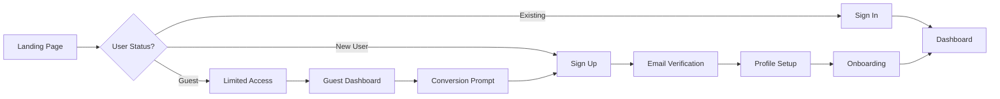


# QuizMentor Complete User Journey & Technical Architecture

## 🎯 End-to-End User Journey

### 1. Authentication Flow


### 2. Main User Flow
```
1. Landing → Auth → Dashboard → Category Selection → Quiz → Results → Leaderboard
                ↑                                              ↓
                └──────────── Progress Saved ←────────────────┘
```

## 🏗️ Complete System Architecture

### Frontend Architecture
```
┌─────────────────────────────────────────────────────────────┐
│                     QuizMentor Frontend                      │
├───────────────────────────────────────────────────────────────┤
│                                                               │
│  ┌─────────────────────────────────────────────────────┐    │
│  │                    UI Layer                          │    │
│  │  ┌──────────┐  ┌──────────┐  ┌──────────┐         │    │
│  │  │  Screens  │  │Components│  │  Modals  │         │    │
│  │  └──────────┘  └──────────┘  └──────────┘         │    │
│  └─────────────────────────────────────────────────────┘    │
│                              ↓                               │
│  ┌─────────────────────────────────────────────────────┐    │
│  │                State Management                      │    │
│  │  ┌──────────┐  ┌──────────┐  ┌──────────┐         │    │
│  │  │  Zustand │  │   React  │  │  React   │         │    │
│  │  │  Stores  │  │   Query  │  │  Context │         │    │
│  │  └──────────┘  └──────────┘  └──────────┘         │    │
│  └─────────────────────────────────────────────────────┘    │
│                              ↓                               │
│  ┌─────────────────────────────────────────────────────┐    │
│  │                  Service Layer                       │    │
│  │  ┌──────────┐  ┌──────────┐  ┌──────────┐         │    │
│  │  │ Supabase │  │   API    │  │  Cache   │         │    │
│  │  │  Client  │  │  Client  │  │  Manager │         │    │
│  │  └──────────┘  └──────────┘  └──────────┘         │    │
│  └─────────────────────────────────────────────────────┘    │
└───────────────────────────────────────────────────────────────┘
```

## 📱 Screen Flow & State Management

### Screen Navigation Tree
```
App.tsx
├── AuthNavigator
│   ├── LandingScreen
│   ├── LoginScreen
│   ├── SignUpScreen
│   └── ForgotPasswordScreen
│
└── MainNavigator (Protected)
    ├── TabNavigator
    │   ├── HomeTab
    │   │   ├── DashboardScreen
    │   │   └── StatsScreen
    │   │
    │   ├── QuizTab
    │   │   ├── CategoriesScreen
    │   │   ├── QuizScreen
    │   │   └── ResultsScreen
    │   │
    │   ├── LeaderboardTab
    │   │   ├── GlobalLeaderboard
    │   │   ├── FriendsLeaderboard
    │   │   └── CategoryLeaderboard
    │   │
    │   └── ProfileTab
    │       ├── ProfileScreen
    │       ├── SettingsScreen
    │       └── AchievementsScreen
    │
    └── ModalStack
        ├── QuizSettingsModal
        ├── ShareModal
        └── ChallengeModal
```

## 🔄 State Management Details

### 1. Zustand Stores Structure
```typescript
// stores/authStore.ts
interface AuthStore {
  user: User | null;
  session: Session | null;
  isLoading: boolean;
  error: string | null;
  
  // Actions
  signIn: (email: string, password: string) => Promise<void>;
  signUp: (email: string, password: string) => Promise<void>;
  signOut: () => Promise<void>;
  refreshSession: () => Promise<void>;
}

// stores/quizStore.ts
interface QuizStore {
  currentQuiz: Quiz | null;
  questions: Question[];
  currentQuestionIndex: number;
  answers: Answer[];
  score: number;
  timeRemaining: number;
  
  // Actions
  startQuiz: (categoryId: string) => void;
  submitAnswer: (answer: Answer) => void;
  nextQuestion: () => void;
  finishQuiz: () => void;
}

// stores/gameStore.ts
interface GameStore {
  level: number;
  xp: number;
  stars: number;
  streak: number;
  achievements: Achievement[];
  
  // Actions
  addXP: (amount: number) => void;
  addStars: (amount: number) => void;
  unlockAchievement: (id: string) => void;
  updateStreak: () => void;
}
```

### 2. React Query Configuration
```typescript
// config/queryClient.ts
const queryClient = new QueryClient({
  defaultOptions: {
    queries: {
      staleTime: 1000 * 60 * 5, // 5 minutes
      cacheTime: 1000 * 60 * 10, // 10 minutes
      retry: 3,
      refetchOnWindowFocus: false,
    },
    mutations: {
      retry: 2,
    },
  },
});

// hooks/useQuizQueries.ts
export const useCategories = () => {
  return useQuery({
    queryKey: ['categories'],
    queryFn: fetchCategories,
    staleTime: 1000 * 60 * 60, // 1 hour
  });
};

export const useQuestions = (categoryId: string) => {
  return useQuery({
    queryKey: ['questions', categoryId],
    queryFn: () => fetchQuestions(categoryId),
    enabled: !!categoryId,
  });
};

export const useLeaderboard = (type: 'global' | 'friends' | 'category') => {
  return useQuery({
    queryKey: ['leaderboard', type],
    queryFn: () => fetchLeaderboard(type),
    refetchInterval: 1000 * 60, // Refresh every minute
  });
};
```

## 🗄️ Backend Architecture (Supabase)

### Database Schema
```sql
-- Users table (extends auth.users)
CREATE TABLE profiles (
  id UUID PRIMARY KEY REFERENCES auth.users(id),
  username TEXT UNIQUE NOT NULL,
  display_name TEXT,
  avatar_url TEXT,
  level INTEGER DEFAULT 1,
  total_xp INTEGER DEFAULT 0,
  stars INTEGER DEFAULT 0,
  rating INTEGER DEFAULT 1200, -- ELO rating
  streak_count INTEGER DEFAULT 0,
  last_active DATE,
  created_at TIMESTAMPTZ DEFAULT NOW(),
  updated_at TIMESTAMPTZ DEFAULT NOW()
);

-- Categories
CREATE TABLE categories (
  id UUID PRIMARY KEY DEFAULT gen_random_uuid(),
  name TEXT NOT NULL,
  slug TEXT UNIQUE NOT NULL,
  description TEXT,
  icon TEXT,
  color TEXT,
  question_count INTEGER DEFAULT 0,
  difficulty_level INTEGER CHECK (difficulty_level BETWEEN 1 AND 5),
  parent_id UUID REFERENCES categories(id),
  order_index INTEGER,
  is_active BOOLEAN DEFAULT true,
  created_at TIMESTAMPTZ DEFAULT NOW()
);

-- Questions
CREATE TABLE questions (
  id UUID PRIMARY KEY DEFAULT gen_random_uuid(),
  category_id UUID REFERENCES categories(id) ON DELETE CASCADE,
  question_text TEXT NOT NULL,
  question_type TEXT CHECK (question_type IN ('multiple_choice', 'true_false', 'code')),
  difficulty INTEGER CHECK (difficulty BETWEEN 1 AND 5),
  points INTEGER DEFAULT 10,
  time_limit INTEGER DEFAULT 30, -- seconds
  explanation TEXT,
  hints JSONB,
  tags TEXT[],
  is_active BOOLEAN DEFAULT true,
  created_by UUID REFERENCES profiles(id),
  created_at TIMESTAMPTZ DEFAULT NOW(),
  updated_at TIMESTAMPTZ DEFAULT NOW()
);

-- Question Options
CREATE TABLE question_options (
  id UUID PRIMARY KEY DEFAULT gen_random_uuid(),
  question_id UUID REFERENCES questions(id) ON DELETE CASCADE,
  option_text TEXT NOT NULL,
  is_correct BOOLEAN DEFAULT false,
  explanation TEXT,
  order_index INTEGER
);

-- Quiz Sessions
CREATE TABLE quiz_sessions (
  id UUID PRIMARY KEY DEFAULT gen_random_uuid(),
  user_id UUID REFERENCES profiles(id),
  category_id UUID REFERENCES categories(id),
  quiz_type TEXT CHECK (quiz_type IN ('practice', 'timed', 'challenge', 'tournament')),
  questions JSONB NOT NULL, -- Array of question IDs
  answers JSONB, -- User's answers
  score INTEGER DEFAULT 0,
  max_score INTEGER,
  time_taken INTEGER, -- seconds
  xp_earned INTEGER DEFAULT 0,
  stars_earned INTEGER DEFAULT 0,
  rating_change INTEGER DEFAULT 0,
  completed_at TIMESTAMPTZ,
  created_at TIMESTAMPTZ DEFAULT NOW()
);

-- User Progress
CREATE TABLE user_progress (
  id UUID PRIMARY KEY DEFAULT gen_random_uuid(),
  user_id UUID REFERENCES profiles(id),
  category_id UUID REFERENCES categories(id),
  questions_attempted INTEGER DEFAULT 0,
  questions_correct INTEGER DEFAULT 0,
  total_time_spent INTEGER DEFAULT 0, -- seconds
  average_score DECIMAL(5,2),
  best_score INTEGER,
  current_streak INTEGER DEFAULT 0,
  best_streak INTEGER DEFAULT 0,
  last_attempt TIMESTAMPTZ,
  UNIQUE(user_id, category_id)
);

-- Achievements
CREATE TABLE achievements (
  id UUID PRIMARY KEY DEFAULT gen_random_uuid(),
  name TEXT NOT NULL,
  description TEXT,
  icon TEXT,
  criteria JSONB NOT NULL,
  xp_reward INTEGER DEFAULT 0,
  star_reward INTEGER DEFAULT 0,
  rarity TEXT CHECK (rarity IN ('common', 'rare', 'epic', 'legendary')),
  category TEXT,
  order_index INTEGER
);

-- User Achievements
CREATE TABLE user_achievements (
  user_id UUID REFERENCES profiles(id),
  achievement_id UUID REFERENCES achievements(id),
  unlocked_at TIMESTAMPTZ DEFAULT NOW(),
  progress JSONB,
  PRIMARY KEY (user_id, achievement_id)
);

-- Leaderboards (Materialized View)
CREATE MATERIALIZED VIEW leaderboard_global AS
SELECT 
  p.id,
  p.username,
  p.display_name,
  p.avatar_url,
  p.level,
  p.total_xp,
  p.stars,
  p.rating,
  RANK() OVER (ORDER BY p.rating DESC) as rank
FROM profiles p
WHERE p.last_active > NOW() - INTERVAL '30 days';

-- Friends System
CREATE TABLE friendships (
  user_id UUID REFERENCES profiles(id),
  friend_id UUID REFERENCES profiles(id),
  status TEXT CHECK (status IN ('pending', 'accepted', 'blocked')),
  created_at TIMESTAMPTZ DEFAULT NOW(),
  PRIMARY KEY (user_id, friend_id)
);

-- Challenges
CREATE TABLE challenges (
  id UUID PRIMARY KEY DEFAULT gen_random_uuid(),
  challenger_id UUID REFERENCES profiles(id),
  challenged_id UUID REFERENCES profiles(id),
  category_id UUID REFERENCES categories(id),
  status TEXT CHECK (status IN ('pending', 'accepted', 'declined', 'completed')),
  challenger_score INTEGER,
  challenged_score INTEGER,
  winner_id UUID REFERENCES profiles(id),
  created_at TIMESTAMPTZ DEFAULT NOW(),
  expires_at TIMESTAMPTZ,
  completed_at TIMESTAMPTZ
);
```

### Row Level Security (RLS) Policies
```sql
-- Enable RLS
ALTER TABLE profiles ENABLE ROW LEVEL SECURITY;
ALTER TABLE quiz_sessions ENABLE ROW LEVEL SECURITY;
ALTER TABLE user_progress ENABLE ROW LEVEL SECURITY;
ALTER TABLE user_achievements ENABLE ROW LEVEL SECURITY;

-- Profiles policies
CREATE POLICY "Public profiles are viewable by everyone"
  ON profiles FOR SELECT
  USING (true);

CREATE POLICY "Users can update own profile"
  ON profiles FOR UPDATE
  USING (auth.uid() = id);

-- Quiz sessions policies
CREATE POLICY "Users can view own sessions"
  ON quiz_sessions FOR SELECT
  USING (auth.uid() = user_id);

CREATE POLICY "Users can create own sessions"
  ON quiz_sessions FOR INSERT
  WITH CHECK (auth.uid() = user_id);

-- Progress policies
CREATE POLICY "Users can view own progress"
  ON user_progress FOR SELECT
  USING (auth.uid() = user_id);

CREATE POLICY "Users can update own progress"
  ON user_progress FOR ALL
  USING (auth.uid() = user_id);
```

## 🔐 Authentication Flow

### Supabase Auth Configuration
```typescript
// lib/supabase.ts
import { createClient } from '@supabase/supabase-js';
import AsyncStorage from '@react-native-async-storage/async-storage';

const supabaseUrl = process.env.EXPO_PUBLIC_SUPABASE_URL;
const supabaseAnonKey = process.env.EXPO_PUBLIC_SUPABASE_ANON_KEY;

export const supabase = createClient(supabaseUrl, supabaseAnonKey, {
  auth: {
    storage: AsyncStorage,
    autoRefreshToken: true,
    persistSession: true,
    detectSessionInUrl: false,
  },
});

// Auth functions
export const authService = {
  signUp: async (email: string, password: string, username: string) => {
    const { data, error } = await supabase.auth.signUp({
      email,
      password,
      options: {
        data: { username },
      },
    });
    
    if (error) throw error;
    
    // Create profile
    if (data.user) {
      await supabase.from('profiles').insert({
        id: data.user.id,
        username,
        display_name: username,
      });
    }
    
    return data;
  },
  
  signIn: async (email: string, password: string) => {
    const { data, error } = await supabase.auth.signInWithPassword({
      email,
      password,
    });
    
    if (error) throw error;
    return data;
  },
  
  signOut: async () => {
    const { error } = await supabase.auth.signOut();
    if (error) throw error;
  },
  
  resetPassword: async (email: string) => {
    const { error } = await supabase.auth.resetPasswordForEmail(email);
    if (error) throw error;
  },
};
```

## 🎮 Game Logic & Algorithms

### XP Calculation
```typescript
function calculateXP(
  score: number,
  maxScore: number,
  timeBonus: number,
  streakMultiplier: number,
  difficultyMultiplier: number
): number {
  const baseXP = (score / maxScore) * 100;
  const timeBonusXP = timeBonus * 0.5;
  const totalXP = (baseXP + timeBonusXP) * streakMultiplier * difficultyMultiplier;
  
  return Math.round(totalXP);
}
```

### ELO Rating System
```typescript
function calculateEloRating(
  playerRating: number,
  opponentRating: number,
  playerScore: number,
  opponentScore: number,
  kFactor: number = 32
): number {
  const expectedScore = 1 / (1 + Math.pow(10, (opponentRating - playerRating) / 400));
  const actualScore = playerScore > opponentScore ? 1 : playerScore === opponentScore ? 0.5 : 0;
  const newRating = playerRating + kFactor * (actualScore - expectedScore);
  
  return Math.round(newRating);
}
```

### Adaptive Difficulty
```typescript
interface DifficultyEngine {
  calculateNextDifficulty(
    userPerformance: number[], // Last 10 quiz scores (0-100)
    currentDifficulty: number // 1-5
  ): number {
    const avgPerformance = userPerformance.reduce((a, b) => a + b, 0) / userPerformance.length;
    
    if (avgPerformance > 85 && currentDifficulty < 5) {
      return currentDifficulty + 1;
    } else if (avgPerformance < 50 && currentDifficulty > 1) {
      return currentDifficulty - 1;
    }
    
    return currentDifficulty;
  }
}
```

## 💾 Caching Strategy

### React Query Cache Configuration
```typescript
// Aggressive caching for static data
const staticDataOptions = {
  staleTime: Infinity,
  cacheTime: 1000 * 60 * 60 * 24, // 24 hours
};

// Moderate caching for user data
const userDataOptions = {
  staleTime: 1000 * 60 * 5, // 5 minutes
  cacheTime: 1000 * 60 * 30, // 30 minutes
};

// No caching for real-time data
const realtimeDataOptions = {
  staleTime: 0,
  cacheTime: 0,
  refetchInterval: 1000 * 10, // 10 seconds
};
```

### Offline Support
```typescript
// services/offlineManager.ts
import NetInfo from '@react-native-community/netinfo';

export class OfflineManager {
  private queue: OfflineAction[] = [];
  
  async syncOfflineData() {
    const isConnected = await NetInfo.fetch().then(state => state.isConnected);
    
    if (!isConnected) {
      return;
    }
    
    while (this.queue.length > 0) {
      const action = this.queue.shift();
      try {
        await this.executeAction(action);
      } catch (error) {
        this.queue.unshift(action); // Re-add to queue
        break;
      }
    }
  }
  
  private async executeAction(action: OfflineAction) {
    switch (action.type) {
      case 'SUBMIT_QUIZ':
        return await supabase.from('quiz_sessions').insert(action.data);
      case 'UPDATE_PROGRESS':
        return await supabase.from('user_progress').upsert(action.data);
      // ... other actions
    }
  }
}
```

## 🎨 UI Component Architecture

### Design System
```typescript
// theme/index.ts
export const theme = {
  colors: {
    primary: '#3b82f6',
    secondary: '#10b981',
    danger: '#ef4444',
    warning: '#f59e0b',
    success: '#22c55e',
    background: '#f3f4f6',
    surface: '#ffffff',
    text: {
      primary: '#1f2937',
      secondary: '#6b7280',
      disabled: '#9ca3af',
    },
  },
  spacing: {
    xs: 4,
    sm: 8,
    md: 16,
    lg: 24,
    xl: 32,
    xxl: 48,
  },
  typography: {
    h1: { fontSize: 32, fontWeight: 'bold' },
    h2: { fontSize: 24, fontWeight: 'bold' },
    h3: { fontSize: 20, fontWeight: '600' },
    body: { fontSize: 16, fontWeight: 'normal' },
    caption: { fontSize: 14, fontWeight: 'normal' },
  },
  borderRadius: {
    sm: 4,
    md: 8,
    lg: 12,
    xl: 16,
    full: 9999,
  },
};
```

### Component Library Structure
```
components/
├── atoms/
│   ├── Button.tsx
│   ├── Text.tsx
│   ├── Input.tsx
│   └── Icon.tsx
├── molecules/
│   ├── QuizCard.tsx
│   ├── LeaderboardItem.tsx
│   ├── AchievementBadge.tsx
│   └── ProgressBar.tsx
├── organisms/
│   ├── QuizQuestion.tsx
│   ├── CategoryGrid.tsx
│   ├── StatsPanel.tsx
│   └── NavigationHeader.tsx
└── templates/
    ├── QuizLayout.tsx
    ├── AuthLayout.tsx
    └── DashboardLayout.tsx
```

## 📊 Analytics & Monitoring

### Event Tracking
```typescript
// analytics/events.ts
export const trackEvent = (eventName: string, properties?: any) => {
  // Amplitude/Mixpanel integration
  amplitude.track(eventName, {
    ...properties,
    timestamp: new Date().toISOString(),
    platform: Platform.OS,
    version: Constants.manifest.version,
  });
};

// Usage
trackEvent('quiz_completed', {
  category_id: categoryId,
  score: score,
  time_taken: timeTaken,
  difficulty: difficulty,
});
```

### Performance Monitoring
```typescript
// monitoring/performance.ts
import * as Sentry from '@sentry/react-native';

Sentry.init({
  dsn: process.env.SENTRY_DSN,
  environment: process.env.NODE_ENV,
  tracesSampleRate: 1.0,
});

// Measure screen load time
export const measureScreenLoad = (screenName: string) => {
  const transaction = Sentry.startTransaction({
    name: `screen_load_${screenName}`,
  });
  
  return {
    finish: () => transaction.finish(),
  };
};
```

## 🚀 Deployment Pipeline

### CI/CD with GitHub Actions
```yaml
# .github/workflows/deploy.yml
name: Deploy QuizMentor

on:
  push:
    branches: [main]

jobs:
  test:
    runs-on: ubuntu-latest
    steps:
      - uses: actions/checkout@v2
      - run: npm install
      - run: npm test
      - run: npx playwright test

  deploy-web:
    needs: test
    runs-on: ubuntu-latest
    steps:
      - uses: actions/checkout@v2
      - run: npm install
      - run: npm run build:web
      - uses: amondnet/vercel-action@v20
        with:
          vercel-token: ${{ secrets.VERCEL_TOKEN }}

  build-mobile:
    needs: test
    runs-on: ubuntu-latest
    steps:
      - uses: actions/checkout@v2
      - uses: expo/expo-github-action@v7
      - run: eas build --platform all --non-interactive
```

## 🎯 Complete User Journey Example

### Sarah's Journey (New User)
```
1. LANDING PAGE
   - Sees marketing content
   - Views feature highlights
   - Clicks "Get Started"

2. SIGN UP
   - Enters email/password
   - Chooses username
   - Verifies email
   - State: User created in Supabase Auth

3. ONBOARDING
   - Selects interests (categories)
   - Sets difficulty preference
   - Completes tutorial quiz
   - State: Profile created, preferences saved

4. DASHBOARD
   - Sees personalized categories
   - Views daily challenges
   - Checks streak status
   - State: User data fetched, cached in React Query

5. STARTS QUIZ
   - Selects "JavaScript" category
   - Chooses "Timed Mode"
   - Answers 10 questions
   - State: Quiz session created, answers stored locally

6. COMPLETES QUIZ
   - Scores 8/10 (80%)
   - Earns 150 XP, 3 stars
   - Unlocks "Quick Learner" achievement
   - State: Results synced to Supabase

7. VIEWS RESULTS
   - Sees detailed breakdown
   - Reviews incorrect answers
   - Shares score on social
   - State: Progress updated, leaderboard refreshed

8. CHECKS LEADERBOARD
   - Ranks #45 globally
   - #3 among friends
   - #12 in JavaScript category
   - State: Real-time updates via Supabase subscriptions

9. CONTINUES LEARNING
   - System suggests "Advanced JavaScript"
   - Difficulty adjusted based on performance
   - New learning path unlocked
   - State: Adaptive algorithm updates preferences
```

---

## Summary

This is the COMPLETE technical architecture showing:
- Full user journey from landing to mastery
- Complete database schema with RLS
- State management with Zustand + React Query
- Caching strategies for optimal performance
- Authentication flow with Supabase
- Game mechanics and algorithms
- Offline support and sync
- Analytics and monitoring
- CI/CD deployment pipeline

The app is designed to scale from 1 to 1M+ users with proper caching, state management, and backend architecture.

